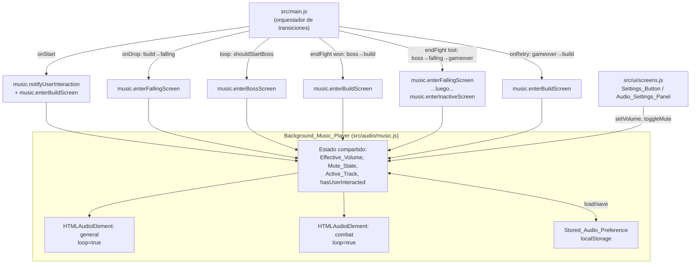

# Design Document

## Overview

Esta funcionalidad introduce un nuevo módulo `Background_Music_Player` (`src/audio/music.js`) que gestiona dos pistas de música de fondo (`general` y `combat`) sincronizadas con las transiciones de pantalla del juego, y un control de configuración de audio (`Settings_Button` + `Audio_Settings_Panel`) que permite mutear/desmutear y ajustar el volumen de ambas pistas de forma unificada.

El módulo se mantiene deliberadamente separado de `src/audio/sfx.js`: ambos reutilizan el mismo patrón de precarga con `HTMLAudioElement` y `audioFileUrl('/audio/<archivo>')`, pero no comparten estado, referencias ni volumen. `sfx.js` sigue gestionando exclusivamente los efectos de sonido puntuales; `music.js` gestiona exclusivamente las dos pistas de música de fondo en bucle.

A diferencia de `sfx.js` (que crea un `HTMLAudioElement` nuevo o clonado por cada evento discreto), `music.js` mantiene **dos instancias persistentes** de `HTMLAudioElement` durante toda la sesión (una por `Music_Track`), porque necesita preservar la posición de reproducción (`currentTime`) entre pausas y reanudaciones — no tiene sentido clonar o recrear el elemento en cada transición.

Todas las transiciones de pantalla del juego (`start` → `build` → `boss` → `build`/`falling` → `gameover` → `build`) ya pasan por funciones explícitas en `src/main.js` (`onStart`, `onDrop`, `loop`, `onAnswer`/`endFight`, `onRetry`). Como el proyecto no tiene un sistema de observers/eventos sobre `state.screen`, el `Background_Music_Player` se integra mediante **llamadas explícitas** a su API pública en cada uno de esos puntos, no mediante un watcher automático.

## Architecture



### Decisión: dos `HTMLAudioElement` persistentes vs uno solo con cambio de `src`

Se evaluaron dos estrategias:

1. **Un único `HTMLAudioElement`, cambiando `src` al alternar de pista.** Simplifica el número de elementos, pero al cambiar `src` el navegador descarta el `currentTime` de la pista anterior — perdería exactamente la posición que el Requirement 1 exige conservar al pausar/reanudar `general` mientras suena `combat`.
2. **Dos `HTMLAudioElement` persistentes (uno por `Music_Track`), reproduciendo/pausando en lugar de cambiar `src`.** Cada elemento conserva su propio `currentTime` de forma nativa mientras está pausado. Alternar pistas es simplemente `activa.play()` + `inactiva.pause()` (o viceversa), sin recrear elementos.

**Decisión**: usar dos `HTMLAudioElement` persistentes con `loop = true`, gestionados internamente por el módulo. Esto resuelve de forma natural la continuidad de posición (Requirement 1.3, 1.4, 1.6) sin necesidad de guardar manualmente `currentTime` en una variable aparte.

### Decisión: persistencia de `Stored_Audio_Preference`

Siguiendo el patrón ya usado en `scoreStore.js` (try/catch alrededor de `localStorage`, sin lanzar), pero sin la complejidad de una interfaz `Store` abstracta: como el Requirement 6 solo exige persistir un objeto simple `{ volume, muted }`, se usa acceso directo a `localStorage` envuelto en funciones internas `loadPreference()` / `savePreference()` dentro de `music.js`, bajo una clave propia (`torre-nubes-audio-pref`) distinta de `torre-nubes-scores`.

## Components and Interfaces

### `Background_Music_Player` (`src/audio/music.js`)

**Estado interno del módulo** (no exportado directamente, accesible vía getters de la API):

```js
const TRACK_FILES = {
  general: 'music_background_music_medieval.wav',
  combat: 'music_combat.mp3',
};

const DEFAULT_VOLUME = 0.06; // Default_Volume_Level: 6% del Base_Volume
const PREF_KEY = 'torre-nubes-audio-pref';

let tracks = null;         // { general: HTMLAudioElement, combat: HTMLAudioElement } | null
let activeTrackName = null; // 'general' | 'combat' | null
let effectiveVolume = DEFAULT_VOLUME; // 0..1
let muted = false;
let hasUserInteracted = false;
let pendingScreen = null;  // pantalla objetivo diferida por Autoplay_Restriction
let initialized = false;
```

**Función `audioFileUrl(filename)`**: idéntica en forma a la de `sfx.js` (`'/audio/' + filename`), duplicada localmente en `music.js` para no crear un acoplamiento entre ambos módulos de audio (cada módulo de audio es autosuficiente, tal como exige el Requirement 8 de aislamiento).

**Función interna `realVolume()`**:
```js
function realVolume() {
  return muted ? 0 : effectiveVolume;
}
```
Esta es la fórmula central que ata `Effective_Volume` y `Mute_State` al volumen real aplicado a los elementos `<audio>` (Requirements 2, 4, 5).

**Función interna `applyVolumeToBothTracks()`**: asigna `realVolume()` a `tracks.general.volume` y `tracks.combat.volume`, cumpliendo Requirement 2.2 (mismo volumen en ambas pistas, activa o no).

**Función interna `safePlay(track)`**: envuelve `track.play()` en manejo de la Promise devuelta:
- Si la Promise resuelve, no hace nada adicional.
- Si la Promise se rechaza (por `Playback_Failure` genérico o por `Autoplay_Restriction`/`NotAllowedError`), captura el rechazo sin propagar excepción (Requirement 1.9, 7.4) y, si el motivo es una restricción de autoplay y aún no hubo interacción del usuario, registra la pantalla actual en `pendingScreen` para reintentar en `notifyUserInteraction()` (Requirement 7.1).
- Nunca usa `await` a nivel del llamador: es fire-and-forget, igual que el patrón de `scoreManager.save().catch(...)`.

**Función interna `pauseTrack(name)`**: llama a `tracks[name].pause()` si el elemento existe; `pause()` conserva `currentTime` de forma nativa, por lo que no se requiere guardar la posición manualmente.

**Función interna `setActiveTrack(name)`** (`name` puede ser `'general'`, `'combat'` o `null`):
1. Si `activeTrackName` es distinto de `name` y hay una pista actualmente activa, la pausa primero (`pauseTrack(activeTrackName)`).
2. Si `name` no es `null`, aplica `realVolume()` a la nueva pista y llama a `safePlay(tracks[name])` **solo si** `hasUserInteracted` es verdadero; si no, guarda `pendingScreen` para diferir el inicio (Requirement 7.1).
3. Actualiza `activeTrackName = name`.

Este orden (pausar la anterior antes de iniciar la nueva, de forma síncrona, sin `await` intermedio) es lo que acota el solapamiento entre pistas al tiempo de una sola vuelta de microtarea del navegador, cumpliendo el margen de 300ms del Requirement 8.3 por construcción, no por temporización explícita.

#### API pública

```js
export const music = {
  init(),                    // Carga Stored_Audio_Preference (o Default_Volume_Level), precarga ambos <audio>
  notifyUserInteraction(),   // Marca hasUserInteracted = true; si hay pendingScreen, reintenta esa transición
  enterBuildScreen(),        // Activa/resume 'general' (build o falling-desde-build)
  enterFallingScreen(),      // Alias semántico de enterBuildScreen(): 'falling' mantiene 'general' activa (Req 1.2)
  enterBossScreen(),         // Pausa 'general' (conserva posición), activa/resume 'combat'
  enterInactiveScreen(),     // Pausa la Active_Track vigente (conserva posición); usar en start y gameover
  setVolume(volumePercent),  // volumePercent: 0..100 → effectiveVolume = volumePercent/100; persiste
  toggleMute(),              // Invierte muted; aplica y persiste
  getEffectiveVolumePercent(), // 0..100, para reflejar el Volume_Slider al abrir el panel
  isMuted(),                 // boolean, para reflejar el control de mute al abrir el panel
};
```

- `enterBuildScreen()` y `enterFallingScreen()` son la misma operación lógica (`setActiveTrack('general')`) expuestas como dos nombres porque el Requirement 1.2 los describe como el mismo `Music_Active_Screen`; se implementan como un alias para evitar duplicar lógica.
- `enterInactiveScreen()` implementa `setActiveTrack(null)` — pausa sin elegir una nueva pista, y no reinicia posición (Requirement 1.5).
- `enterBossScreen()` implementa `setActiveTrack('combat')`.
- Todas las funciones de transición son **idempotentes**: llamarlas repetidamente en el mismo estado no produce reinicios ni efectos secundarios adicionales (por ejemplo, `enterBuildScreen()` llamado dos veces seguidas no reinicia `general` si ya es la `Active_Track`).

### Puntos de integración en `src/main.js`

| Punto en `main.js` | Llamada a `music` | Requirement |
|---|---|---|
| Inicialización del módulo (junto al bloque IIFE de `scoreManager.initialize()`) | `music.init()` | 6.3, 6.4, 6.5, 2.1 |
| `onStart()`, justo antes de `gameState.screen = 'build'` | `music.notifyUserInteraction()` seguido de `music.enterBuildScreen()` | 7.2, 7.3, 1.1 |
| `onDrop()`, rama `result.type === 'fell'` (transición `build`→`falling`) | `music.enterFallingScreen()` | 1.2 |
| `loop()`, rama `updateResult.shouldStartBoss` (transición a `boss`) | `music.enterBossScreen()` | 1.3 |
| `endFight(won)`, rama `won === true` (`boss`→`build`) | `music.enterBuildScreen()` | 1.4 |
| `endFight(won)`, rama `won === false` (`boss`→`falling`) | `music.enterFallingScreen()` | 1.2 (transición vía falling; `general` no vuelve a sonar hasta que expire el timeout hacia `gameover`) |
| `endFight(won)`, dentro del `setTimeout` que ejecuta `gameState.screen = 'gameover'` | `music.enterInactiveScreen()` | 1.5 |
| `onDrop()`, dentro del `setTimeout` que ejecuta `gameState.screen = 'gameover'` (caso caída normal) | `music.enterInactiveScreen()` | 1.5 |
| `onRetry()`, justo antes de `gameState.screen = 'build'` | `music.enterBuildScreen()` | 1.6 |

Nota sobre `document`/canvas como fuente de "primera interacción": el Requirement 7.2 pide reconocer específicamente el `Start_Button` como interacción calificante; como ese botón ya está cableado en `bindInputHandlers` (`document.getElementById('startBtn').addEventListener('click', onStart)`), basta con invocar `music.notifyUserInteraction()` al inicio de `onStart()` sin añadir listeners globales adicionales de `click`/`keydown`/`pointerdown` a nivel de documento.

### `Settings_Button` y `Audio_Settings_Panel` (`index.html` + `src/ui/screens.js`)

**Marcado en `index.html`**, siguiendo el lenguaje visual existente (`.hud-pill`, `.panel.facet-cut`, `.overlay`):

```html
<!-- Dentro de #hud, junto a los hud-pill existentes -->
<button id="settingsBtn" class="hud-pill facet-cut-sm" aria-label="Configuración de audio" style="pointer-events:auto; cursor:pointer;">⚙️</button>

<!-- Nuevo overlay, hermano de #startScreen / #bossScreen / #gameOverScreen -->
<div id="audioSettingsPanel" class="overlay hidden">
  <div class="panel facet-cut">
    <h1>Configuración de audio</h1>
    <label class="subtitle" for="volumeSlider">Volumen de música</label>
    <input type="range" id="volumeSlider" min="0" max="100" step="1" />
    <button id="muteToggleBtn" class="btn-secondary" aria-pressed="false">Silenciar música</button>
    <button id="closeAudioSettingsBtn" class="btn-primary">Cerrar</button>
  </div>
</div>
```

- `#settingsBtn` vive dentro de `#hud`, que ya tiene `pointer-events:none` a nivel de contenedor; por eso el botón necesita `pointer-events:auto` explícito (igual patrón que cualquier control interactivo dentro de un contenedor no interactivo).
- `#audioSettingsPanel` reutiliza `.overlay` + `.panel.facet-cut` para que visualmente sea indistinguible de los paneles de inicio/game over, y `.hidden` para el patrón de mostrar/ocultar ya usado en todo `index.html`.
- `aria-pressed` en el botón de mute y `aria-label` en el botón de settings dan una señal accesible básica del estado (esto no sustituye una validación completa de accesibilidad, que requeriría revisión manual).

**Nuevas funciones en `src/ui/screens.js`**:

```js
export function showAudioSettingsPanel(volumePercent, isMuted) { /* refleja valores, quita 'hidden' */ }
export function hideAudioSettingsPanel() { /* agrega 'hidden' */ }
export function isAudioSettingsPanelVisible() { /* boolean, lee classList */ }
export function setMuteButtonState(isMuted) { /* actualiza texto/aria-pressed del botón */ }

export function bindAudioSettingsHandlers({ onToggleSettings, onVolumeChange, onToggleMute, onCloseSettings }) {
  document.getElementById('settingsBtn').addEventListener('click', onToggleSettings);
  document.getElementById('volumeSlider').addEventListener('input', (e) => onVolumeChange(Number(e.target.value)));
  document.getElementById('muteToggleBtn').addEventListener('click', onToggleMute);
  document.getElementById('closeAudioSettingsBtn').addEventListener('click', onCloseSettings);
}
```

Esto sigue el mismo patrón que `bindInputHandlers` y `bindLeaderboardControls` ya existentes: una función `bind*Handlers` que recibe callbacks desde `main.js`, sin que `screens.js` conozca la lógica de negocio de `music.js`.

**Cableado en `src/main.js`** (nuevas funciones locales, análogas a `onStart`/`onRetry`):

```js
function onToggleAudioSettings() {
  if (ui.isAudioSettingsPanelVisible()) {
    ui.hideAudioSettingsPanel();
  } else {
    ui.showAudioSettingsPanel(music.getEffectiveVolumePercent(), music.isMuted());
  }
}
function onVolumeChange(percent) { music.setVolume(percent); }
function onToggleMute() {
  music.toggleMute();
  ui.setMuteButtonState(music.isMuted());
}
function onCloseAudioSettings() { ui.hideAudioSettingsPanel(); }
```

Estas se registran junto al resto de `bindInputHandlers`/`bindLeaderboardControls` en el bloque de inicialización de `main.js`, mediante una llamada a `ui.bindAudioSettingsHandlers({ onToggleSettings: onToggleAudioSettings, onVolumeChange, onToggleMute, onCloseAudioSettings })`.

Dado que el `Settings_Button` es también una interacción del usuario, `onToggleAudioSettings`, `onVolumeChange` y `onToggleMute` llaman a `music.notifyUserInteraction()` antes de su lógica propia, para que abrir el panel de configuración antes de pulsar "Comenzar a construir" también califique como la primera interacción del Requirement 7.1.

## Data Models

Estructuras internas de `music.js` (no expuestas fuera del módulo salvo por getters):

```
MusicTrackName = 'general' | 'combat'

MusicPlayerState = {
  tracks: { general: HTMLAudioElement, combat: HTMLAudioElement } | null,
  activeTrackName: MusicTrackName | null,
  effectiveVolume: number,   // 0..1 (interno); expuesto como 0..100 en la API pública
  muted: boolean,
  hasUserInteracted: boolean,
  pendingScreen: MusicTrackName | null,
}

StoredAudioPreference = {
  volume: number, // 0..1, debe cumplir 0 <= volume <= 1
  muted: boolean,
}
```

`StoredAudioPreference` se serializa como JSON bajo la clave `torre-nubes-audio-pref` en `localStorage`. Un valor se considera válido si es un objeto con `volume` numérico finito en `[0, 1]` y `muted` estrictamente booleano; cualquier otro caso (JSON inválido, campos ausentes, tipos incorrectos, `volume` fuera de rango) se trata como ausente (Requirement 6.5).

## Correctness Properties

*A property is a characteristic or behavior that should hold true across all valid executions of a system-essentially, a formal statement about what the system should do. Properties serve as the bridge between human-readable specifications and machine-verifiable correctness guarantees.*

### Property 1: Exclusividad de reproducción

For any secuencia de llamadas a las funciones de transición de pantalla de `Background_Music_Player` (`enterBuildScreen`, `enterFallingScreen`, `enterBossScreen`, `enterInactiveScreen`, en cualquier orden y cantidad), en todo punto posterior a cada llamada como máximo una de las dos `Music_Track` (`general`, `combat`) se encuentra en estado "reproduciéndose" (`paused === false`).

**Validates: Requirements 1.7, 8.3**

### Property 2: Continuidad de posición al pausar y reanudar

For any secuencia de transiciones que alterna entre un `Music_Active_Screen` que activa una `Music_Track`, una pausa (transición a `boss` desde `build`, o a `start`/`gameover`), y un retorno posterior a un `Music_Active_Screen` que reactiva la misma `Music_Track`, la posición de reproducción (`currentTime`) de esa pista al reanudar es igual a la posición que tenía en el momento exacto en que fue pausada (o `0` si nunca había comenzado a reproducirse).

**Validates: Requirements 1.3, 1.4, 1.5, 1.6**

### Property 3: Volumen real compartido y consistente

For any valor de `Effective_Volume` en el rango `[0, 100]` y cualquier valor de `Mute_State` (`true`/`false`), y para cualquier `Active_Track` (`general`, `combat`, o ninguna) en el momento de aplicar esos valores, el volumen real (`.volume`) de **ambos** elementos `<audio>` gestionados por `Background_Music_Player` es igual a `Effective_Volume/100 * (Mute_State ? 0 : 1)`, sin importar cuál de las dos pistas está activa en ese momento.

**Validates: Requirements 2.2, 2.3, 4.1, 4.2, 4.3, 5.1, 5.2, 5.4, 7.3**

### Property 4: Robustez ante fallos de carga, reproducción y Autoplay_Restriction

For any Music_Track y cualquier tipo de fallo simulado en su reproducción (rechazo genérico de `.play()`, evento `error` del elemento, o rechazo por `NotAllowedError` simulando una Autoplay_Restriction), invocar cualquier función de transición de pantalla de `Background_Music_Player` no lanza una excepción no controlada, y una invocación posterior de cualquier otra función de transición sigue actualizando correctamente el `Active_Track` interno del módulo con normalidad.

**Validates: Requirements 1.9, 7.1, 7.4**

### Property 5: Round-trip de persistencia de preferencias válidas

For any valor válido de `Effective_Volume` en `[0, 100]` y `Mute_State` en `{true, false}`, guardar esa preferencia mediante `setVolume`/`toggleMute` y luego (re)inicializar el módulo (`init()`) desde ese `Stored_Audio_Preference` produce un `Effective_Volume` y `Mute_State` iniciales iguales a los valores guardados.

**Validates: Requirements 6.1, 6.3**

### Property 6: Descarte de preferencias inválidas

For any valor almacenado bajo la clave de `Stored_Audio_Preference` que no sea un objeto válido según el esquema (JSON malformado, campo `volume` ausente/no numérico/fuera de `[0, 1]`, campo `muted` ausente o no booleano), inicializar el módulo (`init()`) descarta ese valor y aplica el `Default_Volume_Level` (6%) con `Mute_State` inactivo.

**Validates: Requirements 6.5**

### Property 7: El panel de configuración refleja el estado vigente

For any valor de `Effective_Volume` en `[0, 100]` y `Mute_State` en `{true, false}` aplicados previamente al `Background_Music_Player`, al mostrar el `Audio_Settings_Panel` el valor del `Volume_Slider` es igual a ese `Effective_Volume` y el estado del control de mute refleja exactamente ese `Mute_State`.

**Validates: Requirements 3.2, 5.3**

## Error Handling

- **Fallo de carga de un `Audio_File` de música** (evento `error` del `HTMLAudioElement` durante `init()` o durante la reproducción): capturado con un listener `error` que no relanza; el estado interno de `Active_Track`/posición sigue avanzando lógicamente aunque el audio real no suene, cumpliendo Requirement 1.9 (Property 4).
- **Rechazo de la Promise de `.play()`** (`Playback_Failure` genérico o `NotAllowedError` por `Autoplay_Restriction`): capturado dentro de `safePlay()`. Si el motivo es una restricción de autoplay y `hasUserInteracted` es `false`, se registra `pendingScreen` para reintentar en `notifyUserInteraction()` (Requirement 7.1); en cualquier otro caso, el rechazo simplemente se ignora sin alterar `Effective_Volume`/`Mute_State` (Requirement 7.4).
- **Fallo al guardar `Stored_Audio_Preference`** (`localStorage.setItem` lanza, por ejemplo `QuotaExceededError` o modo privado sin storage): capturado en `savePreference()` con try/catch, sin relanzar; `Effective_Volume`/`Mute_State` en memoria no se revierten (Requirement 6.2).
- **`Stored_Audio_Preference` corrupto o inválido al cargar**: `loadPreference()` valida estructura y rango antes de aplicar el valor; cualquier fallo de `JSON.parse` o de validación de esquema hace que la función retorne `null`, y `init()` aplica el `Default_Volume_Level` (Requirement 6.5).
- **Navegador sin soporte de `Audio`** (`typeof Audio === 'undefined'`): `init()` detecta esto explícitamente (mismo patrón que `sfx.js`) y deja `tracks = null`; todas las funciones de transición verifican `tracks` antes de operar y retornan sin efecto ni excepción.

## Testing Strategy

**Enfoque dual**: pruebas unitarias para ejemplos concretos, casos de borde y puntos de integración de UI, y pruebas basadas en propiedades para los invariantes universales de la sección de Correctness Properties.

### Pruebas unitarias (ejemplos)

- `music.init()` sin `Stored_Audio_Preference` previo aplica `Default_Volume_Level` (6%) y `Mute_State` inactivo (Requirement 2.1, 6.4).
- El `Settings_Button` permanece visible y su listener de clic invoca `onToggleAudioSettings` en cualquiera de las cuatro pantallas del juego (Requirement 3.1).
- Alternar dos veces el `Settings_Button` con el panel visible lo oculta sin modificar `Effective_Volume`/`Mute_State` (Requirement 3.3).
- Activar el control de cierre del panel lo oculta sin modificar `Effective_Volume`/`Mute_State` (Requirement 3.4).
- Llamar a `music.toggleMute()` no invoca ni afecta ninguna función exportada por `sfx.js`, y viceversa: invocar cualquier función de `sfx` no modifica `Effective_Volume`/`Mute_State`/`Active_Track` de `music.js` (Requirements 4.4, 8.1, 8.2).
- `onStart()` invoca `music.notifyUserInteraction()` antes de `music.enterBuildScreen()` (Requirement 7.2, 7.3).
- Integración de puntos de transición: cada llamada de `main.js` a `music.*` listada en la tabla de integración se dispara en la rama correspondiente (`onDrop`, `loop`, `endFight`, `onRetry`).

### Pruebas basadas en propiedades

Se utilizará **fast-check** (ya presente en `devDependencies` del proyecto), configurando cada prueba con un mínimo de 100 iteraciones. Cada prueba de propiedad se implementa como un único test que valida la propiedad correspondiente del diseño, y se etiqueta con un comentario que referencia la propiedad:

**Feature: background-music-controls, Property N: {texto de la propiedad}**

Las pruebas usan mocks/stubs de `HTMLAudioElement` (mediante `jsdom`, ya presente en `devDependencies`, sobrescribiendo `play`/`pause`/`currentTime`/eventos `error` según el escenario) para simular reproducción, fallos y posiciones de forma determinista y de bajo costo, sin depender de archivos de audio reales:

- **Property 1** (Exclusividad): generar secuencias aleatorias de 1 a 20 llamadas a las cuatro funciones de transición; tras cada llamada, verificar que a lo sumo un mock de `<audio>` tiene `paused === false`.
- **Property 2** (Continuidad de posición): generar una posición aleatoria de `currentTime` para la pista activa, disparar una transición de pausa (a `boss`/`start`/`gameover`) y luego una transición de reanudación hacia la misma pista; verificar que `currentTime` al reanudar es igual al valor guardado antes de pausar.
- **Property 3** (Volumen real compartido): generar aleatoriamente `Effective_Volume` (0-100), `Mute_State` (booleano) y `Active_Track` (`general`/`combat`/`null`); aplicar `setVolume`/`toggleMute` en ese orden aleatorio y verificar que `tracks.general.volume === tracks.combat.volume === Effective_Volume/100 * (muted?0:1)`.
- **Property 4** (Robustez ante fallos): generar aleatoriamente un tipo de fallo (rechazo genérico, evento `error`, `NotAllowedError`) y una secuencia de 2 a 5 llamadas a funciones de transición; verificar que ninguna lanza excepción y que el `Active_Track` interno reportado por un getter de prueba avanza según la última llamada.
- **Property 5** (Round-trip de persistencia): generar aleatoriamente `volume` (0-100) y `muted` (booleano), llamar `setVolume`/`toggleMute`, simular recarga de módulo llamando `init()` de nuevo sobre el mismo `localStorage` mockeado, y verificar que los valores iniciales resultantes coinciden.
- **Property 6** (Descarte de preferencias inválidas): generar aleatoriamente valores corruptos (JSON malformado, `volume` fuera de `[0,1]`, `volume` no numérico, `muted` no booleano, objeto vacío) almacenados bajo la clave de preferencia; verificar que `init()` aplica siempre `Default_Volume_Level` (6%) y `Mute_State` inactivo.
- **Property 7** (Panel refleja estado vigente): generar aleatoriamente `Effective_Volume`/`Mute_State`, aplicarlos, luego llamar `showAudioSettingsPanel(music.getEffectiveVolumePercent(), music.isMuted())` y verificar que el valor mostrado en el slider mockeado y el estado del botón de mute coinciden con los valores aplicados.

Este enfoque cubre tanto los puntos de integración concretos y el aislamiento estructural respecto a `sfx.js` (unitarios) como los invariantes generales de exclusividad, continuidad, volumen y persistencia (propiedades), siguiendo el mismo formato usado en el spec `sfx-audio-file-integration`.
