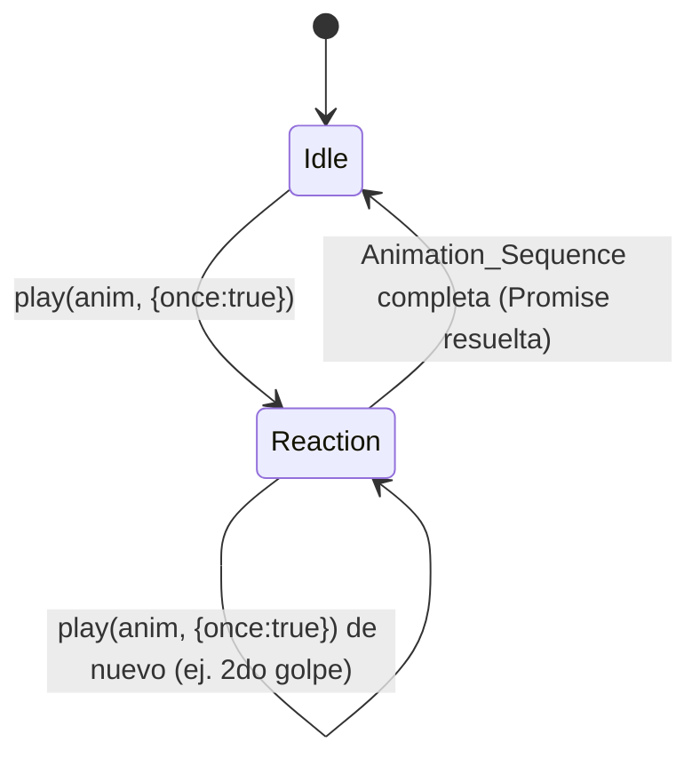

# Design Document

## Overview

Esta funcionalidad reemplaza el combate DOM/CSS actual (`.arena`, `.fighter`, `.knight-*`, `.boss-*`) por un combate dibujado sobre `<canvas id="gameCanvas">`, usando las hojas de sprites y metadata JSON ya existentes en `public/sprites/`. El cambio introduce tres piezas nuevas y reutilizables — un motor de animación de sprites genérico (`Sprite_Animation_Engine`), una capa de dibujo de combate (`Boss_Fight_Renderer`) y una tabla de rotación de bosses (`Boss_Rotation`) — y sustituye la temporización fija (`setTimeout`) de `src/main.js` por una orquestación basada en la finalización real de cada `Animation_Sequence`.

El diseño se apoya en tres decisiones estructurales:

1. **El motor de animación es instanciable por personaje**, no un singleton global: cada `Sprite_Character` activo (el guerrero, y el boss activo) tiene su propia instancia con su propio frame/tiempo, de forma que ambos avanzan de forma independiente en el mismo `requestAnimationFrame`.
2. **`src/combat/fight.js` no se toca** (Requirement 14). Toda la información que `fight.js` no expone — el conteo de fallos previos dentro del combate (para decidir `bloqueo` vs `herido`) y el índice de alternancia `ataque_1`/`ataque_2` — se rastrea en una pequeña estructura de estado de UI (`combatUiState`) que vive en `src/main.js`, creada de nuevo en cada combate y descartada al terminar.
3. **La rotación de bosses reutiliza `gameState.doorsPassed`** en lugar de introducir un contador nuevo en `src/engine/tower.js`. `doorsPassed` ya se incrementa exactamente una vez por combate ganado (`endFight(true)`) y se reinicia en `resetGame`, por lo que ya representa "número de combates contra el guardián resueltos en la sesión actual" sin tocar el engine.

## Architecture

```mermaid
flowchart TD
    subgraph Data["Datos estáticos"]
        ROSTER["Boss_Rotation<br/>src/data/bossRoster.js"]
    end

    subgraph Render["Capa de dibujo"]
        ENGINE["Sprite_Animation_Engine<br/>src/render/spriteEngine.js<br/>(1 instancia por Sprite_Character)"]
        BFR["Boss_Fight_Renderer<br/>src/render/bossFightRender.js"]
        DRAW["draw.js: render()"]
    end

    subgraph UI["DOM / HUD"]
        SCREENS["src/ui/screens.js<br/>hp-bar, fightBanner, cardsRow,<br/>setCardsInteractionLocked()"]
    end

    subgraph Main["Orquestación"]
        MAIN["src/main.js<br/>combatUiState + Animation_Sequence<br/>orchestration (async/await)"]
    end

    FIGHT["src/combat/fight.js<br/>(sin cambios)"]

    MAIN -->|startBossFight/answerCard| FIGHT
    MAIN -->|selectBoss(doorsPassed)| ROSTER
    MAIN -->|crea/reutiliza| ENGINE
    MAIN -->|play('ataque', once) etc.| ENGINE
    ENGINE -->|update dt / frame rect| BFR
    ROSTER -->|Battle_Background, Boss_Display_Name| BFR
    DRAW -->|screen==='boss'| BFR
    MAIN -->|showBanner / setCardsInteractionLocked| SCREENS
```

### Máquina de estados por personaje

Cada `Sprite_Character` (guerrero, boss activo) tiene su propia máquina de reacciones, independiente de la del otro personaje:



`Idle` siempre se reproduce con `play('idle')` (modo continuo, `once:false`), que por Requirement 2.8 reinicia siempre desde el primer fotograma sin importar en qué fotograma estaba la animación interrumpida.

## Components and Interfaces

### 1. `Sprite_Animation_Engine` (`src/render/spriteEngine.js`, NUEVO)

Módulo genérico, sin ninguna rama específica por personaje (Requirement 2.7). Se instancia una vez por `Sprite_Character`.

```js
export class SpriteAnimationEngine {
  /**
   * @param {object} metadata - JSON parseado (displayWidth, displayHeight, frameWidth, frameHeight, animations).
   * @param {Map<string, HTMLImageElement>} images - una imagen precargada por animación (clave = nombre de animación).
   */
  constructor(metadata, images) { ... }

  /**
   * Carga metadata + imágenes desde una carpeta base. No lanza si un archivo falla (ver Error Handling).
   * Resuelve la URL final de cada `animation.file` concatenando `baseFolder` con el nombre de archivo
   * declarado en la metadata: `imageUrl = baseFolder + '/' + animation.file`, análogo al patrón
   * `audioFileUrl(filename)` ya usado en `src/audio/sfx.js`/`src/audio/music.js` (`'/audio/' + filename`).
   * Por ejemplo, para `guerrero.json` con `baseFolder = '/sprites/guerrero'` y una animación
   * `{ file: 'idle.png' }`, la imagen se carga desde `/sprites/guerrero/idle.png`; para un boss con
   * `baseFolder = '/sprites/bosses/boss_2_orco'` y `{ file: 'ataque.png' }`, desde
   * `/sprites/bosses/boss_2_orco/ataque.png`. `baseFolder` no debe terminar en `/` (se le añade
   * explícitamente al concatenar), igual que `jsonPath` en `BOSS_ROSTER` no lo lleva al final.
   */
  static async load(jsonPath, baseFolder) { ... } // -> Promise<SpriteAnimationEngine>

  /**
   * Inicia una Animation_Sequence desde su primer fotograma.
   * @param {string} name - nombre de la animación (clave en metadata.animations).
   * @param {{once?: boolean}} [opts] - once=true: reproduce exactamente un ciclo y resuelve
   *   la Promise devuelta al llegar al último fotograma, sin importar el `loop` declarado en la
   *   metadata (usado por todas las Combat_Reaction: ataque, ataque_1/2, bloqueo, herido, morir).
   *   once=false (default, usado por 'idle'): sigue el `loop` declarado en la metadata
   *   (Requirement 2.5/2.6) — como ninguna animación 'idle' declara loop:false, en la práctica
   *   se repite indefinidamente y la Promise nunca se resuelve por sí sola.
   * @returns {Promise<void>}
   */
  play(name, opts) { ... }

  /** Avanza el frame según fps/dt; resuelve la Promise de play() si corresponde. Llamado cada tick del loop. */
  update(dt) { ... }

  /** Rectángulo fuente {sx, sy, sw, sh} del frame actual, según layout 'grid' o 'row'. */
  getFrameRect() { ... }

  /** Dibuja el frame actual escalado a displayWidth/displayHeight en (x, y) (esquina superior izquierda). */
  draw(ctx, x, y) { ... }

  /** Nombre de la animación en curso (para property tests / debugging). */
  get currentAnimationName() { ... }
}
```

**Decisión: `play(name, {once})` en vez de fiarlo todo al flag `loop` de la metadata.**

Las cuatro animaciones de reacción del guerrero (`ataque`, `bloqueo`, `herido`) y la mayoría de las de ataque de los bosses **no** declaran `loop:false` en su JSON (solo `morir` lo declara). Si el motor solo respetara el `loop` declarado, `ataque` se repetiría en bucle infinito y nunca habría una señal de finalización con la que encadenar `herido` (Requirement 6.1/6.2) ni con la que decidir cuándo reanudar `idle` (Requirement 5.2/8.2). Se evaluaron dos alternativas:

1. Cambiar el JSON de cada personaje para declarar `loop:false` en todas las animaciones de reacción. Esto contamina archivos de datos que ya existen y son compartidos con el arte, y complicaría reutilizar la misma animación tanto para un ciclo (reacción) como en bucle (si en el futuro se quisiera un idle de "ataque" en bucle, por ejemplo).
2. Separar la semántica "cómo se dibuja el JSON declarativamente" (`loop`) de "cómo la usa el orquestador de combate en este momento" (`once`). El motor sigue respetando `loop` fielmente para su modo continuo (Requirement 2.5/2.6, usado por `idle`), y añade un modo `once` explícito que cualquier llamador puede pedir para cualquier animación, independientemente de su `loop` declarado.

Se elige la opción 2: es no invasiva con los archivos de arte, y hace explícito en el código de orquestación (`main.js`) qué animaciones son "de un solo ciclo" sin necesitar leer la metadata para saberlo.

**Cálculo del rectángulo fuente** (`getFrameRect`):

- `layout: "grid"` (Requirement 2.2): `sx = (frameIndex % columns) * frameWidth`, `sy = Math.floor(frameIndex / columns) * frameHeight`, `sw = frameWidth`, `sh = frameHeight`.
- `layout: "row"` (Requirement 2.3): la hoja de cada animación mide `frameWidth * frameCount` de ancho; `sx = frameIndex * frameWidth`, `sy = 0`, `sw = frameWidth`, `sh = frameHeight`.

**Avance de frame** (`update(dt)`, Requirement 2.4): se acumula `elapsed += dt`; `frameDuration = 1000 / animation.fps`; `frameIndex = Math.floor(elapsed / frameDuration)`.

- Si `once === true` o `animation.loop === false`: cuando `frameIndex >= frameCount`, se fija `frameIndex = frameCount - 1` (Requirement 2.5) y, la primera vez que ocurre esto para la reproducción en curso, se resuelve la Promise pendiente de `play()`.
- En otro caso (`once === false` y `loop !== false`): `frameIndex = frameIndex % frameCount` (Requirement 2.6, reinicio inmediato al llegar al final).

`play(name, opts)` siempre reinicia `elapsed = 0` y `frameIndex = 0` al ser invocado, sin importar el frame en el que estuviera la animación previa — esto es lo que garantiza Requirement 2.8 (reanudar `idle` siempre desde el primer fotograma tras cualquier interrupción): `bossFightRender` simplemente llama `engine.play('idle')` de nuevo tras cada `Combat_Reaction`.

### 2. `Boss_Rotation` (`src/data/bossRoster.js`, NUEVO)

```js
export const BOSS_ROSTER = [
  { id: 'boss_1_titan_guerrero', jsonPath: '/sprites/bosses/boss_1_titan_guerrero/boss_1_titan_guerrero.json',
    displayName: 'Titán Guerrero', background: '/background/Fondo_Boss_1.png',
    attackAnimations: ['ataque_1', 'ataque_2'] },
  { id: 'boss_2_orco', jsonPath: '/sprites/bosses/boss_2_orco/boss_2_orco.json',
    displayName: 'Orco', background: '/background/Fondo_Boss_2.png',
    attackAnimations: ['ataque'] },
  { id: 'boss_3_tigre', jsonPath: '/sprites/bosses/boss_3_tigre/boss_3_tigre.json',
    displayName: 'Tigre', background: '/background/Fondo_Boss_3.png',
    attackAnimations: ['ataque'] },
  { id: 'boss_4_golem', jsonPath: '/sprites/bosses/boss_4_golem/boss_4_golem.json',
    displayName: 'Golem', background: '/background/Fondo_Boss_4.png',
    attackAnimations: ['ataque'] },
  { id: 'boss_5_brujo', jsonPath: '/sprites/bosses/boss_5_brujo/boss_5_brujo.json',
    displayName: 'Brujo', background: '/background/Fondo_Boss_5.png',
    attackAnimations: ['ataque'] },
];

/**
 * @param {number} bossesResolved - combates contra el guardián ya resueltos en la sesión
 *   (gameState.doorsPassed en el momento de INICIAR el combate; 0 para el primer combate).
 * @returns {typeof BOSS_ROSTER[number]}
 */
export function selectBoss(bossesResolved) {
  if (bossesResolved < BOSS_ROSTER.length) return BOSS_ROSTER[bossesResolved]; // Requirement 4.1
  const idx = Math.floor(Math.random() * BOSS_ROSTER.length);                  // Requirement 4.2
  return BOSS_ROSTER[idx];
}

export function isAlternatingAttackBoss(bossEntry) {
  return bossEntry.attackAnimations.length > 1; // Requirement 7.4/7.5
}
```

`attackAnimations.length > 1` identifica al `Alternating_Attack_Boss` sin necesidad de un flag booleano redundante: es estructuralmente el único con más de una animación de ataque.

**Nota importante sobre `fight.bossLabel` (Requirement 4.5).** `startBossFight(level)` en `src/combat/fight.js` (sin cambios, Requirement 14) ya calcula y retorna un campo `bossLabel` propio, usando el `BOSS_NAMES` viejo indexado por nivel (`BOSS_NAMES[Math.min(level, BOSS_NAMES.length) - 1] + " — Nivel " + level`, ver `.kiro/specs/combate-cartas-escaladas/design.md`). Ese `bossLabel` **no** tiene relación con el Boss_Sprite realmente seleccionado por `Boss_Rotation` (`selectBoss`) para esta feature, y debe ser **ignorado y descartado por completo** por la capa de integración: `src/main.js` NUNCA debe leer `fight.bossLabel`. El único `bossLabel` válido para `ui.showBossScreen(...)` es el que `main.js` construye él mismo a partir de `bossEntry.displayName` (la entrada de `BOSS_ROSTER` devuelta por `selectBoss`), como se muestra en la sección 4 (`` `${bossEntry.displayName} — Nivel ${lvl}` ``). Esta distinción es fácil de pasar por alto durante la implementación porque ambos campos se llaman igual (`bossLabel`) y ambos tienen forma similar (`"{nombre} — Nivel {level}"`) — la diferencia es la fuente del nombre (`BOSS_NAMES` por nivel vs. `Boss_Display_Name` del Boss_Sprite realmente seleccionado), que solo coinciden por casualidad cuando `level <= 5` y la partida está en su `First_Round`.

### 3. `Boss_Fight_Renderer` (`src/render/bossFightRender.js`, NUEVO)

Responsable únicamente de **dibujar** el estado actual (Requirement 3) — no decide cuándo cambiar de animación; eso vive en la orquestación de `main.js` (sección 5).

```js
export const COMBAT_LAYOUT = {
  warriorXRatio: 0.24,   // centro del guerrero, como fracción del ancho del área de combate
  bossXRatio: 0.76,      // centro del boss, como fracción del ancho del área de combate
  groundYRatio: 0.62,    // línea base compartida, como fracción de H
};

/** Dibuja el fondo de combate estirado a pantalla completa (Requirement 4.4). */
export function drawBattleBackground(ctx, W, H, backgroundImage) { ... }
```

**Corrección post-implementación (Bugfix — Requirement 4.3/4.4, Battle_Background nunca se mostraba).** La primera implementación de esta sección asumía que `bossEntry.backgroundImage` existiría en la entrada de `BOSS_ROSTER` devuelta por `selectBoss`, pero `BOSS_ROSTER` (sección 2) solo define `background` (la ruta string al PNG), y ningún módulo asignaba jamás `backgroundImage` sobre esa entrada — `drawBattleBackground` recibía siempre `undefined` y hacía no-op silencioso (`if (!backgroundImage) return;`), de modo que el fondo nunca se dibujaba. La corrección mantiene `drawBattleBackground(ctx, W, H, backgroundImage)` con la misma firma, pero la imagen ya cargada ahora se resuelve fuera de `bossFightRender.js`: `src/main.js` precarga las 5 imágenes de fondo en un `Map` local (`backgroundImages`, análogo a `bossEngines`) durante la inicialización del módulo, y guarda la imagen correspondiente al boss activo como campo propio de `combatUiState` (`combatUiState.backgroundImage`, ver sección 4 y Data Models) en el momento de construirlo — nunca mutando `bossEntry`/`BOSS_ROSTER`. `draw.js` (`render()`) fue actualizado para leer `combatUiState.backgroundImage` en vez de `combatUiState.bossEntry.backgroundImage`.

/**
 * Dibuja el guerrero a la izquierda y el boss a la derecha (Requirement 3.1/3.2),
 * usando cada uno su propia instancia de Sprite_Animation_Engine.
 */
export function drawCombatants(ctx, W, H, warriorEngine, bossEngine) {
  const groundY = H * COMBAT_LAYOUT.groundYRatio;
  warriorEngine.draw(ctx, W * COMBAT_LAYOUT.warriorXRatio - warriorEngine.displayWidth / 2,
                      groundY - warriorEngine.displayHeight);
  bossEngine.draw(ctx, W * COMBAT_LAYOUT.bossXRatio - bossEngine.displayWidth / 2,
                   groundY - bossEngine.displayHeight);
}

/** update(dt) de ambos motores; se llama cada tick, independientemente de si hay una Combat_Reaction en curso. */
export function updateCombatants(dt, warriorEngine, bossEngine) {
  warriorEngine.update(dt);
  bossEngine.update(dt);
}
```

**Decisión: `updateCombatants(dt, ...)` se invoca desde dentro de `render()`, no desde `engine.update()`.** Esto separa `update`/`draw` de forma menos estricta que el resto del motor (donde `engine.update()` avanza el estado del juego y `render()` solo dibuja), pero es una decisión deliberada, no un descuido: `src/engine/tower.js` no conoce el concepto de combate ni de `Sprite_Animation_Engine`, y Requirement 14 exige no tocar `src/combat/fight.js`, mientras que el principio rector de esta feature (ver Overview, decisión 2) es minimizar los cambios en `src/engine/tower.js` también. Añadir el avance de las animaciones de combate a `engine.update()` obligaría a inyectar `combatUiState` (un concepto de `main.js`/UI) dentro del motor de la torre, o a que `tower.js` importe `spriteEngine.js`, ensanchando su superficie sin necesidad. Como `render()` ya recibe `combatUiState` como parámetro (para dibujar), y ya se le pasa `gameState.lastDt`, colocar `updateCombatants` al inicio de la rama `screen === 'boss'` de `render()` evita cualquier cambio en `tower.js` a costa de que `render()` tenga un efecto secundario (mutar el estado interno de los `SpriteAnimationEngine`) además de dibujar — efecto aceptable porque ese estado (frame/tiempo de animación) es exclusivamente de presentación, no de lógica de juego, y no es leído por ningún otro módulo fuera de la capa de render.

`draw.js` (`render()`) se extiende así, sin tocar `drawKnight` (entidad visual distinta, la del guerrero de la torre en pantallas `build`/`falling`):

```js
export function render(ctx, W, H, gameState, combatUiState) {
  drawSky(ctx, W, H, gameState.clouds);
  drawTower(ctx, W, H, gameState.camElev, gameState.floors);
  drawMovingBlock(ctx, W, H, gameState.camElev, gameState.screen, gameState.floors, gameState.moving, gameState.knight.animating, gameState.doorsPassed);
  if (gameState.screen === 'build' || gameState.screen === 'falling') {
    const topFloorRef = gameState.floors[gameState.floors.length - 1];
    drawKnight(ctx, topFloorRef, gameState.knight, gameState.camElev, H);
  }
  if (gameState.screen === 'boss' && combatUiState) {
    bossFightRender.updateCombatants(gameState.lastDt || 0, combatUiState.warriorEngine, combatUiState.bossEngine);
    bossFightRender.drawBattleBackground(ctx, W, H, combatUiState.backgroundImage);
    bossFightRender.drawCombatants(ctx, W, H, combatUiState.warriorEngine, combatUiState.bossEngine);
  }
}
```

`main.js` guarda el `dt` calculado en `loop()` en `gameState.lastDt` (una línea añadida) para que `render()` pueda pasarlo a `updateCombatants` sin duplicar el cálculo de delta time.

**Corrección post-implementación (Bugfix — Requirement 4.3/4.4):** `combatUiState.backgroundImage` (no `combatUiState.bossEntry.backgroundImage`) es el campo correcto — ver la nota de corrección al final de la sección 3 y la sección 4 (construcción de `combatUiState`) para el detalle de dónde se precarga y asigna esa imagen.

### 4. Orquestación en `src/main.js` (MODIFICADO)

> **NOTA DE RECONCILIACIÓN (post-implementación de Modal_Pregunta):** el diseño original de esta sección asumía el sistema de flip de carta (`renderCardBack`/`flipped`) que existía en el código en el momento de escribir este diseño. Una feature posterior introdujo el sistema de Modal_Pregunta (`openQuestionModal`/`closeQuestionModal`) que reemplazó ese flujo. Esta sección fue actualizada para integrarse con la Modal_Pregunta real. Decisión: las animaciones de sprite se reproducen después de que la modal se cierra, nunca mientras está abierta; el guard `reactionInProgress` bloquea también la apertura de la modal; el banner de resultado se muestra después de las animaciones de reacción (no antes, corrigiendo el orden que tenía el código pre-existente).

**Nuevo estado de combate, creado en `loop()` cuando `updateResult.shouldStartBoss`:**

```js
let combatUiState = null;

// dentro de loop(), rama shouldStartBoss:
const bossEntry = selectBoss(gameState.doorsPassed);           // Requirement 4.1/4.2
fight = combat.startBossFight(lvl);
combatUiState = {
  bossEntry,
  warriorEngine,                     // instancia única y persistente, creada una vez al inicio del juego
  bossEngine: bossEngines.get(bossEntry.id), // instancia persistente por boss, precargadas al inicio
  backgroundImage: backgroundImages.get(bossEntry.id), // Battle_Background ya cargada — Requirement 4.3/4.4
  failedAnswerCount: 0,              // Card_Attempt_State (ver Data Models) — Requirement 7.2/7.3
  attackAlternateIndex: 0,           // reiniciado cada combate — Requirement 7.5
  reactionInProgress: false,         // Requirement 15.2
};
combatUiState.warriorEngine.play('idle');
combatUiState.bossEngine.play('idle');
ui.showBossScreen(`${bossEntry.displayName} — Nivel ${lvl}`, fight.cardCount); // Requirement 4.5
// ... resto de showBossScreen/renderPips/renderCards sin cambios
```

`warriorEngine` y las 5 `bossEngines` se crean **una sola vez**, en la inicialización del módulo (junto a `music.init()`), vía `SpriteAnimationEngine.load(...)`, de forma que iniciar un combate solo cambia qué instancia de boss se usa, sin recargar imágenes.

**Precarga de `Battle_Background` (Bugfix — Requirement 4.3/4.4).** En la misma IIFE async donde se precargan `warriorEngine` y `bossEngines`, se precarga también un `Map` local `backgroundImages` (`entry.id -> HTMLImageElement` cargada), usando `new Image()` + `img.src = entry.background` + esperar `onload`/`onerror`, con el mismo patrón de mejor esfuerzo que ya usa `SpriteAnimationEngine.load` para las imágenes de sprites (nunca lanza; un fallo se registra con `console.error` y esa entrada del `Map` queda en `null`, sin bloquear el resto de la carga). Esta precarga se incluye en el mismo `Promise.all` que la de `bossEngines`, para que ambas ocurran en paralelo; `spritesReady` solo pasa a `true` cuando ese `Promise.all` combinado (sprites + fondos) completa, éxito o fallo. `BOSS_ROSTER` (`bossEntry`) nunca se muta: la imagen cargada se asigna como campo propio de `combatUiState` (`combatUiState.backgroundImage`, ver arriba y Data Models), no como `bossEntry.backgroundImage`.

**`onCardClick(idx)` — guard `reactionInProgress` antes de abrir la Modal_Pregunta (Requirement 15.2).**

El código real y vigente de `onCardClick` en `src/main.js` abre la Modal_Pregunta (`ui.openQuestionModal`) en vez de voltear la carta en la fila:

```js
function onCardClick(idx) {
  if (!fight || fight.resolved) return;
  const card = fight.cards[idx];
  if (card.locked) return;
  const cardEl = document.querySelectorAll('#cardsRow .card')[idx];
  ui.openQuestionModal(cardEl, card, onAnswer, idx, { resolved: fight.resolved });
}
```

Este guard solo cubre `Card_Attempt_State` (`card.locked`, puesto por un fallo previo en esa carta concreta). No verifica en ningún momento si hay una `Combat_Reaction` en curso, por lo que la Modal_Pregunta podría abrirse (`ui.openQuestionModal`) mientras se reproduce cualquier animación de reacción del guerrero o del boss — `ui.setCardsInteractionLocked(true)` solo deshabilita botones `.opt-btn` dentro de `#cardsRow .card`, que en el flujo real de Modal_Pregunta nunca existen ahí (las opciones son `.qmodal-opt`, dentro del overlay de la modal), así que no protege este caso. Se corrige añadiendo el guard `combatUiState.reactionInProgress`, evaluado **antes** de invocar `ui.openQuestionModal`:

```js
function onCardClick(idx) {
  if (!fight || fight.resolved) return;
  if (combatUiState && combatUiState.reactionInProgress) return;        // Requirement 15.2
  const card = fight.cards[idx];
  if (card.locked) return;
  const cardEl = document.querySelectorAll('#cardsRow .card')[idx];
  ui.openQuestionModal(cardEl, card, onAnswer, idx, { resolved: fight.resolved });
}
```

Con este guard, ninguna carta puede abrir la Modal_Pregunta mientras `reactionInProgress` es `true`, cerrando el hueco que `setCardsInteractionLocked` (deshabilitar botones `.opt-btn` de la fila) deja abierto: en este flujo real, `setCardsInteractionLocked` solo aporta la clase visual `reaction-locked` sobre las cartas de la fila (dimming/cursor), mientras que el bloqueo funcional de interacción recae por completo en este guard de `onCardClick`.

**`onAnswer(cardIdx, chosenIdx)` — el marcado visual y los sfx permanecen inmediatos; las cuatro ramas de resultado despachan a una función de secuencia async que primero cierra la Modal_Pregunta y solo después dispara la `Combat_Reaction`:**

```js
function onAnswer(cardIdx, chosenIdx) {
  if (!fight || fight.resolved) return;

  const card = fight.cards[cardIdx];
  if (card.locked) return; // Verificar ANTES de llamar answerCard

  const result = combat.answerCard(fight, cardIdx, chosenIdx);
  if (!result) return;

  // Marcado visual + sfx inmediatos: SIN CAMBIOS (Requirement 12). El marcado de
  // acierto/fallo de las opciones ocurre dentro de la Modal_Pregunta
  // (openQuestionModal, sobre los botones .qmodal-opt); aquí solo se aplica el
  // bloqueo cosmético temporal a la Tarjeta de la fila.
  const cardEl = document.querySelectorAll('#cardsRow .card')[cardIdx];
  cardEl.classList.add('locked');
  if (result.correct) sfx.correct(); else sfx.wrong();
  ui.renderPips('playerHpBar', fight.playerPips, fight.playerPipsMax);
  // En acierto sin resolver el combate, la barra del jefe se sigue difiriendo
  // hasta que la Modal_Pregunta se cierre (SIN CAMBIOS respecto al código actual).
  const deferBossBar = result.correct && result.outcome === null;
  if (!deferBossBar) {
    ui.renderPips('bossHpBar', fight.bossPips, fight.bossPipsMax);
  }

  if (result.outcome === 'win') {
    engine.applyDuelWinSpeedBoost(gameState);
    sfx.win();
    playWinSequence();                       // sustituye la cadena setTimeout(500ms) + setTimeout(1300ms)
  } else if (result.outcome === 'lose') {
    sfx.lose();
    playLoseSequence();                       // sustituye showBanner inmediato + setTimeout(1200ms)
  } else if (result.correct) {
    playCorrectNonResolvingSequence(cardEl);   // sustituye setTimeout(900ms) + setTimeout(560ms)
  } else {
    cardEl.classList.add('failed');
    playIncorrectNonResolvingSequence();       // sustituye setTimeout(900ms)
  }
}
```

**Pausas de lectura de la modal (Requirement 11.4).** Los mismos milisegundos que hoy introducen los `setTimeout` del código vigente se conservan, pero se reinterpretan: ya no son la pausa *antes del banner*, sino la pausa *antes de cerrar la Modal_Pregunta* (el jugador necesita ese tiempo para leer el resultado marcado sobre `.qmodal-opt` antes de que la modal se cierre y arranque la `Combat_Reaction`):

```js
const MODAL_CLOSE_PAUSE_MS = {
  win: 500,                    // antes: pausa antes del banner de victoria
  lose: 1200,                  // antes: pausa antes de closeQuestionModal()+endFight(false)
  correctNonResolving: 900,    // antes: pausa antes de closeQuestionModal()
  incorrectNonResolving: 900,  // antes: pausa antes de closeQuestionModal()
};

function wait(ms) {
  return new Promise(resolve => setTimeout(resolve, ms));
}
```

**Funciones de secuencia (nuevas, reemplazan los `setTimeout` encadenados).** Las cuatro siguen el mismo esqueleto: `await wait(pausa)` → `ui.closeQuestionModal()` → **recién ahí** `reactionInProgress = true` + `ui.setCardsInteractionLocked(true)` → `Combat_Reaction` (Requirement 1 de la nota de reconciliación arriba) → banner/limpieza (Requirement 11.1/11.2, ahora después de la reacción, no antes) → cierre.

**Bandera `reactionInProgress` (Requirement 15.2).** Cada función de secuencia marca `combatUiState.reactionInProgress = true` justo después de `ui.closeQuestionModal()` (nunca mientras la modal está abierta), en el mismo momento en que llama a `ui.setCardsInteractionLocked(true)`, y la vuelve a poner en `false` justo antes de `ui.setCardsInteractionLocked(false)` en los dos casos que no resuelven el combate (`playIncorrectNonResolvingSequence`, `playCorrectNonResolvingSequence`). En `playWinSequence`/`playLoseSequence` no es necesario devolverla a `false` explícitamente porque esas ramas terminan en `endFight(...)`, que descarta `combatUiState` por completo (ver más abajo); mientras `combatUiState` exista durante esas dos secuencias, `reactionInProgress` permanece `true` hasta que el combate se cierra, lo cual es correcto: ninguna carta debe poder abrir la Modal_Pregunta entre que `outcome` se resuelve y que la pantalla de combate se cierra.

```js
async function playWinSequence() {
  await wait(MODAL_CLOSE_PAUSE_MS.win);                                 // pausa de lectura de la modal
  ui.closeQuestionModal();                                              // Requirement 11.4 — modal cerrada
  combatUiState.reactionInProgress = true;                              // Requirement 15.2
  ui.setCardsInteractionLocked(true);                                   // Requirement 15.1
  await combatUiState.warriorEngine.play('ataque', { once: true });     // Requirement 6.1
  await combatUiState.bossEngine.play('herido', { once: true });        // Requirement 6.2
  ui.showBanner('¡Guardián derrotado!', 'win');                         // Requirement 11.1 (tras la reacción)
  await combatUiState.bossEngine.play('morir', { once: true });         // Requirement 10.1/10.2
  endFight(true);                                                       // Requirement 10.3
}

async function playLoseSequence() {
  await wait(MODAL_CLOSE_PAUSE_MS.lose);                                // pausa de lectura de la modal
  ui.closeQuestionModal();                                              // Requirement 11.4 — modal cerrada
  combatUiState.reactionInProgress = true;                              // Requirement 15.2
  ui.setCardsInteractionLocked(true);                                   // Requirement 15.1
  await playFailureReaction();                                          // Requirement 7 (ver abajo)
  ui.showBanner('¡Has caído ante el guardián!', 'lose');                // Requirement 11.2 (tras la reacción)
  await combatUiState.warriorEngine.play('morir', { once: true });      // Requirement 9.1/9.2
  endFight(false);                                                      // Requirement 9.3
}

async function playCorrectNonResolvingSequence(cardEl) {
  await wait(MODAL_CLOSE_PAUSE_MS.correctNonResolving);                 // pausa de lectura de la modal
  ui.closeQuestionModal();                                              // Requirement 11.4 — modal cerrada
  ui.renderPips('bossHpBar', fight.bossPips, fight.bossPipsMax);        // pip visible al cerrar (SIN CAMBIOS)
  combatUiState.reactionInProgress = true;                              // Requirement 15.2
  ui.setCardsInteractionLocked(true);                                   // Requirement 15.1
  await combatUiState.warriorEngine.play('ataque', { once: true });     // Requirement 6.1
  await combatUiState.bossEngine.play('herido', { once: true });        // Requirement 6.2
  if (fight && !fight.resolved) cardEl.classList.remove('locked');      // Requirement 11.3: re-habilita la Tarjeta
  resumeIdleBoth();
  combatUiState.reactionInProgress = false;                             // Requirement 15.2
  ui.setCardsInteractionLocked(false);                                  // Requirement 15.3
}

async function playIncorrectNonResolvingSequence() {
  await wait(MODAL_CLOSE_PAUSE_MS.incorrectNonResolving);               // pausa de lectura de la modal
  ui.closeQuestionModal();                                              // Requirement 11.4 — modal cerrada
  combatUiState.reactionInProgress = true;                              // Requirement 15.2
  ui.setCardsInteractionLocked(true);                                   // Requirement 15.1
  await playFailureReaction();                                          // Requirement 7
  resumeIdleBoth();                                                     // Requirement 5.2/8.2/2.8
  combatUiState.reactionInProgress = false;                             // Requirement 15.2
  ui.setCardsInteractionLocked(false);                                  // Requirement 15.3
}
```

**Decisión: reinterpretación de Requirement 11.3 ("flip the answered card back to its front face").** El texto original de Requirement 11.3 (no modificado, ver requirements.md) fue escrito cuando la carta de la fila mostraba físicamente su reverso (`renderCardBack`/`flipped`). En el flujo real, la carta de la fila nunca cambia de cara — el "reverso" (la pregunta y sus opciones) vive exclusivamente en la Modal_Pregunta, superpuesta como overlay. Por eso "volver a la cara frontal" se satisface con `ui.closeQuestionModal()` (que ya ocurre, ver arriba, **antes** de la `Combat_Reaction`, cumpliendo la letra del requisito porque la carta de la fila jamás deja de mostrar su frente); "re-enable it for further interaction" es lo que efectivamente ocurre **después** de la `Combat_Reaction`, mediante `cardEl.classList.remove('locked')`, que es el único bloqueo cosmético real que tenía esa Tarjeta.

```js
/** Boss ataca (con alternancia si aplica) -> guerrero bloqueo/herido según Card_Attempt_State. */
async function playFailureReaction() {
  const { bossEntry } = combatUiState;
  const attackAnim = bossEntry.attackAnimations.length > 1
    ? bossEntry.attackAnimations[combatUiState.attackAlternateIndex % 2] // Requirement 7.4
    : bossEntry.attackAnimations[0];
  if (bossEntry.attackAnimations.length > 1) combatUiState.attackAlternateIndex++;

  await combatUiState.bossEngine.play(attackAnim, { once: true });      // Requirement 7.1
  const reactionAnim = combatUiState.failedAnswerCount === 0 ? 'bloqueo' : 'herido'; // Requirement 7.2/7.3
  combatUiState.failedAnswerCount++;
  await combatUiState.warriorEngine.play(reactionAnim, { once: true });
}

function resumeIdleBoth() {
  combatUiState.warriorEngine.play('idle');                             // Requirement 5.2 / 2.8
  combatUiState.bossEngine.play('idle');                                // Requirement 8.2 / 2.8
}
```

**`endFight(won)`**: sin cambios estructurales salvo limpiar `combatUiState = null` junto a `fight = null` (ya no hay más lectura de sprites de ese combate). El resto (registro de score, `showGameOverScreen`, transición de `screen`) permanece igual — Requirement 9.3/10.3 ya quedan satisfechos porque `endFight` solo se invoca desde dentro de los `await` de `playWinSequence`/`playLoseSequence`, es decir, **después** de que `morir` complete, nunca antes.

**Decisión: interpretación de `Card_Attempt_State`.** El glosario lo define "por carta/pregunta concreta", pero `fight.js` bloquea una carta de forma permanente en su primer fallo (`card.locked = true`), por lo que una carta nunca puede acumular más de un fallo — la lectura literal por-carta haría que Requirement 7.3 (`herido`) fuera inalcanzable. La User Story del Requirement 7 ("bloquear el primer golpe... resultar herido en golpes posteriores") deja claro que la progresión es sobre el combate completo, no sobre una carta específica. Por eso `combatUiState.failedAnswerCount` cuenta los fallos totales ya ocurridos en el combate actual (0 en el primer fallo, ≥1 en cualquier fallo posterior, sobre cualquier carta), que es la única interpretación consistente con el mecanismo de bloqueo permanente de `fight.js` (Requirement 14) y con la narrativa del Requirement 7.

### 5. Bloqueo de cartas (`src/ui/screens.js`, MODIFICADO)

```js
/**
 * Habilita o deshabilita TODAS las cartas no bloqueadas por Card_Attempt_State
 * (es decir, las que no tienen la clase 'locked' ya aplicada por un fallo).
 * @param {boolean} isLocked
 */
export function setCardsInteractionLocked(isLocked) {
  document.querySelectorAll('#cardsRow .card').forEach(cardEl => {
    if (cardEl.classList.contains('locked')) return; // ya bloqueada permanentemente por un fallo
    const buttons = cardEl.querySelectorAll('.opt-btn');
    if (isLocked) {
      cardEl.classList.add('reaction-locked');
      buttons.forEach(b => b.disabled = true);
    } else {
      cardEl.classList.remove('reaction-locked');
      buttons.forEach(b => b.disabled = false);
    }
  });
}
```

`setCardsInteractionLocked` por sí sola solo cubre las cartas **ya volteadas** (deshabilita sus botones `.opt-btn`); no protege una carta que todavía muestra su frente, porque esa carta no tiene botones de opción hasta que `onCardClick` la voltea. Por eso Requirement 15.2 exige un segundo mecanismo: el guard `combatUiState.reactionInProgress` en `onCardClick` (ver sección 4), que impide voltear cualquier carta —independientemente de si ya tenía o no reverso visible— mientras una `Combat_Reaction` está en curso. Los dos mecanismos son complementarios: `setCardsInteractionLocked` bloquea la interacción de cartas ya volteadas, y el guard de `reactionInProgress` en `onCardClick` bloquea que cualquier carta nueva se voltee.

### 6. Eliminación de markup/CSS obsoleto (`index.html`, MODIFICADO)

**Markup de `#bossScreen`** — se elimina `.arena`, ambos `.combatant`, ambos `.fighter` y todos sus `.facet-*` hijos, y `.vs-badge`; se conservan `hp-label`/`hp-bar`/`fightBanner`/`cardsRow` (Requirement 1.1, 1.3):

```html
<div id="bossScreen" class="overlay hidden">
  <div class="hp-label">Tu vida</div>
  <div class="hp-bar" id="playerHpBar"></div>
  <div class="hp-label" id="bossName">Guardián</div>
  <div class="hp-bar boss" id="bossHpBar"></div>
  <div class="banner hidden" id="fightBanner"></div>
  <div class="cards-row" id="cardsRow"></div>
</div>
```

**Corrección post-implementación (Bugfix — Requirement 3.1/3.2, barras de vida no alineadas con los sprites).** El markup anterior hereda de `.overlay` el layout `display:flex; flex-direction:column; align-items:center;`, por lo que las 4 barras se apilaban verticalmente centradas en el medio de la pantalla, sin relación con la posición horizontal real de los sprites (`Warrior_Sprite` en `COMBAT_LAYOUT.warriorXRatio = 0.24`, `Boss_Sprite` en `COMBAT_LAYOUT.bossXRatio = 0.76`, sección 3). La corrección envuelve cada par `hp-label`/`hp-bar` en un contenedor propio (`.combatant-hp-player`, `.combatant-hp-boss`), posicionado de forma absoluta dentro de `#bossScreen` en esas mismas fracciones de ancho — los ids `playerHpBar`/`bossHpBar`/`bossName` no cambian, porque `screens.js` los usa vía `getElementById`:

```html
<div id="bossScreen" class="overlay hidden">
  <div class="combatant-hp combatant-hp-player">
    <div class="hp-label">Tu vida</div>
    <div class="hp-bar" id="playerHpBar"></div>
  </div>
  <div class="combatant-hp combatant-hp-boss">
    <div class="hp-label" id="bossName">Guardián</div>
    <div class="hp-bar boss" id="bossHpBar"></div>
  </div>
  <div class="banner hidden" id="fightBanner"></div>
  <div class="cards-row" id="cardsRow"></div>
</div>
```

```css
.combatant-hp{
  position:absolute; top:min(4vh,34px); width:180px;
  display:flex; flex-direction:column; align-items:center;
}
.combatant-hp-player{ left:24%; transform:translateX(-50%); }
.combatant-hp-boss{ left:76%; transform:translateX(-50%); }
```

`#bossScreen` es un contenedor de posicionamiento válido para estos `position:absolute` porque hereda `position:absolute` de `.overlay` (regla ya existente). En la regla `@media (max-width:520px)` existente se añade `.combatant-hp{width:140px;}` para que el ancho de 180px no se corte en pantallas angostas.

**Selectores CSS a eliminar por completo** (Requirement 1.2): `.arena`, `.combatant`, `.fighter`, `.facet`, `.knight-head`, `.knight-body`, `.knight-shoulder-l`, `.knight-shoulder-r`, `.knight-sword`, `.knight-legs`, `.boss-core`, `.boss-eye-l`, `.boss-eye-r`, `.boss-crown`, `.boss-arm-l`, `.boss-arm-r`, `.boss-legs`, `.vs-badge`, y la regla `@media (max-width:520px) .fighter{...}`.

**Consecuencia necesaria no listada explícitamente pero implicada por Requirement 1.1**: `.overlay` define `background: radial-gradient(...)` opaco, que hoy cubre completamente lo que hay detrás. Como el `Battle_Background`/sprites ahora se dibujan en el `canvas` **debajo** de `#bossScreen`, se añade una regla `#bossScreen { background: none; }` para que ese fondo de combate sea visible a través del overlay, mientras las barras de vida/banner/cartas siguen dibujándose como DOM encima del canvas.

### 7. Estructura de carpetas de audio placeholder (Requirement 13)

Directorios nuevos (cada uno con un `.gitkeep`, sin archivos `.wav` reales):

```
public/audio/guerrero/bloqueo/.gitkeep
public/audio/guerrero/herido/.gitkeep
public/audio/guerrero/morir/.gitkeep

public/audio/bosses/boss_1_titan_guerrero/idle/.gitkeep
public/audio/bosses/boss_1_titan_guerrero/ataque_1/.gitkeep
public/audio/bosses/boss_1_titan_guerrero/ataque_2/.gitkeep
public/audio/bosses/boss_1_titan_guerrero/herido/.gitkeep
public/audio/bosses/boss_1_titan_guerrero/morir/.gitkeep

public/audio/bosses/boss_2_orco/idle/.gitkeep
public/audio/bosses/boss_2_orco/ataque/.gitkeep
public/audio/bosses/boss_2_orco/herido/.gitkeep
public/audio/bosses/boss_2_orco/morir/.gitkeep

public/audio/bosses/boss_3_tigre/idle/.gitkeep
public/audio/bosses/boss_3_tigre/ataque/.gitkeep
public/audio/bosses/boss_3_tigre/herido/.gitkeep
public/audio/bosses/boss_3_tigre/morir/.gitkeep

public/audio/bosses/boss_4_golem/idle/.gitkeep
public/audio/bosses/boss_4_golem/ataque/.gitkeep
public/audio/bosses/boss_4_golem/herido/.gitkeep
public/audio/bosses/boss_4_golem/morir/.gitkeep

public/audio/bosses/boss_5_brujo/idle/.gitkeep
public/audio/bosses/boss_5_brujo/ataque/.gitkeep
public/audio/bosses/boss_5_brujo/herido/.gitkeep
public/audio/bosses/boss_5_brujo/morir/.gitkeep
```

`boss_1_titan_guerrero` recibe `ataque_1`/`ataque_2` en vez de `ataque` (Requirement 13.2, Alternating_Attack_Boss); el guerrero no recibe carpetas para `idle`/`ataque` porque esos eventos ya tienen o no requieren archivo en `AUDIO_MAP` (Requirement 13.3 solo pide `bloqueo`/`herido`/`morir`).

## Data Models

```
SpriteMetadata = {
  displayWidth: number, displayHeight: number,
  frameWidth: number, frameHeight: number,
  animations: Record<string, SpriteAnimationMeta>,
}

SpriteAnimationMeta = {
  file: string,
  layout: 'grid' | 'row',
  columns?: number, rows?: number,   // solo cuando layout === 'grid'
  frameCount: number,
  fps: number,
  loop?: boolean,                    // ausente/true = bucle continuo; false = mantener último frame
}

BossRosterEntry = {
  id: string,                        // 'boss_1_titan_guerrero' .. 'boss_5_brujo'
  jsonPath: string,
  displayName: string,               // Boss_Display_Name (Requirement 4.5)
  background: string,                // ruta a Fondo_Boss_N.png
  attackAnimations: string[],        // ['ataque'] o ['ataque_1','ataque_2']
}

CombatUiState = {                    // vive solo en src/main.js, uno por combate activo
  bossEntry: BossRosterEntry,
  warriorEngine: SpriteAnimationEngine,  // instancia persistente y compartida entre combates
  bossEngine: SpriteAnimationEngine,     // instancia persistente por boss, seleccionada según bossEntry
  backgroundImage: HTMLImageElement | null, // Battle_Background ya cargada para bossEntry (Bugfix Requirement 4.3/4.4);
                                      // proviene del Map local `backgroundImages` de main.js, nunca de bossEntry.
  failedAnswerCount: number,         // Card_Attempt_State agregado del combate (Requirement 7.2/7.3)
  attackAlternateIndex: number,      // Requirement 7.4/7.5, reiniciado a 0 en cada combate
  reactionInProgress: boolean,       // Requirement 15.2 — true mientras cualquier Combat_Reaction
                                      // Animation_Sequence está en curso; ver sección 4 y 5.
}
```

`fight` (el objeto devuelto por `startBossFight`/mutado por `answerCard` en `src/combat/fight.js`) **no cambia de forma** (Requirement 14): `Boss_Fight_Renderer`, `Sprite_Animation_Engine` y `combatUiState` solo lo leen (`fight.resolved`, `fight.cards[i].locked`), nunca lo mutan ni recalculan `playerPips`/`bossPips`.

## Correctness Properties

*A property is a characteristic or behavior that should hold true across all valid executions of a system-essentially, a formal statement about what the system should do. Properties serve as the bridge between human-readable specifications and machine-verifiable correctness guarantees.*

### Property 1: Geometría correcta del rectángulo de fotograma

For any Sprite_Animation con `layout: "grid"` y cualquier índice de fotograma válido (`0 <= frameIndex < frameCount`), el rectángulo fuente calculado es `{sx: (frameIndex % columns) * frameWidth, sy: Math.floor(frameIndex / columns) * frameHeight, sw: frameWidth, sh: frameHeight}`; y for any Sprite_Animation con `layout: "row"` y cualquier índice de fotograma válido, el rectángulo fuente es `{sx: frameIndex * frameWidth, sy: 0, sw: frameWidth, sh: frameHeight}`.

**Validates: Requirements 2.2, 2.3**

### Property 2: Avance de fotograma consistente con fps, loop y modo once

For any Sprite_Animation (con cualquier `fps` y `frameCount` válidos) y cualquier secuencia de llamadas a `update(dt)` cuya suma de `dt` sea `T` milisegundos: si la reproducción es en modo continuo (`once: false`) y `loop !== false`, el índice de fotograma resultante es `Math.floor(T / (1000/fps)) % frameCount`; si es en modo `once: true` o `loop === false`, el índice de fotograma nunca excede `frameCount - 1`, se mantiene fijo en `frameCount - 1` una vez alcanzado, y la Promise devuelta por `play()` se resuelve exactamente una vez, en el primer `update()` que alcanza o supera esa duración total.

**Validates: Requirements 2.4, 2.5, 2.6**

### Property 3: `idle` siempre se reanuda desde el primer fotograma

For any estado previo de una Sprite_Animation en curso (cualquier `frameIndex`, cualquier `elapsed`, en modo `once` o continuo), invocar `play('idle')` inmediatamente después produce `frameIndex === 0` y `elapsed === 0` para la nueva reproducción, sin importar en qué punto se encontraba la reproducción interrumpida.

**Validates: Requirements 2.8**

### Property 4: Invariantes de layout del Boss_Fight_Renderer

For any dimensiones de canvas `W > 0`, `H > 0` y cualquier par de `displayWidth`/`displayHeight` válidos para el Warrior_Sprite y el Boss_Sprite, tras `drawCombatants` el centro horizontal del Warrior_Sprite dibujado es estrictamente menor que el centro horizontal del Boss_Sprite dibujado; y for any `W`, `H`, el rectángulo dibujado por `drawBattleBackground` cubre exactamente `{x:0, y:0, width:W, height:H}`.

**Validates: Requirements 3.1, 3.2, 4.4**

### Property 5: Rotación determinística en los primeros 5 combates

For any valor de `bossesResolved` en `[0, 4]`, `selectBoss(bossesResolved)` devuelve siempre la misma entrada de `BOSS_ROSTER` en la posición `bossesResolved` (`boss_1_titan_guerrero` para 0, ..., `boss_5_brujo` para 4), de forma repetible entre llamadas con el mismo valor.

**Validates: Requirements 4.1**

### Property 6: Rotación aleatoria con repetición desde el sexto combate

For any valor de `bossesResolved >= 5` y cualquier número N de llamadas sucesivas a `selectBoss(bossesResolved)`, cada resultado pertenece siempre al conjunto de las 5 entradas de `BOSS_ROSTER` (ninguna llamada devuelve `undefined` ni un id fuera del roster), y para N suficientemente grande (≥ 100) se observan al menos dos resultados iguales entre llamadas distintas (repetición permitida).

**Validates: Requirements 4.2**

### Property 7: Atributos derivados del boss seleccionado

For any entrada de `BOSS_ROSTER` y cualquier nivel `level >= 1`, el `bossLabel` mostrado es exactamente `` `${entry.displayName} — Nivel ${level}` ``, y el `Battle_Background` resuelto para ese combate es exactamente `entry.background`, independientemente del valor de `BOSS_NAMES` en `src/data/services.js`.

**Validates: Requirements 4.3, 4.5**

### Property 8: Ciclo idle-por-defecto / reacción / vuelta-a-idle para ambos personajes

For any Sprite_Character (Warrior_Sprite o Boss_Sprite) que no tiene ninguna Combat_Reaction en curso, su animación activa es `idle` en bucle; y for any Combat_Reaction Animation_Sequence disparada para ese Sprite_Character que completa (la Promise de `play(anim, {once:true})` se resuelve), la siguiente animación activa para ese personaje es `idle`, reiniciada desde el primer fotograma.

**Validates: Requirements 5.1, 5.2, 8.1, 8.2**

### Property 9: Orden y cierre de la secuencia de acierto (incluye victoria)

For any respuesta correcta procesada por `playWinSequence`/`playCorrectNonResolvingSequence`, la Modal_Pregunta (`isQuestionModalOpen()`) siempre está cerrada antes de que comience a reproducirse la Animation_Sequence `ataque` del Warrior_Sprite (ninguna Combat_Reaction arranca mientras `ui.isQuestionModalOpen()` es `true`); la Animation_Sequence `herido` del Boss_Sprite nunca comienza a reproducirse antes de que la Animation_Sequence `ataque` del Warrior_Sprite haya completado; y si esa respuesta resuelve el combate como victoria, la Animation_Sequence `morir` del Boss_Sprite nunca comienza antes de que `herido` haya completado, el banner de victoria (`ui.showBanner`) nunca se muestra antes de que `herido` haya completado, y `endFight(true)` (cierre del Fight_Screen y transición a `'build'`) nunca se invoca antes de que `morir` haya completado.

**Validates: Requirements 6.1, 6.2, 10.1, 10.2, 10.3, 11.1**

### Property 10: Orden, selección de reacción y cierre de la secuencia de fallo (incluye derrota)

For any respuesta incorrecta procesada por `playLoseSequence`/`playIncorrectNonResolvingSequence`, la Modal_Pregunta (`isQuestionModalOpen()`) siempre está cerrada antes de que comience a reproducirse la Animation_Sequence de ataque del Boss_Sprite (ninguna Combat_Reaction arranca mientras `ui.isQuestionModalOpen()` es `true`); la Animation_Sequence de ataque del Boss_Sprite (`ataque`, o la que corresponda para el Alternating_Attack_Boss) nunca comienza a reproducirse antes de completar (no aplica: es la primera del par) y la reacción del Warrior_Sprite (`bloqueo` o `herido`) nunca comienza antes de que esa animación de ataque haya completado; la reacción elegida es `bloqueo` si, y solo si, `failedAnswerCount` era `0` en el momento de esa respuesta, y `herido` en cualquier otro caso; y si esa respuesta resuelve el combate como derrota, la Animation_Sequence `morir` del Warrior_Sprite nunca comienza antes de que la reacción de fallo haya completado, el banner de derrota (`ui.showBanner`) nunca se muestra antes de que la reacción de fallo haya completado, y `endFight(false)` nunca se invoca antes de que `morir` haya completado.

**Validates: Requirements 7.1, 7.2, 7.3, 9.1, 9.2, 9.3, 11.2**

### Property 11: Alternancia `ataque_1`/`ataque_2` con reinicio por combate

For any Alternating_Attack_Boss y cualquier secuencia de `k` respuestas incorrectas dentro de un mismo combate, la animación de ataque usada en la `n`-ésima respuesta incorrecta de esa secuencia (`1 <= n <= k`) es `ataque_1` si `n` es impar y `ataque_2` si `n` es par; y for any estado de alternancia alcanzado en un combate anterior (par o impar), la primera respuesta incorrecta de un nuevo combate contra el Alternating_Attack_Boss siempre usa `ataque_1`.

**Validates: Requirements 7.4, 7.5**

### Property 12: Ciclo de bloqueo/desbloqueo de cartas durante una Combat_Reaction

For any conjunto de cartas de un combate con cualquier combinación de estados `locked` (bloqueadas permanentemente por un fallo previo) y no bloqueadas, invocar `setCardsInteractionLocked(true)` deshabilita exactamente las cartas no bloqueadas por `Card_Attempt_State` (Requirement 14 no muta `locked`); una llamada posterior a `setCardsInteractionLocked(false)` (tras que ambos Sprite_Character hayan reanudado `idle`) rehabilita exactamente esas mismas cartas, dejando las bloqueadas permanentemente sin cambios en ambos momentos; y for any carta no bloqueada por `Card_Attempt_State` y for any invocación de `onCardClick` sobre esa carta mientras `combatUiState.reactionInProgress` es `true`, la Modal_Pregunta permanece cerrada (no se invoca `ui.openQuestionModal`), sin importar si esa carta ya había abierto o no la Modal_Pregunta previamente en el combate.

**Validates: Requirements 15.1, 15.2, 15.3**

### Property 13: El estado de combate de `fight.js` no es alterado por la capa visual

For any objeto `fight` producido por `startBossFight` (con cualquier `cardCount` válido) en cualquier punto de una secuencia de dibujo (`updateCombatants`, `drawCombatants`, `drawBattleBackground`) y de orquestación de reacciones (`playWinSequence`, `playLoseSequence`, etc., usando mocks de los motores de animación), los valores `cardCount`, `playerPips`, `bossPips`, `resolved`, y el array `cards` (incluyendo cada `card.locked`) permanecen exactamente iguales (deep-equal) antes y después de esas operaciones — solo `answerCard` (invocado por `fight.js`, no modificado) puede cambiarlos.

**Validates: Requirements 14.1**

## Error Handling

- **Fallo al cargar un archivo JSON de metadata o una imagen de sprite** (`SpriteAnimationEngine.load`): se captura con try/catch alrededor de cada `fetch`/`Image.onerror`; si falla, se registra en consola (`console.error`) y la instancia resultante expone un `draw()`/`update()` que son no-op seguros (no dibujan nada ni lanzan), de forma que un asset faltante en un boss no bloquee el resto del juego. Esto es coherente con el patrón "mejor esfuerzo" ya usado en `sfx.js`/`music.js` para archivos de audio.
- **`play(name, ...)` con un nombre de animación que no existe en la metadata**: se ignora silenciosamente (no cambia de animación, no lanza), y se registra una advertencia en consola; esto evita que un typo en la orquestación de `main.js` rompa el bucle de render.
- **`update(dt)` invocado sobre un motor cuya metadata aún no ha terminado de cargar** (`SpriteAnimationEngine.load` en curso): `update`/`draw` son no-op hasta que la carga complete; el combate no se inicia (`ui.showBossScreen`) hasta que las Promises de carga de `warriorEngine` y de las 5 `bossEngines` se hayan resuelto en la inicialización del juego, por lo que este caso no ocurre en el flujo normal, pero el motor queda protegido igualmente por robustez.
- **Una Combat_Reaction cuya Promise nunca se resuelve** (por ejemplo, si `frameCount` fuera `0` en un archivo de metadata corrupto): se considera un dato de configuración inválido, no un caso de error en tiempo de ejecución a recuperar; se documenta como precondición de los archivos de metadata (deben tener `frameCount >= 1`).
- **`fight` se vuelve `null`/`resolved` mientras una secuencia `async` está en curso** (por ejemplo, si en el futuro se añadiera una vía de abandono de combate): cada función de secuencia (`playWinSequence`, etc.) solo lee `fight`/`combatUiState` capturados por closure en el momento en que se disparó la secuencia, y `endFight` ya reinicia `fight = null`/`combatUiState = null` de forma segura al final; no hay una ruta de cancelación de combate a mitad de una `Animation_Sequence` en el alcance de esta feature.

## Testing Strategy

**Enfoque dual**: pruebas unitarias para ejemplos concretos, casos de borde y puntos de integración de DOM/orquestación, y pruebas basadas en propiedades para los invariantes universales de la sección de Correctness Properties, siguiendo el mismo formato que los specs `sfx-audio-file-integration` y `background-music-controls` (fast-check + vitest + jsdom, ya presentes en `devDependencies`).

### Pruebas unitarias (ejemplos)

- `SpriteAnimationEngine.load()` con metadata válida expone `displayWidth`/`displayHeight` y una lista de animaciones que coincide exactamente con `Object.keys(metadata.animations)` (Requirement 2.1).
- `#bossScreen` no contiene ningún nodo con clase `fighter`, `facet`, `combatant`, `arena` ni `vs-badge` tras renderizar la pantalla de combate (Requirement 1.1).
- El stylesheet compilado no contiene ninguna de las reglas listadas en la sección "Eliminación de markup/CSS obsoleto" (Requirement 1.2) — verificado leyendo el CSS fuente en el test.
- `renderPips`/`fightBanner`/`cardsRow` siguen funcionando igual que antes de la migración (Requirement 1.3) — reutiliza los tests ya existentes de `screens.js` si los hubiera, o casos concretos nuevos.
- `selectBoss(0)` .. `selectBoss(4)` devuelven respectivamente `boss_1_titan_guerrero` .. `boss_5_brujo` (Requirement 4.1, caso concreto que complementa la Property 5).
- `sfx.correct()`/`sfx.wrong()`/`sfx.win()`/`sfx.lose()` se invocan inmediatamente después de `ui.renderPips(...)` y antes de que se resuelva ninguna Promise de `Animation_Sequence` (Requirement 12.1, 12.2, 12.3) — verificado con un motor de animación mockeado cuyo `play()` devuelve una Promise que solo se resuelve tras un `await` explícito del test, confirmando que el sfx ya se ejecutó.
- Cada directorio listado en la sección "Estructura de carpetas de audio placeholder" existe y contiene un `.gitkeep` (Requirement 13.1, 13.2, 13.3, 13.4).
- `setCardsInteractionLocked(true)` sobre una carta ya bloqueada (`locked` en `fight.cards`) no le agrega/quita clases de reacción ni cambia el estado `disabled` de sus botones inexistentes (la carta bloqueada no tiene reverso interactivo activo) — caso de borde de la Property 12.
- `onCardClick(idx)` con `combatUiState.reactionInProgress === true` sobre una carta no bloqueada no invoca `ui.openQuestionModal` (Requirement 15.2) — caso concreto que complementa la Property 12 y cubre el gap identificado entre `onCardClick` y `setCardsInteractionLocked`.

### Pruebas basadas en propiedades

Se utiliza **fast-check** con un mínimo de 100 iteraciones por prueba. Cada test de propiedad se etiqueta:

**Feature: boss-fight-sprite-animations, Property N: {texto de la propiedad}**

- **Property 1** (Geometría de frame): generar aleatoriamente `columns`/`rows`/`frameWidth`/`frameHeight` (grid) o `frameWidth`/`frameHeight`/`frameCount` (row) y un `frameIndex` válido; verificar la fórmula exacta del rectángulo fuente para ambos layouts.
- **Property 2** (Avance de fotograma): generar aleatoriamente `fps` (1-30), `frameCount` (1-20), `loop`/`once` y una secuencia de `dt` aleatorios (1-48ms, igual que el `Math.min(48, ...)` de `main.js`) que sumen un `T` conocido; verificar el índice de fotograma resultante y, en modo `once`/`loop:false`, que la Promise se resuelve exactamente una vez.
- **Property 3** (Reset de idle): generar un estado previo aleatorio (`frameIndex`, `elapsed`, modo `once` true/false) y luego invocar `play('idle')`; verificar `frameIndex === 0` y `elapsed === 0` tras la llamada.
- **Property 4** (Layout del renderer): generar aleatoriamente `W`, `H` (mayores a 0) y `displayWidth`/`displayHeight` de ambos personajes; verificar la relación de centros horizontales y el rectángulo del fondo.
- **Property 5** (Rotación determinística): generar `bossesResolved` aleatorio en `[0,4]` y llamar `selectBoss` varias veces con el mismo valor; verificar igualdad de resultado.
- **Property 6** (Rotación aleatoria): generar `bossesResolved` aleatorio `>= 5` (hasta un límite razonable, ej. 1000) y N llamadas (100-500); verificar pertenencia al roster y presencia de al menos una repetición.
- **Property 7** (Atributos derivados): generar una entrada aleatoria del roster y un `level` aleatorio (1-50); verificar el formato exacto de `bossLabel` y el `background` resuelto.
- **Property 8** (Ciclo idle/reacción): generar una secuencia aleatoria de disparos de Combat_Reaction (mockeando `play()` para resolver tras N `update()`) para el guerrero y/o el boss de forma independiente; verificar que, entre reacciones, la animación activa es `idle`, y que tras cada resolución vuelve a `idle` en frame 0.
- **Property 9** (Secuencia de acierto/victoria): usar motores de animación mockeados cuyas Promises se resuelven de forma controlada (con `resolve` diferido manualmente en el test) y `ui.closeQuestionModal`/`ui.isQuestionModalOpen` mockeados; verificar que la modal está cerrada (`isQuestionModalOpen() === false`) antes de que arranque `ataque`, el orden estricto de llamadas (`ataque` antes que `herido`, `herido` antes del banner, banner antes que `morir` en el caso de victoria) y que `endFight` no se invoca antes de que el mock de `morir` resuelva.
- **Property 10** (Secuencia de fallo/derrota): igual que la Property 9 pero para la rama de fallo, generando aleatoriamente `failedAnswerCount` inicial (0 o mayor) para verificar la selección `bloqueo`/`herido`, y verificando igualmente que la modal está cerrada antes de que arranque la animación de ataque del boss.
- **Property 11** (Alternancia): generar `k` aleatorio (1-20) de respuestas incorrectas sucesivas contra el Alternating_Attack_Boss dentro de uno o más combates simulados (reiniciando `attackAlternateIndex` entre combates); verificar la secuencia `ataque_1, ataque_2, ataque_1, ...` y el reinicio en cada nuevo combate.
- **Property 12** (Bloqueo de cartas): generar un array aleatorio de cartas con `locked` aleatorio; invocar `setCardsInteractionLocked(true)` y luego `setCardsInteractionLocked(false)`; verificar que solo las cartas no bloqueadas cambian de estado `disabled` en cada paso. Adicionalmente, con `combatUiState.reactionInProgress` fijado aleatoriamente a `true`/`false` y una carta aleatoria no bloqueada, invocar `onCardClick(idx)` (con `ui.openQuestionModal` mockeado) y verificar que se invoca si y solo si `reactionInProgress` es `false` (y `card.locked` es `false`).
- **Property 13** (Inmutabilidad del estado de combate): generar un objeto `fight` aleatorio (vía `startBossFight` con un `level` aleatorio); tomar una copia profunda antes de ejercitar `updateCombatants`/`drawCombatants`/`drawBattleBackground` (con `ctx`/imágenes mockeadas) y las funciones de orquestación (con motores mockeados); verificar deep-equal contra la copia.

Las pruebas de las Properties 1-4, 8-12 usan mocks ligeros de `CanvasRenderingContext2D` (objeto con métodos `drawImage`/`fillRect` como spies, sin canvas real) e `Image`/`HTMLImageElement` (objetos planos con `width`/`height`), evitando cualquier dependencia de `jsdom` real para el dibujo en sí; las Properties 9/10/13 pueden reutilizar `jsdom` (ya en `devDependencies`) para las partes que tocan `document.querySelectorAll('#cardsRow .card')`.

