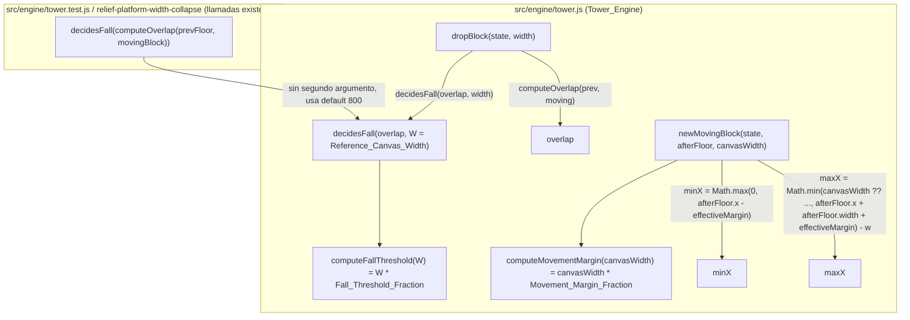

# Design Document

## Overview

`src/engine/tower.js` fija dos valores de física del Bloque_en_Movimiento en píxeles absolutos, sin relación al ancho del canvas: el Umbral_de_Caida (`decidesFall(overlap) { return overlap < 16; }`) y el Margen_de_Movimiento (`afterFloor.x - 90` / `afterFloor.x + afterFloor.width + 90` en `newMovingBlock`). Esta feature reemplaza ambas constantes por cálculos derivados de `W`, usando dos fracciones fijas (`Fall_Threshold_Fraction`, `Movement_Margin_Fraction`) calibradas para que, evaluadas en `Reference_Canvas_Width` (800px), reproduzcan exactamente los valores actuales (16px y 90px).

La solución añade dos funciones puras exportadas:

```js
export const Reference_Canvas_Width = 800; // ya usado en combat-sprite-scaling; reutilizado sin cambios
export const Fall_Threshold_Fraction = 16 / Reference_Canvas_Width;      // 0.02
export const Movement_Margin_Fraction = 90 / Reference_Canvas_Width;     // 0.1125

export function computeFallThreshold(W) { return W * Fall_Threshold_Fraction; }
export function computeMovementMargin(canvasWidth) { return canvasWidth * Movement_Margin_Fraction; }
```

**Decisión de diseño clave — mínima disrupción de firmas:** `decidesFall(overlap)` se llama hoy sin segundo argumento en `dropBlock`, en todos los tests existentes de `tower.test.js`, y está documentada explícitamente en la spec hermana `relief-platform-width-collapse` como función "que no se modifica". Cambiar su firma a `decidesFall(overlap, W)` obligatorio rompería esos call-sites. Siguiendo el mismo patrón ya usado en `landscape-orientation-support` para `elevToScreen(camElev, elev, H, ratio = DEFAULT_VERTICAL_ANCHOR_RATIO)`, `decidesFall` gana un **segundo parámetro opcional con valor por defecto `Reference_Canvas_Width`**:

```js
export function decidesFall(overlap, W = Reference_Canvas_Width) {
  return overlap < computeFallThreshold(W);
}
```

Con este default, `decidesFall(overlap)` (sin `W`) sigue evaluando `overlap < computeFallThreshold(800)`, y como `computeFallThreshold(800) === 800 * (16/800) === 16` exactamente, el comportamiento de toda llamada existente sin `W` es **idéntico bit a bit** al actual, sin tocar ningún test ni la spec hermana. Solo `dropBlock(state, width)` — el único call-site de producción real — se modifica para pasar `width` explícitamente:

```js
if (decidesFall(overlap, width)) {
  return { type: 'fell', floorNum: state.floors.length - 1 };
}
```

`newMovingBlock(state, afterFloor, canvasWidth)` ya recibe `canvasWidth` como parámetro obligatorio hoy — no hay problema de firma ahí. Solo se reemplaza el literal `90` por `computeMovementMargin(canvasWidth)` en ambos usos (`minX` y `maxX`), reutilizando la misma variable local para garantizar que ambos límites usan siempre el mismo margen efectivo (Requirement 2.6).

No se modifica `computeOverlap`, `computeNewFloor`, `isReliefPlatformFloor`, `applyReliefPlatformSpeedBoost`, `moveSpeed`/`SPEED_CAP`, ni el acotado de ancho de `newMovingBlock`/`createTowerState`/`resetGame` ya corregido en specs anteriores (Requirement 4).

## Architecture



`computeFallThreshold` y `computeMovementMargin` son las únicas fuentes de verdad para traducir `W` en valores de física efectivos; `decidesFall` y `newMovingBlock` nunca vuelven a usar los literales `16`/`90` directamente.

### Por qué las fracciones reproducen exactamente 16 y 90 en `Reference_Canvas_Width`

Por definición algebraica:

```
Fall_Threshold_Fraction    = 16 / 800  = 0.02
Movement_Margin_Fraction   = 90 / 800  = 0.1125

computeFallThreshold(800)  = 800 * 0.02   = 16    (exacto, sin redondeo: 800 * 16 / 800 = 16)
computeMovementMargin(800) = 800 * 0.1125 = 90    (exacto, sin redondeo: 800 * 90 / 800 = 90)
```

Esto no depende de ninguna rama condicional que compare `W === 800`: `computeFallThreshold`/`computeMovementMargin` son una única multiplicación aplicada siempre, para cualquier `W`. Que el resultado sea exactamente 16/90 en `W = 800` es una consecuencia algebraica de cómo se definieron las fracciones (`16/800` y `90/800`), no un caso especial en el código — el mismo razonamiento que ya se usó en `relief-platform-canvas-clamp`/`base-platform-canvas-clamp` para justificar "Property 2: preservación por construcción, no solo por intención". Esto también resuelve directamente el Requirement 2.3: para `canvasWidth = 799` o `801` (o cualquier valor distinto de 800, por 1px que sea), `computeMovementMargin` aplica la misma fórmula proporcional sin ninguna tolerancia ni rama especial alrededor de 800; el valor 90 solo emerge en `canvasWidth === 800` porque `800 * (90/800) = 90` por aritmética, no porque exista un `if (canvasWidth === 800) return 90`.

## Components and Interfaces

### `src/engine/tower.js` (modificado)

```js
// Nuevas constantes exportadas
export const Reference_Canvas_Width = 800; // idéntico al ya definido en combat-sprite-scaling
export const Fall_Threshold_Fraction = 16 / Reference_Canvas_Width;    // 0.02
export const Movement_Margin_Fraction = 90 / Reference_Canvas_Width;   // 0.1125

// Nuevas funciones puras exportadas (testeables de forma aislada)
export function computeFallThreshold(W) {
  return W * Fall_Threshold_Fraction;
}

export function computeMovementMargin(canvasWidth) {
  return canvasWidth * Movement_Margin_Fraction;
}

// Función existente, modificada: segundo parámetro OPCIONAL con default = Reference_Canvas_Width
export function decidesFall(overlap, W = Reference_Canvas_Width) {
  return overlap < computeFallThreshold(W);
}
```

- `computeFallThreshold(W)`: función pura, `W * Fall_Threshold_Fraction`. Sin estado, sin `Math.random`/`Date` (Requirement 1.5).
- `computeMovementMargin(canvasWidth)`: función pura, `canvasWidth * Movement_Margin_Fraction`. Misma naturaleza que `computeFallThreshold`.
- `decidesFall(overlap, W = Reference_Canvas_Width)`: **única función existente cuya firma cambia**, y solo mediante un parámetro opcional. Todo call-site actual sin `W` (tests de `tower.test.js`, spec `relief-platform-width-collapse`) sigue compilando y comportándose exactamente igual, porque el default reproduce el umbral fijo de 16px por construcción algebraica (ver Architecture).

### `dropBlock(state, width)` (modificado, única línea)

```js
export function dropBlock(state, width) {
  // ...sin cambios hasta aquí...
  const overlap = computeOverlap(prev, moving);

  if (decidesFall(overlap, width)) { // antes: decidesFall(overlap)
    return { type: 'fell', floorNum: state.floors.length - 1 };
  }
  // ...resto sin cambios...
}
```

Este es el único call-site de producción real de `decidesFall`. Al pasar `width` explícitamente, el umbral efectivo usado en el juego pasa a depender del ancho real del canvas (Requirement 1.4), mientras que cualquier otro llamador que no pase `W` sigue viendo el comportamiento de escritorio de referencia.

### `newMovingBlock(state, afterFloor, canvasWidth)` (modificado, sin cambio de firma)

```js
export function newMovingBlock(state, afterFloor, canvasWidth) {
  // ...sin cambios hasta el cálculo de minX/maxX...

  const effectiveMargin = computeMovementMargin(canvasWidth); // antes: literal 90
  const minX = Math.max(0, afterFloor.x - effectiveMargin);
  const maxX = Math.min(canvasWidth ?? (afterFloor.x + afterFloor.width + effectiveMargin), afterFloor.x + afterFloor.width + effectiveMargin) - w;

  // ...resto sin cambios (startFromRight, dir, x, return)...
}
```

`effectiveMargin` se calcula una sola vez por llamada y se reutiliza en ambas fórmulas (`minX` y `maxX`), garantizando por construcción el Requirement 2.6 (mismo margen para ambos límites en la misma llamada). La firma de `newMovingBlock` no cambia: `canvasWidth` ya era un parámetro obligatorio de producción antes de esta feature.

## Data Models

No se introducen entidades de datos persistentes ni se modifica la forma de `Bloque_en_Movimiento`, `Piso_Anterior`, ni `state`. Los "modelos" relevantes son formas de datos puramente en memoria, usados como parámetros/retornos de las funciones puras nuevas:

```ts
// Entrada de computeFallThreshold / segundo parámetro de decidesFall
type CanvasWidth = number; // W > 0 en la práctica; el dominio matemático no está restringido a enteros

// Retorno de computeFallThreshold — Umbral_de_Caida efectivo, en píxeles
type EffectiveFallThreshold = number; // = W * Fall_Threshold_Fraction

// Entrada de computeMovementMargin
type CanvasWidthForMargin = number; // canvasWidth > 0

// Retorno de computeMovementMargin — Margen_de_Movimiento efectivo, en píxeles
type EffectiveMovementMargin = number; // = canvasWidth * Movement_Margin_Fraction
```

`Fall_Threshold_Fraction` y `Movement_Margin_Fraction` son constantes numéricas fijas (`0.02` y `0.1125` respectivamente), no entidades con identidad propia; no se recalculan ni se almacenan en `state`.

## Correctness Properties

*A property is a characteristic or behavior that should hold true across all valid executions of a system-essentially, a formal statement about what the system should do. Properties serve as the bridge between human-readable specifications and machine-verifiable correctness guarantees.*

### Property 1: Paridad exacta con el comportamiento actual en Reference_Canvas_Width (decidesFall)

*For any* `overlap` value, `decidesFall(overlap, Reference_Canvas_Width)` SHALL equal `overlap < 16`, and `decidesFall(overlap)` (called without a second argument) SHALL produce the exact same result as `decidesFall(overlap, Reference_Canvas_Width)`.

**Validates: Requirements 1.2, 1.4, 1.6, 3.2**

### Property 2: El Umbral_de_Caida efectivo es estrictamente monótono creciente en W

*For any* two canvas widths `W1 < W2` (both `> 0`), `computeFallThreshold(W1)` SHALL be strictly less than `computeFallThreshold(W2)`.

**Validates: Requirements 1.3**

### Property 3: El cálculo del Umbral_de_Caida es determinista

*For any* canvas width `W > 0`, calling `computeFallThreshold(W)` multiple times SHALL always return the exact same value.

**Validates: Requirements 1.5**

### Property 4: El Margen_de_Movimiento efectivo es siempre exactamente proporcional a canvasWidth, sin excepción ni tolerancia

*For all* canvas widths `canvasWidth > 0`, `computeMovementMargin(canvasWidth)` SHALL equal exactly `canvasWidth * Movement_Margin_Fraction` — including for `canvasWidth` values arbitrarily close to (but different from) `Reference_Canvas_Width` (e.g. `799` or `801`), where the result SHALL differ from `90` proportionally, with no special-cased tolerance band around `Reference_Canvas_Width`.

**Validates: Requirements 2.1, 2.3, 2.4**

### Property 5: Paridad exacta con el comportamiento actual en Reference_Canvas_Width (newMovingBlock)

*For all* `afterFloor` objects and moving-block widths `w`, when `newMovingBlock` computes `minX`/`maxX` using `canvasWidth = Reference_Canvas_Width`, the resulting `minX` SHALL equal `Math.max(0, afterFloor.x - 90)` and the resulting `maxX` SHALL equal `Math.min(canvasWidth, afterFloor.x + afterFloor.width + 90) - w` — identical to the current unmodified formula for every possible `afterFloor` and `w`.

**Validates: Requirements 2.2, 2.5, 2.6, 2.7, 3.3**

### Property 6: minX y maxX siempre usan el mismo Margen_de_Movimiento efectivo, para cualquier canvasWidth

*For all* canvas widths `canvasWidth > 0`, *for all* `afterFloor` objects, and *for all* moving-block widths `w`, the `effectiveMargin` used to compute `minX` (`afterFloor.x - effectiveMargin`) SHALL be numerically identical to the `effectiveMargin` used to compute `maxX` (`afterFloor.x + afterFloor.width + effectiveMargin`) within that same call, and both SHALL equal `computeMovementMargin(canvasWidth)`.

**Validates: Requirements 2.4, 2.5, 2.6**

### Property 7: El cálculo del umbral/margen efectivo no altera moveSpeed ni otros sistemas fuera de alcance

*For any* game `state` and *any* canvas width, calling `computeFallThreshold`, `computeMovementMargin`, or `decidesFall` (in isolation, without going through `newMovingBlock`'s relief-platform branch) SHALL leave `state.moveSpeed`, `state.perfectStreak`, and `state.streakWidthBonus` unchanged from their values before the call; and for `newMovingBlock` specifically, the only path that mutates `state.moveSpeed` remains the pre-existing `isReliefPlatformFloor` branch (`applyReliefPlatformSpeedBoost`), unaffected by whichever `Movement_Margin_Fraction` value is used to compute `minX`/`maxX`.

**Validates: Requirements 4.2**

### Property Reflection

Antes de fijar la lista anterior se revisaron los siguientes solapamientos, siguiendo el prework de testabilidad:

- **1.1** y **2.1** son las afirmaciones arquitectónicas generales ("se calcula a partir de W/canvasWidth y una fracción, en vez de una constante fija"); no generan propiedades propias porque ya quedan probadas indirectamente por el resto de las propiedades (si Property 4 prueba que el margen siempre es `canvasWidth * fraction`, 2.1 queda demostrado; análogamente 1.1 queda cubierto por Properties 1-3).
- **1.2, 1.4, 1.6 y 3.2** (paridad de `decidesFall` en `Reference_Canvas_Width`, para cualquier `overlap`, con y sin segundo argumento) se consolidaron en la **Property 1**: probar que `decidesFall(overlap, 800) === overlap < 16` para todo `overlap`, y que el default reproduce el mismo resultado, cubre las cuatro cláusulas simultáneamente sin duplicar aserciones.
- **2.2, 2.5, 2.6, 2.7 y 3.3** (paridad de `minX`/`maxX` en `Reference_Canvas_Width`, uso del mismo margen en ambos límites, para cualquier `afterFloor`/`w`) se consolidaron en la **Property 5**: al fijar `canvasWidth = Reference_Canvas_Width` y comparar contra la fórmula literal `90`, se prueba a la vez que el margen es exactamente 90 en el ancho de referencia (2.2), que se usa correctamente en ambas fórmulas (2.5, 2.6) y que el resultado es idéntico al comportamiento preexistente (2.7, 3.3).
- **2.3** (sin tolerancia alrededor de 800) no generó una propiedad separada: queda subsumida por la **Property 4**, que prueba la fórmula proporcional exacta para todo `canvasWidth > 0` sin ninguna rama condicional — si la fórmula se aplica siempre sin excepción, automáticamente no existe ninguna banda de tolerancia alrededor de 800.
- **2.6** aparece tanto en Property 5 (caso particular en 800) como en Property 6 (caso general para cualquier `canvasWidth`); se mantienen ambas porque cada una aporta valor distinto: Property 5 ancla el comportamiento exacto de no-regresión en el ancho de referencia, mientras que Property 6 generaliza la consistencia interna (`minX`/`maxX` comparten margen) a todo el dominio de `canvasWidth`, incluyendo anchos donde el valor de `effectiveMargin` nunca antes existió en el código (por ejemplo `canvasWidth = 375`).
- **3.1** (existencia/valor de la constante `Reference_Canvas_Width = 800`) no es una propiedad cuantificada sobre un espacio de entradas: es una aserción puntual sobre un valor de código fuente. Se cubre con un test unitario (`Reference_Canvas_Width === 800`), no con PBT.
- **4.1, 4.3, 4.4 y 4.5** (no modificar el clamping de ancho ya corregido, `isReliefPlatformFloor`, la lógica de Bono_Racha_Perfecta, ni las firmas de `dropBlock`/`newMovingBlock` de forma incompatible) no son propiedades universalmente cuantificadas sobre un espacio de entrada variable *introducido por esta feature*: son restricciones de no-regresión sobre código que esta feature no toca en absoluto. Se cubren con la suite de tests existente de esas specs hermanas, que debe seguir pasando sin modificación, más un test estructural puntual que confirma que las firmas de `dropBlock`/`newMovingBlock` no cambiaron su número de parámetros obligatorios.
- **4.2** sí generó una propiedad propia (**Property 7**) porque, a diferencia de 4.1/4.3/4.4/4.5, el código que sí se modifica en esta feature (`newMovingBlock`, `decidesFall`) queda cerca del código de `moveSpeed`/streak que no debe modificarse; vale la pena una propiedad explícita de aislamiento para detectar una regresión accidental introducida por *este* cambio, en vez de asumir que la ausencia de edición garantiza ausencia de efectos secundarios.

Cada propiedad restante aporta una validación única: paridad exacta de referencia para ambos valores (Properties 1, 5), monotonía y determinismo del umbral (Properties 2-3), proporcionalidad exacta sin tolerancia del margen (Property 4), consistencia interna del margen entre `minX`/`maxX` para todo `canvasWidth` (Property 6), y aislamiento respecto a sistemas fuera de alcance (Property 7).

## Error Handling

- `computeFallThreshold(W)` / `computeMovementMargin(canvasWidth)`: funciones puras sin I/O. `W <= 0` o `canvasWidth <= 0` (no debería ocurrir en producción, ya que el canvas siempre reporta un ancho positivo) se evalúan con la misma multiplicación sin lanzar excepción; el resultado para esos casos degenerados no está especificado por los requirements (fuera de alcance), pero la función nunca lanza, preservando el patrón de "no-op seguro" ya usado en `computeSpriteScaleFactor`/`computeVerticalAnchorRatio`.
- `decidesFall(overlap, W = Reference_Canvas_Width)`: si se omite `W`, usa `Reference_Canvas_Width` (800), preservando el comportamiento de todas las llamadas existentes en `tower.test.js` y en `relief-platform-width-collapse` sin modificarlas. Un `W` inválido (`NaN`, `0`, negativo) se propaga aritméticamente (`NaN` o un umbral degenerado) igual que cualquier otro valor fuera de dominio hoy — no se añade validación especial, siguiendo el precedente de `elevToScreen`/`scaleDimensions` en specs hermanas.
- `newMovingBlock`: sustituir el literal `90` por `computeMovementMargin(canvasWidth)` no introduce nuevas ramas de fallo; si `canvasWidth` es `undefined` (convención ya existente de "sin límite"), `computeMovementMargin(undefined)` devuelve `NaN`, que se propaga a `minX`/`maxX` exactamente igual que hoy ocurre con `canvasWidth ?? (afterFloor.x + afterFloor.width + 90)` cuando la resta involucra valores indefinidos — comportamiento sin cambios respecto al actual para ese caso ya fuera de dominio.
- `dropBlock(state, width)`: sigue devolviendo `null` en los mismos casos que hoy (`state.screen !== 'build'`, `!state.moving`, animación en curso); pasar `width` a `decidesFall` no introduce ninguna condición de fallo nueva porque `width` ya era un parámetro obligatorio de `dropBlock` antes de esta feature.

## Testing Strategy

**Enfoque dual:**

- **Property tests (fast-check, convención ya establecida en el repo — ver `combat-sprite-scaling`, `landscape-orientation-support`, `tower.test.js`)**: implementan las 7 Correctness Properties listadas arriba, una por test, con mínimo 100 ejecuciones (`fc.assert(fc.property(...), { numRuns: 100 })` o el default de fast-check). Cada test se etiqueta con un comentario:
  `// Feature: canvas-relative-physics-balance, Property N: <texto de la propiedad>`
  - Generadores relevantes: `fc.integer({ min: 1, max: 5000 })` o `fc.double({ min: 0.01, max: 5000, noNaN: true })` para `W`/`canvasWidth` (cubriendo con holgura móvil, tablet y escritorio); `fc.double({ min: -5000, max: 5000, noNaN: true })` para `overlap` (incluyendo negativos, ya válidos hoy cuando los bloques no se solapan); pares ordenados `(W1, W2)` con `W1 < W2` para la Property 2 (por ejemplo generando dos valores y ordenándolos); objetos `afterFloor` sintéticos (`{ x, width }`) con `fc.record` para las Properties 5 y 6.
- **Unit tests (vitest)** para ejemplos concretos, casos límite y no-regresión:
  - `Reference_Canvas_Width === 800` (Requirement 3.1, constante puntual).
  - `Fall_Threshold_Fraction === 0.02` y `Movement_Margin_Fraction === 0.1125` (valores exactos derivados en el diseño).
  - `computeFallThreshold(800) === 16` y `computeMovementMargin(800) === 90` (ejemplo puntual que complementa las Properties 1 y 5).
  - `decidesFall(15)` y `decidesFall(15, 800)` ambos `=== true`; `decidesFall(16)` y `decidesFall(16, 800)` ambos `=== false` (casos límite exactos del umbral, borde estricto `<`).
  - Ejemplo móvil concreto: `computeFallThreshold(375)` y `computeMovementMargin(375)` producen valores proporcionalmente menores que en escritorio, ilustrando el escenario descrito en el Introduction.
  - Regresión de `tower.test.js`: las llamadas existentes `decidesFall(computeOverlap(prevFloor, movingBlock))` (un solo argumento) siguen pasando sin modificación alguna.
  - Regresión de firma: `dropBlock.length` y `newMovingBlock.length` no cambian su número de parámetros obligatorios respecto al código actual (Requirement 4.5).
  - No-regresión de sistemas fuera de alcance: llamar `newMovingBlock` con distintos `canvasWidth` no modifica `isReliefPlatformFloor(floorNum)` para un `floorNum` fijo, ni `state.streakWidthBonus`/`state.perfectStreak` (Requirement 4.3, 4.4, complementando la Property 7).

**Por qué PBT aplica aquí:** `computeFallThreshold`, `computeMovementMargin` y la parte pura de `decidesFall`/`newMovingBlock` son funciones puras de transformación numérica con un espacio de entrada grande (anchos de canvas de cualquier dispositivo, valores de solapamiento, posiciones/anchos de piso arbitrarios) y propiedades universales claras (proporcionalidad exacta, monotonía, determinismo, paridad de referencia, aislamiento). Esto encaja directamente en el patrón de "funciones puras con propiedades universales sobre un espacio de entrada grande" para el que PBT es apropiado, y sigue la convención ya establecida en `combat-sprite-scaling`/`landscape-orientation-support` (mismo repo, misma librería `fast-check`, mismo formato de etiquetado de tests).

**Mocking:** ninguno de los tests requiere mocks de `CanvasRenderingContext2D` ni de `Math.random`: `computeFallThreshold`, `computeMovementMargin` y `decidesFall` son funciones deterministas puras; las property tests sobre `newMovingBlock` que necesiten un `state` mínimo pueden usar un objeto sintético (`{ doorsPassed: 0, streakWidthBonus: 0, moveSpeed: BASE_SPEED, floors: [...] }`) sin depender de `createTowerState` completo, siguiendo el patrón ya usado en `tower.test.js` para probar `newMovingBlock` de forma aislada.
