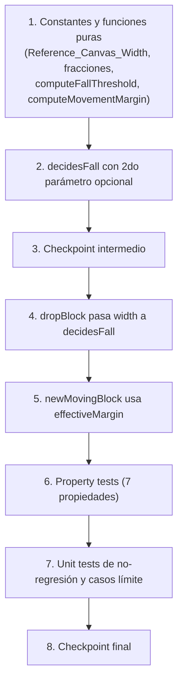

# Implementation Plan: canvas-relative-physics-balance

## Overview

Este plan reemplaza los literales fijos `16` (Umbral_de_Caida) y `90` (Margen_de_Movimiento) en `src/engine/tower.js` por cálculos derivados del ancho del canvas (`W`/`canvasWidth`) y dos fracciones fijas (`Fall_Threshold_Fraction`, `Movement_Margin_Fraction`), calibradas para reproducir exactamente el comportamiento actual en `Reference_Canvas_Width = 800`. Se sigue estrictamente el orden: (1) constantes y funciones puras nuevas → (2) `decidesFall` con segundo parámetro opcional → (3) `dropBlock` pasando `width` explícitamente → (4) `newMovingBlock` reutilizando `effectiveMargin` → verificando en cada paso que las llamadas existentes de un solo argumento y los tests actuales sigan pasando sin modificación.

## Dependency Graph

Tarea 1 es la base de todo (define las funciones puras que todas las demás usan). Tarea 2 depende de Tarea 1 (usa `computeFallThreshold`). Tareas 4 y 5 son independientes entre sí una vez completada la Tarea 2/3, pero se secuencian para mantener el plan lineal. Los property e unit tests (6, 7) dependen de que la implementación completa (1-5) exista.

## Tasks

- [x] 1. Añadir constantes y funciones puras de cálculo de física relativa en `src/engine/tower.js`
  - Añadir `export const Reference_Canvas_Width = 800;`
  - Añadir `export const Fall_Threshold_Fraction = 16 / Reference_Canvas_Width;` (debe evaluar a `0.02`)
  - Añadir `export const Movement_Margin_Fraction = 90 / Reference_Canvas_Width;` (debe evaluar a `0.1125`)
  - Añadir `export function computeFallThreshold(W) { return W * Fall_Threshold_Fraction; }`
  - Añadir `export function computeMovementMargin(canvasWidth) { return canvasWidth * Movement_Margin_Fraction; }`
  - No modificar ninguna otra constante o función existente en este paso
  - _Requirements: 1.1, 1.5, 2.1, 3.1_

- [x] 2. Modificar `decidesFall` para aceptar un segundo parámetro opcional `W`
  - Cambiar la firma de `export function decidesFall(overlap) { return overlap < 16; }` a `export function decidesFall(overlap, W = Reference_Canvas_Width) { return overlap < computeFallThreshold(W); }`
  - No modificar ningún call-site todavía (se hace en la Tarea 4); confirmar que las llamadas existentes de un solo argumento en `dropBlock` (todavía sin tocar) y en `tower.test.js` sigan funcionando gracias al valor por defecto
  - _Requirements: 1.2, 1.4, 1.6, 3.2_

- [x] 3. Checkpoint intermedio - Ensure all tests pass, ask the user if questions arise.

- [x] 4. Modificar `dropBlock(state, width)` para pasar `width` explícitamente a `decidesFall`
  - En la única línea de uso dentro de `dropBlock`, cambiar `if (decidesFall(overlap)) {` a `if (decidesFall(overlap, width)) {`
  - No modificar ninguna otra línea de `dropBlock` (el resto de la función, incluyendo el cálculo de `overlap` vía `computeOverlap`, permanece igual)
  - No cambiar la firma de `dropBlock(state, width)`
  - _Requirements: 1.4, 4.5_

- [x] 5. Modificar `newMovingBlock(state, afterFloor, canvasWidth)` para usar un `effectiveMargin` calculado una sola vez
  - Añadir `const effectiveMargin = computeMovementMargin(canvasWidth);` justo antes del cálculo de `minX`/`maxX`
  - Reemplazar `Math.max(0, afterFloor.x - 90)` por `Math.max(0, afterFloor.x - effectiveMargin)`
  - Reemplazar `Math.min(canvasWidth ?? (afterFloor.x + afterFloor.width + 90), afterFloor.x + afterFloor.width + 90) - w` por `Math.min(canvasWidth ?? (afterFloor.x + afterFloor.width + effectiveMargin), afterFloor.x + afterFloor.width + effectiveMargin) - w`
  - No cambiar la firma de `newMovingBlock`, ni ninguna otra línea de la función (cálculo de `w`, Plataforma_Respiro, `startFromRight`, `dir`, `x`, valor de retorno)
  - _Requirements: 2.4, 2.5, 2.6_

- [x]* 5.1 Escribir property test para paridad exacta de `decidesFall` en Reference_Canvas_Width
  - **Property 1: Paridad exacta con el comportamiento actual en Reference_Canvas_Width (decidesFall)**
  - Usar `fast-check` con `fc.double` (rango amplio, incluyendo negativos) para `overlap`; afirmar `decidesFall(overlap, 800) === (overlap < 16)` y que `decidesFall(overlap) === decidesFall(overlap, 800)`
  - Etiquetar: `// Feature: canvas-relative-physics-balance, Property 1: ...`
  - **Validates: Requirements 1.2, 1.4, 1.6, 3.2**

- [x]* 5.2 Escribir property test de monotonía del Umbral_de_Caida
  - **Property 2: El Umbral_de_Caida efectivo es estrictamente monótono creciente en W**
  - Generar dos anchos `W1 < W2` (ambos `> 0`) y afirmar `computeFallThreshold(W1) < computeFallThreshold(W2)`
  - **Validates: Requirements 1.3**

- [x]* 5.3 Escribir property test de determinismo de `computeFallThreshold`
  - **Property 3: El cálculo del Umbral_de_Caida es determinista**
  - Para un `W > 0` generado, invocar `computeFallThreshold(W)` varias veces y afirmar que el resultado es siempre idéntico
  - **Validates: Requirements 1.5**

- [x]* 5.4 Escribir property test de proporcionalidad exacta del Margen_de_Movimiento
  - **Property 4: El Margen_de_Movimiento efectivo es siempre exactamente proporcional a canvasWidth, sin excepción ni tolerancia**
  - Generar `canvasWidth > 0` (incluyendo valores cercanos a 800 como 799/801) y afirmar `computeMovementMargin(canvasWidth) === canvasWidth * Movement_Margin_Fraction`
  - **Validates: Requirements 2.1, 2.3, 2.4**

- [x]* 5.5 Escribir property test de paridad exacta de `newMovingBlock` en Reference_Canvas_Width
  - **Property 5: Paridad exacta con el comportamiento actual en Reference_Canvas_Width (newMovingBlock)**
  - Generar `afterFloor` sintéticos (`fc.record` con `x`, `width`) y `w` arbitrarios; comparar `minX`/`maxX` calculados con `canvasWidth = 800` contra la fórmula literal con `90`
  - **Validates: Requirements 2.2, 2.5, 2.6, 2.7, 3.3**

- [x]* 5.6 Escribir property test de consistencia interna minX/maxX
  - **Property 6: minX y maxX siempre usan el mismo Margen_de_Movimiento efectivo, para cualquier canvasWidth**
  - Para `canvasWidth > 0`, `afterFloor` y `w` arbitrarios, afirmar que el `effectiveMargin` implícito derivado de `minX` y de `maxX` es el mismo y coincide con `computeMovementMargin(canvasWidth)`
  - **Validates: Requirements 2.4, 2.5, 2.6**

- [x]* 5.7 Escribir property test de aislamiento respecto a moveSpeed/streak
  - **Property 7: El cálculo del umbral/margen efectivo no altera moveSpeed ni otros sistemas fuera de alcance**
  - Para un `state` sintético y `canvasWidth`/`overlap` arbitrarios, invocar `computeFallThreshold`, `computeMovementMargin` y `decidesFall` en aislamiento y afirmar que `state.moveSpeed`, `state.perfectStreak`, `state.streakWidthBonus` no cambian
  - **Validates: Requirements 4.2**

- [x]* 5.8 Escribir unit tests de casos límite y no-regresión
  - Afirmar `Reference_Canvas_Width === 800`, `Fall_Threshold_Fraction === 0.02`, `Movement_Margin_Fraction === 0.1125`
  - Afirmar `computeFallThreshold(800) === 16` y `computeMovementMargin(800) === 90`
  - Afirmar `decidesFall(15) === true` y `decidesFall(15, 800) === true`; `decidesFall(16) === false` y `decidesFall(16, 800) === false`
  - Añadir ejemplo móvil concreto: verificar que `computeFallThreshold(375)` y `computeMovementMargin(375)` son proporcionalmente menores que sus equivalentes en `800`
  - Confirmar que las llamadas existentes de un solo argumento en `tower.test.js` (`decidesFall(computeOverlap(prevFloor, movingBlock))`) siguen pasando sin modificarlas
  - Afirmar que `dropBlock.length` y `newMovingBlock.length` no cambiaron respecto al código previo a esta feature (regresión de aridad)
  - Afirmar no-regresión de `isReliefPlatformFloor`, `streakWidthBonus`, `perfectStreak`: invocar `newMovingBlock` con distintos `canvasWidth` y confirmar que estos valores fuera de alcance no se ven afectados por el cambio de margen
  - _Requirements: 3.1, 4.1, 4.3, 4.4, 4.5_

- [x] 6. Checkpoint final - Ensure all tests pass, ask the user if questions arise.

## Notes

- Las tareas marcadas con `*` son opcionales (tests) y pueden omitirse para una implementación mínima más rápida, aunque se recomienda completarlas para cubrir las 7 Correctness Properties del design.
- Cada property test corre un mínimo de 100 iteraciones (`fast-check`, ya usado en el repo en `combat-sprite-scaling`/`landscape-orientation-support`/`tower.test.js`).
- No se modifican `requirements.md` ni `design.md` como parte de este plan.
- No se modifican `computeOverlap`, `computeNewFloor`, `isReliefPlatformFloor`, `applyReliefPlatformSpeedBoost`, `moveSpeed`/`SPEED_CAP`, ni el acotado de ancho ya corregido en specs hermanas.
