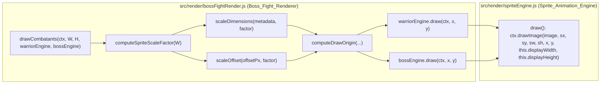

# Design Document

## Overview

Esta feature introduce un escalado proporcional del tamaño de dibujo de los Combat_Sprite (`Warrior_Sprite` y `Boss_Sprite`) cuando el canvas es más angosto que un ancho de referencia de escritorio. El escalado se calcula y aplica **exclusivamente** dentro de `Boss_Fight_Renderer` (`src/render/bossFightRender.js`); `Sprite_Animation_Engine` (`src/render/spriteEngine.js`) permanece sin cambios: sigue recibiendo `displayWidth`/`displayHeight` fijos por instancia y dibujando con `ctx.drawImage(...)` tal como hoy, sin conocer el ancho del canvas ni el factor de escala (Requirement 5.3).

La solución añade:

1. Una función pura `computeSpriteScaleFactor(W)` que traduce el ancho de canvas `W` en un `Sprite_Scale_Factor` dentro de `[Minimum_Scale_Factor, 1]`.
2. Una función pura `scaleDimensions({ width, height }, factor)` que calcula `Scaled_Display_Width`/`Scaled_Display_Height`.
3. Una función pura `computeDrawOrigin(...)` que, dado el `groundY`, el ratio horizontal (`warriorXRatio`/`bossXRatio`), las dimensiones ya escaladas y los `Combat_Layout_Offset` (también escalados por el mismo factor), calcula el punto `(x, y)` superior-izquierdo que hoy se pasa a `engine.draw(ctx, x, y)`.
4. `drawCombatants()` se reescribe para: calcular `Sprite_Scale_Factor` una sola vez por llamada (mismo factor para ambos sprites, Requirement 2.1), escalar dimensiones y offsets, y llamar a `computeDrawOrigin` para cada Combat_Sprite antes de invocar `engine.draw()`.

No se modifica ningún archivo JSON de metadata de sprites (Requirement 2.3), ni la firma pública de `SpriteAnimationEngine.draw(ctx, x, y)`, ni `updateCombatants()` (Requirement 5.1).

## Architecture



`Sprite_Animation_Engine.displayWidth`/`displayHeight` nunca cambian de valor: el escalado solo afecta los argumentos `x`, `y` calculados por `Boss_Fight_Renderer`, y el tamaño real dibujado sigue viniendo de `this.displayWidth`/`this.displayHeight` sin tocar (ver limitación abajo — decisión de diseño explicada en "Decisiones de diseño").

### Decisión de diseño: cómo se logra el escalado sin tocar `SpriteAnimationEngine.draw()`

El Requirement 5.3 prohíbe que `SpriteAnimationEngine` lea el ancho del canvas o calcule el factor de escala, pero `draw(ctx, x, y)` internamente sigue usando `this.displayWidth`/`this.displayHeight` fijos para el `drawImage`. Para que el sprite se dibuje efectivamente más chico sin modificar `spriteEngine.js`, `Boss_Fight_Renderer` debe controlar el tamaño final por otro medio que no sea mutar la instancia del engine ni su método `draw`.

La opción elegida es que `Boss_Fight_Renderer` envuelva la llamada a `engine.draw(ctx, x, y)` en un contexto de canvas escalado (`ctx.save()` / `ctx.scale(factor, factor)` / traducir `x, y` a coordenadas del espacio escalado / `ctx.restore()`), de forma que:

- `Scaled_Display_Width`/`Scaled_Display_Height` siguen calculándose como valores lógicos (`displayWidth * factor`, `displayHeight * factor`) para todo el álgebra de posicionamiento (Ground_Line, centrado, offsets), tal como piden los Requirements 2 y 3.
- El tamaño *realmente pintado en pantalla* coincide con esos valores lógicos porque el propio contexto 2D está escalado por `factor` durante la llamada a `engine.draw()`; `engine.draw()` sigue leyendo `this.displayWidth`/`this.displayHeight` sin cambios y sin saber que existe un factor de escala.
- Cuando `factor === 1` (canvas de escritorio), `ctx.scale(1, 1)` es un no-op: el pipeline de dibujo es idéntico al actual (Requirement 4.2 / 2.5).

Todas las coordenadas que `Boss_Fight_Renderer` pasa a `engine.draw(ctx, x, y)` dentro del bloque escalado se expresan en el **espacio lógico ya escalado** (es decir, usando `Scaled_Display_Width/Height` y offsets ya divididos por `factor`, de forma que al multiplicarlos de nuevo por `ctx.scale(factor, factor)` el resultado en píxeles de pantalla sea el esperado). Esto se encapsula íntegramente en `computeDrawOrigin`, de modo que las funciones puras de cálculo (testeables por property-based testing) devuelven directamente las coordenadas de pantalla esperadas (en píxeles reales, sin escala de contexto aplicada), y una capa muy delgada en `drawCombatants()` se encarga de traducir esas coordenadas de pantalla al espacio del `ctx.scale()` antes de llamar a `draw()`. Esta traducción (`screenX / factor`, `screenY / factor`) es aritmética simple y no requiere property tests propios: las propiedades relevantes (Ground_Line, centrado, orden horizontal, no-enlarge) se verifican sobre las coordenadas de pantalla finales, que son las que importan para el jugador.

## Components and Interfaces

### `src/render/bossFightRender.js` (modificado)

```js
// Nuevas constantes exportadas
export const Reference_Canvas_Width = 800; // ancho de escritorio actual sin reducción
export const Minimum_Scale_Factor = 0.55;  // por debajo de esto un sprite deja de ser legible

// Nuevas funciones puras exportadas (testeables de forma aislada)
export function computeSpriteScaleFactor(W) { /* ... */ }
export function scaleDimensions({ width, height }, factor) { /* -> { width, height } */ }
export function scaleOffset(offsetPx, factor) { /* -> number */ }
export function computeDrawOrigin({
  groundY, canvasWidth, xRatio,
  scaledWidth, scaledHeight,
  horizontalOffsetPx, verticalOffsetPx,
  scaleFactor,
}) { /* -> { x, y } en coordenadas de pantalla (px reales) */ }

// Funciones existentes, modificadas para usar lo anterior
export function drawBattleBackground(ctx, W, H, backgroundImage) { /* sin cambios */ }
export function drawCombatants(ctx, W, H, warriorEngine, bossEngine) { /* reescrita */ }
export function updateCombatants(dt, warriorEngine, bossEngine) { /* sin cambios */ }
```

- `computeSpriteScaleFactor(W)`:
  - `W >= Reference_Canvas_Width` → devuelve `1` (Requirement 1.2).
  - `W < Reference_Canvas_Width` → devuelve `clamp(W / Reference_Canvas_Width, Minimum_Scale_Factor, 1)` (Requirements 1.3, 1.4, 1.5).
  - Función pura, sin estado ni lectura de `Date`/`Math.random` (Requirement 1.6).
- `scaleDimensions(metadata, factor)`: multiplica `width`/`height` por `factor`. No lee ni escribe `displayWidth`/`displayHeight` de la instancia del engine (Requirement 2.2) — recibe y devuelve valores planos.
- `scaleOffset(offsetPx, factor)`: `offsetPx * factor` (Requirement 3.3). Se aplica a los cuatro `Combat_Layout_Offset` existentes (`VERTICAL_OFFSET_PX`, `BOSS_EXTRA_VERTICAL_OFFSET_PX`, `BOSS_HORIZONTAL_OFFSET_PX`, `WARRIOR_HORIZONTAL_OFFSET_PX`).
- `computeDrawOrigin(...)`: centraliza el álgebra de posicionamiento (Requirements 3.1, 3.2, 3.4, 3.5), devolviendo coordenadas de pantalla en píxeles reales:
  - `y = groundY - scaledHeight + scaleOffset(verticalOffsetPx, scaleFactor) [+ scaleOffset(extraOffset, scaleFactor)]`
  - `x = canvasWidth * xRatio - scaledWidth / 2 + scaleOffset(horizontalOffsetPx, scaleFactor)`
- `drawCombatants(ctx, W, H, warriorEngine, bossEngine)`:
  1. `const factor = computeSpriteScaleFactor(W);`
  2. Para cada engine: `const { width, height } = scaleDimensions({ width: engine.displayWidth, height: engine.displayHeight }, factor);`
  3. `const { x, y } = computeDrawOrigin({ ... })` (coordenadas de pantalla).
  4. `ctx.save(); ctx.scale(factor, factor); engine.draw(ctx, x / factor, y / factor); ctx.restore();`
  5. Repetir para el boss, sumando el offset extra vertical.

`engine.displayWidth`/`displayHeight` **no se leen para mutarlos ni se reasignan**; solo se leen para calcular las dimensiones escaladas locales (Requirement 2.2).

### `src/render/spriteEngine.js`

Sin cambios. Se mantiene como está: `draw(ctx, x, y)` sigue usando `this.displayWidth`/`this.displayHeight` internamente y no recibe ni calcula ningún factor de escala (Requirement 5.3). Esto se verifica con una prueba estructural (ver Testing Strategy) que confirma que el código fuente de `spriteEngine.js` no referencia `window.innerWidth`, `canvas.width`, ni ningún símbolo de escala.

## Data Models

No se introducen nuevas entidades de datos persistentes ni se modifica `Sprite_Metadata` (JSON). Los "modelos" relevantes son formas de datos puramente en memoria, usados como parámetros/retornos de las funciones puras:

```ts
// Parámetro de scaleDimensions / dimensiones desde Sprite_Metadata
type SpriteDimensions = { width: number; height: number }; // width, height > 0

// Parámetro de computeDrawOrigin
type DrawOriginInput = {
  groundY: number;          // H * COMBAT_LAYOUT.groundYRatio
  canvasWidth: number;      // W > 0
  xRatio: number;           // COMBAT_LAYOUT.warriorXRatio | bossXRatio, en [0, 1]
  scaledWidth: number;      // >= 0
  scaledHeight: number;     // >= 0
  horizontalOffsetPx: number;
  verticalOffsetPx: number;
  scaleFactor: number;      // en [Minimum_Scale_Factor, 1]
};

// Retorno de computeDrawOrigin
type DrawOrigin = { x: number; y: number };
```

`Sprite_Scale_Factor` es un `number` en el rango cerrado `[Minimum_Scale_Factor, 1]`; no se modela como una entidad con identidad propia, es un valor derivado y recalculado en cada `drawCombatants()`.

## Correctness Properties

*A property is a characteristic or behavior that should hold true across all valid executions of a system-essentially, a formal statement about what the system should do. Properties serve as the bridge between human-readable specifications and machine-verifiable correctness guarantees.*

### Property 1: El factor de escala satura en 1 para canvases anchos

*For any* canvas width `W >= Reference_Canvas_Width`, `computeSpriteScaleFactor(W)` SHALL equal `1`.

**Validates: Requirements 1.2**

### Property 2: El factor de escala es monótono no decreciente en `W`

*For any* two canvas widths `W1 <= W2` (both `> 0`), `computeSpriteScaleFactor(W1) <= computeSpriteScaleFactor(W2)`.

**Validates: Requirements 1.3**

### Property 3: El factor de escala siempre está en `[Minimum_Scale_Factor, 1]`

*For any* canvas width `W > 0`, `computeSpriteScaleFactor(W)` SHALL be within the closed range `[Minimum_Scale_Factor, 1]`.

**Validates: Requirements 1.4, 1.5**

### Property 4: El factor de escala es determinista (función pura)

*For any* canvas width `W > 0`, calling `computeSpriteScaleFactor(W)` multiple times SHALL always return the exact same value.

**Validates: Requirements 1.6**

### Property 5: El escalado nunca agranda un sprite y es exacto en los bordes del dominio

*For all* valid `Sprite_Metadata` dimensions (`displayWidth > 0`, `displayHeight > 0`) *and for all* `Sprite_Scale_Factor` values in `[Minimum_Scale_Factor, 1]`, `scaleDimensions` SHALL produce a `Scaled_Display_Width <= displayWidth` and a `Scaled_Display_Height <= displayHeight`, with equality holding exactly when `factor === 1`.

**Validates: Requirements 2.1, 2.4, 2.5**

### Property 6: `scaleDimensions` no muta ni lee el estado del engine

*For any* `SpriteAnimationEngine` instance and *any* `Sprite_Scale_Factor`, after computing `Scaled_Display_Width`/`Scaled_Display_Height` and calling `drawCombatants()`, `engine.displayWidth` and `engine.displayHeight` SHALL remain unchanged from their values before the call.

**Validates: Requirements 2.2**

### Property 7: Los `Combat_Layout_Offset` se escalan proporcionalmente al mismo factor

*For any* fixed pixel offset and *any* `Sprite_Scale_Factor` in `[Minimum_Scale_Factor, 1]`, `scaleOffset(offsetPx, factor)` SHALL equal `offsetPx * factor`, and the draw origin computed by `computeDrawOrigin` SHALL use this scaled offset rather than the raw unscaled offset whenever `factor < 1`.

**Validates: Requirements 3.3**

### Property 8: Los pies de cada Combat_Sprite quedan siempre sobre la misma línea de suelo ajustada

*For all* canvas dimensions `W > 0, H > 0`, *all* valid `Sprite_Metadata` for the Warrior_Sprite and the Boss_Sprite, and *all* resulting `Sprite_Scale_Factor` values, the bottom edge of the drawn Warrior_Sprite (`y + scaledHeight`) and the bottom edge of the drawn Boss_Sprite SHALL each equal `groundY` plus the same fixed vertical adjustment that would be used at `Sprite_Scale_Factor = 1`, regardless of the actual scale factor applied.

**Validates: Requirements 3.1, 3.5**

### Property 9: El centrado horizontal se calcula sobre las dimensiones escaladas

*For all* canvas widths `W > 0`, *all* `xRatio` in `[0, 1]`, and *all* `Sprite_Scale_Factor` values, the horizontal center of the drawn Combat_Sprite (`x + scaledWidth / 2`, before applying the horizontal Combat_Layout_Offset) SHALL equal `W * xRatio`.

**Validates: Requirements 3.2**

### Property 10: El guerrero siempre queda a la izquierda del boss

*For all* canvas dimensions `W > 0, H > 0` and *all* valid `Sprite_Metadata` for the Warrior_Sprite and the Boss_Sprite, after `drawCombatants()` the horizontal center of the drawn Warrior_Sprite SHALL be strictly less than the horizontal center of the drawn Boss_Sprite.

**Validates: Requirements 3.4**

### Property 11: El escalado nunca reduce un sprite por debajo del mínimo legible

*For any* canvas width `W > 0` and *any* valid `displayWidth`/`displayHeight`, the resulting `Scaled_Display_Width` SHALL be greater than or equal to `displayWidth * Minimum_Scale_Factor` (and analogously for height).

**Validates: Requirements 4.3**

### Property 12: El ciclo de animación es independiente del factor de escala

*For any* sequence of `dt` values applied via `updateCombatants(dt, warriorEngine, bossEngine)`, the resulting internal animation state of each engine (current frame index / elapsed time) SHALL be identical regardless of what `Sprite_Scale_Factor` was computed or applied during any interleaved `drawCombatants()` calls.

**Validates: Requirements 5.1**

### Property 13: El estado de combate es inmutable frente al escalado visual

*For any* `fight` state object produced by `startBossFight` (including its `cardCount`, `playerPips`, `bossPips` fields), calling `drawCombatants()` any number of times with any canvas width SHALL leave every field of the `fight` object deep-equal to its value before those calls.

**Validates: Requirements 5.2**

### Property Reflection

Antes de fijar la lista anterior se revisaron los siguientes solapamientos:

- **1.1 y 1.4** no generaron propiedades propias: 1.1 es la afirmación general que ya queda cubierta por las Properties 1–4 (que verifican el cálculo en cada tramo del dominio), y 1.4 (clamping) queda subsumido por la Property 3 (rango cerrado `[Minimum_Scale_Factor, 1]`) — si el rango siempre se cumple, el clamp está probado implícitamente.
- **3.1** (origen vertical desde `Scaled_Display_Height`) se fusionó dentro de la **Property 8**: si el borde inferior siempre coincide con `groundY` + ajuste fijo para cualquier factor, esto solo es posible si el origen se calculó a partir de la altura ya escalada.
- **4.2** (paridad de escritorio) no generó una propiedad independiente: es consecuencia directa de la Property 1 (`factor === 1` cuando `W >= Reference_Canvas_Width`) combinada con la Property 5 (`scaled === unscaled` cuando `factor === 1`); probar ambas ya cubre 4.2 sin duplicar aserciones.
- **2.5** (identidad en `factor === 1`) se integró como caso límite dentro de la **Property 5**, en lugar de escribir una propiedad separada, porque comparte el mismo generador de dimensiones y solo varía el valor de `factor` usado.
- **4.1** (constante `Minimum_Scale_Factor > 0`) y **5.3** (el engine no debe leer el ancho del canvas ni calcular el factor) no son propiedades universalmente cuantificadas sobre un espacio de entradas variable: son, respectivamente, una aserción puntual sobre una constante y una restricción estructural del código. Se cubren con un test unitario y un test estructural respectivamente (ver Testing Strategy), no con property-based testing.

Cada propiedad restante aporta una validación única: rango/monotonía/determinismo del factor (Properties 1-4), aritmética de escalado sin mutación (Properties 5-7), posicionamiento (Properties 8-10), legibilidad mínima (Property 11), y no-interferencia con animación/estado de combate (Properties 12-13).

## Error Handling

- `computeSpriteScaleFactor(W)`:
  - `W <= 0` (entrada inválida, no debería ocurrir en producción ya que el canvas siempre tiene ancho positivo): se trata como `W` muy pequeño y se clampa igualmente a `Minimum_Scale_Factor`, sin lanzar excepción, para mantener `drawCombatants()` como no-op seguro tal como el resto del módulo (`drawBattleBackground` ya sigue este patrón de nunca lanzar).
- `scaleDimensions`/`scaleOffset`: funciones puras sin I/O; no tienen condiciones de error propias, cualquier `NaN` de entrada se propaga como `NaN` (comportamiento estándar de aritmética JS, sin necesidad de manejo especial: un `NaN` en `displayWidth` ya sería un bug de la metadata, fuera del alcance de esta feature).
- `drawCombatants()`: conserva el contrato actual de no lanzar por engines aún no cargados — `engine.draw()` ya es no-op seguro si `_loadFailed` o no hay animación en curso; envolver la llamada en `ctx.save()`/`ctx.scale()`/`ctx.restore()` no introduce nuevas condiciones de fallo porque estas operaciones de `CanvasRenderingContext2D` no lanzan con factores numéricos válidos. Se garantiza `ctx.restore()` incluso si `engine.draw()` internamente no lanza (ya es no-op seguro), por lo que no se requiere un bloque `try/finally` adicional más allá del flujo lineal actual.

## Testing Strategy

**Enfoque dual:**

- **Property tests (fast-check, ya usado en el repo — ver `src/combat/fight.test.js`, `src/render/draw.test.js`, etc.)**: implementan las 13 Correctness Properties listadas arriba, una por cada test, con un mínimo de 100 ejecuciones (`fc.assert(fc.property(...), { numRuns: 100 })` o el default de fast-check que ya es 100). Cada test se etiqueta con un comentario:
  `// Feature: combat-sprite-scaling, Property N: <texto de la propiedad>`
- **Unit tests (vitest)**: para ejemplos concretos y casos límite:
  - `Minimum_Scale_Factor > 0` (constante, Requirement 4.1).
  - `computeSpriteScaleFactor(Reference_Canvas_Width)` y valores por encima/exactamente igual devuelven `1` (ejemplo puntual, complementa la Property 1).
  - Ejemplo de escritorio: llamar `drawCombatants` con `W = Reference_Canvas_Width` y verificar que las coordenadas `(x, y)` pasadas a `engine.draw()` (via spies/mocks) sean idénticas a las que produce la implementación actual sin escalado (regresión visual de escritorio).
  - Ejemplo móvil concreto: `W = 375` reproduce el escenario descrito en el Introduction (Boss_Sprite de 550px de ancho) y se verifica que el sprite dibujado cabe dentro del canvas.
- **Test estructural (siguiendo el patrón de `src/render/proceduralInvariant.test.js`)**: lee `src/render/spriteEngine.js` como texto fuente y verifica con una expresión regular que no contiene referencias a `canvas.width`, `window.innerWidth`, `Sprite_Scale_Factor`, `scaleFactor`, ni llamadas a `computeSpriteScaleFactor`, confirmando estáticamente el Requirement 5.3 (el engine no calcula ni lee el factor de escala). Ejecución única, sin fast-check.

**Por qué PBT aplica aquí:** todas las funciones nuevas (`computeSpriteScaleFactor`, `scaleDimensions`, `scaleOffset`, `computeDrawOrigin`) son funciones puras de transformación numérica con un espacio de entrada grande (anchos de canvas, dimensiones de metadata, ratios, offsets) y propiedades universales claras (rango, monotonía, determinismo, no-enlarge, invariantes de alineación). Esto encaja directamente en el patrón de "parsers, serializers, data transformations, algorithms, business logic" para el que PBT es apropiado, y sigue la convención ya establecida en el resto del repo (`fight.js`, `draw.js`, `modalState.js`, etc., todos con properties usando `fast-check`).

**Mocking:** las property tests sobre `drawCombatants()` (Properties 6, 8, 9, 10, 12, 13) usan un `CanvasRenderingContext2D` simulado mínimo (stub con métodos no-op: `save`, `restore`, `scale`, `drawImage`, etc. — patrón ya usado en `draw.test.js`) y engines `SpriteAnimationEngine` reales pero sin imágenes cargadas (o mocks ligeros con los campos `displayWidth`/`displayHeight`/`draw` necesarios), para mantener los tests rápidos y deterministas sin depender de carga real de assets.
