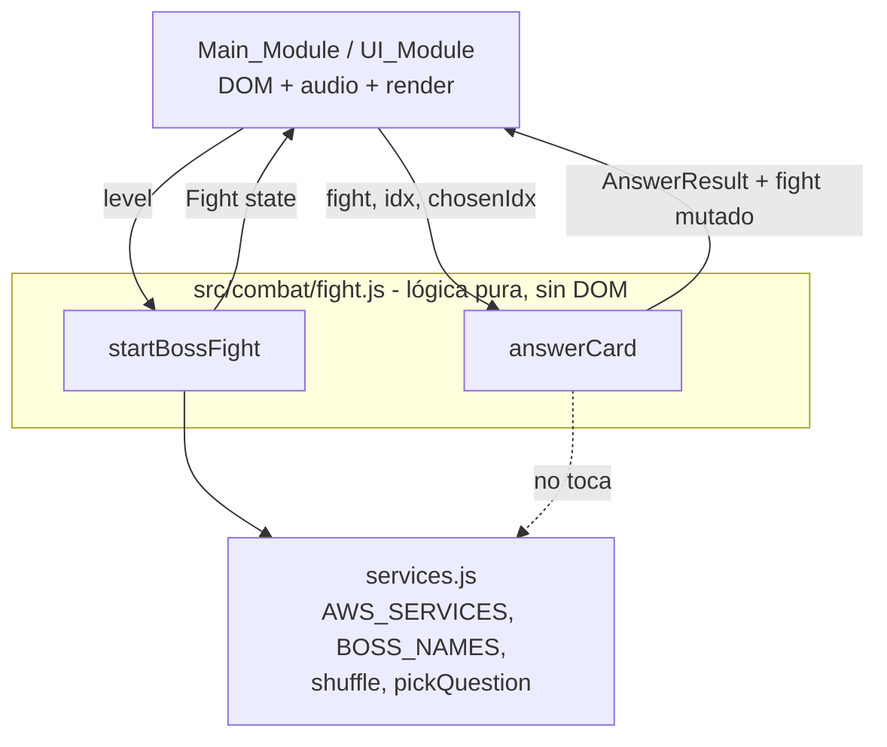
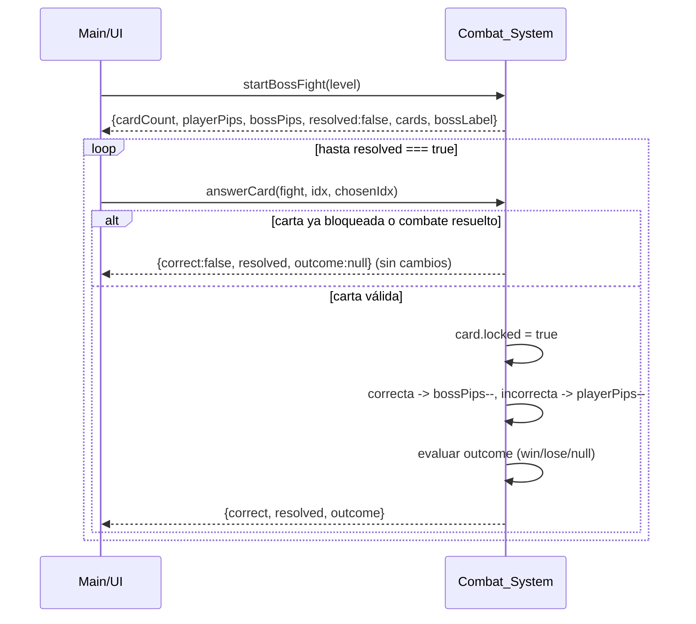

# Design Document

## Overview

Esta funcionalidad redefine la mecánica de resolución del duelo por turnos contra los guardianes de AWS en "Torre de las Nubes — Duelo AWS". El módulo de combate (`src/combat/fight.js`) es lógica pura: no toca el DOM ni reproduce audio; solo calcula y muta el estado del combate.

Se introducen dos cambios centrales y un cambio derivado obligatorio:

1. **Un único intento por carta**: cada carta se responde una sola vez y queda bloqueada (`locked = true`) de forma definitiva. Se elimina la mecánica de "refrescar" la pregunta tras un fallo.
2. **Escalado del número de cartas**: `cardCount` crece con el `level` hasta un máximo de 7 (`Max_Card_Count`).
3. **Rediseño de la resolución del combate** (derivado): el modelo antiguo asignaba `playerPips == bossPips == cardCount` asumiendo reintentos ilimitados. Con un único intento por carta ese modelo se vuelve inconsistente (podría quedar sin resolver o ser imposible de ganar). Por ello se redefinen los umbrales de vida:
   - `Boss_Defeat_Threshold = ceil(cardCount / 2)`
   - `Player_Defeat_Threshold = cardCount - Boss_Defeat_Threshold + 1`

Estos dos umbrales garantizan que la suma de aciertos necesarios y fallos tolerados no supere `cardCount + 1`, de modo que el combate **siempre** se resuelve a más tardar al responder la última carta, y siempre queda una ruta ganable.

### Objetivos de diseño

- Mantener la firma pública compatible con el resto del juego (`startBossFight`, `answerCard`).
- Conservar la forma plana del estado de combate (`{ cardCount, playerPips, bossPips, resolved, cards, bossLabel }`).
- Eliminar (o deprecar de forma segura) `refreshCardQuestion`, que contradice la regla de intento único.
- Cero dependencias externas de runtime, ES modules vanilla, sin build step.
- Todo texto de cara al usuario en español.

### Cambios respecto al código actual

| Aspecto | Actual | Nuevo |
|---|---|---|
| `cardCount` | `Math.min(level, 4)` | `Math.min(level, 7)` (`Max_Card_Count = 7`) |
| `playerPips` inicial | `cardCount` | `Player_Defeat_Threshold = cardCount - ceil(cardCount/2) + 1` |
| `bossPips` inicial | `cardCount` | `Boss_Defeat_Threshold = ceil(cardCount/2)` |
| Índice de boss | `BOSS_NAMES[Math.min(level,4)-1]` | `BOSS_NAMES[Math.min(level, BOSS_NAMES.length)-1]` |
| `refreshCardQuestion` | reactiva la carta tras fallo | eliminada / deprecada (contradice intento único) |
| Intento por carta | ilimitado (vía refresh) | único (carta bloqueada permanentemente) |

## Architecture

El combate sigue el patrón "lógica pura, sin efectos secundarios de UI" ya establecido en la migración modular (ver `structure.md`). El módulo expone funciones puras/mutadoras de estado; la capa de UI (Main_Module / UI_Module) es la única responsable del DOM, el audio y el renderizado.



### Flujo de un combate



### Invariante estructural clave (por qué el combate siempre resuelve)

Con `B = Boss_Defeat_Threshold` y `P = Player_Defeat_Threshold`:

- `B = ceil(cardCount / 2)`
- `P = cardCount - B + 1`
- Por tanto `B + P = cardCount + 1`.

Cada respuesta reduce exactamente uno de los dos contadores en 1 (acierto → boss, fallo → player). Tras responder las `cardCount` cartas, el total de reducciones es `cardCount`. Como se necesitan `B` aciertos para ganar o `P` fallos para perder, y `B + P = cardCount + 1`, no es posible responder las `cardCount` cartas sin alcanzar alguno de los dos umbrales (en el peor caso, la última carta fuerza la resolución). Esto garantiza que el combate se resuelve a más tardar en la última carta y que siempre existe una ruta ganable (`B <= cardCount`).

## Components and Interfaces

### `startBossFight(level)`

Calcula la configuración inicial del combate. Función determinista salvo por la aleatoriedad de `shuffle`/`pickQuestion` (selección de servicios y preguntas).

```js
/**
 * @param {number} level - Nivel del combate (entero >= 1).
 * @returns {Fight}
 */
export function startBossFight(level)
```

Lógica:
1. `cardCount = Math.min(level, MAX_CARD_COUNT)` con `MAX_CARD_COUNT = 7`. Para `level = 1` esto da `1`.
2. `bossDefeatThreshold = Math.ceil(cardCount / 2)`.
3. `playerDefeatThreshold = cardCount - bossDefeatThreshold + 1`.
4. `services = shuffle(AWS_SERVICES).slice(0, cardCount)` → servicios con identidad distinta (sin repetición).
5. `cards = services.map(s => ({ service: s, question: pickQuestion(s.id, null), locked: false }))`.
6. `bossLabel = BOSS_NAMES[Math.min(level, BOSS_NAMES.length) - 1] + " — Nivel " + level`.
7. Retorna `{ cardCount, playerPips: playerDefeatThreshold, bossPips: bossDefeatThreshold, resolved: false, cards, bossLabel }`.

El índice de `BOSS_NAMES` se acota con `Math.min(level, BOSS_NAMES.length)` para que niveles superiores al número de nombres disponibles sigan devolviendo un nombre no vacío (el último guardián), cumpliendo el requisito de `bossLabel` con nombre no vacío.

### `answerCard(fight, idx, chosenIdx)`

Procesa la respuesta a una carta. Muta `fight` in situ. Sin cambios estructurales respecto al comportamiento actual salvo que ya no existe reactivación de cartas.

```js
/**
 * @param {Fight} fight
 * @param {number} idx - Índice de la carta respondida.
 * @param {number} chosenIdx - Índice de la opción elegida.
 * @returns {AnswerResult}
 */
export function answerCard(fight, idx, chosenIdx)
```

Lógica (orden estricto):
1. Si `fight.resolved` → retorna `{ correct: false, resolved: true, outcome: null }` sin mutar nada.
2. `card = fight.cards[idx]`. Si `card.locked` → retorna `{ correct: false, resolved: false, outcome: null }` sin mutar nada.
3. `card.locked = true` (se bloquea **antes** de evaluar).
4. `correct = (chosenIdx === card.question.correct)`.
5. Si `correct`: `fight.bossPips = Math.max(0, fight.bossPips - 1)`; si no: `fight.playerPips = Math.max(0, fight.playerPips - 1)`.
6. Resolver: si `fight.bossPips <= 0` → `fight.resolved = true`, `outcome = 'win'`; si no, si `fight.playerPips <= 0` → `fight.resolved = true`, `outcome = 'lose'`; en otro caso `outcome = null`.
7. Retorna `{ correct, resolved: fight.resolved, outcome }`.

El orden importa: `win` tiene prioridad sobre `lose` (consistente con el requisito 2.5 / 3.2, que exigen `bossPips > 0` para declarar `lose`).

### `refreshCardQuestion` — eliminación

La función `refreshCardQuestion(fight, idx)` reactivaba una carta (`card.locked = false`) tras un fallo. Esto **contradice directamente** la regla de intento único (Requirement 1) y debe eliminarse del módulo. La capa de UI que la invocaba debe dejar de hacerlo.

Decisión: **eliminar** la exportación en lugar de deprecarla, porque mantenerla dejaría disponible una operación que viola invariantes del nuevo modelo. Si algún consumidor todavía la importa, el fallo de importación es preferible (visible y temprano) a una regresión silenciosa de la mecánica. Los llamadores conocidos se ajustan como parte de la implementación.

## Data Models

### `Fight` (estado de combate, forma plana)

```js
/**
 * @typedef {Object} Fight
 * @property {number} cardCount            - Número de cartas del combate (1..7).
 * @property {number} playerPips           - Vida del jugador. Inicial = Player_Defeat_Threshold.
 * @property {number} bossPips             - Vida del jefe. Inicial = Boss_Defeat_Threshold.
 * @property {boolean} resolved            - true cuando el combate ha terminado.
 * @property {Card[]} cards                - Exactamente cardCount cartas.
 * @property {string} bossLabel            - "{nombre guardián} — Nivel {level}".
 */
```

### `Card`

```js
/**
 * @typedef {Object} Card
 * @property {Object} service   - Servicio AWS (de AWS_SERVICES): {id, abbr, name, color}.
 * @property {Question} question - Pregunta asociada (no se sustituye una vez respondida).
 * @property {boolean} locked   - false al inicio; true de forma permanente tras responder.
 */
```

### `Question` (producida por `pickQuestion`)

```js
/**
 * @typedef {Object} Question
 * @property {string} text        - Enunciado.
 * @property {string[]} options   - Opciones barajadas.
 * @property {number} correct     - Índice de la opción correcta dentro de options.
 */
```

### `AnswerResult` (retorno de `answerCard`)

```js
/**
 * @typedef {Object} AnswerResult
 * @property {boolean} correct                    - true si la respuesta fue correcta.
 * @property {boolean} resolved                   - Estado resolved tras la acción.
 * @property {'win'|'lose'|null} outcome          - Resultado del combate.
 */
```

### Constantes derivadas

| Nombre | Fórmula | Rango |
|---|---|---|
| `MAX_CARD_COUNT` | `7` (literal) | — |
| `cardCount` | `min(level, 7)` | `1 <= cardCount <= 7` |
| `Boss_Defeat_Threshold` | `ceil(cardCount / 2)` | `1 <= B <= cardCount` |
| `Player_Defeat_Threshold` | `cardCount - B + 1` | `P >= 1`, y `B + P = cardCount + 1` |

Tabla de valores por `cardCount`:

| cardCount | B = ceil(cc/2) | P = cc - B + 1 | B + P |
|---|---|---|---|
| 1 | 1 | 1 | 2 |
| 2 | 1 | 2 | 3 |
| 3 | 2 | 2 | 4 |
| 4 | 2 | 3 | 5 |
| 5 | 3 | 3 | 6 |
| 6 | 3 | 4 | 7 |
| 7 | 4 | 4 | 8 |

## Correctness Properties

*Una propiedad es una característica o comportamiento que debe cumplirse en todas las ejecuciones válidas del sistema: en esencia, una afirmación formal sobre lo que el sistema debe hacer. Las propiedades sirven de puente entre las especificaciones legibles por humanos y las garantías de corrección verificables por máquina.*

Este módulo es lógica pura (sin DOM, sin I/O) con propiedades universales claras, por lo que el testing basado en propiedades es apropiado. Tras el prework y la reflexión de redundancia, los criterios testables se consolidan en las siguientes propiedades. Cada propiedad se implementa con un único test basado en propiedades.

### Property 1: Responder bloquea la carta de forma permanente

*For any* combate y cualquier secuencia de respuestas, responder una carta no bloqueada la deja con `locked = true`, y ninguna carta que ya esté bloqueada vuelve nunca a `locked = false` durante el resto del combate.

**Validates: Requirements 1.1, 1.5**

### Property 2: Responder una carta bloqueada o un combate resuelto no altera el estado

*For any* combate, si se intenta responder una carta ya bloqueada o si el combate está resuelto (`resolved = true`), entonces `playerPips`, `bossPips`, `resolved` y el estado `locked` de todas las cartas quedan idénticos a como estaban antes de la acción.

**Validates: Requirements 1.2, 1.3, 2.6, 3.3**

### Property 3: La pregunta de una carta nunca se sustituye

*For any* combate y cualquier secuencia de respuestas, el objeto `question` de cada carta sigue siendo el mismo objeto (identidad referencial) que tenía al iniciar el combate.

**Validates: Requirements 1.4**

### Property 4: Aplicación correcta del daño y del resultado de la respuesta

*For any* combate con resultado aún `null` y cualquier carta no bloqueada, responderla produce: `correct` igual a `(chosenIdx === question.correct)`; si es correcta, `bossPips` disminuye en exactamente 1 y `playerPips` no cambia; si es incorrecta, `playerPips` disminuye en exactamente 1 y `bossPips` no cambia; y ni `bossPips` ni `playerPips` quedan nunca por debajo de 0.

**Validates: Requirements 2.1, 2.2, 2.3**

### Property 5: bossPips en 0 produce victoria estable

*For any* combate, cuando una respuesta correcta lleva `bossPips` a 0 estando el combate sin resolver, el resultado es `win`, `resolved` pasa a `true`, y ese resultado permanece sin cambios ante cualquier acción posterior.

**Validates: Requirements 2.4, 3.1**

### Property 6: playerPips en 0 (con bossPips > 0) produce derrota estable

*For any* combate, cuando una respuesta incorrecta lleva `playerPips` a 0 estando `bossPips > 0` y el combate sin resolver, el resultado es `lose`, `resolved` pasa a `true`, y ese resultado permanece sin cambios ante cualquier acción posterior.

**Validates: Requirements 2.5, 3.2**

### Property 7: Todo combate se resuelve a más tardar en la última carta

*For any* nivel y cualquier secuencia de respuestas que agote todas las cartas del combate, el combate termina con `resolved = true` y un resultado en `{win, lose}`; además, al iniciar el combate se cumple `bossPips + playerPips <= cardCount + 1`.

**Validates: Requirements 3.5**

### Property 8: Umbrales iniciales válidos y según fórmula

*For any* nivel entero mayor o igual a 1, el combate iniciado cumple: `bossPips === ceil(cardCount / 2)`; `playerPips === cardCount - bossPips + 1`; `1 <= bossPips <= cardCount`; y `playerPips >= 1`.

**Validates: Requirements 3.6, 3.7, 3.8, 3.9, 4.6, 5.3**

### Property 9: cardCount válido, acotado y monótono

*For any* par de niveles enteros `a <= b` (ambos mayores o iguales a 1), se cumple: `cardCount(a)` y `cardCount(b)` son enteros con `1 <= cardCount <= 7`; `cardCount(a) <= cardCount(b)` (no decreciente); y para cualquier nivel mayor o igual a 7, `cardCount === 7`.

**Validates: Requirements 3.4, 4.1, 4.2, 4.4**

### Property 10: Servicios únicos por combate

*For any* nivel entero mayor o igual a 1, las cartas del combate están asociadas a servicios de AWS con identidad distinta: los `service.id` de las `cardCount` cartas son todos únicos y hay exactamente `cardCount` de ellos.

**Validates: Requirements 4.5**

### Property 11: Forma del estado de combate

*For any* nivel entero mayor o igual a 1, el estado devuelto por `startBossFight` incluye los campos `cardCount`, `playerPips`, `bossPips`, `cards` y `bossLabel`, y `cards.length === cardCount`.

**Validates: Requirements 5.1**

### Property 12: Formato de la etiqueta del jefe

*For any* nivel entero mayor o igual a 1, `bossLabel` es igual a la concatenación de un nombre de guardián no vacío con el texto literal ` — Nivel {level}`, donde `{level}` es el valor numérico del nivel.

**Validates: Requirements 5.2**

## Error Handling

El módulo es lógica pura y opera sobre entradas que provienen de la propia capa de juego (no de entrada externa arbitraria), por lo que la estrategia es defensiva pero minimalista:

- **Índice de carta fuera de rango o carta inexistente en `answerCard`**: si `fight.cards[idx]` es `undefined`, el acceso a `card.locked` fallaría. El diseño asume que la UI solo envía índices válidos de cartas renderizadas. Como salvaguarda, `answerCard` trata un `idx` inválido como acción ignorada (retorna `{ correct: false, resolved: fight.resolved, outcome: null }` sin mutar), siguiendo el mismo principio de "acción inválida = no-op" de los requisitos 1.2/1.3.
- **Combate ya resuelto**: gestionado explícitamente como no-op (Requirement 3.3 / Property 2).
- **Carta ya bloqueada**: gestionado explícitamente como no-op (Requirement 1.2 / Property 2).
- **Clamping de pips**: `Math.max(0, ...)` evita valores negativos de `bossPips`/`playerPips` (Requirements 2.1, 2.2).
- **`level` fuera del rango de nombres de jefe**: el índice de `BOSS_NAMES` se acota con `Math.min(level, BOSS_NAMES.length)` para garantizar siempre un nombre no vacío (Requirement 5.2). El diseño asume `level >= 1` (invariante del juego); no se valida explícitamente `level < 1` porque el motor de la torre nunca produce niveles menores que 1.
- **Sin excepciones lanzadas**: el módulo no lanza; comunica resultados vía el valor de retorno, en línea con el estilo del código existente.

## Testing Strategy

El proyecto ya usa un runner de tests (existen `*.test.js` en `src/`, p. ej. `scoreManager.test.js`, `leaderboard.test.js`). Los tests del combate viven en `src/combat/fight.test.js`.

### Enfoque dual

- **Property-based tests**: verifican las 12 propiedades universales anteriores sobre entradas generadas aleatoriamente. Cubren la lógica de escalado, umbrales, resolución e invariantes de bloqueo.
- **Unit tests (ejemplos y bordes)**: cubren casos concretos y de integración de las funciones:
  - `startBossFight(1).cardCount === 1` (Requirement 4.3, clasificado como EXAMPLE).
  - Bordes de `cardCount`: `level = 6` → 6 cartas; `level = 7` → 7; `level = 8` y `level = 100` → 7.
  - Tabla de umbrales por `cardCount` (1..7) de la sección Data Models como casos concretos.
  - `bossLabel` para un nivel dentro del rango de `BOSS_NAMES` y para un nivel que excede la longitud del arreglo (se usa el último guardián).
  - Que `refreshCardQuestion` ya no se exporta desde `src/combat/fight.js`.

### Biblioteca de property-based testing

- Se usará **fast-check** (biblioteca estándar de PBT para JavaScript/ES modules), no se implementará PBT desde cero.
- Restricción de stack: el proyecto declara "sin dependencias externas de JS" para el runtime del juego. `fast-check` es una **dependencia de desarrollo/test** (no se carga en el navegador ni en `torre-de-las-nubes.html`), por lo que es compatible con esa restricción. La instalación como `devDependency` debe confirmarse al implementar; si el usuario prefiere evitarla, la alternativa es un generador aleatorio mínimo propio en el archivo de test (loop de 100+ iteraciones con entradas aleatorias). Diseño preferido: `fast-check` como devDependency.

### Generadores

- `level`: enteros en un rango representativo, p. ej. `fc.integer({ min: 1, max: 100 })` (cubre 1, el tramo de escalado 1..7 y el tramo saturado >7).
- Secuencias de respuestas: para un `fight` dado, generar secuencias de `(idx, chosenIdx)` — incluyendo índices repetidos (cartas ya bloqueadas), índices válidos e inválidos, y respuestas correctas/incorrectas — para ejercitar las propiedades de no-op, resolución y aplicación de daño.
- Para probar "siempre correcto" / "siempre incorrecto" (Properties 5, 6, 7) se derivan respuestas a partir de `card.question.correct`.

### Configuración de los property tests

- Mínimo **100 iteraciones** por test de propiedad (`fc.assert(fc.property(...), { numRuns: 100 })` o superior).
- Cada test de propiedad se etiqueta con un comentario que referencia la propiedad del diseño, con el formato:
  - `// Feature: combate-cartas-escaladas, Property {número}: {texto de la propiedad}`
- Cada propiedad de la sección Correctness Properties se implementa con **un único** test basado en propiedades.

### Notas de aislamiento

- Como `startBossFight` usa aleatoriedad (`shuffle`, `pickQuestion`), las propiedades se formulan sobre invariantes que se cumplen independientemente de qué servicios/preguntas se elijan (unicidad, longitudes, umbrales, resolución), evitando dependencia de un orden concreto.
- Los tests no tocan el DOM ni el audio, en coherencia con el diseño de módulo puro.
