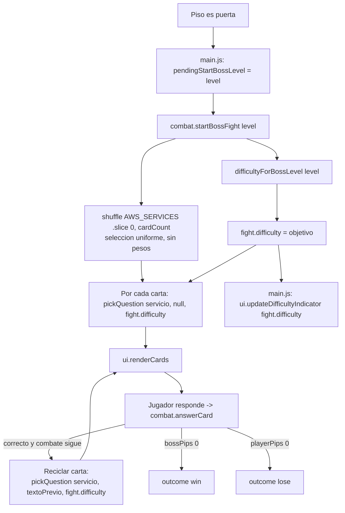

# Design Document

## Overview

Esta feature añade **dificultad progresiva** a las preguntas del juego "Torre de las Nubes — Duelo AWS". Hoy `pickQuestion(serviceId, avoidText, targetDifficulty)` ya vive en el módulo `src/data/services.js` y elige una pregunta del pool de un servicio; el combate en `src/combat/fight.js` todavía no propaga una dificultad objetivo por combate. El diseño se implementa **enteramente sobre los módulos ES bajo `src/`** (la implementación vigente del juego), y **no** sobre el monolito congelado `torre-de-las-nubes.html`, que permanece sin modificarse (R6.5).

El diseño introduce cuatro cambios acotados y cohesivos, repartidos entre los módulos reales:

1. **Atributo de dificultad por pregunta** (`src/data/services.js`): cada objeto de `QUESTIONS[servicio]` gana un campo `d` (1, 2 o 3). El banco se amplía para cumplir los mínimos **por cada servicio de `AWS_SERVICES`** (8 de nivel 1, 10 de nivel 2, 5 de nivel 3).
2. **Mapeador_De_Dificultad** (`difficultyForBossLevel(level)` en `src/data/services.js`): traduce el Nivel_De_Jefe a un Nivel_De_Dificultad_Objetivo, con mapeo `1→1`, `2→2`, `>=3→3`, monótono no decreciente y acotado en `[1,3]`. *(Ya existe en el archivo.)*
3. **Selector_De_Preguntas** (`pickQuestion(serviceId, avoidText, targetDifficulty)` + `resolveEffectiveDifficulty(pool, target)` en `src/data/services.js`): filtra por dificultad objetivo con reglas de reserva (exacto → más cercano menor → más cercano mayor), preservando el barajado de opciones y el índice correcto. *(Ya existe en el archivo; el combate aún no le pasa la dificultad.)*
4. **Consistencia por combate + indicador visual**: `startBossFight`/`answerCard` (`src/combat/fight.js`) guardan el `difficulty` vigente y lo reutilizan al reciclar cartas; `updateDifficultyIndicator` (`src/ui/screens.js`) muestra "Fácil"/"Media"/"Difícil" con degradación elegante sobre el nodo `#bossDifficulty` (definido en `index.html`); `src/main.js` conecta el indicador al arrancar el combate.

**Trato igualitario de todos los servicios.** No existe un subconjunto "foco" de servicios: la cobertura mínima por nivel de dificultad se aplica **por igual a cada servicio definido en `AWS_SERVICES`** (~54 servicios que cubren todos los dominios del CLF-C02), y la selección de qué servicios aparecen en un combate es **aleatoria uniforme** vía `shuffle(AWS_SERVICES)`, sin priorizar ni pesar ningún servicio (R1.5, R1.6).

El diseño respeta las restricciones del proyecto: JavaScript vanilla en módulos ES bajo `src/`, sin dependencias externas en tiempo de ejecución, y todo el contenido de cara al usuario en español. Las herramientas de prueba (`vitest` + `fast-check` + `jsdom`) ya están declaradas en `package.json`; las pruebas importan directamente los módulos ES (`import { ... } from '../data/services.js'`), sin ningún hook global tipo `window.__torreTest`.

### Alcance y trazabilidad

| Requisito | Cómo lo cubre el diseño | Archivo(s) |
|-----------|-------------------------|------------|
| R1.1–R1.4 (clasificación de dificultad) | Campo `d` por pregunta + ampliación del banco + default a 1 (`q.d || 1`) | `src/data/services.js` |
| R1.5 (cobertura mínima igual por servicio) | Mismos umbrales (8/10/5) aplicados a **cada** servicio de `AWS_SERVICES`; sin servicios foco | `src/data/services.js` |
| R1.6 (selección uniforme de servicios) | `shuffle(AWS_SERVICES).slice(0, cardCount)` — permutación uniforme, sin pesos | `src/combat/fight.js` |
| R2 (mapeo de progreso) | `difficultyForBossLevel(level)` | `src/data/services.js` |
| R3 (selección por dificultad) | `pickQuestion` con `targetDifficulty` + `resolveEffectiveDifficulty` (fallback) | `src/data/services.js` |
| R4 (consistencia por combate) | `fight.difficulty` fijado en `startBossFight` y reutilizado al reciclar en `answerCard` | `src/combat/fight.js` |
| R5 (indicador visual) | Nodo `#bossDifficulty` + `updateDifficultyIndicator()`; wiring en el arranque del combate | `index.html`, `src/ui/screens.js`, `src/main.js` |
| R6.1–R6.4 (preservar comportamiento) | Cambios aditivos; `DOOR_INTERVAL`, `cardCount`, daño y vanilla-JS/módulos ES intactos | `src/engine/`, `src/combat/fight.js` |
| R6.5 (monolito congelado no modificado) | Toda la feature vive bajo `src/`; `torre-de-las-nubes.html` no se toca ni se importa | (verificación de proceso) |
| R7 (semejanza con CLF-C02) | Autoría del banco de nivel 2/3 alineada al examen (estilo escenario, 4 opciones, español) + campo `dom`; cobertura de los cuatro dominios entre nivel 2/3 | `src/data/services.js` |

## Architecture

El flujo actual del combate se conserva; solo se inserta el cálculo de dificultad en el arranque del combate y se propaga hacia el selector. La selección de servicios sigue siendo aleatoria uniforme sobre `AWS_SERVICES` (R1.6).



### Ubicación de los cambios en los módulos `src/`

La implementación vigente ya está modularizada. Los cambios se reparten así:

- **`src/data/services.js`** (sección DATA):
  - Ampliar `QUESTIONS` (añadir campo `d` y más preguntas hasta los mínimos por servicio). *(Ampliación de datos.)*
  - `difficultyForBossLevel`, `pickQuestion` y `resolveEffectiveDifficulty` **ya existen** con la firma correcta.
  - Añadir el helper `difficultyLabel(difficulty)` y la constante `CLF_DOMAINS` (dominios de contenido CLF-C02). *(Aún no existen.)*
- **`src/combat/fight.js`** (lógica de combate):
  - En `startBossFight(level)`: calcular `difficulty = difficultyForBossLevel(level)`, guardarlo en el objeto de combate retornado (`fight.difficulty`) y pasarlo a `pickQuestion(s.id, null, difficulty)`.
  - En `answerCard(fight, idx, chosenIdx)`: al reciclar la carta tras un acierto, pasar `fight.difficulty` a `pickQuestion(card.service.id, card.question.text, fight.difficulty)`.
  - La selección uniforme de servicios (`shuffle(AWS_SERVICES).slice(0, cardCount)`) **se conserva sin cambios** (R1.6).
- **`index.html`**: añadir el nodo DOM `#bossDifficulty` dentro del bloque del jefe (junto a `#bossName`) y una regla CSS pequeña y no intrusiva para él (el `#bossDifficulty` y su CSS viven aquí, no en el monolito congelado).
- **`src/ui/screens.js`** (UI DOM): añadir `updateDifficultyIndicator(difficulty)` que escribe la etiqueta en `#bossDifficulty` con degradación elegante.
- **`src/main.js`** (wiring): al arrancar el combate (donde ya se llama a `combat.startBossFight(lvl)` y `ui.showBossScreen(...)`), invocar `ui.updateDifficultyIndicator(fight.difficulty)`.

> El monolito `torre-de-las-nubes.html` **no** forma parte del alcance de esta feature y no se modifica ni se importa desde `src/` (R6.5).

### Principios de diseño

- **Cambios aditivos y compatibles hacia atrás**: `pickQuestion` recibe `targetDifficulty` como tercer parámetro; si es `undefined` (por ejemplo, llamadas de 2 argumentos aún presentes), se comporta de forma segura (dificultad 1 por defecto), evitando romper llamadas existentes.
- **Trato igualitario de servicios**: ninguna parte del diseño prioriza, pondera ni excluye servicios; los mínimos del banco y la selección de combate son idénticos para todos los servicios de `AWS_SERVICES` (R1.5, R1.6).
- **Funciones puras aisladas**: `difficultyForBossLevel`, `resolveEffectiveDifficulty` y `difficultyLabel` son deterministas; `pickQuestion` solo depende de `Math.random()` para el barajado. Se importan directamente en las pruebas.
- **Tolerancia a datos incompletos**: preguntas sin `d` se tratan como nivel 1 (R1.4).

## Components and Interfaces

### 1. Mapeador_De_Dificultad — `difficultyForBossLevel(level)` *(`src/data/services.js`, ya existe)*

```js
// Traduce Nivel_De_Jefe -> Nivel_De_Dificultad_Objetivo.
// Mapeo: 1->1, 2->2, >=3->3. Monótono no decreciente, acotado en [1,3].
export function difficultyForBossLevel(level){
  const lvl = Math.floor(level);
  if(lvl <= 1) return 1;
  if(lvl === 2) return 2;
  return 3;
}
```

- **Entrada**: `level` (entero ≥ 1; el Nivel_De_Jefe). Para robustez, valores < 1 se tratan como 1.
- **Salida**: entero en `{1, 2, 3}`.
- **Propiedades**: monotonicidad no decreciente y cota `[1,3]` (ver Correctness Properties).
- **Equivalencia matemática**: `clamp(level, 1, 3)`; se implementa con ramas explícitas para dejar el mapeo legible y alineado con R2.2–R2.4.

### 2. Selector_De_Preguntas — `pickQuestion(serviceId, avoidText, targetDifficulty)` *(`src/data/services.js`, ya existe)*

La firma ya incluye `targetDifficulty`. La lógica de selección se divide en dos pasos: (a) elegir el **pool de dificultad efectiva** aplicando el fallback (`resolveEffectiveDifficulty`); (b) elegir una pregunta de ese pool y barajar sus opciones (comportamiento existente conservado). Implementación vigente:

```js
// Devuelve la dificultad efectiva disponible más adecuada al objetivo,
// siguiendo: exacta -> más cercana MENOR -> más cercana MAYOR.
export function resolveEffectiveDifficulty(pool, target){
  if(!pool || pool.length === 0) return null;
  const levels = new Set(pool.map(q => q.d || 1)); // R1.4: sin d => 1
  if(levels.has(target)) return target;            // R3.2 coincidencia exacta
  for(let d = target - 1; d >= 1; d--){ if(levels.has(d)) return d; } // R3.3 más cercana MENOR
  for(let d = target + 1; d <= 3; d++){ if(levels.has(d)) return d; } // R3.4 más cercana MAYOR
  return null; // sin niveles disponibles
}

export function pickQuestion(serviceId, avoidText, targetDifficulty){
  const pool = QUESTIONS[serviceId];
  if(!pool || pool.length === 0) return null; // servicio sin preguntas
  // Default seguro a 1 si targetDifficulty no es un entero en [1,3]
  // (incluye undefined -> compatibilidad con llamadas de 2 argumentos).
  const target = (Number.isInteger(targetDifficulty) && targetDifficulty >= 1 && targetDifficulty <= 3)
    ? targetDifficulty : 1;
  const eff = resolveEffectiveDifficulty(pool, target);
  const subset = pool.filter(q => (q.d || 1) === eff);
  let pick = subset[Math.floor(Math.random()*subset.length)];
  if(subset.length > 1 && avoidText){
    let tries = 0;
    while(pick.q === avoidText && tries < 8){
      pick = subset[Math.floor(Math.random()*subset.length)]; tries++;
    }
  }
  // Barajado de opciones con seguimiento del índice correcto (comportamiento existente).
  const optionIdx = [0,1,2,3];
  const order = shuffle(optionIdx);
  const options = order.map(i => pick.o[i]);
  const correct = order.indexOf(pick.c);
  return {text: pick.q, options, correct, difficulty: pick.d || 1};
}
```

- **Reglas de reserva (R3.2–R3.4)**: exacta → menor más cercana → mayor más cercana. Como el rango es `[1,3]` y cada servicio tendrá los tres niveles poblados (R1.2), el fallback rara vez se activa en producción, pero queda definido y probado para robustez.
- **Garantía de retorno válido (R3.5)**: mientras el servicio tenga al menos una pregunta, `resolveEffectiveDifficulty` encuentra siempre un nivel presente, por lo que `subset` nunca queda vacío y se devuelve una pregunta.
- **Preservación del índice correcto (R3.6)**: se conserva intacto el mecanismo actual de barajado (`order.indexOf(pick.c)`).
- **Campo `difficulty` en el retorno**: expuesto para diagnóstico/consistencia; no cambia el consumo actual (`text`, `options`, `correct`).

### 3. Consistencia por combate — cambios en `startBossFight` y `answerCard` *(`src/combat/fight.js`)*

`startBossFight` **no toca el DOM**: devuelve un objeto de combate plano que `src/main.js` usa para el estado y la UI. Los cambios son aditivos: calcular la dificultad, guardarla en el objeto retornado y pasarla a `pickQuestion`. La selección uniforme de servicios (`shuffle(AWS_SERVICES).slice(0, cardCount)`) se mantiene intacta (R1.6).

```js
import { AWS_SERVICES, BOSS_NAMES, shuffle, pickQuestion, difficultyForBossLevel } from '../data/services.js';

export const MAX_CARD_COUNT = 7;

export function startBossFight(level){
  const cardCount = Math.min(level, MAX_CARD_COUNT);      // R6.2 sin cambios
  const difficulty = difficultyForBossLevel(level);        // R2.1, R4.1  (NUEVO)
  const bossPipsInit = cardCount;
  const playerDefeatThreshold = cardCount - Math.ceil(cardCount / 2) + 1;
  const services = shuffle(AWS_SERVICES).slice(0, cardCount); // R1.6 uniforme, sin pesos
  const cards = services.map(s => ({
    service: s,
    question: pickQuestion(s.id, null, difficulty),        // R3.1, R4.1  (NUEVO: pasa difficulty)
    locked: false,
  }));
  const bossLabel = BOSS_NAMES[Math.min(level, BOSS_NAMES.length) - 1] + ` — Nivel ${level}`;
  return {
    cardCount,
    difficulty,                                            // R4.3 constante durante el combate (NUEVO)
    playerPips: playerDefeatThreshold,
    bossPips: bossPipsInit,
    playerPipsMax: playerDefeatThreshold,
    bossPipsMax: bossPipsInit,
    resolved: false,
    cards,
    bossLabel,
  };
}
```

En el reciclado de carta (dentro de `answerCard`, tras un acierto que no resuelve el combate), se usa la dificultad vigente del combate:

```js
// answerCard(fight, idx, chosenIdx): al acertar sin resolver el combate (R4.2)
if (correct && !fight.resolved) {
  card.question = pickQuestion(card.service.id, card.question.text, fight.difficulty); // NUEVO: pasa fight.difficulty
}
```

- `fight.difficulty` se fija una sola vez en `startBossFight` y no se modifica mientras exista el objeto de combate (R4.3).
- Todas las cartas iniciales y todas las cartas recicladas usan ese mismo valor (R4.1, R4.2).
- La mecánica de daño, `cardCount` (acotado a `MAX_CARD_COUNT`) y umbrales de vida se conservan sin cambios (R6.2, R6.3).

### 4. Indicador visual — `updateDifficultyIndicator(difficulty)` *(`src/ui/screens.js`)* + `difficultyLabel` *(`src/data/services.js`)*

DOM nuevo en `index.html`, dentro del bloque del jefe en `#bossScreen` (junto a `#bossName`):

```html
<div class="hp-label" id="bossName">Guardián</div>
<div class="difficulty-tag" id="bossDifficulty" aria-live="polite"></div>
```

`difficultyLabel` es un helper puro en `src/data/services.js` (junto a las demás funciones de dificultad):

```js
// src/data/services.js
export function difficultyLabel(difficulty){
  if(difficulty === 1) return 'Fácil';
  if(difficulty === 2) return 'Media';
  if(difficulty === 3) return 'Difícil';
  return 'Fácil'; // default defensivo
}
```

`updateDifficultyIndicator` vive en `src/ui/screens.js` (capa DOM) e importa `difficultyLabel`:

```js
// src/ui/screens.js
import { difficultyLabel } from '../data/services.js';

// R5.1, R5.2, R5.3: actualiza la etiqueta; si el nodo no existe, no rompe el combate.
export function updateDifficultyIndicator(difficulty){
  try{
    const el = document.getElementById('bossDifficulty');
    if(!el) return;                       // R5.3 degradación elegante
    el.textContent = 'Dificultad: ' + difficultyLabel(difficulty);
    el.dataset.level = String(difficulty);
  }catch(e){ /* R5.3: continuar el combate sin indicación */ }
}
```

Wiring en `src/main.js`, en el bloque que ya arranca el combate (junto a `ui.showBossScreen(...)`):

```js
// src/main.js (al iniciar el combate)
fight = combat.startBossFight(lvl);
ui.showBossScreen(`${bossEntry.displayName} — Nivel ${lvl}`, fight.cardCount);
ui.updateDifficultyIndicator(fight.difficulty);   // R5.1, R5.2  (NUEVO)
```

- **R5.1**: muestra la etiqueta correcta según el nivel objetivo del combate.
- **R5.2**: como `fight.difficulty` se recalcula en cada `startBossFight`, combates sucesivos con distinto nivel actualizan el texto.
- **R5.3**: si el nodo falta o hay error de DOM, la función retorna silenciosamente y el combate continúa.

CSS mínimo en `index.html` (paleta existente vía variables):

```css
.difficulty-tag{ font-size:.72rem; letter-spacing:.04em; opacity:.85; margin-top:2px; }
.difficulty-tag[data-level="1"]{ color:#57b46b; }
.difficulty-tag[data-level="2"]{ color:#f0c04a; }
.difficulty-tag[data-level="3"]{ color:#ff6b61; }
```

### Contrato de interfaces (resumen)

| Función | Módulo | Firma | Retorno |
|---------|--------|-------|---------|
| `difficultyForBossLevel` | `src/data/services.js` | `(level:number)` | `1 \| 2 \| 3` |
| `pickQuestion` | `src/data/services.js` | `(serviceId:string, avoidText:string\|null, targetDifficulty:number)` | `{text, options[], correct, difficulty} \| null` |
| `resolveEffectiveDifficulty` | `src/data/services.js` | `(pool:Pregunta[], target:number)` | `1 \| 2 \| 3 \| null` |
| `difficultyLabel` | `src/data/services.js` | `(difficulty:number)` | `'Fácil' \| 'Media' \| 'Difícil'` |
| `startBossFight` | `src/combat/fight.js` | `(level:number)` | `{cardCount, difficulty, playerPips, bossPips, ..., cards[], bossLabel}` |
| `answerCard` | `src/combat/fight.js` | `(fight, idx:number, chosenIdx:number)` | `{correct, resolved, outcome}` |
| `updateDifficultyIndicator` | `src/ui/screens.js` | `(difficulty:number)` | `void` |

## Data Models

### Pregunta (elemento de `QUESTIONS[servicio]`)

Modelo actual:

```js
{ q: string, o: string[4], c: number /* índice correcto 0..3 */ }
```

Modelo nuevo (aditivo):

```js
{
  q: string,
  o: string[4],
  c: number,
  d: 1 | 2 | 3,          // Nivel_De_Dificultad
  dom?: DominioCLF        // OPCIONAL: dominio de contenido CLF-C02 (solo nivel 2/3)
}
```

- `d` clasifica la dificultad. Si falta, el sistema lo interpreta como `1` (R1.4).
- `dom` es un campo **opcional y aditivo** que etiqueta el dominio de contenido del Examen_Cloud_Practitioner (CLF-C02) al que pertenece la Pregunta. Se usa en las Preguntas de Nivel_De_Dificultad 2 y 3 (R7.1, R7.2). Las Preguntas de Nivel_De_Dificultad 1 **pueden omitirlo** (R7.6), por lo que el modelo permanece compatible hacia atrás: la ausencia de `dom` nunca rompe la lógica de selección (que solo depende de `q`, `o`, `c`, `d`).
- `q` y `o` permanecen en español para todos los niveles (R1.3, R7.5).

#### Valores permitidos de `dom` (dominios CLF-C02, en español)

`dom` toma uno de estos cuatro valores canónicos, correspondientes a los dominios de contenido del examen CLF-C02:

| Valor de `dom` | Etiqueta (dominio CLF-C02) | Peso aprox. en el examen |
|----------------|----------------------------|--------------------------|
| `'conceptos'` | Conceptos de la Nube | ~24% |
| `'seguridad'` | Seguridad y Cumplimiento | ~30% |
| `'tecnologia'` | Tecnología y Servicios en la Nube | ~34% |
| `'facturacion'` | Facturación, Precios y Soporte | ~12% |

Estos valores se definen como una constante exportada en `src/data/services.js` para evitar cadenas mágicas y facilitar la validación desde las pruebas (que la importan directamente):

```js
// src/data/services.js
// Dominios de contenido del Examen_Cloud_Practitioner (CLF-C02).
export const CLF_DOMAINS = {
  conceptos:   'Conceptos de la Nube',
  seguridad:   'Seguridad y Cumplimiento',
  tecnologia:  'Tecnología y Servicios en la Nube',
  facturacion: 'Facturación, Precios y Soporte'
};
```

#### Guía de autoría para Preguntas de Nivel_De_Dificultad 2 y 3 (R7)

Al redactar o ampliar el contenido de nivel 2 (media) y 3 (difícil), el contenido debe asemejarse al examen AWS Certified Cloud Practitioner (CLF-C02):

- **Orientadas a escenario** (R7.3): el enunciado plantea una situación breve (una empresa/equipo con una necesidad) y pregunta qué servicio, característica o enfoque de AWS aplica, evaluando la comprensión fundamental de los servicios de AWS o su propuesta de valor. Evitar preguntas de mera definición en estos niveles.
- **Formato consistente** (R7.4): exactamente 4 opciones (`o` de longitud 4) y un único índice de opción correcta (`c` en `[0,3]`), igual que el resto del banco.
- **En español** (R7.5): enunciados y opciones en español, coherentes con el tono del juego.
- **Etiqueta de dominio** (R7.1, R7.2): asignar a cada Pregunta de nivel 2/3 un `dom` que corresponda a uno de los cuatro dominios CLF-C02.
- **Cobertura de dominios** (R7.7): entre el conjunto de todas las Preguntas de nivel 2 y 3 de **todos** los servicios del banco, los cuatro dominios (`conceptos`, `seguridad`, `tecnologia`, `facturacion`) deben estar representados con al menos una Pregunta cada uno. La cobertura de los cuatro dominios es un requisito **global** del banco; no se exige una asignación de dominio por servicio más allá de que cada pregunta de nivel 2/3 lleve un `dom` válido. Como todos los servicios reciben el mismo trato y `AWS_SERVICES` ya cubre los servicios de los cuatro dominios del CLF-C02, la cobertura de dominios surge naturalmente al completar los mínimos por servicio; no se inclina deliberadamente el volumen hacia ningún dominio.
- **Fuente de contenido**: al escribir las preguntas se recomienda consultar la guía oficial del examen AWS CLF-C02 y la documentación de AWS para asegurar precisión y representatividad; el contenido debe redactarse de forma original (no copiar literalmente material con licencia).
- **Nivel 1 (fácil)** (R7.6): puede mantener enunciados introductorios o de definición (siglas, "¿qué es…?") y **no** requiere el formato de escenario ni el campo `dom`.

### Estructura del banco y ampliación requerida (R1.2, R1.5)

**Cada** servicio definido en `AWS_SERVICES` (sin subconjunto "foco" ni excepciones) debe contener como mínimo:

| Nivel | Etiqueta | Mínimo por servicio |
|-------|----------|---------------------|
| 1 | Fácil | 8 preguntas |
| 2 | Media | 10 preguntas |
| 3 | Difícil | 5 preguntas |

Estos umbrales (8/10/5 → ≥23 por servicio) son **idénticos para todos los servicios**: ningún servicio requiere más preguntas que otro (R1.5). El diseño anterior enmarcaba un subconjunto de 6 "servicios foco" (`ec2`, `s3`, `lambda`, `dynamodb`, `vpc`, `iam`); ese enfoque se elimina por completo — la cobertura mínima aplica por igual a los ~54 servicios de `AWS_SERVICES`, que abarcan todos los dominios del CLF-C02.

**Implicación de diseño (ampliación del banco) — esfuerzo de contenido muy grande:**

- Estado actual: `AWS_SERVICES` define ~54 servicios; la mayoría de los pools tienen solo unas pocas preguntas de nivel 1 sin `d`.
- Estado objetivo: **≥23 preguntas por servicio × ~54 servicios ≈ ≥1150–1250 preguntas** en total (≈1242 con 54 servicios). Es un esfuerzo de autoría de contenido **muy considerable**, muy superior al estimado anterior (que solo contemplaba 6 servicios).
- Las preguntas existentes por servicio se conservan y se les asigna `d` según su complejidad (mayormente nivel 1), completando el resto hasta los mínimos.
- Consideraciones al redactar el contenido:
  - Mantener el formato de 4 opciones con índice correcto `c`.
  - Todo en español, coherente con el tono del juego (R1.3).
  - Nivel 1: definiciones y siglas. Nivel 2: casos de uso y características. Nivel 3: matices, límites y decisiones de arquitectura.
  - Para los niveles 2 y 3 aplica además la guía de autoría alineada al examen CLF-C02 (formato de escenario, campo `dom` y cobertura de dominios): ver "Guía de autoría para Preguntas de Nivel_De_Dificultad 2 y 3 (R7)" más arriba.
- El crecimiento del banco es solo de datos (no cambia la lógica); se ubica en `src/data/services.js`. **Dado el volumen (~1150+ preguntas), la escritura del contenido se planificará como tareas discretas por servicio o por grupo de dominio en `tasks.md`**, para que cada tarea sea acotada y revisable de forma independiente.

### Estado del combate `fight` (ampliado)

El objeto que retorna `startBossFight` (en `src/combat/fight.js`) es plano y no toca el DOM. La única adición es `difficulty`:

```js
{
  cardCount: number,
  difficulty: 1 | 2 | 3,     // NUEVO: Nivel_De_Dificultad_Objetivo del combate (R4)
  playerPips: number,
  bossPips: number,
  playerPipsMax: number,     // para dibujar las barras de pips
  bossPipsMax: number,
  resolved: boolean,
  cards: [{ service, question: {text, options, correct, difficulty}, locked }],
  bossLabel: string          // "{BOSS_NAMES[...]} — Nivel {level}"
}
```

`fight.difficulty` es la única adición; se establece una vez y permanece constante durante el combate (R4.3). El resto de los campos (`playerPipsMax`, `bossPipsMax`, `bossLabel`) ya existen en la implementación vigente y no cambian.

### Derivación del Nivel_De_Jefe (sin cambios)

Se conserva la relación existente: el motor (`src/engine/`) señala el arranque del combate mediante `gameState.doorsPassed` con una puerta cada `DOOR_INTERVAL = 5` pisos (R6.1); `src/main.js` toma el nivel resultante y llama a `combat.startBossFight(level)`. El cálculo de la dificultad ocurre dentro de `startBossFight` a partir de ese `level`.

## Correctness Properties

*A property is a characteristic or behavior that should hold true across all valid executions of a system—essentially, a formal statement about what the system should do. Properties serve as the bridge between human-readable specifications and machine-verifiable correctness guarantees.*

Esta feature es idónea para pruebas basadas en propiedades: `difficultyForBossLevel` y la lógica de selección son funciones con entrada/salida clara y un espacio de entrada amplio (niveles de jefe arbitrarios, pools de preguntas variados, dificultades objetivo). El análisis de testabilidad por criterio de aceptación se realizó con la herramienta de prework.

### Property 1: Mapeo acotado en [1,3]

*Para todo* Nivel_De_Jefe entero mayor o igual a 1, `difficultyForBossLevel(level)` devuelve un valor dentro del rango de 1 a 3 inclusive.

**Validates: Requirements 2.6**

### Property 2: Mapeo monótono no decreciente

*Para todo* par de Niveles_De_Jefe `a` y `b` con `a <= b` (ambos ≥ 1), se cumple que `difficultyForBossLevel(a) <= difficultyForBossLevel(b)`.

**Validates: Requirements 2.5**

### Property 3: Mapeo conforme a los puntos especificados

*Para todo* Nivel_De_Jefe, el mapeo respeta: nivel 1 → 1, nivel 2 → 2, y todo nivel mayor o igual a 3 → 3.

**Validates: Requirements 2.2, 2.3, 2.4**

### Property 4: El selector siempre devuelve una pregunta válida del servicio

*Para todo* servicio con al menos una pregunta en el banco y *para toda* dificultad objetivo en `{1,2,3}`, `pickQuestion(servicio, avoidText, objetivo)` devuelve una pregunta cuyo enunciado y opciones pertenecen a alguna pregunta del pool de ese servicio, con exactamente 4 opciones y un índice `correct` en `[0,3]`.

**Validates: Requirements 3.5, 3.1**

### Property 5: Coincidencia exacta de dificultad cuando existe

*Para todo* servicio y dificultad objetivo tal que el pool contiene al menos una pregunta con esa dificultad, la pregunta devuelta por `pickQuestion` tiene un `difficulty` igual a la dificultad objetivo.

**Validates: Requirements 3.2**

### Property 6: Reserva al nivel disponible más cercano

*Para todo* servicio y dificultad objetivo sin preguntas en ese nivel exacto: si existen preguntas de nivel menor, la dificultad devuelta es el mayor nivel disponible menor que el objetivo; en caso contrario, es el menor nivel disponible mayor que el objetivo. En todos los casos, no existe ningún nivel disponible estrictamente más cercano al objetivo que el devuelto.

**Validates: Requirements 3.3, 3.4**

### Property 7: Preservación del índice de la opción correcta tras barajar

*Para toda* pregunta devuelta por `pickQuestion`, la opción ubicada en el índice `correct` del arreglo `options` barajado es idéntica a la opción originalmente marcada como correcta en la pregunta de origen.

**Validates: Requirements 3.6**

### Property 8: Consistencia de dificultad dentro de un combate

*Para todo* combate iniciado en un Nivel_De_Jefe dado, toda pregunta seleccionada durante ese combate (cartas iniciales y cartas recicladas) se solicita con el mismo Nivel_De_Dificultad_Objetivo igual a `difficultyForBossLevel(nivel)`, y ese valor permanece constante mientras el combate está en curso.

**Validates: Requirements 4.1, 4.2, 4.3**

### Property 9: Etiqueta de dificultad correcta

*Para toda* dificultad en `{1,2,3}`, `difficultyLabel(difficulty)` devuelve respectivamente "Fácil", "Media" y "Difícil".

**Validates: Requirements 5.1**

### Property 10: Preguntas sin dificultad se tratan como nivel 1

*Para toda* pregunta sin campo `d` en el pool, la lógica de selección la considera de dificultad 1 (a efectos de coincidencia exacta y de reserva).

**Validates: Requirements 1.4**

### Property 11: Cobertura de los cuatro dominios CLF-C02 en niveles 2 y 3

*Para cada uno* de los cuatro dominios de contenido del Examen_Cloud_Practitioner (CLF-C02) —`conceptos`, `seguridad`, `tecnologia`, `facturacion`— existe al menos una Pregunta en el Banco_De_Preguntas con Nivel_De_Dificultad 2 o 3 cuyo campo `dom` es igual a ese dominio. Es decir, el conjunto de valores `dom` presentes entre todas las Preguntas de nivel 2 y 3 contiene los cuatro dominios canónicos.

**Validates: Requirements 7.7**

### Property 12: Etiqueta de dominio válida en niveles 2 y 3

*Para toda* Pregunta del Banco_De_Preguntas con Nivel_De_Dificultad 2 o 3, su campo `dom` está definido y pertenece al conjunto canónico de dominios CLF-C02 (`conceptos`, `seguridad`, `tecnologia`, `facturacion`).

**Validates: Requirements 7.1, 7.2**

### Property 13: Selección de servicios uniforme y sin pesos

*Para todo* `cardCount` en `[1, AWS_SERVICES.length]`, `shuffle(AWS_SERVICES).slice(0, cardCount)` devuelve exactamente `cardCount` servicios distintos, todos pertenecientes a `AWS_SERVICES`, sin duplicados; y sobre muchas corridas cada servicio de `AWS_SERVICES` tiene probabilidad no nula de aparecer (ningún servicio se prioriza, excluye o pondera). Es decir, `shuffle` es una permutación uniforme y la selección de combate no favorece a ningún servicio.

**Validates: Requirements 1.6**

## Error Handling

- **Servicio sin preguntas**: `pickQuestion` devuelve `null` si `QUESTIONS[serviceId]` no existe o está vacío. En producción esto no ocurre (todos los servicios tienen pool), pero el guardia evita excepciones. Los llamadores actuales siempre pasan `serviceId` de `AWS_SERVICES`, que están poblados.
- **Dificultad objetivo inválida o ausente**: si `targetDifficulty` no está en `[1,3]` (incluye `undefined`), el selector usa `1` como valor por defecto seguro, preservando compatibilidad con cualquier llamada existente.
- **Pregunta sin campo `d`**: se interpreta como nivel 1 (R1.4) mediante `q.d || 1` en filtrado y resolución de dificultad efectiva.
- **Nivel de jefe fuera de rango**: `difficultyForBossLevel` trata valores `< 1` como 1 y valores fraccionarios con `Math.floor`, garantizando salida en `{1,2,3}`.
- **Indicador visual no disponible (R5.3)**: `updateDifficultyIndicator` envuelve el acceso al DOM en un guardia (`if(!el) return`) y un `try/catch`; ante ausencia del nodo o error, el combate continúa sin indicación.
- **Sin cambios en el manejo de daño**: la lógica de `answerCard` que resta pips al jefe (acierto) o al jugador (fallo) se conserva íntegra (R6.3).

## Testing Strategy

El proyecto ya declara `vitest`, `fast-check` y `jsdom` en `package.json` (`npm test` → `vitest run`). Se adopta un enfoque dual: pruebas basadas en propiedades para las garantías universales y pruebas por ejemplo para casos concretos y de UI.

### Acceso a las funciones bajo prueba

La implementación ya está modularizada, por lo que las funciones se importan **directamente como módulos ES**, sin ningún hook global. **No se usa** el antiguo mecanismo `window.__torreTest` ni se carga el monolito `torre-de-las-nubes.html` en `jsdom`. Ejemplos de import por prueba:

```js
// pruebas de lógica pura (funciones de dificultad y selector)
import {
  AWS_SERVICES, QUESTIONS, shuffle,
  difficultyForBossLevel, pickQuestion, resolveEffectiveDifficulty,
  difficultyLabel, CLF_DOMAINS,
} from '../data/services.js';

// pruebas de combate
import { startBossFight, answerCard, MAX_CARD_COUNT } from '../combat/fight.js';

// pruebas de UI (con jsdom)
import { updateDifficultyIndicator } from '../ui/screens.js';
```

Ya existen archivos de prueba relacionados (`src/data/services.difficulty.test.js`, `src/data/services.selector.test.js`, `src/combat/fight.test.js`) que se ampliarán con las propiedades y ejemplos de esta feature. Las pruebas de UI usan el entorno `jsdom` (ya configurado en vitest) montando el fragmento DOM `#bossDifficulty`.

### Pruebas basadas en propiedades (mínimo 100 iteraciones cada una)

Se implementa **una** prueba por propiedad con `fast-check`, cada una etiquetada así:

```
// Feature: dificultad-progresiva-preguntas, Property {n}: {texto de la propiedad}
```

Configuración: `fc.assert(fc.property(...), { numRuns: 100 })` como mínimo.

Cobertura por propiedad:

- **Property 1–3** (`difficultyForBossLevel`): generar enteros `>= 1` (y algunos grandes) para cota y monotonicidad; casos puntuales 1→1, 2→2, ≥3→3.
- **Property 4–6, 10** (selección): generar pools sintéticos con distintas combinaciones de niveles presentes/ausentes (incluidas preguntas sin `d`) y dificultades objetivo en `{1,2,3}`; verificar validez del retorno, coincidencia exacta, regla de "más cercano" y trato de ausencia de `d`.
- **Property 7** (índice correcto): generar preguntas con opciones y `c` arbitrario; ejecutar `pickQuestion` muchas veces y comprobar `options[correct] === opciónCorrectaOriginal` en cada corrida (cubre la aleatoriedad del barajado).
- **Property 8** (consistencia por combate): probar `startBossFight`/reciclado importando `src/combat/fight.js`; verificar que la dificultad de las preguntas seleccionadas es coherente con `difficultyForBossLevel(nivel)` y que `fight.difficulty` permanece constante. Puede instrumentarse `pickQuestion` con un spy (por ejemplo, `vi.spyOn`) para registrar el `targetDifficulty` recibido en cada llamada del combate.
- **Property 9** (`difficultyLabel`): mapeo exhaustivo de `{1,2,3}`.
- **Property 13** (selección uniforme de servicios): con `fast-check`, generar `cardCount` en `[1, AWS_SERVICES.length]` y verificar que `shuffle(AWS_SERVICES).slice(0, cardCount)` produce `cardCount` servicios distintos, todos en `AWS_SERVICES`, sin duplicados. Complementar con un ejemplo estadístico: sobre muchas corridas, acumular las apariciones por servicio y afirmar que todos aparecen (frecuencia aproximadamente uniforme, sin servicios excluidos ni sobre-representados).
- **Property 11–12** (cobertura y validez de dominio CLF-C02): son invariantes sobre el **dato concreto** del banco (no funciones con espacio de entrada amplio), por lo que se verifican con pruebas data-driven que recorren el banco real una sola vez (ver "Pruebas por ejemplo"), en lugar de con randomización de 100 iteraciones.

### Pruebas por ejemplo (unitarias / integración ligera con jsdom)

- **R1.2 / R1.5 (mínimos del banco, iguales para todos los servicios)**: test que **itera sobre `AWS_SERVICES`** (no sobre un subconjunto fijo) y, para **cada** servicio, afirma `>=8` preguntas de nivel 1, `>=10` de nivel 2 y `>=5` de nivel 3 en `QUESTIONS[servicio.id]`. Los umbrales son constantes idénticas para todos los servicios, lo que demuestra el trato igualitario (R1.5). Falla hasta que el banco se amplíe para todos los servicios (guía la implementación de datos por servicio/dominio).

  ```js
  for (const s of AWS_SERVICES) {
    const pool = QUESTIONS[s.id] || [];
    const n1 = pool.filter(q => (q.d || 1) === 1).length;
    const n2 = pool.filter(q => q.d === 2).length;
    const n3 = pool.filter(q => q.d === 3).length;
    expect(n1, `${s.id} nivel 1`).toBeGreaterThanOrEqual(8);
    expect(n2, `${s.id} nivel 2`).toBeGreaterThanOrEqual(10);
    expect(n3, `${s.id} nivel 3`).toBeGreaterThanOrEqual(5);
  }
  ```

- **R1.3 (español)**: verificación de que las preguntas no contienen marcadores de idioma inesperados (chequeo básico de contenido); se complementa con revisión humana.
- **R5.1/R5.2 (indicador visual)**: en `jsdom`, montar un `#bossDifficulty`, invocar `updateDifficultyIndicator` con 1, 2 y 3 (o simular inicios de combate sucesivos con niveles 1, 2 y ≥3) y comprobar que muestra "Fácil"/"Media"/"Difícil" y que el texto cambia entre combates sucesivos.
- **R5.3 (degradación elegante)**: sin `#bossDifficulty` en el DOM, confirmar que `updateDifficultyIndicator` no lanza y el flujo continúa.
- **R6.1–R6.3 (preservación)**: pruebas de humo de que `DOOR_INTERVAL === 5` (motor), `cardCount === Math.min(level, MAX_CARD_COUNT)` y que en `answerCard` un acierto reduce `bossPips` y un fallo reduce `playerPips`.
- **R6.5 (monolito congelado no modificado)**: verificación de proceso — la feature solo edita archivos bajo `src/` e `index.html`; `torre-de-las-nubes.html` no aparece en imports de `src/` ni en el diff de la feature. Se asegura mediante revisión de cambios (no test automatizado).
- **R7.1/R7.2/R7.4 (etiqueta de dominio y formato en nivel 2/3)**: test data-driven que recorre `QUESTIONS` y, para toda pregunta con `d >= 2`, afirma que (a) `dom` está definido y pertenece a las claves de `CLF_DOMAINS` (`conceptos, seguridad, tecnologia, facturacion`) —equivalente a Property 12— y (b) `o.length === 4` y `c` es un entero en `[0,3]` (formato consistente). Falla hasta que el contenido de nivel 2/3 se etiquete y ajuste al formato.
- **R7.7 (cobertura de dominios — Property 11)**: test que reúne el conjunto de valores `dom` de todas las preguntas con `d >= 2` en **todo** el banco y afirma que contiene los cuatro dominios canónicos (al menos una pregunta por dominio entre niveles 2 y 3). Guía la autoría del contenido hasta cubrir los cuatro dominios.
- **Nota R7.3/R7.5/R7.6**: la orientación a escenario, la verificación de idioma español y la permisividad del nivel 1 son cualidades redaccionales o permisivas no verificables de forma automática fiable; se aseguran mediante revisión humana durante la autoría del contenido (no se automatizan).

### Balance

Las propiedades cubren la corrección universal (mapeo, selección por dificultad, preservación de índice, selección uniforme de servicios); las pruebas por ejemplo cubren datos concretos (mínimos del banco por servicio, dominios CLF-C02), la UI (indicador) y la no regresión del comportamiento existente. No se sobre-especifican pruebas unitarias donde una propiedad ya cubre el espacio de entrada.
