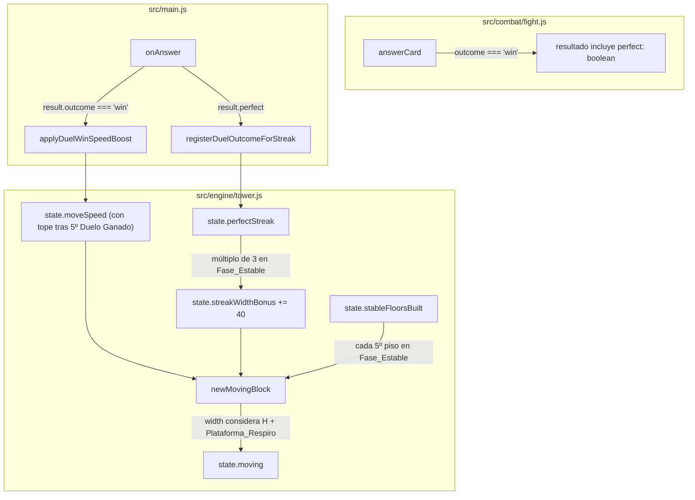

# Design Document

## Overview

Esta feature corrige el "cliff" de dificultad de "Torre de las Nubes" descrito en `endless-tower-difficulty-cap/requirements.md`, extendiendo el mecanismo de progresión ya introducido por `tower-progression-scaling`:

1. **Tope de velocidad tras el 5º Duelo Ganado**: `state.moveSpeed` deja de multiplicarse por `SPEED_INCREMENT_FACTOR` una vez que `state.doorsPassed >= 5`. El valor queda fijo en `Tope_Velocidad = BASE_SPEED * SPEED_INCREMENT_FACTOR^5`.
2. **Plataformas de Respiro periódicas**: dentro de la Fase_Estable (`doorsPassed >= 5`), cada 5º piso construido desde el inicio de esa fase duplica el ancho normal del Bloque en Movimiento (acotado a `BASE_PLATFORM_WIDTH`, 630px).
3. **Bono de ancho por Racha Perfecta**: `src/combat/fight.js` expone si un Duelo Ganado fue perfecto (sin fallos). `src/engine/tower.js` cuenta la Racha_Perfecta y, dentro de la Fase_Estable, otorga +40px permanentes al ancho máximo del Bloque en Movimiento cada vez que la racha alcanza un múltiplo de 3.

Todo el trabajo se realiza en `src/engine/tower.js` (estado y física) y `src/combat/fight.js` (resultado del Duelo), integrándose en `src/main.js` en el mismo punto donde hoy se invoca `applyDuelWinSpeedBoost`. No se modifica `src/render/draw.js`, `src/render/spriteEngine.js`, ni `src/data/bossRoster.js`: el ancho ya fluye desde `state.moving.width`/`floor.width` hacia el render existente sin cambios de firma.

## Architecture



### Secuencia: Duelo Ganado en Fase_Estable, con y sin racha perfecta

```mermaid
sequenceDiagram
    participant UI as main.js (onAnswer)
    participant Fight as combat/fight.js
    participant Engine as engine/tower.js

    UI->>Fight: answerCard(fight, idx, chosenIdx)
    Fight-->>UI: { outcome: 'win', perfect: true|false }
    UI->>Engine: applyDuelWinSpeedBoost(gameState)
    Engine->>Engine: IF doorsPassed < 5 THEN moveSpeed *= 1.30 ELSE moveSpeed sin cambio
    UI->>Engine: registerDuelOutcomeForStreak(gameState, result.perfect)
    Engine->>Engine: IF perfect THEN perfectStreak++ ELSE perfectStreak = 0
    Engine->>Engine: IF doorsPassed >= 5 AND perfect AND perfectStreak % 3 === 0 THEN streakWidthBonus += 40
    UI->>UI: gameState.doorsPassed += 1; endFight(true)
    Note over Engine: siguiente dropBlock() -> newMovingBlock() lee moveSpeed, streakWidthBonus y stableFloorsBuilt vigentes
```

**Decisión de diseño**: igual que `applyDuelWinSpeedBoost`, el nuevo tracking de racha se hace en una función exportada de `engine/tower.js` (`registerDuelOutcomeForStreak`) invocada explícitamente desde `main.js` en el punto donde se conoce `result.perfect`, no dentro de `fight.js`. Esto mantiene `fight.js` sin dependencia de `tower.js` (como hoy) y concentra toda la mutación de `state` en su módulo dueño.

`fight.js` solo necesita reportar si el Duelo fue perfecto; no necesita saber nada de Fase_Estable, Tope_Velocidad, ni rachas — esa lógica vive enteramente en `tower.js`.

## Components and Interfaces

### `src/combat/fight.js`

**Cambio mínimo en `answerCard`**: se añade seguimiento de fallos dentro del objeto `fight` (ya existe implícitamente vía `card.locked`, pero no hay un contador agregado) y se expone `perfect` en el resultado devuelto cuando `outcome === 'win'`.

Se añade un campo nuevo al estado `fight` devuelto por `startBossFight`:

```js
// dentro de startBossFight(level), añadir al objeto retornado:
failedAnyCard: false, // Requirement 3.1/3.2: rastrea si el Duelo tuvo al menos un fallo
```

En `answerCard`, en la rama de fallo:

```js
} else {
  card.locked = true;
  fight.playerPips = Math.max(0, fight.playerPips - 1);
  fight.failedAnyCard = true; // Requirement 3.2: un solo fallo basta para que el Duelo no sea perfecto
}
```

Y el valor de retorno pasa de:
```js
return { correct, resolved: fight.resolved, outcome };
```
a:
```js
return { correct, resolved: fight.resolved, outcome, perfect: outcome === 'win' ? !fight.failedAnyCard : null };
```

`perfect` es `null` cuando `outcome !== 'win'` (no aplica el concepto de Duelo Perfecto a un Duelo perdido o no resuelto), `true`/`false` cuando `outcome === 'win'` (Requirement 3.1, 3.2).

### `src/engine/tower.js`

**Constantes nuevas:**

```js
export const STABLE_PHASE_DUEL_THRESHOLD = 5;    // Requirement 1.1, 1.6: Duelos Ganados para entrar en Fase_Estable
export const SPEED_CAP = BASE_SPEED * Math.pow(SPEED_INCREMENT_FACTOR, STABLE_PHASE_DUEL_THRESHOLD); // Tope_Velocidad
export const RELIEF_PLATFORM_INTERVAL = 5;       // Requirement 2.1: cada N pisos dentro de la Fase_Estable
export const RELIEF_PLATFORM_WIDTH_MULTIPLIER = 2; // Requirement 2.2
export const PERFECT_STREAK_BONUS_INTERVAL = 3;   // Requirement 3.4: cada N Duelos Perfectos consecutivos
export const PERFECT_STREAK_BONUS_WIDTH = 40;     // Requirement 3.4: px otorgados por cada bono
```

**Extensión de `createTowerState`/`resetGame`**: se añaden tres campos nuevos al estado, todos reiniciados a sus valores base (Requirement 1.5, 2.5, 3.8):

```js
state.perfectStreak = 0;        // Requirement 3.1/3.2/3.3
state.streakWidthBonus = 0;     // Requirement 3.4/3.6/3.7/3.8
state.stableFloorsBuilt = 0;    // Requirement 2.1/2.5, cuenta pisos construidos DESDE que doorsPassed alcanzó 5
```

`state.moveSpeed` y `state.doorsPassed` ya existían (de `tower-progression-scaling`); no cambian de nombre ni de forma.

**Función pura nueva — cálculo del tope de velocidad (Requirement 1.1, 1.2, 1.3):**

```js
// Requirement 1.1/1.2/1.3: aplica el incremento de velocidad solo si aún no se alcanzó
// el Tope_Velocidad (definido a partir de STABLE_PHASE_DUEL_THRESHOLD Duelos Ganados)
export function applySpeedBoostWithCap(currentSpeed, doorsPassedBeforeThisWin) {
  if (doorsPassedBeforeThisWin >= STABLE_PHASE_DUEL_THRESHOLD) {
    return SPEED_CAP; // Requirement 1.2/1.3: ya en Fase_Estable, se mantiene el tope exacto
  }
  const next = applySpeedBoost(currentSpeed); // reutiliza la función pura existente (currentSpeed * 1.30)
  return doorsPassedBeforeThisWin + 1 >= STABLE_PHASE_DUEL_THRESHOLD ? SPEED_CAP : next;
}
```

Nota de diseño: en el caso límite del 5º Duelo Ganado (`doorsPassedBeforeThisWin === 4` antes de este triunfo), se fuerza el resultado exactamente a `SPEED_CAP` en lugar de `currentSpeed * 1.30`, para que el Requirement 1.1 ("SHALL fijar ese valor como el Tope_Velocidad... calculado como `Velocidad_Base * Factor_Incremento^5`") se cumpla con exactitud aritmética sin depender de que 5 multiplicaciones flotantes sucesivas coincidan bit a bit con `Math.pow(1.30, 5)`.

**`applyDuelWinSpeedBoost(state)` modificado:**

```js
// Requirement 1.1, 1.2, 1.3, 1.4: aplica el incremento compuesto solo antes del Tope_Velocidad
export function applyDuelWinSpeedBoost(state) {
  state.moveSpeed = applySpeedBoostWithCap(state.moveSpeed, state.doorsPassed);
  return state.moveSpeed;
}
```

La firma y el punto de invocación desde `main.js` (`onAnswer`, rama `outcome === 'win'`) no cambian; solo cambia el cálculo interno. Esto preserva Requirement 1.4 (comportamiento pre-tope idéntico al de `tower-progression-scaling`) por construcción, ya que `applySpeedBoostWithCap` delega en la `applySpeedBoost` sin modificar mientras `doorsPassedBeforeThisWin < 4`.

**Función nueva — seguimiento de Racha_Perfecta y Bono_Racha_Perfecta (Requirement 3.1-3.8):**

```js
// Requirement 3.1, 3.2, 3.3: actualiza la Racha_Perfecta según el resultado de un Duelo Ganado
// perfect: boolean — true si el Duelo Ganado no tuvo ningún fallo; se invoca únicamente
// cuando outcome === 'win' (un Duelo perdido/caída se maneja aparte, ver resetPerfectStreak)
export function registerDuelWinForStreak(state, perfect) {
  if (!perfect) {
    state.perfectStreak = 0; // Requirement 3.2
    return state.perfectStreak;
  }
  state.perfectStreak += 1; // Requirement 3.1
  const inStablePhase = state.doorsPassed >= STABLE_PHASE_DUEL_THRESHOLD; // ya incrementado por applyDuelWinSpeedBoost/main.js antes de esta llamada
  if (inStablePhase && state.perfectStreak % PERFECT_STREAK_BONUS_INTERVAL === 0) {
    state.streakWidthBonus += PERFECT_STREAK_BONUS_WIDTH; // Requirement 3.4, 3.6
  }
  return state.perfectStreak;
}

// Requirement 3.3: pierde el Duelo o cae de la Torre -> Racha_Perfecta a 0 (sin revertir streakWidthBonus, Requirement 3.7)
export function resetPerfectStreak(state) {
  state.perfectStreak = 0;
}
```

**Decisión de orden de invocación (importante para Requirement 3.4)**: `main.js` debe llamar primero `applyDuelWinSpeedBoost(state)` (o al menos incrementar `state.doorsPassed`) y luego `registerDuelWinForStreak(state, result.perfect)`, para que `inStablePhase` refleje el conteo de Duelos Ganados YA incluyendo el Duelo actual. Ver sección "Puntos de integración en `src/main.js`" para el orden exacto.

**`newMovingBlock` modificado — integra Plataformas_Respiro y Bono_Racha_Perfecta (Requirement 2.1-2.5, 3.4-3.6, 4.1-4.3):**

```js
// Requirement 2.1/2.2/2.4: determina si el próximo piso construido es una Plataforma_Respiro
export function isReliefPlatformFloor(stableFloorsBuiltBeforeThisFloor) {
  const floorsBuiltCountingThisOne = stableFloorsBuiltBeforeThisFloor + 1;
  return floorsBuiltCountingThisOne % RELIEF_PLATFORM_INTERVAL === 0; // Requirement 2.1
}

export function newMovingBlock(state, afterFloor, canvasWidth) {
  const h = 34 + Math.random() * 20; // sin cambios
  const inStablePhase = state.doorsPassed >= STABLE_PHASE_DUEL_THRESHOLD;

  // Requirement 3.4/3.6: ancho máximo base + bonos de racha acumulados
  const maxWidthWithStreakBonus = Math.min(
    afterFloor.width + (inStablePhase ? state.streakWidthBonus : 0),
    canvasWidth ?? Infinity
  );

  let w = Math.max(MIN_WIDTH, Math.min(maxWidthWithStreakBonus, maxWidthWithStreakBonus - Math.random() * 10));

  // Requirement 2.1/2.2/4.2: Plataforma_Respiro duplica el ancho ya incrementado por el bono de racha,
  // acotado al ancho de la Plataforma Base (630px)
  if (inStablePhase && isReliefPlatformFloor(state.stableFloorsBuilt)) {
    w = Math.min(BASE_PLATFORM_WIDTH, w * RELIEF_PLATFORM_WIDTH_MULTIPLIER);
  }

  const minX = Math.max(0, afterFloor.x - 90);
  const maxX = Math.min(canvasWidth ?? (afterFloor.x + afterFloor.width + 90), afterFloor.x + afterFloor.width + 90) - w;

  const startFromRight = Math.random() < 0.5;
  const dir = startFromRight ? -1 : 1;
  const x = startFromRight ? maxX : minX;

  return {
    x, y: 0, width: w, height: h, dir,
    speed: state.moveSpeed, // sin cambios (ya lee el Tope_Velocidad cuando corresponde)
    minX, maxX,
  };
}
```

Nota de diseño: el ancho "normal" que se duplica en una Plataforma_Respiro (Requirement 2.2, "el doble del ancho que le correspondería normalmente en ese momento") se define como el ancho YA resultante de aplicar el Bono_Racha_Perfecta vigente (Requirement 4.2), no el ancho base sin bonos — esto resuelve explícitamente Requirement 4.2 de la especificación.

**`dropBlock` modificado — incrementa `stableFloorsBuilt` (Requirement 2.1, 2.5):**

En el bloque donde se hace `state.floors.push(newFloor)`, se añade:

```js
if (state.doorsPassed >= STABLE_PHASE_DUEL_THRESHOLD) {
  state.stableFloorsBuilt += 1; // Requirement 2.1: solo cuenta pisos construidos dentro de la Fase_Estable
}
```

Esto debe ejecutarse ANTES de llamar a `newMovingBlock` para el siguiente bloque (que consulta `state.stableFloorsBuilt` vía `isReliefPlatformFloor`), de modo que el piso recién construido (el N-ésimo de la Fase_Estable) sea el que determina si el SIGUIENTE bloque en movimiento (que se convertirá en el piso N+1) es Plataforma_Respiro. Ver corrección de índice abajo.

**Corrección de índice (importante)**: Requirement 2.1 dice que la Plataforma_Respiro se otorga "en el 5º, 10º, 15º... piso construido" dentro de la Fase_Estable — es decir, el PISO en sí es ancho, no el bloque que lo antecede en una posición distinta. Como el ancho de un piso se fija en el momento en que su Bloque en Movimiento se crea (`newMovingBlock`) y permanece igual al colocarse (`computeNewFloor` usa `movingBlock.width`), la implementación correcta es: `newMovingBlock` decide el ancho del bloque que EVENTUALMENTE será el piso `stableFloorsBuilt + 1`-ésimo de la Fase_Estable — de ahí `isReliefPlatformFloor(state.stableFloorsBuilt)` usa `stableFloorsBuiltBeforeThisFloor + 1` internamente, y el incremento real de `state.stableFloorsBuilt` en `dropBlock` ocurre cuando ESE piso ya fue colocado, después de haber generado su `newMovingBlock` correspondiente con el flag correcto. El orden de operaciones dentro de `dropBlock` es:

```js
// 1. calcular newFloor con el moving block actual (ya decidido en la llamada anterior a newMovingBlock)
// 2. state.floors.push(newFloor)
// 3. SI ese newFloor se construyó dentro de la Fase_Estable: state.stableFloorsBuilt += 1
// 4. generar el SIGUIENTE moving block con newMovingBlock(state, newFloor, width),
//    que internamente usa el state.stableFloorsBuilt YA actualizado en el paso 3
//    para decidir si ESE bloque (el próximo piso) es Plataforma_Respiro
```

Este orden ya coincide con el orden real de `dropBlock` (push del piso, luego generación del siguiente `moving`), por lo que no se requiere reordenar el código existente — solo insertar el incremento de `state.stableFloorsBuilt` entre esos dos pasos.

**`resetGame`/`createTowerState` — reinicio completo (Requirement 1.5, 2.5, 3.8):**

Se añaden las tres inicializaciones nuevas junto a `state.moveSpeed = BASE_SPEED`:

```js
state.moveSpeed = BASE_SPEED;
state.perfectStreak = 0;
state.streakWidthBonus = 0;
state.stableFloorsBuilt = 0;
```

`state.doorsPassed = 0` ya se reinicia hoy en `resetGame` (comportamiento preexistente, no se toca).

### Puntos de integración en `src/main.js`

En `onAnswer(cardIdx, chosenIdx)`, la rama `outcome === 'win'` pasa de:

```js
if (result.outcome === 'win') {
  engine.applyDuelWinSpeedBoost(gameState);
  sfx.win();
  playWinSequence();
}
```

a:

```js
if (result.outcome === 'win') {
  engine.applyDuelWinSpeedBoost(gameState);          // Requirement 1.1-1.4: aplica o mantiene el tope, según doorsPassed ANTES de este incremento
  engine.registerDuelWinForStreak(gameState, result.perfect); // Requirement 3.1/3.2/3.4: usa gameState.doorsPassed (aún no incrementado en este punto)
  sfx.win();
  playWinSequence();
}
```

`gameState.doorsPassed += 1` ocurre más adelante, dentro de `endFight(true)` (comportamiento preexistente sin cambios) — por lo tanto, en el momento en que se llama `applyDuelWinSpeedBoost`/`registerDuelWinForStreak`, `gameState.doorsPassed` todavía refleja el conteo ANTES de este Duelo Ganado, que es exactamente lo que ambas funciones esperan recibir (`doorsPassedBeforeThisWin`). No se requiere reordenar `endFight`.

En la rama `outcome === 'lose'` y en `onDrop` (caída de la Torre), se añade una llamada a `engine.resetPerfectStreak(gameState)` (Requirement 3.3):

```js
} else if (result.outcome === 'lose') {
  sfx.lose();
  engine.resetPerfectStreak(gameState); // Requirement 3.3
  playLoseSequence();
}
```

y en `onDrop`, dentro de la rama `result.type === 'fell'`, antes o junto al registro del score:

```js
if (result.type === 'fell') {
  engine.triggerFall(gameState, performance.now());
  engine.resetPerfectStreak(gameState); // Requirement 3.3
  music.enterFallingScreen();
  sfx.fall();
  ...
}
```

No se modifica ninguna otra rama de `main.js`, ni `playFailureReaction`, `playWinSequence`, `playLoseSequence`, `playCorrectNonResolvingSequence`, ni el bloque de inicio de Boss_Fight en `loop()`.

## Data Models

Extensión de `GameState` (objeto plano en `src/engine/tower.js`):

```
GameState {
  ...campos existentes (screen, floors, moving, moveSpeed, doorsPassed, camElev, knight, ...)
  perfectStreak: number       // NUEVO — Requirement 3.1/3.2/3.3, Racha_Perfecta vigente
  streakWidthBonus: number    // NUEVO — Requirement 3.4/3.6/3.7/3.8, suma de Bono_Racha_Perfecta otorgados en la partida
  stableFloorsBuilt: number   // NUEVO — Requirement 2.1/2.5, pisos construidos desde el inicio de la Fase_Estable
}
```

- `perfectStreak`, `streakWidthBonus`, `stableFloorsBuilt` se inicializan a `0` en `createTowerState`/`resetGame` y solo se mutan desde `registerDuelWinForStreak`, `resetPerfectStreak` (para `perfectStreak`) y `dropBlock`/`newMovingBlock` (para `stableFloorsBuilt`, lectura de `streakWidthBonus`).
- `doorsPassed` y `moveSpeed` (ya existentes de `tower-progression-scaling`) no cambian de forma; `moveSpeed` ahora puede alcanzar como máximo `SPEED_CAP` (constante derivada, no un campo nuevo del estado).

Extensión del resultado de `answerCard` en `src/combat/fight.js`:

```
AnswerCardResult {
  correct: boolean            // sin cambios
  resolved: boolean           // sin cambios
  outcome: 'win' | 'lose' | null  // sin cambios
  perfect: boolean | null     // NUEVO — Requirement 3.1/3.2: true/false solo si outcome === 'win', null en otro caso
}
```

Extensión del objeto `fight` (estado de combate) devuelto por `startBossFight`:

```
FightState {
  ...campos existentes (cardCount, playerPips, bossPips, resolved, cards, bossLabel, playerPipsMax, bossPipsMax)
  failedAnyCard: boolean      // NUEVO — Requirement 3.1/3.2, true en cuanto una carta se marca locked por fallo
}
```

`MovingBlock` y `Floor` no cambian de forma; solo cambia el origen del valor `width` (ahora puede incluir `streakWidthBonus` y el duplicado de Plataforma_Respiro, ambos acotados a `BASE_PLATFORM_WIDTH`).

No se persiste ninguno de los campos nuevos en `localStorage`/leaderboard — son puramente de la sesión en memoria, igual que `moveSpeed`/`doorsPassed` hoy.

## Correctness Properties

*A property is a characteristic or behavior that should hold true across all valid executions of a system-essentially, a formal statement about what the system should do. Properties serve as the bridge between human-readable specifications and machine-verifiable correctness guarantees.*

### Property 1: El Tope_Velocidad se alcanza exactamente al 5º Duelo Ganado y se mantiene constante después

*For any* secuencia de `N >= 5` Duelos Ganados consecutivos (sin Duelos perdidos ni caídas intercaladas) aplicados mediante `applyDuelWinSpeedBoost` sobre un estado que arranca en `moveSpeed = BASE_SPEED` y `doorsPassed = 0` (incrementando `doorsPassed` en 1 tras cada llamada, replicando el orden real de `main.js`), el `moveSpeed` resultante tras la 5ª llamada SHALL ser exactamente `SPEED_CAP` (`BASE_SPEED * Factor_Incremento^5`), y el `moveSpeed` resultante tras CUALQUIER llamada adicional (6ª, 7ª, ..., hasta al menos la 60ª) SHALL permanecer exactamente igual a `SPEED_CAP`, sin volver a multiplicarse.

**Validates: Requirements 1.1, 1.2, 1.3, 1.6**

### Property 2: El comportamiento previo al Tope_Velocidad es idéntico al de `tower-progression-scaling`

*For any* secuencia de `N` Duelos Ganados consecutivos con `1 <= N <= 4` (estrictamente antes de alcanzar el Tope_Velocidad) aplicados mediante `applyDuelWinSpeedBoost`, el `moveSpeed` resultante SHALL ser idéntico (tolerancia `0.001`) al que produciría la función original `applySpeedBoost` aplicada `N` veces de forma compuesta sobre `BASE_SPEED` (es decir, `BASE_SPEED * Math.pow(1.30, N)`), sin ninguna intervención del tope.

**Validates: Requirement 1.4**

### Property 3: Reiniciar la partida restablece velocidad, racha y contadores de Fase_Estable a sus valores base

*For any* estado de juego arbitrario alcanzado tras una secuencia válida de Duelos Ganados/perdidos y pisos construidos (con `moveSpeed`, `doorsPassed`, `perfectStreak`, `streakWidthBonus`, `stableFloorsBuilt` en cualquier valor alcanzable), invocar `resetGame(state, width, height)` SHALL restablecer `moveSpeed === BASE_SPEED`, `doorsPassed === 0`, `perfectStreak === 0`, `streakWidthBonus === 0`, y `stableFloorsBuilt === 0`, independientemente del estado previo.

**Validates: Requirements 1.5, 2.5, 3.8**

### Property 4: Las Plataformas_Respiro solo ocurren en la Fase_Estable, exactamente cada 5 pisos construidos desde su inicio

*For any* número entero `k >= 0` de pisos construidos ANTES de entrar en la Fase_Estable (`doorsPassed < 5`), y *for any* secuencia de `M >= 1` pisos construidos DESPUÉS de entrar en la Fase_Estable (simulados incrementando `stableFloorsBuilt` en el mismo orden que `dropBlock`), `isReliefPlatformFloor(stableFloorsBuilt)` evaluado antes de construir cada uno de esos `M` pisos SHALL devolver `true` si y solo si el piso es el 5º, 10º, 15º, ... construido dentro de la Fase_Estable (es decir, `(stableFloorsBuilt + 1) % 5 === 0`), y SHALL devolver `false` para cualquier piso construido con `doorsPassed < 5` (fuera de la Fase_Estable), sin excepción.

**Validates: Requirements 2.1, 2.3, 2.4**

### Property 5: El ancho de una Plataforma_Respiro es exactamente el doble del ancho que tendría sin ese mecanismo, acotado a 630px

*For any* ancho base `w` (`MIN_WIDTH <= w <= BASE_PLATFORM_WIDTH`) que resultaría de `newMovingBlock` sin el mecanismo de Plataforma_Respiro (incluyendo cualquier Bono_Racha_Perfecta ya aplicado), cuando el piso en construcción es elegible como Plataforma_Respiro (Property 4), el ancho final devuelto por `newMovingBlock` SHALL ser exactamente `Math.min(BASE_PLATFORM_WIDTH, w * 2)`, y cuando el piso NO es elegible, el ancho final SHALL ser exactamente `w` sin modificación alguna por este mecanismo.

**Validates: Requirements 2.2, 4.2**

### Property 6: La Racha_Perfecta se incrementa solo con Duelos Perfectos consecutivos y se reinicia ante cualquier interrupción

*For any* secuencia de resultados de Duelo (`'perfect-win'`, `'imperfect-win'`, `'lose'`, `'fall'`) de longitud arbitraria `N >= 1`, aplicando `registerDuelWinForStreak(state, true)` para cada `'perfect-win'`, `registerDuelWinForStreak(state, false)` para cada `'imperfect-win'`, y `resetPerfectStreak(state)` para cada `'lose'`/`'fall'`, el valor final de `perfectStreak` SHALL ser exactamente igual a la longitud de la racha de `'perfect-win'` consecutivos al final de la secuencia (0 si el último elemento no es `'perfect-win'`).

**Validates: Requirements 3.1, 3.2, 3.3**

### Property 7: El Bono_Racha_Perfecta se otorga exactamente cada 3 Duelos Perfectos consecutivos dentro de la Fase_Estable, es acumulativo y nunca se revierte

*For any* estado con `doorsPassed >= 5` (Fase_Estable activa) y `streakWidthBonus` inicial arbitrario `b0 >= 0`, y *for any* secuencia de `N >= 1` llamadas a `registerDuelWinForStreak(state, perfect)` con valores de `perfect` arbitrarios, el `streakWidthBonus` final SHALL ser exactamente `b0 + 40 * floor(P / 3)`, donde `P` es la longitud de la racha de `true` consecutivos con la que termina la secuencia contada como en Property 6 — y en particular, `streakWidthBonus` SHALL ser una función no decreciente a lo largo de toda la secuencia (nunca disminuye), incluso en los pasos donde `perfectStreak` se reinicia a 0.

**Validates: Requirements 3.4, 3.6, 3.7**

### Property 8: Ningún Duelo Perfecto anterior a la Fase_Estable otorga Bono_Racha_Perfecta, aunque sí incrementa la racha

*For any* secuencia de `N >= 3` Duelos Perfectos consecutivos aplicados mediante `registerDuelWinForStreak(state, true)` mientras `state.doorsPassed < 5` se mantiene constante durante toda la secuencia (ningún Duelo Ganado adicional que incremente `doorsPassed` ocurre entre ellos), `state.streakWidthBonus` SHALL permanecer en su valor inicial sin ningún incremento, mientras que `state.perfectStreak` SHALL incrementarse normalmente en 1 por cada llamada, alcanzando `N` al final.

**Validates: Requirement 3.5**

### Property 9: El Tope_Velocidad y los mecanismos de ancho (Plataforma_Respiro, Bono_Racha_Perfecta) son completamente independientes entre sí

*For any* secuencia arbitraria de operaciones que combine llamadas a `applyDuelWinSpeedBoost`, `registerDuelWinForStreak`, `resetPerfectStreak`, y `newMovingBlock`/`dropBlock` (en cualquier orden válido según el flujo real del juego), el valor de `state.moveSpeed` en cualquier punto de la secuencia SHALL depender exclusivamente de las llamadas a `applyDuelWinSpeedBoost` y de `state.doorsPassed`, sin verse alterado por ningún valor de `state.streakWidthBonus`, `state.stableFloorsBuilt`, ni por el ancho de ningún `Floor`/`MovingBlock` generado; simétricamente, el ancho de cualquier `MovingBlock` generado por `newMovingBlock` SHALL depender exclusivamente de `afterFloor.width`, `state.streakWidthBonus`, `state.stableFloorsBuilt` y `canvasWidth`, sin verse alterado por el valor de `state.moveSpeed`.

**Validates: Requirement 4.3**

## Error Handling

- **`applySpeedBoostWithCap`**: no requiere validación adicional de rango; reutiliza `applySpeedBoost` (que ya acepta el overflow de IEEE 754 como comportamiento aceptable, según `tower-progression-scaling`). Un `doorsPassedBeforeThisWin` negativo o no entero (estado corrupto, no debería ocurrir por construcción de `main.js`) se trata de forma segura por la comparación `>=`, que simplemente evaluará a `false` para valores negativos, preservando el comportamiento pre-tope sin lanzar excepciones.
- **`registerDuelWinForStreak`**: si se invoca con `perfect` no booleano (`undefined`, por un caller que no pasó por `answerCard`), el chequeo `if (!perfect)` trata cualquier valor *falsy* (`undefined`, `null`, `0`, `false`) como "no perfecto", reiniciando la racha de forma segura sin lanzar excepción.
- **`isReliefPlatformFloor`**: función pura `number -> boolean`; un `stableFloorsBuiltBeforeThisFloor` negativo (no debería ocurrir) simplemente nunca satisface `% 5 === 0` de forma coincidente con un múltiplo positivo esperado, sin lanzar excepción.
- **`newMovingBlock`**: el `Math.min(BASE_PLATFORM_WIDTH, w * RELIEF_PLATFORM_WIDTH_MULTIPLIER)` garantiza que ninguna combinación de Bono_Racha_Perfecta acumulado + duplicado de Plataforma_Respiro pueda exceder el ancho de la Plataforma Base ni desbordar visualmente el canvas más allá de lo que ya podía ocurrir hoy con el ancho normal (acotado también por `canvasWidth` en el cálculo de `minX`/`maxX`, sin cambios respecto al comportamiento preexistente).
- **`fight.js` / `failedAnyCard`**: se inicializa explícitamente a `false` en `startBossFight`, por lo que un Duelo Ganado sin ningún fallo previo siempre calcula `perfect: true` correctamente incluso si `answerCard` nunca fue llamado con un fallo antes del triunfo (caso de un Duelo de 1 sola carta acertada a la primera).

## Testing Strategy

**Enfoque dual, consistente con `tower-progression-scaling`:**

- **Tests unitarios (Vitest)**: casos concretos.
  - `applySpeedBoostWithCap(BASE_SPEED, 4)` (5º Duelo Ganado) devuelve exactamente `SPEED_CAP`.
  - `applySpeedBoostWithCap(SPEED_CAP, 10)` (Duelo Ganado muy posterior) devuelve `SPEED_CAP` sin cambio.
  - `answerCard` en un Duelo de 1 carta acertada a la primera devuelve `perfect: true`; en un Duelo con al menos una carta fallida antes de ganar devuelve `perfect: false`; en un Duelo perdido devuelve `perfect: null`.
  - `isReliefPlatformFloor(4)` (5º piso de la Fase_Estable) es `true`; `isReliefPlatformFloor(3)` es `false`.
  - `registerDuelWinForStreak` con `doorsPassed = 5` y 3 llamadas `true` consecutivas incrementa `streakWidthBonus` en exactamente 40 en la 3ª llamada, no antes.
  - `createTowerState`/`resetGame` producen `perfectStreak === 0`, `streakWidthBonus === 0`, `stableFloorsBuilt === 0` en un caso concreto.

- **Tests de propiedades (`fast-check`)**: implementan las 9 Correctness Properties de arriba, una por test, con mínimo 100 ejecuciones (`fc.assert(fc.property(...), { numRuns: 100 })`), etiquetadas `// Feature: endless-tower-difficulty-cap, Property N: <texto>`.
  - Ubicación sugerida: `src/engine/tower.test.js` (Properties 1, 2, 3, 4, 5, 7, 8, 9) y `src/combat/fight.test.js` (Property 6, ya que involucra directamente `answerCard`'s `perfect` además de las funciones de `tower.js`; alternativamente, Property 6 puede residir junto a las demás en `tower.test.js` si `registerDuelWinForStreak`/`resetPerfectStreak` son las únicas funciones ejercitadas, sin necesidad de `fight.js`).
  - Generadores relevantes: `fc.integer({min: 1, max: 60})` para número de Duelos Ganados consecutivos; `fc.integer({min: 0, max: 4})` para `doorsPassed` antes del tope; `fc.array(fc.constantFrom('perfect-win','imperfect-win','lose','fall'), {minLength: 1, maxLength: 40})` para secuencias de resultados de Duelo (Properties 6, 7, 8); `fc.integer({min: 0, max: 200})` para `stableFloorsBuilt`/conteos de pisos.
  - `src/engine/tower.test.js` ya existe (creado durante `tower-progression-scaling`); las nuevas Properties 1, 2, 3, 4, 5, 7, 8, 9 de esta feature se añaden a ese archivo existente, sin sobrescribir sus tests actuales.
