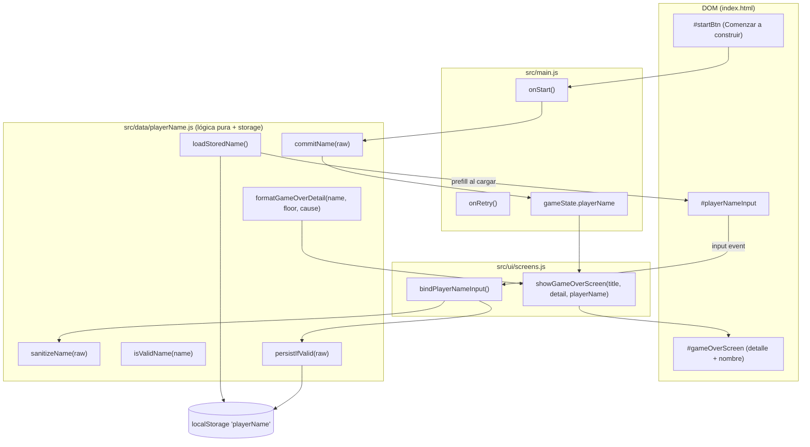

# Documento de Diseño

## Overview

Esta feature mejora la pantalla de bienvenida de "Torre de las Nubes — Duelo AWS" añadiendo:

1. Una pantalla de bienvenida inmersiva a pantalla completa con mensaje motivacional y descripción del juego.
2. Un campo de entrada opcional para el nombre del jugador.
3. Validación silenciosa del nombre (máximo 8 caracteres, sin mínimo, sin fricción).
4. Persistencia del nombre en `localStorage` bajo la clave `playerName`.
5. Personalización de la pantalla de Game Over mostrando el nombre junto al piso alcanzado.

El diseño respeta la dirección de modularización descrita en `tech.md` y `structure.md`: la lógica pura de captura, validación y persistencia del nombre vive en un módulo ES nuevo (`src/data/playerName.js`), sin dependencias externas y con solo JavaScript vanilla (ES6+). La capa de UI se conecta a través del módulo existente `src/ui/screens.js`, y el wiring ocurre en `src/main.js`. El estilo "facetado" (`clip-path`) y la paleta de variables CSS existentes se reutilizan tal cual.

### Alcance y objetivos de diseño

- **Cero dependencias nuevas.** Solo `localStorage`, DOM y CSS (`clip-path`), ya soportados en navegadores modernos (Requisito 11).
- **Sin fricción.** El campo de nombre siempre es opcional; el botón "Comenzar a construir" nunca se bloquea (Requisitos 4, 8).
- **Separación lógica/UI.** La lógica de sanitización, validación y persistencia es pura y testeable de forma aislada; la UI solo lee/escribe el DOM.
- **Todo el texto en español**, consistente con `product.md`.
- **Paridad de artefactos.** El proyecto mantiene dos artefactos: el monolito `torre-de-las-nubes.html` y la versión modularizada (`index.html` + `src/`). El cambio se implementa en la versión modularizada (fuente de verdad de la modularización en curso) y se refleja en el monolito para mantener la paridad visual/funcional.

## Architecture

La feature introduce una capa de "gestión de nombre de jugador" que se sitúa entre el DOM de la pantalla de bienvenida y el estado del juego.



### Flujo de datos

1. **Al cargar la página / volver a la bienvenida:** `main.js` llama a `loadStoredName()` y pre-rellena `#playerNameInput` (Requisitos 5.2, 7.2, 10.2).
2. **Mientras el jugador escribe:** un listener `input` sanitiza el valor visible y llama a `persistIfValid()`, que guarda en `localStorage` solo si el nombre es válido (Requisitos 5.1, 5.3).
3. **Al hacer clic en "Comenzar a construir":** `onStart()` llama a `commitName()` con el valor actual del campo. El resultado (nombre válido o cadena vacía) se guarda en `gameState.playerName` y se usa para esa partida (Requisitos 4, 7.3, 8.1, 10.3, 10.4).
4. **En Game Over:** `main.js` pasa `gameState.playerName` a `showGameOverScreen()`, que compone el detalle personalizado o genérico (Requisito 6).

### Decisiones de diseño y justificación

- **Separación entre "nombre persistido" y "nombre activo de la partida".** El nombre persistido en `localStorage` solo se actualiza con valores válidos (1–8 caracteres sanitizados, con al menos un carácter alfanumérico) mientras se escribe. El nombre activo se decide en el momento del clic en "Comenzar a construir" evaluando el valor actual del campo. Esto resuelve de forma determinista y sin conflictos los requisitos 5.3 (no actualizar storage con nombres inválidos), 10.3 (usar nombre almacenado si no se cambia) y 10.4 (jugar sin nombre si se borra el campo, sin usar el almacenado). El campo pre-rellenado con el nombre guardado hace que "no cambiar nada" y "usar el nombre almacenado" sean el mismo caso.
- **Sanitización en la capa lógica, no en el DOM.** Aunque el `<input>` limita la longitud vía `maxlength`, la sanitización real (caracteres permitidos) ocurre en `sanitizeName()` para que sea testeable de forma pura y reutilizable por el monolito.
- **Nombre en Game Over vía elemento dedicado.** Para aplicar tipografía dorada Cinzel al nombre (Requisito 6.3) sin inyectar HTML arbitrario proveniente del usuario, se usa un elemento DOM separado (`#gameOverPlayerName`) cuyo `textContent` recibe el nombre ya sanitizado. Esto evita riesgos de inyección y mantiene el estilo.

## Components and Interfaces

### 1. `src/data/playerName.js` (nuevo módulo — lógica pura y persistencia)

```js
export const STORAGE_KEY = 'playerName';
export const MAX_NAME_LENGTH = 8;
// No hay longitud mínima: cualquier nombre de 1 a 8 caracteres sanitizados
// (con al menos un carácter alfanumérico) es válido. Vacío = jugar sin nombre.

/**
 * Elimina caracteres no permitidos, dejando solo letras (incluye acentos y ñ),
 * dígitos y espacios. Recorta a MAX_NAME_LENGTH (8) caracteres.
 * @param {string} raw
 * @returns {string} nombre sanitizado
 */
export function sanitizeName(raw) { /* ... */ }

/**
 * Un nombre es válido si, tras sanitizar, tiene longitud entre 1 y
 * MAX_NAME_LENGTH (8) caracteres (contando espacios) y contiene al menos un
 * carácter alfanumérico. No hay longitud mínima distinta de 1.
 * @param {string} raw
 * @returns {boolean}
 */
export function isValidName(raw) { /* ... */ }

/**
 * Devuelve el nombre activo para la partida:
 * el nombre sanitizado si es válido, o cadena vacía en caso contrario.
 * @param {string} raw
 * @returns {string}
 */
export function commitName(raw) { /* ... */ }

/**
 * Guarda el nombre sanitizado en localStorage SOLO si es válido.
 * Si no es válido (vacío tras sanitizar, o sin carácter alfanumérico),
 * no modifica localStorage. Los nombres de más de 8 caracteres se recortan
 * a 8 por sanitizeName antes de evaluar la validez.
 * @param {string} raw
 * @returns {boolean} true si se persistió, false si no
 */
export function persistIfValid(raw) { /* ... */ }

/**
 * Lee el nombre guardado en localStorage. Devuelve '' si no existe o hay error.
 * @returns {string}
 */
export function loadStoredName() { /* ... */ }

/**
 * Compone el texto de detalle de Game Over.
 * @param {string} playerName - nombre activo (puede ser '')
 * @param {number} floor - piso alcanzado
 * @param {'fall'|'boss'} cause - causa de la derrota
 * @returns {{ detail: string, playerName: string }}
 */
export function formatGameOverDetail(playerName, floor, cause) { /* ... */ }
```

### 2. `src/ui/screens.js` (extensiones)

```js
/**
 * Conecta el campo de nombre: pre-rellena con el nombre guardado y
 * sanitiza + persiste mientras el jugador escribe.
 * @param {{ getStored: Function, sanitize: Function, persist: Function }} deps
 */
export function bindPlayerNameInput(deps) { /* ... */ }

/**
 * Devuelve el valor actual (crudo) del campo de nombre.
 * @returns {string}
 */
export function getPlayerNameInputValue() { /* ... */ }

/**
 * (Modificada) Muestra la pantalla de game over con título, detalle y nombre opcional.
 * El nombre se muestra en un elemento dedicado con estilo dorado.
 * @param {string} title
 * @param {string} detail
 * @param {string} [playerName] - si está vacío, no se muestra bloque de nombre
 */
export function showGameOverScreen(title, detail, playerName) { /* ... */ }
```

### 3. `src/main.js` (wiring)

- En la inicialización: llamar a `bindPlayerNameInput()` inyectando las funciones de `playerName.js`.
- En `onStart()`: `gameState.playerName = commitName(getPlayerNameInputValue())` antes de iniciar la partida.
- En `onRetry()`: volver a mostrar la bienvenida (el campo ya está pre-rellenado). El nombre activo se recalcula en el siguiente `onStart()`.
- En Game Over (`onDrop` fallido y `endFight(false)`): pasar `gameState.playerName` a `showGameOverScreen()`.

> Nota: la pantalla de Game Over actual ofrece "Reconstruir la torre" que reinicia directamente la construcción. Para satisfacer el Requisito 10.1 (volver a la pantalla de bienvenida al reintentar) y 7 (cambiar nombre al reintentar), `onRetry()` mostrará la pantalla de bienvenida en lugar de reiniciar de inmediato, de modo que el jugador pueda ajustar su nombre. Esta es una decisión de diseño que se refleja en las propiedades de correctitud.

### 4. DOM (`index.html` y, por paridad, `torre-de-las-nubes.html`)

**Principio rector: preservación total de la estructura existente.** La mejora es puramente **aditiva**. Ningún elemento actual de `#startScreen` se elimina, reemplaza ni reordena. Se conservan intactos, con sus mismos ids, clases y texto:

- El contenedor `#startScreen` con su clase `overlay`.
- El `.panel` con su clase `facet-cut` (no se cambian sus clases).
- El `.crest` con el emoji `🏰`.
- El encabezado `<h1>Torre de las Nubes</h1>`.
- El párrafo `.subtitle` con su texto completo.
- La lista `.rules` (`<ul>`) con sus **cuatro** `<li>` (soltar bloque, puerta cada 5 pisos, elegir carta AWS, número de cartas), sin alterar su contenido ni orden.
- El botón `#startBtn`, que conserva su id `startBtn`, su clase `btn-primary` y su texto **"Comenzar a construir"**.

Los **nuevos** elementos se **insertan dentro del `.panel` existente** (que ya tiene la clase `facet-cut`), en la posición **entre la lista `.rules` y el botón `#startBtn`**: el párrafo `.welcome-msg`, el envoltorio `.name-field` con `#playerNameInput` (`maxlength="8"`) y el párrafo `.name-hint`.

Snippet anotado del `#startScreen` resultante (lo existente se marca como PRESERVADO; lo nuevo como NUEVO):

```html
<!-- PRESERVADO: contenedor y clases sin cambios -->
<div id="startScreen" class="overlay">
  <!-- PRESERVADO: panel existente (mantiene la clase facet-cut) -->
  <div class="panel facet-cut">
    <div class="crest">🏰</div>                              <!-- PRESERVADO -->
    <h1>Torre de las Nubes</h1>                              <!-- PRESERVADO -->
    <p class="subtitle">Construye la torre piso a piso mientras tu caballero asciende. Cada cierto número de pisos aparece una puerta: al llegar, un guardián de AWS te desafía.</p> <!-- PRESERVADO -->
    <ul class="rules">                                       <!-- PRESERVADO (los 4 li se mantienen) -->
      <li><strong>Toca, haz clic o presiona Espacio</strong> para soltar el bloque y encajarlo en la torre.</li>
      <li>Cada <strong>5 pisos</strong> hay una <strong>puerta</strong>. Al alcanzarla comienza un duelo de preguntas.</li>
      <li>Elige una carta de servicio de AWS: acertar daña al guardián, fallar te daña a ti.</li>
      <li>El número de cartas define cuántos aciertos necesitas y cuántos fallos puedes soportar.</li>
    </ul>

    <!-- NUEVO: mensaje de bienvenida motivacional -->
    <p class="welcome-msg">¿Listo para conquistar nuevos niveles y llevar tu conocimiento de AWS al límite?</p>
    <!-- NUEVO: campo de nombre opcional -->
    <div class="name-field facet-cut-sm">
      <input id="playerNameInput" type="text" maxlength="8"
             autocomplete="off" spellcheck="false"
             placeholder="Tu nombre (opcional)"
             aria-label="Tu nombre (opcional)">
    </div>
    <!-- NUEVO: indicación sutil de que el nombre es opcional -->
    <p class="name-hint">Puedes jugar sin nombre; la experiencia será genérica.</p>

    <!-- PRESERVADO: botón existente, mismo id, clase y texto -->
    <button id="startBtn" class="btn-primary">Comenzar a construir</button>
  </div>
</div>
```

Este orden mantiene la estructura y el layout balanceado del panel (reglas → invitación → nombre → acción), respetando los Requisitos 2.4 y 9.4 (conservar las reglas y el botón de inicio existentes y un layout equilibrado).

En `#gameOverScreen`, dentro del bloque de detalle:

```html
<p id="gameOverPlayerName" class="player-name-display"></p>
<p id="gameOverDetail"></p>
```

### 5. CSS (nuevas reglas, reutilizando variables existentes)

**Las reglas y variables CSS existentes se reutilizan tal cual, sin modificarlas.** En concreto, `.panel`, `.facet-cut`, `.btn-primary`, `.crest`, `.subtitle`, `.rules` (y `.rules li`, `.rules strong`) y la paleta de `:root` (`--gold`, `--ink`, `--ink-dim`, `--aws`, `--panel`, `--font-display`, `--font-body`, etc.) permanecen intactas. Todo el CSS nuevo (`.welcome-msg`, `.name-field`, `#playerNameInput`, `.name-hint`, `.player-name-display`) es **puramente aditivo**: solo agrega reglas nuevas y consume las variables existentes, sin sobrescribir ni redefinir selectores previos.

- `.welcome-msg`: color `var(--gold)`, fuente `var(--font-display)` (Requisito 2.3).
- `.name-field`: contenedor con `clip-path` facetado (`facet-cut-sm`), borde dorado y fondo oscuro (Requisitos 3.5, 9.2, 9.3).
- `#playerNameInput`: fondo transparente/oscuro, texto `var(--ink)`, sin borde propio (lo aporta `.name-field`), padding cómodo.
- `.name-hint`: texto pequeño y tenue (`var(--ink-dim)`), indicación sutil (Requisito 8.4).
- `.player-name-display`: fuente `var(--font-display)` peso 700, color `var(--gold)` (Requisito 6.3).
- Media query `@media (max-width:520px)`: ajustar ancho/tamaño del campo para mantener legibilidad (Requisito 9.5).

## Data Models

### Constantes

| Constante | Valor | Descripción |
|-----------|-------|-------------|
| `STORAGE_KEY` | `'playerName'` | Clave de `localStorage` (Requisito 5.1). |
| `MAX_NAME_LENGTH` | `8` | Longitud máxima válida, contando espacios; aplicada por el campo (`maxlength=8`) y la sanitización (Requisitos 3.3, 4.1, 4.2). No existe longitud mínima distinta de 1. |
| `ALLOWED_CHARS` | regex `letras + dígitos + espacios` | Caracteres permitidos (Requisito 3.3). |

### Estado

- `gameState.playerName: string` — nombre activo de la partida actual. `''` significa "jugar sin nombre". Se fija en `onStart()`.
- `localStorage['playerName']: string` — nombre persistido entre sesiones. Solo contiene nombres válidos (1–8 caracteres sanitizados, con al menos un carácter alfanumérico).

### Contrato de nombre

- **Nombre crudo (raw):** lo que el jugador teclea (puede contener caracteres no permitidos, exceder 8 caracteres o estar vacío).
- **Nombre sanitizado:** raw filtrado a `ALLOWED_CHARS` y recortado a `MAX_NAME_LENGTH` (8).
- **Nombre válido:** sanitizado con longitud entre 1 y `MAX_NAME_LENGTH` (8) caracteres y con al menos un carácter alfanumérico. No hay longitud mínima distinta de 1.
- **Nombre activo:** sanitizado si es válido; en caso contrario `''`.

## Correctness Properties

*Una propiedad es una característica o comportamiento que debe cumplirse en todas las ejecuciones válidas de un sistema — esencialmente, un enunciado formal sobre lo que el sistema debe hacer. Las propiedades sirven de puente entre las especificaciones legibles por humanos y las garantías de correctitud verificables por máquina.*

Estas propiedades aplican a la lógica pura del módulo `src/data/playerName.js`. Los criterios de aceptación de estilo/layout (fuentes, colores, `clip-path`, responsividad) no son propiedades computables y se cubren con verificación visual y tests de ejemplo (ver Testing Strategy).

### Property 1: Sanitización conserva solo caracteres permitidos y es idempotente

*Para toda* cadena de entrada, `sanitizeName` devuelve una cadena que contiene únicamente letras, dígitos y espacios, con longitud ≤ `MAX_NAME_LENGTH` (8), y aplicarla de nuevo sobre su propio resultado no produce cambios (`sanitizeName(sanitizeName(x)) === sanitizeName(x)`).

**Validates: Requirements 3.3, 4.2**

### Property 2: La validación depende de la longitud sanitizada

*Para toda* cadena de entrada, `isValidName` devuelve `true` si y solo si la cadena sanitizada tiene longitud entre 1 y `MAX_NAME_LENGTH` (8) caracteres (contando espacios) y contiene al menos un carácter alfanumérico. No existe longitud mínima distinta de 1.

**Validates: Requirements 4.1**

### Property 3: El nombre activo proviene del campo y descarta entradas inválidas

*Para toda* cadena de entrada, `commitName` devuelve el nombre sanitizado cuando la entrada es válida, y la cadena vacía `''` cuando la entrada es inválida (vacía tras sanitizar, o sin ningún carácter alfanumérico). Dado que `sanitizeName` recorta a 8 caracteres, las entradas de más de 8 caracteres se reducen a su prefijo sanitizado de 8 antes de evaluar la validez. Además, `commitName` es idempotente sobre nombres válidos (`commitName(commitName(x)) === commitName(x)`), de modo que hacer clic en "Comenzar a construir" sin cambiar un nombre válido ya presente conserva ese nombre.

**Validates: Requirements 4.2, 4.4, 7.4, 8.1, 10.3, 10.4**

### Property 4: Round-trip de persistencia — la última escritura válida gana

*Para toda* secuencia de entradas que termine en un nombre válido, tras invocar `persistIfValid` sobre cada una en orden, `loadStoredName` devuelve el nombre sanitizado de la última entrada válida. En particular, para cualquier nombre válido individual, `persistIfValid(name)` seguido de `loadStoredName()` devuelve `sanitizeName(name)`.

**Validates: Requirements 5.1, 5.2, 7.2, 7.3, 10.2**

### Property 5: Persistencia no modifica el storage para entradas inválidas

*Para todo* estado previo de `localStorage` y toda entrada inválida (que tras sanitizar quede vacía o sin ningún carácter alfanumérico), `persistIfValid` deja el valor almacenado bajo `playerName` exactamente igual que antes de la invocación.

**Validates: Requirements 5.3**

### Property 6: El detalle de Game Over se personaliza según haya nombre o no

*Para todo* piso alcanzado y causa de derrota: si el nombre activo es válido (no vacío), el texto de detalle producido por `formatGameOverDetail` contiene el nombre y el piso; si el nombre activo es vacío, el texto es genérico (no contiene bloque de nombre) e incluye el piso.

**Validates: Requirements 6.1, 6.2, 8.2**

## Error Handling

- **`localStorage` no disponible o lanza excepción** (modo privado, cuota excedida, storage deshabilitado): `loadStoredName()` captura el error y devuelve `''`; `persistIfValid()` captura el error y continúa sin persistir (no propaga la excepción). El juego sigue siendo jugable sin nombre. Se registra un `console.warn`/`console.error` como en los módulos existentes (`scoreStore.js`).
- **Datos corruptos en `localStorage`** (valor no string): `loadStoredName()` normaliza a cadena o devuelve `''` si no es utilizable.
- **Entrada no string** en las funciones lógicas: se coacciona a cadena o se trata como vacía; nunca se lanza excepción hacia la capa de UI.
- **Elementos DOM ausentes** (`#playerNameInput`, `#gameOverPlayerName`): las funciones de `screens.js` verifican la existencia antes de operar, siguiendo el patrón defensivo del módulo; si faltan, degradan silenciosamente sin romper el flujo del juego.
- **Nombre demasiado largo:** `sanitizeName` recorta a `MAX_NAME_LENGTH` (8); el atributo `maxlength="8"` del `<input>` es una defensa adicional en la UI.

## Testing Strategy

Enfoque dual: tests basados en propiedades para la lógica pura y tests de ejemplo/integración para la UI y el DOM. Se usa el runner existente del proyecto (**Vitest**, ya configurado en `vitest.config.js`), con **fast-check** como librería de property-based testing para JavaScript. No se implementa PBT desde cero.

### Tests basados en propiedades (`src/data/playerName.test.js`)

- Se implementa **una** prueba por cada propiedad de correctitud (Propiedades 1–6).
- Cada prueba ejecuta un **mínimo de 100 iteraciones** (configuración de `fast-check`, `numRuns: 100`).
- Cada prueba se etiqueta con un comentario que referencia la propiedad del diseño, con formato:
  `// Feature: enhanced-welcome-screen, Property {número}: {texto de la propiedad}`
- Generadores: cadenas arbitrarias (incluyendo unicode, símbolos, espacios, vacías), cadenas de longitud controlada en rangos 0 (vacío), 1–8 (válido) y >8 (recortado a 8), además de casos solo-espacios/solo-símbolos (inválidos por falta de alfanumérico), y secuencias de nombres para el round-trip.
- Para las propiedades 4 y 5 (persistencia), se usa un **mock de `localStorage`** (o `jsdom`) para mantener las pruebas rápidas y deterministas; se limpia el store entre iteraciones según corresponda.

### Tests de ejemplo / unitarios (UI y DOM, con `jsdom`)

- **Requisito 2.2:** el DOM de la bienvenida contiene el mensaje exacto de bienvenida.
- **Requisitos 3.1, 3.2:** existe `#playerNameInput` con el placeholder "Tu nombre (opcional)".
- **Requisito 4.3:** con el campo vacío no se muestra mensaje de error.
- **Requisitos 8.3, 8.4:** `#startBtn` nunca está `disabled`; existe la indicación sutil `.name-hint`.
- **Requisito 10.1:** `onRetry()` vuelve a mostrar la pantalla de bienvenida.
- **Pre-relleno:** al inicializar con un nombre válido en storage, `bindPlayerNameInput` deja ese valor en el campo.
- **Requisitos 2.4, 9.4 (preservación de estructura):** el DOM de `#startScreen` sigue conteniendo el `.crest`, el `<h1>Torre de las Nubes</h1>`, el `.subtitle`, la `.rules` con sus cuatro `<li>` y el `#startBtn` (clase `btn-primary`, texto "Comenzar a construir"); los nuevos `.welcome-msg`, `.name-field`/`#playerNameInput` y `.name-hint` aparecen entre la lista `.rules` y el `#startBtn` sin desplazar ni eliminar los elementos existentes.

### Verificación visual / manual (estilo, layout, compatibilidad)

- **Requisitos 1.1–1.3, 2.1, 2.3, 2.4, 3.4, 3.5, 6.3, 6.4, 9.1–9.5, 11.4:** inspección visual en escritorio y móvil (pantalla completa, canvas de fondo, tipografía Cinzel dorada, `clip-path` facetado, layout balanceado, responsividad).
- **Requisitos 11.1–11.3:** verificación manual en Firefox, Chrome, Safari y Edge recientes; confirmación de ausencia de dependencias externas.

### Paridad

Tras validar en la versión modularizada (`index.html` + `src/`), se replica el mismo comportamiento en el monolito `torre-de-las-nubes.html`, reutilizando los scripts de verificación de paridad existentes del proyecto.
