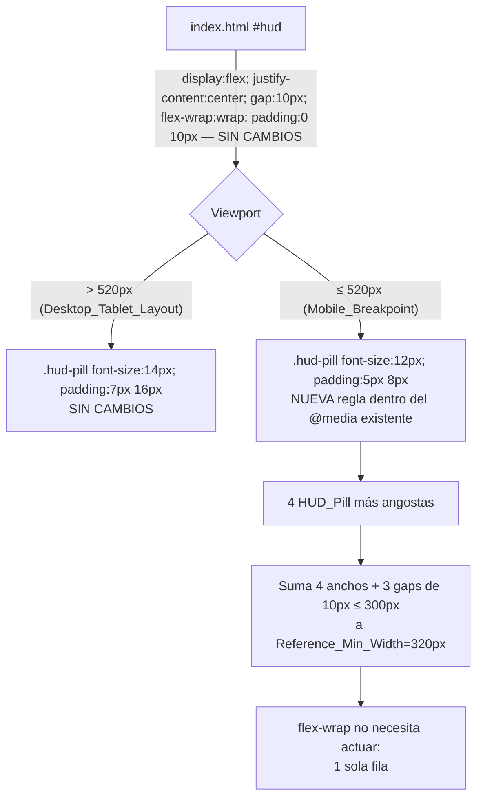

# Design Document

## Overview

Esta funcionalidad corrige el `flex-wrap` impredecible del HUD (`#hud`) en Mobile_Breakpoint (viewport ≤520px). `#hud` ya usa `display:flex; justify-content:center; gap:10px; flex-wrap:wrap; padding:0 10px;` y contiene exactamente 4 HUD_Pill (mejor puntuación, piso, puerta y el botón de ajustes `#settingsBtn`), todas con la clase `.hud-pill` y sus valores actuales `padding:7px 16px; font-size:14px;`. En viewports angostos dentro de Mobile_Breakpoint (320–375px), la suma de anchos de las 4 HUD_Pill más los 3 `gap:10px` supera el ancho disponible del HUD, y `flex-wrap:wrap` envía una o más HUD_Pill a una segunda fila de forma errática según el ancho exacto del dispositivo.

A diferencia de `combat-cards-mobile-layout` (donde el número de Cards varía y se diseñó una agrupación deliberada en 2 filas), aquí el número de HUD_Pill es siempre 4 (fijo). El problema no es de conteo variable sino de tamaño: el objetivo es que las 4 HUD_Pill sigan cabiendo en **una sola fila** en Mobile_Breakpoint, reduciendo `font-size` y `padding` de `.hud-pill` dentro del breakpoint móvil ya existente. `flex-wrap:wrap` se mantiene sin cambios como salvaguarda ante anchos aún más angostos que Reference_Min_Width, pero no se diseña ninguna agrupación en filas fijas (no aplica aquí).

Esta es, igual que en la spec hermana, una solución **puramente CSS**: una sola regla nueva para `.hud-pill` dentro de `@media (max-width:520px)` en `index.html`. No se modifica `#hud`, no se modifica el DOM, no se modifica ningún archivo `.js`.

## Architecture



No hay cambios de arquitectura de módulos ni de DOM: `#hud` y sus 4 hijos (`.hud-pill` × 3 + `#settingsBtn`) permanecen exactamente como están hoy en `index.html`. El único artefacto modificado es la hoja de estilos embebida: una nueva regla `.hud-pill` dentro del bloque `@media (max-width:520px)` que ya existe (el mismo bloque donde vive el fix de `.card` de `combat-cards-mobile-layout`).

### Por qué reducir tamaño y no reestructurar el layout

Se evaluaron dos enfoques:

1. **Reestructurar el HUD** (por ejemplo, apilar verticalmente los HUD_Value_Span dentro de cada pill, o dividir el HUD en dos filas fijas de 2 pills cada una): resolvería el desborde, pero requeriría cambiar el marcado HTML o introducir reglas de agrupación nuevas, y contradice la premisa de la introducción del requirements ("no se requiere reordenar ni agrupar en filas fijas").
2. **Reducir `font-size`/`padding` de `.hud-pill`** (enfoque elegido): no toca `#hud`, no toca el DOM, no introduce agrupación. Es el cambio de menor superficie, análogo en espíritu al de `combat-cards-mobile-layout` (reducir el "peso" visual de cada elemento hijo dentro del breakpoint móvil existente para que quepan mejor), y cumple textualmente R1.1, R1.4, R3.1, R3.2.

Se elige el enfoque de reducción de tamaño porque resuelve el requerimiento con una sola regla CSS, sin riesgo de romper la interactividad de `#settingsBtn` (que no se toca en absoluto) ni los IDs de los HUD_Value_Span.

### Justificación aritmética de los valores elegidos

**Valores elegidos:** `font-size:12px` (≥11px, cumple R2.1) y `padding:5px 8px` (>0px en ambos ejes, cumple R2.3), dentro de `@media (max-width:520px)`.

**Ancho disponible en Reference_Min_Width (320px):**

```
Ancho disponible del HUD = 320px (viewport) − 2 × 10px (padding:0 10px de #hud) = 300px
Espacio ocupado por gaps = 3 × 10px (gap:10px entre 4 pills) = 30px
Espacio disponible para el contenido + padding de las 4 pills = 300px − 30px = 270px
```

**Estimación conservadora de contenido de texto** (Cinzel, serif, `font-weight:700`, más ancho que una sans-serif; se usa el mismo criterio conservador que en `combat-cards-mobile-layout` para el ancho de las Cards). Se asume un ancho medio por carácter de `0.55em` para letras, `0.6em` para dígitos (los dígitos en Cinzel son ligeramente más angostos que las letras) y `1.2em` para cada emoji, con `1em = font-size`. Se toma el texto más largo esperable por pill:

| HUD_Pill | Contenido más largo esperable | Cálculo (em) | Ancho @ 12px |
|---|---|---|---|
| Mejor puntuación | `🏆 999999` (emoji + espacio + 6 dígitos) | 1.2 + 0.3 + 6×0.6 = 4.9em | 4.9 × 12 = 58.8px |
| Piso | `Piso 999` (4 letras + espacio + 3 dígitos) | 4×0.55 + 0.3 + 3×0.6 = 4.3em | 4.3 × 12 = 51.6px |
| Puerta | `Puerta en 5` (8 letras + 2 espacios + 1 dígito) | 8×0.55 + 2×0.3 + 1×0.6 = 5.8em | 5.8 × 12 = 69.6px |
| Settings (`⚙️`) | Solo el emoji | 1.2em | 1.2 × 12 = 14.4px |

Se suma el padding horizontal (`8px` × 2 lados = `16px`) a cada pill:

```
Mejor puntuación: 58.8 + 16 = 74.8px
Piso:             51.6 + 16 = 67.6px
Puerta:           69.6 + 16 = 85.6px
Settings:         14.4 + 16 = 30.4px
-------------------------------------
Suma de 4 pills:            258.4px
```

**Comparación con el ancho disponible:** `258.4px ≤ 270px` (holgura de ~11.6px, ~4% del ancho disponible de 270px), y sumando los gaps: `258.4px + 30px (gaps) = 288.4px ≤ 300px` (holgura de ~11.6px sobre el ancho total disponible del HUD). Esto confirma R1.2 en Reference_Min_Width con margen conservador, sin necesitar reducir aún más el `font-size` (que ya está en el mínimo permitido superior a 11px, dejando 12px como valor legible) ni el `padding` (que se mantiene perceptible, evitando padding≈0 que perjudicaría la legibilidad/target táctil de `#settingsBtn`).

Para anchos entre 320px y 520px (R1.3), el ancho disponible crece linealmente mientras el ancho del contenido de las pills permanece fijo (no depende del viewport), por lo que la holgura solo aumenta; si cabe a 320px, cabe a cualquier ancho mayor dentro de Mobile_Breakpoint. Esto es el mismo razonamiento monótono usado para justificar los anchos de Card en `combat-cards-mobile-layout`.

## Components and Interfaces

### `index.html` — hoja de estilos embebida (único artefacto modificado)

Dentro del bloque `@media (max-width:520px)` que ya existe (el mismo donde vive la regla `.card` de `combat-cards-mobile-layout`), se añade:

```css
@media (max-width:520px){
  /* ...reglas existentes de .card, .combatant-hp, etc. sin cambios... */
  .hud-pill{
    font-size: 12px;
    padding: 5px 8px;
  }
}
```

Notas de diseño:

- No se modifica ninguna propiedad de `#hud` (`display:flex; justify-content:center; gap:10px; pointer-events:none; z-index:25; flex-wrap:wrap; padding:0 10px;` permanecen idénticas dentro y fuera de Mobile_Breakpoint), cumpliendo R1.4 y R3.2 de forma trivial.
- La regla `.hud-pill{background:...; border:...; font-family:var(--font-display); font-weight:700; letter-spacing:.03em; color:var(--gold);}` fuera de `@media` no cambia; solo se sobrescriben `font-size` y `padding` dentro del breakpoint, dejando intactos `color` (`var(--gold)`) y `.hud-pill span{color:var(--ink);}` (cumple R2.2).
- Fuera de `@media (max-width:520px)` (Desktop_Tablet_Layout), `.hud-pill` conserva `padding:7px 16px; font-size:14px;` sin ningún cambio (cumple R3.1).
- No se introduce ninguna regla nueva para `#settingsBtn` como selector distinto: al compartir la clase `.hud-pill`, el botón recibe automáticamente el mismo `font-size`/`padding` reducido que las demás pills, sin necesidad de un selector adicional. El atributo `style="pointer-events:auto; cursor:pointer;"` inline del botón no se toca (cumple R4.4).
- No se usa `!important`, no se introduce ninguna media query nueva, y no se modifica el orden de las reglas existentes dentro del bloque `@media (max-width:520px)`.

### `#settingsBtn` — sin cambios funcionales

`#settingsBtn` sigue siendo un elemento `<button id="settingsBtn" class="hud-pill facet-cut-sm" aria-label="Configuración de audio" style="pointer-events:auto; cursor:pointer;">⚙️</button>`. No se modifica su tag, sus atributos, ni sus clases. Confirmado por búsqueda en `src/`: el listener de clic se adjunta en `bindAudioSettingsHandlers` (`src/ui/screens.js`) mediante `document.getElementById('settingsBtn').addEventListener('click', ...)`, que **no depende de ningún valor de `font-size` ni `padding`** — la referencia es por `id`, no por dimensiones o estilo computado. Reducir el tamaño visual de la pill no afecta el área de hit del `<button>` (que sigue siendo el `<button>` completo, redimensionado junto con su contenido) ni el registro del evento `click`. Esto satisface R4.2 y R4.4 sin ningún cambio en `src/ui/screens.js` ni en `src/main.js`.

### HUD_Value_Span (`#bestScoreValue`, `#floorNum`, `#doorIn`) — sin cambios funcionales

Estos `<span>` conservan sus IDs y su contenido se sigue actualizando por el mismo código de renderizado del HUD (fuera del alcance de este cambio, que es exclusivamente CSS). Reducir `font-size`/`padding` de la `.hud-pill` contenedora no trunca ni oculta el contenido de los `<span>`: el texto sigue siendo el nodo de texto completo dentro del `<span>`, solo se renderiza más pequeño. Esto satisface R4.1 y R4.3.

## Data Models

No se introducen ni modifican modelos de datos. El valor de puntuación (`#bestScoreValue`), piso (`#floorNum`) y conteo de puerta (`#doorIn`) siguen siendo actualizados por el código existente (fuera de alcance); este cambio no afecta cómo ni cuándo se actualizan esos valores, solo su presentación visual en Mobile_Breakpoint.

## Error Handling

No se introduce lógica nueva susceptible de error (no hay parsing, I/O, ni ramas condicionales nuevas en JavaScript; este es un cambio CSS puro). Casos de robustez a considerar:

- **Viewport exactamente en 520px**: el media query `(max-width:520px)` es inclusivo, consistente con el Glossary de requirements.md y con el comportamiento ya existente del breakpoint (sin cambios en el punto de corte, mismo criterio ya usado en `combat-cards-mobile-layout`).
- **Contenido de HUD_Value_Span más largo que lo estimado** (por ejemplo, una puntuación de 7+ dígitos no contemplada en la estimación conservadora): `flex-wrap:wrap` en `#hud` permanece activo sin cambios (R1.4) precisamente como salvaguarda; si un valor excepcionalmente largo excede el ancho disponible, el HUD degrada a 2 filas en lugar de desbordar horizontalmente o truncar contenido, preservando R4.3 (no se oculta ni trunca ningún valor).
- **Viewport más angosto que Reference_Min_Width (por ejemplo, 280px)**: no está cubierto por los Acceptance Criteria (que definen 320px como el mínimo de referencia); el mismo `flex-wrap:wrap` de salvaguarda aplica. No se diseña mitigación adicional para anchos por debajo de 320px, siguiendo el alcance definido en requirements.md.

## Testing Strategy

**Evaluación de aplicabilidad de PBT:** igual que en `combat-cards-mobile-layout`, esta funcionalidad no introduce ninguna función pura ni lógica de transformación de datos en JavaScript — es un cambio exclusivamente declarativo en la hoja de estilos CSS embebida en `index.html` (una nueva regla `.hud-pill` dentro de un `@media` existente). No hay entrada/salida computable sobre la que formular una propiedad universal ("para todo X, P(X) se cumple") relativa a código propio: el "comportamiento" a verificar es la disposición visual resultante de reglas CSS, que jsdom (el entorno de test del proyecto) no calcula (no hay motor de layout real; `getBoundingClientRect()` devuelve ceros salvo que se mockee explícitamente). Por lo tanto, **se omite la sección de Correctness Properties y no se usa property-based testing (fast-check) para esta funcionalidad**, siguiendo el mismo criterio de "cambio CSS puro" ya aplicado en la spec hermana. Se usan en su lugar tests unitarios/DOM basados en jsdom (mismo patrón que `screens.cardLayout.test.js`/`screens.modal.open.test.js`) más verificación estática de la regla CSS.

### Unit / DOM tests (jsdom, patrón `screens.*.test.js`)

1. **`#settingsBtn` sigue siendo interactivo tras el cambio de estilo (R4.2, R4.4)**: construir el DOM del HUD (patrón `buildDom` de `screens.audioSettings.test.js`), llamar a `bindAudioSettingsHandlers`, simular `click` en `#settingsBtn` y afirmar que el callback `onToggleSettings` se invoca — confirma que el listener sigue registrado por `id` independientemente del `font-size`/`padding` de `.hud-pill` (jsdom no aplica el CSS del media query, pero el test demuestra que el binding no depende de ningún valor de estilo).
2. **IDs y contenido de HUD_Value_Span intactos (R4.1, R4.3)**: construir el HUD con `#bestScoreValue`, `#floorNum`, `#doorIn` con valores concretos (incluyendo un caso de puntuación de varios dígitos, ej. `123456`) y afirmar que `document.getElementById(...).textContent` conserva el valor exacto sin truncar, y que los tres IDs siguen presentes — cubre que el marcado no cambia sus IDs (este test no depende del breakpoint porque jsdom no aplica `@media`, pero valida que ninguna transformación de contenido ocurre a nivel DOM).

### Verificación estática de la regla CSS (ejemplo, no PBT)

3. **Regla `.hud-pill` reducida presente dentro del breakpoint móvil (R1.1, R2.1, R2.3)**: test unitario que lee el contenido de `index.html` con `readFileSync` (mismo patrón que `src/audio/sfx.test.js`/`src/main.test.js`) y afirma mediante una expresión regular que, dentro del bloque `@media (max-width:520px){...}`, existe una regla `.hud-pill` con `font-size` cuyo valor numérico es `>= 11` y `<= 14` (estrictamente menor que el valor fuera del breakpoint) y con `padding` cuyos componentes vertical y horizontal son ambos `> 0`.
4. **Regla de Desktop_Tablet_Layout intacta (R3.1)**: mismo mecanismo, afirmando que la regla `.hud-pill{...padding:7px 16px; ...font-size:14px;...}` fuera de cualquier `@media` no cambió.
5. **`#hud` sin cambios (R1.4, R3.2)**: mismo mecanismo, afirmando que el bloque `#hud{...}` fuera de `@media` sigue conteniendo literalmente `display:flex`, `justify-content:center`, `gap:10px`, `pointer-events:none`, `flex-wrap:wrap` y `padding:0 10px`, y que ninguna de esas propiedades es sobrescrita dentro de `@media (max-width:520px)`.
6. **`#settingsBtn` conserva `<button>` y `pointer-events:auto` (R4.4)**: mismo mecanismo (o una aserción DOM directa sobre `index.html` parseado), afirmando que `#settingsBtn` sigue siendo un `<button>` con el atributo `style` conteniendo `pointer-events:auto`.

Estos son ejemplos concretos (no propiedades universales) porque `index.html` es un artefacto único y estático, no un espacio de entradas a explorar.

### Fuera de alcance de los tests automatizados (QA manual)

- La verificación visual real de que las 4 HUD_Pill quedan en una sola fila sin desbordar en dispositivos reales (R1.2, R1.3) requiere renderizado real de layout (motor de navegador), que jsdom no provee. Se recomienda una verificación manual/QA en al menos tres anchos de viewport: 320px, 375px y 520px, confirmando visualmente que las 4 pills ocupan una sola fila y que el texto de cada HUD_Value_Span (incluyendo puntuaciones de varios dígitos) permanece legible y sin truncar, antes de cerrar la tarea de implementación.
