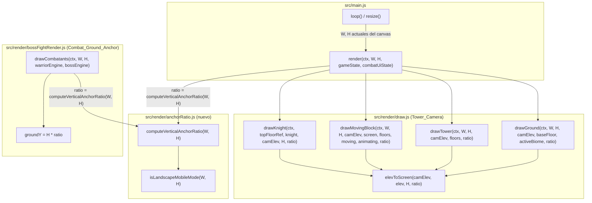

# Design Document

## Overview

Esta feature introduce un `Vertical_Anchor_Ratio` variable (`0.62` por defecto, `0.75` en `Landscape_Mobile_Mode`) que sustituye al literal `0.62` hoy hardcodeado independientemente en dos lugares: `elevToScreen` (`src/render/draw.js`, usado por `Tower_Camera`) y `COMBAT_LAYOUT.groundYRatio` (`src/render/bossFightRender.js`, usado por `drawCombatants`).

La solución añade una única función pura y compartida, `computeVerticalAnchorRatio(W, H)`, en un nuevo módulo pequeño (`src/render/anchorRatio.js`) importado tanto por `draw.js` como por `bossFightRender.js`. Esta función centraliza la detección de `Landscape_Mobile_Mode` y la resolución del ratio, garantizando por construcción el Requirement 3.3 (Tower_Camera y Combat_Ground_Anchor comparten siempre el mismo ratio para el mismo `W`/`H`) sin duplicar la lógica de umbral en dos archivos.

**Decisión de diseño clave — mínima disrupción de firmas:** en lugar de cambiar la firma de `elevToScreen(camElev, elev, H)` para aceptar `W` (lo que rompería los 3 call-sites de `draw.test.js` que invocan `elevToScreen(camElev, elev, H)` con 3 argumentos, y forzaría pasar `W` a `drawKnight`, que hoy no lo recibe), el ratio se resuelve **una vez por frame**, en el punto de entrada de cada subsistema (`render()` para `Tower_Camera`, `drawCombatants()` para `Combat_Ground_Anchor`), y se pasa como **cuarto parámetro opcional** a `elevToScreen`. Esto sigue el mismo patrón ya usado por `combat-sprite-scaling`, que evitó tocar `spriteEngine.js` calculando el factor de escala una sola vez en `drawCombatants()` y propagándolo hacia abajo.

Concretamente:

- `elevToScreen(camElev, elev, H, ratio = DEFAULT_VERTICAL_ANCHOR_RATIO)` gana un **cuarto parámetro opcional con valor por defecto `0.62`**. Las 3 llamadas existentes en `draw.test.js` (`elevToScreen(camElev, elev, H)`, 3 argumentos) siguen funcionando sin modificación alguna, porque el default reproduce exactamente el comportamiento actual.
- `drawGround`, `drawTower`, `drawMovingBlock`, `drawKnight` ganan cada uno un nuevo parámetro `verticalAnchorRatio` (con el mismo default `0.62`, por robustez si se llaman sueltos en tests), que reenvían a `elevToScreen`. `render()` calcula el ratio una sola vez (`computeVerticalAnchorRatio(W, H)`) y lo pasa a las cuatro funciones.
- `drawCombatants(ctx, W, H, warriorEngine, bossEngine)` mantiene su firma actual (no necesita parámetro nuevo, porque ya recibe `W` y `H`): internamente sustituye `H * COMBAT_LAYOUT.groundYRatio` por `H * computeVerticalAnchorRatio(W, H)`.
- `createTowerState`/`resetGame` (`src/engine/tower.js`) **no se modifican**: `anchorScreenY` se confirmó como código de solo-escritura (`grep` de `.anchorScreenY` en todo `src/` solo encuentra las dos asignaciones en `tower.js`, ninguna lectura), por lo que no participa en ningún pipeline de render y no requiere el mismo tratamiento. Esto satisface directamente el Requirement 4.1 sin ningún cambio de código.

## Architecture



`computeVerticalAnchorRatio` es la única fuente de verdad para el umbral y los dos valores de ratio; ni `draw.js` ni `bossFightRender.js` duplican la comparación `W > H && H <= 520`.

## Components and Interfaces

### `src/render/anchorRatio.js` (nuevo módulo)

```js
export const DEFAULT_VERTICAL_ANCHOR_RATIO = 0.62;
export const LANDSCAPE_VERTICAL_ANCHOR_RATIO = 0.75;
export const LANDSCAPE_HEIGHT_THRESHOLD = 520;

/**
 * Landscape_Mobile_Mode: activo cuando W > H (orientación landscape) y
 * H <= LANDSCAPE_HEIGHT_THRESHOLD (viewport lo bastante bajo como para
 * considerarse móvil en vez de tablet/escritorio).
 * Función pura, sin efectos secundarios.
 */
export function isLandscapeMobileMode(W, H) {
  return W > H && H <= LANDSCAPE_HEIGHT_THRESHOLD;
}

/**
 * Vertical_Anchor_Ratio a usar para el frame actual, dado el ancho/alto
 * actuales del canvas. Única fuente de verdad compartida por Tower_Camera
 * (elevToScreen, vía render()) y Combat_Ground_Anchor (drawCombatants()).
 * Función pura, determinista.
 */
export function computeVerticalAnchorRatio(W, H) {
  return isLandscapeMobileMode(W, H)
    ? LANDSCAPE_VERTICAL_ANCHOR_RATIO
    : DEFAULT_VERTICAL_ANCHOR_RATIO;
}
```

### `src/render/draw.js` (modificado)

```js
import { DEFAULT_VERTICAL_ANCHOR_RATIO, computeVerticalAnchorRatio } from './anchorRatio.js';

export function elevToScreen(camElev, elev, H, ratio = DEFAULT_VERTICAL_ANCHOR_RATIO) {
  return H * ratio - (elev - camElev);
}

export function drawGround(ctx, W, H, camElev, baseFloor, activeBiome, ratio = DEFAULT_VERTICAL_ANCHOR_RATIO) {
  if (!baseFloor) return;
  const groundY = elevToScreen(camElev, baseFloor.bottom, H, ratio);
  // ...resto sin cambios
}

export function drawTower(ctx, W, H, camElev, floors, ratio = DEFAULT_VERTICAL_ANCHOR_RATIO) {
  floors.forEach((f, i) => {
    const yTop = elevToScreen(camElev, f.top, H, ratio);
    const yBot = elevToScreen(camElev, f.bottom, H, ratio);
    // ...resto sin cambios
  });
}

export function drawMovingBlock(ctx, W, H, camElev, screen, floors, moving, knightAnimating, ratio = DEFAULT_VERTICAL_ANCHOR_RATIO) {
  // ...
  const yTop = elevToScreen(camElev, tf.top + m.height, H, ratio);
  // ...
}

export function drawKnight(ctx, topFloorRef, knight, camElev, H, ratio = DEFAULT_VERTICAL_ANCHOR_RATIO) {
  // ...
  feetY = elevToScreen(camElev, knight.elev, H, ratio); // (y en la rama `falling`)
}

export function render(ctx, W, H, gameState, combatUiState) {
  const ratio = computeVerticalAnchorRatio(W, H);
  drawSky(ctx, W, H, gameState.clouds, gameState.activeBiome, gameState.activeTimeOfDay);
  drawGround(ctx, W, H, gameState.camElev, gameState.floors[0], gameState.activeBiome, ratio);
  drawTower(ctx, W, H, gameState.camElev, gameState.floors, ratio);
  drawMovingBlock(ctx, W, H, gameState.camElev, gameState.screen, gameState.floors, gameState.moving, gameState.knight.animating, ratio);
  if (gameState.screen === 'build' || gameState.screen === 'falling') {
    const topFloorRef = gameState.floors[gameState.floors.length - 1];
    drawKnight(ctx, topFloorRef, gameState.knight, gameState.camElev, H, ratio);
  }
  if (gameState.screen === 'boss' && combatUiState) {
    bossFightRender.updateCombatants(gameState.lastDt || 0, combatUiState.warriorEngine, combatUiState.bossEngine);
    bossFightRender.drawBattleBackground(ctx, W, H, combatUiState.backgroundImage);
    bossFightRender.drawCombatants(ctx, W, H, combatUiState.warriorEngine, combatUiState.bossEngine);
  }
}
```

Todos los parámetros nuevos son opcionales con default `DEFAULT_VERTICAL_ANCHOR_RATIO`, por lo que **ninguna llamada existente en `draw.test.js` requiere modificación** (Requirement 4, no-regresión de tests actuales).

### `src/render/bossFightRender.js` (modificado)

```js
import { computeVerticalAnchorRatio } from './anchorRatio.js';

// COMBAT_LAYOUT.groundYRatio se elimina; groundY ya no lee una constante fija.
export const COMBAT_LAYOUT = {
  warriorXRatio: 0.24,
  bossXRatio: 0.76,
};

export function drawCombatants(ctx, W, H, warriorEngine, bossEngine) {
  const factor = computeSpriteScaleFactor(W); // sin cambios (Requirement 5.2)
  const groundY = H * computeVerticalAnchorRatio(W, H);
  // ...resto sin cambios (scaleDimensions, computeDrawOrigin, etc.)
}
```

`computeSpriteScaleFactor(W)` no se modifica y sigue dependiendo únicamente de `W` (Requirement 5.2): el ratio vertical y el factor de escala de sprites son ejes ortogonales que conviven sin interferir.

> **Nota sobre `COMBAT_LAYOUT.groundYRatio`:** el Requirement 4.2 pide que este valor "se mantenga sin cambios" cuando `Landscape_Mobile_Mode` no está activo. Como `groundY` ahora se deriva de `computeVerticalAnchorRatio(W, H)` (que devuelve exactamente `0.62` fuera de landscape móvil, idéntico al valor que tenía la constante), el comportamiento observable es idéntico bit a bit; se elimina la constante `groundYRatio` porque queda redundante con `DEFAULT_VERTICAL_ANCHOR_RATIO`, evitando dos fuentes de verdad para el mismo valor. Si se prefiriera preservar la constante por compatibilidad de API pública de `COMBAT_LAYOUT`, es una alternativa de bajo riesgo, pero no aporta valor porque ningún otro módulo importa `COMBAT_LAYOUT.groundYRatio` fuera de `bossFightRender.js` (confirmado por búsqueda en el repo).

### `src/engine/tower.js`

Sin cambios (Requirement 4.1). `anchorScreenY` permanece `height * 0.62` en `createTowerState`/`resetGame`, sin leerse en ningún pipeline de render (confirmado: no hay ninguna referencia de lectura a `.anchorScreenY` en `src/`).

## Data Models

No se introducen entidades de datos persistentes. Los "modelos" son formas de datos en memoria usados como parámetros/retornos de las funciones puras nuevas:

```ts
// Retorno / parámetro implícito de computeVerticalAnchorRatio
type VerticalAnchorRatio = 0.62 | 0.75; // en la práctica, solo estos dos valores posibles

// Entradas de isLandscapeMobileMode / computeVerticalAnchorRatio
type CanvasDimensions = { W: number; H: number }; // W > 0, H > 0
```

`Vertical_Anchor_Ratio` no se almacena en `gameState` ni en ningún estado persistente: se recalcula en cada llamada a `render()`/`drawCombatants()` a partir de las dimensiones actuales del canvas, garantizando el Requirement 1.4 (recálculo automático tras `resize`) sin necesidad de un listener de `orientationchange` adicional ni de cachear el valor.

## Correctness Properties

*A property is a characteristic or behavior that should hold true across all valid executions of a system-essentially, a formal statement about what the system should do. Properties serve as the bridge between human-readable specifications and machine-verifiable correctness guarantees.*

### Property 1: Detección correcta de Landscape_Mobile_Mode en el cuadrante landscape móvil

*For all* `W > 0` and `H > 0` such that `W > H` and `H <= 520`, `isLandscapeMobileMode(W, H)` SHALL return `true`.

**Validates: Requirements 1.1**

### Property 2: Landscape_Mobile_Mode desactivado cuando W <= H, para cualquier H

*For all* `W > 0` and `H > 0` such that `W <= H`, `isLandscapeMobileMode(W, H)` SHALL return `false`, regardless of the value of `H`.

**Validates: Requirements 1.2**

### Property 3: Landscape_Mobile_Mode desactivado en landscape con suficiente alto (tablet/escritorio)

*For all* `W > 0` and `H > 0` such that `W > H` and `H > 520`, `isLandscapeMobileMode(W, H)` SHALL return `false`.

**Validates: Requirements 1.3**

### Property 4: El ratio resuelto es exactamente 0.75 en Landscape_Mobile_Mode

*For all* `W > 0` and `H > 0` such that `isLandscapeMobileMode(W, H)` is `true`, `computeVerticalAnchorRatio(W, H)` SHALL equal exactly `0.75`.

**Validates: Requirements 2.1, 3.1**

### Property 5: El ratio resuelto es exactamente 0.62 fuera de Landscape_Mobile_Mode (no-regresión)

*For all* `W > 0` and `H > 0` such that `isLandscapeMobileMode(W, H)` is `false`, `computeVerticalAnchorRatio(W, H)` SHALL equal exactly `0.62`.

**Validates: Requirements 2.3, 3.2**

### Property 6: Camera_Anchor y Combat_Ground_Anchor siempre comparten el mismo ratio

*For all* `W > 0` and `H > 0`, the ratio used to compute Camera_Anchor (via `computeVerticalAnchorRatio(W, H)` as consumed by `render()`) SHALL be identical to the ratio used to compute Combat_Ground_Anchor (via the same `computeVerticalAnchorRatio(W, H)` as consumed by `drawCombatants()`), since both call the same shared pure function with the same `W`/`H`.

**Validates: Requirements 3.3**

### Property 7: elevToScreen preserva las distancias relativas de elevación, para cualquier ratio

*For all* `camElev`, `elev1`, `elev2`, `H > 0`, and any valid ratio (`0.62` or `0.75`), `elevToScreen(camElev, elev1, H, ratio) - elevToScreen(camElev, elev2, H, ratio)` SHALL equal `elev2 - elev1`. This guarantees that `drawTower`, `drawMovingBlock`, `drawKnight` and `drawGround` remain mutually aligned regardless of which ratio is currently active, since they all resolve the ratio once per frame and pass the same value.

**Validates: Requirements 2.2**

### Property 8: El cambio de ratio nunca altera los tamaños fijos en píxeles dibujados

*For all* pairs `(W, H1)` and `(W, H2)` producing different `Vertical_Anchor_Ratio` values (one in `Landscape_Mobile_Mode`, one not), the fixed pixel dimensions used by `drawFacetedBlock` (floor height) and `drawKnight` (knight body/head/sword geometry) SHALL remain byte-for-byte identical; only the computed Y origin (via `elevToScreen`) changes.

**Validates: Requirements 5.1**

### Property 9: Sprite_Scale_Factor es independiente de H y de Landscape_Mobile_Mode

*For all* `W > 0` and *for all* pairs `H1, H2 > 0` (regardless of whether either induces `Landscape_Mobile_Mode`), `computeSpriteScaleFactor(W)` SHALL return the exact same value, since it depends only on `W`.

**Validates: Requirements 5.2**

### Property Reflection

Antes de fijar la lista anterior se revisaron los siguientes solapamientos:

- **2.1 y 3.1** no generaron propiedades separadas: ambos Acceptance Criteria piden lo mismo ("el ratio en modo landscape móvil es 0.75") aplicado a dos subsistemas distintos que ya comparten la misma función pura (`computeVerticalAnchorRatio`). Se consolidaron en la **Property 4**, que prueba el valor de la función una sola vez; junto con la Property 6 (mismo ratio en ambos subsistemas), queda cubierto que tanto Camera_Anchor como Combat_Ground_Anchor usan 0.75.
- **2.3 y 3.2** se consolidaron análogamente en la **Property 5** (no-regresión a 0.62), por la misma razón.
- **1.4** (recálculo tras `resize`) no generó una propiedad de PBT: es una garantía estructural de que el ratio se recalcula en cada `render()`/`drawCombatants()` a partir de `W`/`H` actuales en vez de cachearse, no una propiedad cuantificable sobre un espacio de entradas variable con generadores. Se cubre con un test unitario/estructural (ver Testing Strategy).
- **4.1 y 4.2** (no-regresión de `anchorScreenY` y de la constante `groundYRatio`) no son propiedades universales: son aserciones puntuales sobre valores de código fuente que no cambian. Se cubren con tests unitarios de regresión, no con PBT.
- **6.1 y 6.2** (el HUD no debe quedar cubierto) se excluyeron de PBT: dependen del layout real del DOM (`getBoundingClientRect` del elemento `#hud`), que no es una función pura testeable con generadores aislados. Se recomienda verificación visual manual / smoke test en viewports representativos (ver Testing Strategy).

Cada propiedad restante aporta una validación única: detección correcta del cuadrante de `Landscape_Mobile_Mode` en las tres regiones del espacio W/H (Properties 1-3), resolución exacta del ratio en ambos modos (Properties 4-5), consistencia entre subsistemas (Property 6), invariante de alineación relativa de `elevToScreen` (Property 7), y no-interferencia con los ejes ortogonales ya validados por specs previas — tamaños fijos en píxeles y `Sprite_Scale_Factor` (Properties 8-9).

## Error Handling

- `isLandscapeMobileMode(W, H)` / `computeVerticalAnchorRatio(W, H)`: funciones puras sin I/O. `W <= 0` o `H <= 0` (no debería ocurrir en producción, ya que el canvas siempre reporta dimensiones positivas vía `canvas.clientWidth`/`clientHeight`) se evalúan con la misma comparación aritmética sin lanzar excepción; el resultado para esos casos degenerados no está especificado por los requirements (fuera de alcance), pero la función nunca lanza, preservando el patrón de "no-op seguro" ya usado en `drawBattleBackground` y `computeSpriteScaleFactor`.
- `elevToScreen(camElev, elev, H, ratio)`: si se omite `ratio`, usa `DEFAULT_VERTICAL_ANCHOR_RATIO` (0.62), preservando el comportamiento de las 3 llamadas existentes en `draw.test.js` sin modificarlas. Un `ratio` inválido (`NaN`, `undefined` explícito) se propaga aritméticamente como `NaN` en el resultado, igual que cualquier otro `NaN` de entrada hoy — no se añade validación especial, siguiendo el precedente de `scaleDimensions`/`scaleOffset` en `combat-sprite-scaling`.
- `drawCombatants`: conserva el contrato actual de no lanzar; sustituir `COMBAT_LAYOUT.groundYRatio` por `computeVerticalAnchorRatio(W, H)` no introduce nuevas ramas de fallo porque ambas expresiones son aritmética simple sobre números ya validados como `W > 0`/`H > 0` en la práctica.

## Testing Strategy

**Enfoque dual:**

- **Property tests (fast-check, convención ya establecida en el repo — ver `combat-sprite-scaling`, `draw.test.js`, `bossFightRender.test.js`)**: implementan las 9 Correctness Properties listadas arriba, una por test, con mínimo 100 ejecuciones (`fc.assert(fc.property(...), { numRuns: 100 })`). Cada test se etiqueta:
  `// Feature: landscape-orientation-support, Property N: <texto de la propiedad>`
  - Generadores relevantes: `fc.integer({min:1, max:3000})` para `W`/`H` (cubriendo con holgura el umbral `520`), `fc.constantFrom(0.62, 0.75)` para `ratio` en la Property 7, y `fc.integer({min:1, max:520})`/`fc.integer({min:521, max:3000})` para acotar explícitamente los sub-rangos de `H` en las Properties 1 y 3 cuando se necesite forzar el cuadrante exacto.
- **Unit tests (vitest)** para ejemplos concretos, casos límite y no-regresión:
  - Caso límite exacto del umbral: `isLandscapeMobileMode(800, 520)` → `true` (borde inclusive, `<=`); `isLandscapeMobileMode(800, 521)` → `false`.
  - Caso límite de igualdad `W === H`: `isLandscapeMobileMode(400, 400)` → `false` (Requirement 1.2, `W <= H`).
  - No-regresión de `anchorScreenY`: `createTowerState(W, H).anchorScreenY === H * 0.62` y lo mismo tras `resetGame`, para cualquier `H` de ejemplo, confirmando el Requirement 4.1 sin necesidad de PBT.
  - No-regresión de escritorio/portrait: `render()`/`drawCombatants()` con `W=800, H=600` (portrait/desktop típico) producen exactamente las mismas coordenadas Y que antes de esta feature (`ratio === 0.62`).
  - Ejemplo de landscape móvil concreto: `W=667, H=375` (viewport típico de un teléfono rotado) produce `ratio === 0.75` tanto en `render()` como en `drawCombatants()`.
  - Regresión de `draw.test.js`: las llamadas existentes a `elevToScreen(camElev, elev, H)` (3 argumentos, sin `ratio`) deben seguir pasando sin modificación, verificando el comportamiento del parámetro por default.
- **Smoke test manual (fuera de PBT)** para los Requirements 6.1/6.2 (no superposición con el HUD): verificación visual en un viewport landscape móvil de ejemplo (por ejemplo 667×375 en DevTools), confirmando que el piso superior/caballero (`screen==='build'`) y los Combat_Sprite (`screen==='boss'`) quedan por debajo del área ocupada por `#hud`. No se automatiza como test unitario porque depende de `getBoundingClientRect` en un DOM real renderizado, fuera del alcance práctico de esta suite basada en mocks de `CanvasRenderingContext2D`.

**Por qué PBT aplica aquí:** `isLandscapeMobileMode` y `computeVerticalAnchorRatio` son funciones puras de clasificación/decisión sobre un espacio de entrada bidimensional grande (`W`, `H`), con propiedades universales claras por región del dominio (Properties 1-3), más una invariante aritmética de `elevToScreen` (Property 7) que ya sigue el patrón de PBT existente en `draw.test.js` para esa misma función. Esto encaja en el patrón de "funciones puras con propiedades universales sobre un espacio de entrada grande" para el que PBT es apropiado, y reutiliza literalmente el estilo de `combat-sprite-scaling` (mismo repo, misma convención `fast-check`, mismo formato de etiquetado de tests).

**Mocking:** los tests sobre `render()`/`drawCombatants()` reutilizan el mismo `createMockCtx()` (stub de `CanvasRenderingContext2D` con métodos `vi.fn()`) ya definido en `draw.test.js` y `bossFightRender.test.js`, sin necesidad de un DOM real ni de imágenes de sprite cargadas.
