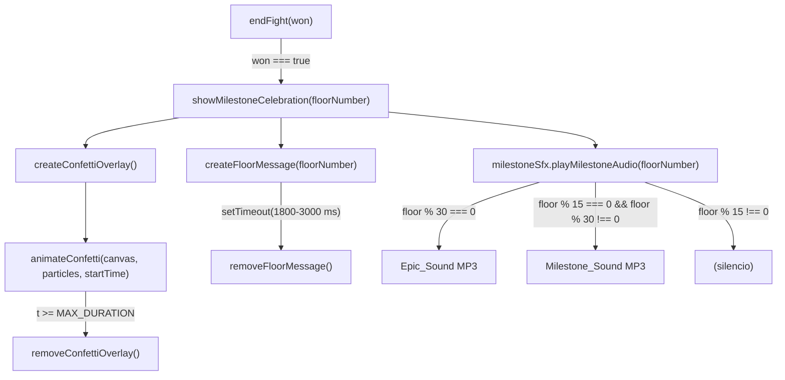

# Design Document: Milestone Celebration Feedback

## Overview

El sistema de celebración de hitos (`Celebration_System`) añade feedback visual y sonoro cuando el jugador vence a un guardián en "Torre de las Nubes". Se activa exclusivamente desde `endFight(true)` en `src/main.js` y orquesta tres elementos en paralelo:

1. **Confetti_Overlay** — lluvia de partículas animadas en canvas superpuesto.
2. **Floor_Message** — texto grande "PISO N" centrado en pantalla.
3. **Milestone_Sound_Player** — reproducción selectiva de MP3 según el piso alcanzado.

El diseño sigue los patrones ya establecidos en el proyecto:
- El `Milestone_Sound_Player` sigue el mismo patrón de precarga `new Audio()` + `PRELOADED` map de `src/audio/sfx.js`.
- El módulo se crea como `src/audio/milestoneSfx.js`, paralelo a `combatSfx.js`.
- El código visual de celebración se añade en `src/ui/celebration.js` y se llama desde `main.js`.
- Todo es vanilla JS ES6+, sin dependencias externas.

---

## Architecture



### Principio de no bloqueo

La función `showMilestoneCelebration` es **síncrona** desde la perspectiva del llamador: inicia los tres efectos y retorna inmediatamente. El bucle `requestAnimationFrame` continúa sin interrupción. Los `setTimeout` para la limpieza DOM son independientes del loop de juego.

### Z-index stack

| Elemento | z-index |
|---|---|
| canvas#gameCanvas | 0 |
| #hud | 5 |
| Confetti_Overlay canvas | 15 |
| Floor_Message div | 25 |
| #bossScreen | 100 |
| #gameOverScreen | 200 |
| #questionModalOverlay | 300 |

---

## Components and Interfaces

### `src/audio/milestoneSfx.js` — Milestone_Sound_Player

Módulo de audio independiente, paralelo a `combatSfx.js`. Exporta un objeto `milestoneSfx`.

```js
// Interfaz pública
export const milestoneSfx = {
  init(),                          // precarga y lee preferencias de audio
  playMilestoneAudio(floorNumber), // selecciona y reproduce el sonido correcto
};
```

**Selección de sonido:**
- `floorNumber % 30 === 0` → reproduce `epic_ congratulations_30.mp3`
- `floorNumber % 15 === 0 && floorNumber % 30 !== 0` → reproduce `every_10_floors.mp3`
- En cualquier otro caso → silencio (no-op)

**Integración con el sistema de audio:**
- Lee el volumen efectivo del módulo `music.js` a través de un callback inyectado (`getVolumeContext`), o por defecto usa volumen neutro (1.0).
- En `main.js`, durante la inicialización: `milestoneSfx.init(() => ({ volume: music.getEffectiveVolumePercent() / 100, muted: music.isMuted() }))`.
- Errores de carga/reproducción → `console.error` + degradación silenciosa (nunca propaga excepción).

### `src/ui/celebration.js` — Celebration_System visual

```js
// Interfaz pública
export function showMilestoneCelebration(floorNumber) {}
```

Internamente orquesta:

```js
// Funciones privadas
function createConfettiOverlay()              // crea <canvas> superpuesto
function generateParticles(screenWidth)       // genera array de Particle
function animateConfetti(canvas, particles)   // loop RAF hasta MAX_DURATION
function removeConfettiOverlay()              // elimina del DOM
function createFloorMessage(floorNumber)      // crea <div> con "PISO N"
function removeFloorMessage()                 // elimina del DOM
function prefersReducedMotion()               // lee matchMedia
```

### Integración en `src/main.js`

```js
import { showMilestoneCelebration } from './ui/celebration.js';
import { milestoneSfx } from './audio/milestoneSfx.js';

// En la inicialización:
milestoneSfx.init(() => ({ volume: music.getEffectiveVolumePercent() / 100, muted: music.isMuted() }));

// En endFight():
function endFight(won) {
  ui.hideBossScreen();
  fight = null;
  combatUiState = null;
  if (won) {
    const floorNumber = gameState.floors.length - 1;
    showMilestoneCelebration(floorNumber);   // ← nuevo, no bloqueante
    milestoneSfx.playMilestoneAudio(floorNumber); // ← nuevo, no bloqueante
    gameState.doorsPassed += 1;
    gameState.screen = 'build';
    gameState.pendingBossLevel = 0;
    music.enterBuildScreen();
  } else {
    // ... resto igual
  }
}
```

---

## Data Models

### Particle (objeto de partícula de confeti)

```js
/**
 * @typedef {Object} Particle
 * @property {number} x         - Posición horizontal en píxeles [0, screenWidth]
 * @property {number} y         - Posición vertical inicial (negativo, fuera del viewport)
 * @property {number} speed     - Velocidad de caída en px/frame [2, 6]
 * @property {number} rotation  - Ángulo de rotación actual en radianes
 * @property {number} rotSpeed  - Velocidad de rotación en rad/frame, puede ser negativo
 * @property {number} width     - Ancho de la partícula en píxeles [6, 14]
 * @property {number} height    - Alto de la partícula en píxeles [8, 18]
 * @property {string} color     - Color hex de AWS_PALETTE
 */
```

**Constantes:**
```js
const CONFETTI_COLORS = ['#ff9f2e','#d9b34d','#3fa1a1','#59c27a','#e2493a','#f3ecd8','#6b4226'];
const PARTICLE_COUNT_MIN = 80;
const PARTICLE_COUNT_MAX = 150;
const SPEED_MIN = 2;
const SPEED_MAX = 6;
const CONFETTI_DURATION_MS = 3500;   // entre los límites 2000-4000
const FLOOR_MSG_DURATION_MS = 2400;  // entre los límites 1800-3000
```

### Estado de audio del Milestone_Sound_Player

```js
// Estado interno (no exportado)
let epicAudio   = null;      // HTMLAudioElement | null
let milestoneAudio = null;   // HTMLAudioElement | null
let getVolCtx   = null;      // () => { volume: number, muted: boolean }
```

---

## Correctness Properties

*Una propiedad es una característica o comportamiento que debe ser cierto a través de todas las ejecuciones válidas del sistema — esencialmente, una declaración formal sobre lo que el sistema debe hacer. Las propiedades sirven de puente entre las especificaciones legibles por humanos y las garantías de corrección verificables por máquinas.*

### Property 1: Particle count within bounds

*Para cualquier* ancho de pantalla positivo `w`, la función `generateParticles(w)` debe devolver un array con un número de partículas en el rango `[PARTICLE_COUNT_MIN, PARTICLE_COUNT_MAX]` (es decir, entre 80 y 150 inclusive).

**Valida: Requisito 1.2**

---

### Property 2: Particle speed and color invariants

*Para cualquier* llamada a `generateParticles(w)`, cada partícula del array resultante debe tener:
- `speed` en `[2, 6]` (px/frame)
- `color` perteneciente al conjunto `CONFETTI_COLORS`
- `x` en `[0, w]`

**Valida: Requisitos 1.3, 1.4**

---

### Property 3: Floor message text encoding

*Para cualquier* número entero positivo `N`, la función que construye el Floor_Message debe producir un elemento cuyo `textContent` sea exactamente `"PISO N"`.

**Valida: Requisito 2.1**

---

### Property 4: Sound selection — multiples of 30

*Para cualquier* entero positivo `n` que sea múltiplo de 30 (`n % 30 === 0`), la función de selección de sonido `selectMilestoneSound(n)` debe retornar `'epic'` y nunca `'milestone'`.

**Valida: Requisitos 3.1, 3.3, 4.3**

---

### Property 5: Sound selection — multiples of 15 (not 30)

*Para cualquier* entero positivo `n` donde `n % 15 === 0` y `n % 30 !== 0`, la función `selectMilestoneSound(n)` debe retornar `'milestone'`.

**Valida: Requisito 4.1**

---

### Property 6: Sound selection — non-multiples of 15

*Para cualquier* entero positivo `n` donde `n % 15 !== 0`, la función `selectMilestoneSound(n)` debe retornar `'none'`.

**Valida: Requisito 5.3**

---

### Property 7: Volume application

*Para cualquier* valor de volumen `v` en `[0, 100]` y cualquier estado de silencio booleano `m`, el volumen efectivo aplicado al `HTMLAudioElement` debe ser `m ? 0 : v / 100`.

**Valida: Requisitos 3.5, 4.5, 6.5**

---

## Error Handling

### Errores de audio

Todos los errores de audio siguen el patrón de `sfx.js` y `combatSfx.js`:

```
Error en new Audio()      → try/catch, console.error, audio = null
Error en audio.load()     → addEventListener('error', ...) → console.error
Error en audio.play()     → playPromise.catch() → console.error
```

Ningún error de audio propaga una excepción al llamador. La celebración visual continúa independientemente del estado del audio.

### Errores de DOM (confeti)

El canvas del confeti se crea dentro de un bloque `try/catch`. Si falla la creación del canvas 2D (ej. límite de contextos del navegador), la función retorna sin mostrar confeti pero el Floor_Message y el audio continúan.

### `prefers-reduced-motion`

```js
function prefersReducedMotion() {
  try {
    return window.matchMedia('(prefers-reduced-motion: reduce)').matches;
  } catch {
    return false; // entornos sin matchMedia (jsdom): no bloquear
  }
}
```

Cuando `prefers-reduced-motion: reduce` está activo:
- **No** se crea el Confetti_Overlay (Requisito 1.6).
- El Floor_Message **sí** se muestra (no es animación cinética).
- El audio **sí** se reproduce (no es afectado por reduced motion).

---

## Testing Strategy

### Evaluación de PBT

Esta feature combina lógica pura (generación de partículas, selección de sonido, cálculo de volumen) con operaciones DOM y audio. La capa pura es idónea para property-based testing; las capas DOM y audio se verifican con tests de ejemplo.

Se utiliza **fast-check** (ya disponible en el proyecto o a instalar como dev dependency) para las propiedades universales.

### Tests unitarios (ejemplo-based)

Objetivo: cubrir comportamientos específicos y casos de borde que no encajan en propiedades universales.

| Caso | Verificación |
|---|---|
| `showMilestoneCelebration` con `prefers-reduced-motion` activo | No se crea el canvas de confeti |
| Floor_Message tiene z-index > Confetti_Overlay z-index | Inspección inline-style de ambos elementos |
| Floor_Message tiene z-index < `#bossScreen` (100) | Inspección numérica |
| Floor_Message usa `var(--font-display)` y `font-size >= 48px` | Inspección inline-style |
| `endFight(false)` no llama a `showMilestoneCelebration` | Spy/mock en la función |
| Audio falla → `console.error` llamado, sin excepción propagada | Mock `Audio` que rechaza `.play()` |
| Después de `CONFETTI_DURATION_MS`, el canvas no está en el DOM | `setTimeout` fake con `vi.useFakeTimers()` |
| `milestoneSfx.init()` precarga ambos archivos de audio | `PRELOADED` tiene entrada para ambos nombres de archivo |

### Tests de propiedades (property-based con fast-check)

Cada test usa mínimo 100 iteraciones. Etiqueta de referencia: `// Feature: milestone-celebration-feedback, Property N: <texto>`

```js
// Property 1: Particle count within bounds
// Feature: milestone-celebration-feedback, Property 1: Particle count within bounds
fc.assert(fc.property(
  fc.integer({ min: 100, max: 4000 }), // ancho de pantalla en píxeles
  (w) => {
    const particles = generateParticles(w);
    return particles.length >= 80 && particles.length <= 150;
  }
), { numRuns: 100 });
```

```js
// Property 2: Particle speed and color invariants
// Feature: milestone-celebration-feedback, Property 2: Particle speed and color invariants
fc.assert(fc.property(
  fc.integer({ min: 100, max: 4000 }),
  (w) => {
    const particles = generateParticles(w);
    return particles.every(p =>
      p.speed >= 2 && p.speed <= 6 &&
      CONFETTI_COLORS.includes(p.color) &&
      p.x >= 0 && p.x <= w
    );
  }
), { numRuns: 100 });
```

```js
// Property 3: Floor message text encoding
// Feature: milestone-celebration-feedback, Property 3: Floor message text encoding
fc.assert(fc.property(
  fc.integer({ min: 1, max: 9999 }),
  (n) => {
    const el = buildFloorMessageElement(n);
    return el.textContent === `PISO ${n}`;
  }
), { numRuns: 100 });
```

```js
// Property 4: Sound selection — multiples of 30
// Feature: milestone-celebration-feedback, Property 4: Sound selection multiples of 30
fc.assert(fc.property(
  fc.integer({ min: 1, max: 333 }).map(n => n * 30),
  (n) => selectMilestoneSound(n) === 'epic'
), { numRuns: 100 });
```

```js
// Property 5: Sound selection — multiples of 15, not 30
// Feature: milestone-celebration-feedback, Property 5: Sound selection multiples of 15 not 30
fc.assert(fc.property(
  fc.integer({ min: 1, max: 666 }).map(n => n * 15).filter(n => n % 30 !== 0),
  (n) => selectMilestoneSound(n) === 'milestone'
), { numRuns: 100 });
```

```js
// Property 6: Sound selection — non-multiples of 15
// Feature: milestone-celebration-feedback, Property 6: Sound selection non-multiples of 15
fc.assert(fc.property(
  fc.integer({ min: 1, max: 9998 }).filter(n => n % 15 !== 0),
  (n) => selectMilestoneSound(n) === 'none'
), { numRuns: 100 });
```

```js
// Property 7: Volume application
// Feature: milestone-celebration-feedback, Property 7: Volume application
fc.assert(fc.property(
  fc.integer({ min: 0, max: 100 }),
  fc.boolean(),
  (volumePercent, muted) => {
    const expected = muted ? 0 : volumePercent / 100;
    const actual = computeEffectiveVolume(volumePercent, muted);
    return Math.abs(actual - expected) < 0.0001;
  }
), { numRuns: 100 });
```

### Flujo de verificación

```
generateParticles()     → jest/vitest unit + fast-check properties 1, 2
buildFloorMessageElement() → fast-check property 3
selectMilestoneSound()  → fast-check properties 4, 5, 6
computeEffectiveVolume() → fast-check property 7
showMilestoneCelebration() → unit tests de integración DOM (mocked timers)
milestoneSfx (audio)    → unit tests con Audio mockeado
endFight() integration  → unit test con spies
```

Las funciones puras (`generateParticles`, `buildFloorMessageElement`, `selectMilestoneSound`, `computeEffectiveVolume`) se exportan de sus módulos para ser testeables directamente sin dependencia del DOM real.
