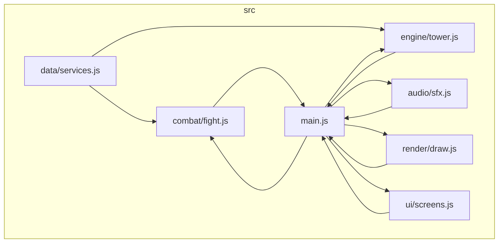

# Design Document

## Overview

Esta migración convierte `torre-de-las-nubes.html` (HTML+CSS+JS inline, IIFE) en una aplicación con el mismo HTML/CSS pero con el JavaScript dividido en módulos ES organizados bajo `src/`, servidos y empaquetados con Vite. No se introduce ningún framework, TypeScript, ni gestión de estado formal (Redux, stores reactivos, etc.): el objeto de estado mutable `state` (y el estado de combate `fight`) se mantienen conceptualmente iguales, pero pasan a vivir en `Engine_Module` y `Combat_Module` respectivamente, exportados explícitamente e importados donde se necesiten.

El resultado observable (DOM, CSS, canvas, audio, textos, dificultad, aleatoriedad) debe ser indistinguible del monolito. Esto es una restricción de diseño dura: cada función que se mueve de la IIFE a un módulo se traslada **literalmente**, cambiando solo:
- su ubicación (de qué archivo forma parte),
- cómo obtiene sus dependencias (parámetros/imports en vez de closures compartidas del IIFE),
- nunca su cuerpo, sus fórmulas numéricas, ni el orden de sus efectos secundarios.

## Research

**Vite como Build_Tool** (ya decidido con el usuario en la introducción de requirements.md). Puntos relevantes confirmados:
- Vite se declara exclusivamente en `devDependencies`; el output de `vite build` es HTML/JS/CSS estático sin runtime de Node necesario para servirlo ([vite.dev](https://vite.dev/guide/)).
- Vite soporta ES modules nativos en desarrollo (sin bundlear) y Rollup para el build de producción, por lo que el código fuente puede escribirse como ES modules estándar (`import`/`export`) sin sintaxis específica de Vite.
- Elegimos **Vite 5.4.x** (última patch estable de la línea 5, ej. `5.4.21` en npm) en vez de la línea 7/8 más reciente: la línea 5 solo requiere Node.js **18.x o superior**, mientras que Vite 7+ exige Node **20.19+/22.12+** ([vite.dev migration guide](https://vite.dev/guide/migration), [stackoverflow report on Vite 7 Node requirement](https://stackoverflow.com/questions/79756341)). Dado que Requirement 6.3 exige documentar una versión mínima de Node razonable y el proyecto no tiene restricciones que obliguen a la última versión, Vite 5.4.x minimiza la barrera de entrada para colaboradores con toolchains algo más antiguas, sin sacrificar ninguna característica que este proyecto (sin TypeScript, sin JSX, sin SSR) necesite.
- No se requiere ningún plugin de Vite (no hay React/Vue/TS): la configuración por defecto de Vite ya sirve `index.html` como entrada y resuelve imports ES relativos.

**Compatibilidad de navegador** (Requirement 7): las APIs usadas por el monolito (Canvas 2D, Web Audio API, CSS `clip-path`, ES modules nativos) ya están ampliamente disponibles ("Widely available") en MDN para las últimas versiones de Chrome/Firefox/Edge/Safari, tanto desktop como Chrome Android/Safari iOS. Vite no introduce ninguna API de navegador nueva: solo cambia cómo se sirven/empaquetan los archivos.

## Architecture



Reglas de dependencia (sin ciclos, según Requirement 3.9):
- `data/` no importa nada de `src/` (solo usa `Math`, JS estándar). Es la base del grafo.
- `audio/` no importa nada de `src/` (Requirement 3.7). Es una hoja independiente.
- `engine/` importa de `data/` (para saber cuántos servicios existen al dimensionar puertas, aunque en la práctica el motor solo necesita `DOOR_INTERVAL`; ver Data Models). No importa de `combat/`, `render/`, `ui/`, ni `audio/`.
- `combat/` importa de `data/` (`AWS_SERVICES`, `BOSS_NAMES`, `shuffle`, `pickQuestion`). No importa de `engine/`, `render/`, `ui/`, ni `audio/`.
- `render/` no importa de `engine/`, `combat/`, `ui/` ni `audio/`: recibe el estado que necesita dibujar como argumentos desde `main.js` (evita acoplar el dibujado a la forma interna del estado de motor/combate, y evita ciclos).
- `ui/` no importa de `engine/`, `combat/`, `render/` ni `audio/`: recibe callbacks y datos ya calculados desde `main.js`.
- `main.js` es el único módulo que importa de **todos** los demás. Nadie importa de `main.js`. Esto garantiza ausencia de ciclos: el grafo de imports es un DAG con `main.js` como único sumidero final que a su vez alimenta el bucle de `requestAnimationFrame`.

Esta estructura sigue exactamente la sugerida en `structure.md`:

```
src/
├── data/
│   └── services.js
├── engine/
│   └── tower.js
├── combat/
│   └── fight.js
├── render/
│   └── draw.js
├── ui/
│   └── screens.js
├── audio/
│   └── sfx.js
└── main.js
```

`index.html` pasa a tener `<script type="module" src="/src/main.js"></script>` en vez del `<script>` inline con IIFE. El HTML del `<body>` y el `<style>` del `<head>` se copian literalmente (Requirement 2.1, 2.2).

## Components and Interfaces

### `src/data/services.js` (Data_Module)

Responsabilidad exclusiva (Requirement 3.2): datos estáticos y funciones puras de selección, sin DOM/canvas/Web Audio.

```js
/* ===== DATA: servicios AWS y banco de preguntas ===== */
export const AWS_SERVICES = [ ... ];   // igual que el monolito
export const QUESTIONS = { ... };      // igual que el monolito
export const BOSS_NAMES = [ ... ];     // igual que el monolito

export function shuffle(arr) { ... }              // idéntica al monolito
export function pickQuestion(serviceId, avoidText) { ... } // idéntica al monolito
```

`shuffle` y `pickQuestion` siguen usando `Math.random()` internamente, igual que el monolito (Requirement 1.1 exige "semilla de aleatoriedad equivalente", no un PRNG inyectado en producción; la inyectabilidad para tests se resuelve en la Testing Strategy sin cambiar el comportamiento de producción, ver más abajo).

### `src/audio/sfx.js` (Audio_Module)

Responsabilidad exclusiva (Requirement 3.7): síntesis de audio, sin dependencias de otros módulos de `src/`.

```js
/* ===== AUDIO: síntesis de efectos con Web Audio API ===== */
let actx = null;
function beep(freq, dur, type, gain) { ... } // idéntica al monolito, no exportada (detalle interno)

export const sfx = {
  place: () => beep(220, 0.08, 'square', 0.05),
  fall: () => beep(110, 0.5, 'sawtooth', 0.07),
  correct: () => { ... },
  wrong: () => beep(140, 0.28, 'sawtooth', 0.08),
  win: () => { ... },
  lose: () => { ... },
  door: () => { ... },
};
```

### `src/engine/tower.js` (Engine_Module)

Responsabilidad exclusiva (Requirement 3.3): estado y física de la torre, sin manipular DOM ni canvas.

Se separa deliberadamente la parte **pura** (testeable con PBT) de la parte que **muta** el objeto `state` compartido, para que Requirement 1.2 (paridad de cálculo) se pueda verificar con funciones puras sin necesitar mocks de `performance.now()`/DOM:

```js
/* ===== ENGINE: estado y física de la torre ===== */
export const DOOR_INTERVAL = 5;
export const BASE_WIDTH = 210;
export const MIN_WIDTH = 46;

export function createTowerState(width, height) { ... } // equivalente a construir `state` + makeBaseFloor + resetGame, parametrizado por W/H en vez de globals

// --- funciones puras extraídas para PBT (Requirement 1.2) ---
export function computeOverlap(prevFloor, movingBlock) { ... }         // right-left, misma fórmula
export function computeNewFloor(prevFloor, movingBlock, isDoor, seed) { ... } // {bottom, top, x, width, height, isDoor, seed}
export function decidesFall(overlap) { return overlap < 16; }

// --- mutadores de estado equivalentes a los del monolito ---
export function topFloor(state) { ... }
export function newMovingBlock(state, afterFloor) { ... }
export function resetGame(state, width, height) { ... }
export function updateDoorCounter(state) { return { placed, remain }; } // valores puros; UI_Module los pinta
export function dropBlock(state) { ... } // retorna un descriptor {type:'placed'|'fell', ...} en vez de tocar el DOM directamente
export function triggerFall(state, now) { ... }
export function easeOutQuad(t) { return 1-(1-t)*(1-t); }
export function update(state, dt, now) { ... } // idéntico a update() del monolito, sin la parte de canvas
```

`dropBlock(state)` deja de llamar directamente a `document.getElementById(...)` o `sfx.place()`: en su lugar retorna un **descriptor de resultado** (`{ type: 'placed', floor, isDoor, willTriggerBoss, floorNum, doorIn }` o `{ type: 'fell' }`), y es `main.js` quien, al recibir ese descriptor, invoca `sfx.place()`/`sfx.door()` y `UI_Module.updateHud(...)`. Esto preserva el orden de efectos observado en el monolito (colocar piso → sonido → HUD → animación del caballero) sin que `Engine_Module` conozca el DOM ni el audio, cumpliendo Requirement 3.3 y 3.9 a la vez.

### `src/combat/fight.js` (Combat_Module)

Responsabilidad exclusiva (Requirement 3.4): estado y resolución del combate, sin DOM ni canvas.

```js
/* ===== COMBAT: duelo contra el guardián ===== */
export function startBossFight(level) { ... } // retorna el objeto `fight` (igual forma que el monolito) + bossLabel `${BOSS_NAMES[...]} — Nivel ${level}`
export function answerCard(fight, idx, chosenIdx) { ... } // muta fight.playerPips/bossPips/locked, retorna descriptor {correct, resolved, outcome:'win'|'lose'|null}
export function refreshCardQuestion(fight, idx) { ... } // equivalente al bloque `pickQuestion` diferido en el setTimeout de answerCard del monolito
```

Igual que `Engine_Module`, `Combat_Module` retorna descriptores de resultado (`outcome`, `correct`, pips actualizados) en vez de tocar `document.*` o `sfx.*` directamente; `main.js` decide qué pinta `UI_Module` y qué sonido dispara `Audio_Module` a partir de esos descriptores, preservando el mismo orden temporal de efectos que el monolito (actualizar pips → sonido de acierto/fallo → banner si se resuelve → sonido de victoria/derrota).

### `src/render/draw.js` (Render_Module)

Responsabilidad exclusiva (Requirement 3.5): dibujo en canvas, sin DOM de overlays/HUD.

Todas las funciones de dibujo del monolito se trasladan **literalmente**, recibiendo `ctx`, dimensiones y el estado a dibujar como parámetros explícitos en vez de leer variables cerradas (`ctx`, `W`, `H`, `state` del IIFE):

```js
/* ===== RENDER: dibujo del mundo de juego en canvas ===== */
export function elevToScreen(camElev, elev, H) { ... }
export function drawSky(ctx, W, H, clouds) { ... }
export function drawCloud(ctx, cx, cy, r) { ... }
export function seededRand(seed) { ... }
export function drawFacetedBlock(ctx, x, yTop, w, h, seed, palette, isDoor) { ... }
export function drawTorch(ctx, tx, ty, seed) { ... }
export function drawTower(ctx, W, H, camElev, floors) { ... }
export function drawMovingBlock(ctx, W, H, camElev, screen, floors, moving, knightAnimating) { ... }
export function drawKnight(ctx, topFloorRef, knight, camElev, H) { ... }
export function render(ctx, W, H, gameState) { ... } // orquesta drawSky→drawTower→drawMovingBlock→drawKnight, mismo z-order que el monolito
```

Ninguna fórmula de posición/color cambia: se copian los mismos gradientes, ángulos, offsets y condiciones de `performance.now()` que usaba el monolito.

### `src/ui/screens.js` (UI_Module)

Responsabilidad exclusiva (Requirement 3.6): DOM de overlays/HUD, sin física de torre ni resolución de combate.

```js
/* ===== UI: overlays y HUD del DOM ===== */
export function updateHud(floorNum, doorIn) { ... }
export function showStartScreen() / hideStartScreen()
export function showGameOverScreen(title, detail) / hideGameOverScreen()
export function showBossScreen(bossLabel, cardCount) / hideBossScreen()
export function renderPips(elId, current, total) { ... }
export function renderCards(cards, onCardClick) { ... }       // recibe callback, no importa Combat_Module
export function renderCardBack(cardEl, card, onAnswer) { ... }
export function showBanner(text, kind) { ... }
export function bindInputHandlers({ onDrop, onStart, onRetry }) { ... } // listeners de pointerdown/keydown/click, delegando la acción real a callbacks de main.js
```

`UI_Module` nunca decide *si* una respuesta es correcta ni *cuándo* cae el caballero: solo pinta lo que se le indica y notifica eventos de usuario vía callbacks, que `main.js` conecta a `Engine_Module`/`Combat_Module`.

### `src/main.js` (Main_Module)

Responsabilidad exclusiva (Requirement 3.8): inicializar canvas, hacer wiring, ejecutar el bucle principal. No contiene lógica de física, combate, dibujo ni DOM propios.

```js
/* ===== MAIN: inicialización y bucle principal ===== */
import { AWS_SERVICES, QUESTIONS, BOSS_NAMES, shuffle, pickQuestion } from './data/services.js';
import { sfx } from './audio/sfx.js';
import * as engine from './engine/tower.js';
import * as combat from './combat/fight.js';
import * as render from './render/draw.js';
import * as ui from './ui/screens.js';

const canvas = document.getElementById('gameCanvas');
const ctx = canvas.getContext('2d');
let W = 0, H = 0;
let gameState = null;
let fight = null;

function resize() { ... }              // igual fórmula que el monolito
function onDrop() { ... }               // llama engine.dropBlock, interpreta el descriptor, dispara sfx/ui/combate según corresponda
function onCardClick(idx) { ... }       // delega a ui.renderCardBack + combat.pickQuestion vía data
function onAnswer(idx, chosenIdx) { ... } // llama combat.answerCard, interpreta outcome, dispara sfx/ui, y en 'win'/'lose' resuelve el fin del combate igual que endFight() del monolito
function loop(ts) { ... }               // idéntico a loop() del monolito: dt, engine.update, render.render, requestAnimationFrame

resize();
ui.bindInputHandlers({ onDrop, onStart: () => { ... }, onRetry: () => { ... } });
window.addEventListener('resize', resize);
requestAnimationFrame(loop);
```

Este wiring reproduce exactamente la secuencia de llamadas del monolito (`dropBlock` → `sfx.place()`/`sfx.door()` → actualizar HUD → animar caballero → si corresponde, `startBossFight()`), solo que repartida entre módulos que se comunican por valores de retorno y callbacks en vez de closures compartidas.

## Data Models

El modelo de datos no cambia de forma, solo de ubicación/propiedad:

- **Floor**: `{ bottom, top, x, width, height, isDoor, seed }` — igual que el monolito, vive dentro de `gameState.floors[]` en `main.js`, gestionado por `engine/tower.js`.
- **MovingBlock**: `{ x, y, width, height, dir, speed, minX, maxX }` — igual, vive en `gameState.moving`.
- **Knight**: `{ elev, animating, fromElev, toElev, animStart, animDur, falling, fallStart, fallDur, fallX }` — igual, vive en `gameState.knight`.
- **GameState** (antes `state` global del IIFE): `{ screen, floors, moving, camElev, camElevTarget, anchorScreenY, knight, doorsPassed, pendingBossLevel, lastTs, clouds, torchSeed }` — misma forma, pero ahora es un valor explícito creado por `engine.createTowerState(W, H)` y pasado como argumento entre `main.js`, `engine/`, y `render/`, en vez de una constante cerrada sobre el IIFE.
- **Fight** (antes `fight` del monolito): `{ cardCount, playerPips, bossPips, resolved, cards: [{ service, question, locked }] }` — misma forma, vive en `main.js` y se pasa a `combat/fight.js`.
- **Question**: `{ text, options: string[4], correct: number }` — igual, producido por `data/services.js#pickQuestion`.

No se introduce persistencia (localStorage, IndexedDB) ni serialización a JSON: todo el estado vive en memoria durante la sesión de juego, igual que el monolito. Por eso no aplica una propiedad de round-trip de serialización en este diseño.

## Correctness Properties

*A property is a characteristic or behavior that should hold true across all valid executions of a system-essentially, a formal statement about what the system should do. Properties serve as the bridge between human-readable specifications and machine-verifiable correctness guarantees.*

### Property 1: Colocación/caída de bloque preserva las fórmulas del monolito

Para cualquier piso previo (`prevFloor`) con posición/ancho arbitrarios y cualquier bloque en movimiento (`movingBlock`) con posición/ancho arbitrarios, `computeOverlap` SHALL devolver `min(movingBlock.x+movingBlock.width, prevFloor.x+prevFloor.width) - max(movingBlock.x, prevFloor.x)`, `decidesFall` SHALL devolver `true` si y solo si ese overlap es menor que 16, y cuando no cae, `computeNewFloor` SHALL producir un piso con `x = max(movingBlock.x, prevFloor.x)` y `width` igual al overlap calculado.

**Validates: Requirements 1.2**

### Property 2: Selección de preguntas preserva el banco y el índice correcto, respetando el reintento de `avoidText`

Para cualquier `serviceId` válido y cualquier `avoidText` (incluyendo cadenas que coinciden con alguna pregunta del banco de ese servicio y cadenas que no coinciden con ninguna), `pickQuestion` SHALL devolver una pregunta cuyo `text` pertenece al banco de `QUESTIONS[serviceId]`, cuyo conjunto de `options` (sin importar el orden) es igual al conjunto de las 4 opciones originales de esa pregunta, y cuyo `options[correct]` es igual a la opción que era correcta en la pregunta original antes de barajar; y cuando el banco de ese servicio tiene más de una pregunta, SHALL aplicar hasta 8 reintentos buscando una pregunta con `text` distinto de `avoidText`.

**Validates: Requirements 1.3, 1.10**

### Property 3: Configuración de combate depende solo del nivel, con el mismo clamping a 4

Para cualquier nivel entero mayor o igual a 1, `startBossFight(level)` SHALL producir `cardCount = min(level, 4)`, `playerPips = bossPips = cardCount`, y un nombre de guardián igual a `BOSS_NAMES[min(level, 4) - 1]`.

**Validates: Requirements 1.4**

### Property 4: Responder una carta reduce en uno los pips del bando correspondiente

Para cualquier estado de combate válido (pips de jugador y de guardián entre 0 y `cardCount`) y cualquier resultado de respuesta (correcta o incorrecta), `answerCard` SHALL reducir en exactamente uno los `bossPips` cuando la respuesta es correcta, o los `playerPips` cuando es incorrecta, dejando sin cambios los pips del otro bando, y SHALL aplicar un límite inferior de cero en ambos casos.

**Validates: Requirements 1.5, 1.6**

### Property 5: El combate se resuelve como victoria o derrota exactamente cuando el pip correspondiente llega a cero

Para cualquier estado de combate alcanzado tras una secuencia arbitraria de respuestas, SHALL cumplirse que: si `bossPips` llega a 0, el combate queda `resolved = true` con desenlace de victoria (`doorsPassed` se incrementa en 1 y la pantalla vuelve a `'build'`); si `playerPips` llega a 0, el combate queda `resolved = true` con desenlace de derrota (la pantalla pasa a `'falling'` con `knight.falling = true`); y si ninguno de los dos llegó a 0, el combate permanece sin resolver.

**Validates: Requirements 1.7, 1.8**

### Property 6: Fallar el encaje de un bloque siempre reporta el número de piso alcanzado en ese momento

Para cualquier cantidad de pisos ya construidos, cuando `dropBlock` decide una caída (overlap < 16), el descriptor resultante SHALL indicar el número de piso alcanzado igual a `floors.length - 1` en el momento de la caída, y SHALL dejar el estado con `knight.falling = true` y la pantalla en `'falling'`.

**Validates: Requirements 1.9**

### Property 7: El Render_Module produce la misma secuencia de operaciones de dibujo que las funciones equivalentes del monolito

Para cualquier estado de juego válido generado aleatoriamente (pisos, bloque en movimiento, caballero, nubes, elevación de cámara), al invocar `render(ctx, W, H, gameState)` del `Render_Module` con un contexto de canvas simulado (mock que registra cada llamada a métodos como `fillRect`, `arc`, `moveTo`, `lineTo`, `createLinearGradient`, etc. junto con sus argumentos), la secuencia de llamadas registradas SHALL ser igual a la secuencia que produce una copia de referencia congelada de las funciones de dibujo extraídas literalmente del Monolith_File, ejecutada con el mismo mock y el mismo estado de entrada.

**Validates: Requirements 2.3**

## Error Handling

- **Fuentes externas no disponibles** (Requirement 2.5): no requiere lógica JS; el fallback ya está declarado en la propia hoja de estilos (`--font-display: 'Cinzel', serif; --font-body: 'Space Grotesk', sans-serif;`), copiada literalmente. No hay manejo de errores en tiempo de ejecución que agregar.
- **Web Audio no disponible o bloqueado** (`AudioContext` lanza o no existe): `Audio_Module` conserva el mismo `try/catch` silencioso que el monolito dentro de `beep()`, de modo que un fallo de audio nunca interrumpe el juego. Esto ya cumple Requirement 1 (paridad de comportamiento) sin cambios.
- **Navegador sin Canvas 2D o sin Web Audio** (Requirement 7.5): a diferencia del monolito (que no lo maneja explícitamente), este es un caso *nuevo* introducido por el propio Requirement 7.5, no una regla de paridad. `main.js` verifica al arrancar si `canvas.getContext('2d')` devuelve `null` o si `window.AudioContext`/`window.webkitAudioContext` no existen ambos; si falta Canvas 2D, se muestra un mensaje visible de incompatibilidad en el DOM (reemplazando el overlay de inicio) en vez de continuar; Web Audio ausente no bloquea el juego (ya que `sfx` degrada silenciosamente), pero si tanto Canvas 2D como Web Audio faltan, se prioriza el mensaje de incompatibilidad de Canvas 2D por ser bloqueante para el propio render del juego.
- **Error de sintaxis o de resolución de módulos en build de producción** (Requirement 4.5): delegado enteramente a Vite/Rollup: un `import` roto o un error de sintaxis hace que `vite build` termine con código de salida distinto de cero y sin generar el directorio `dist/` completo. No se necesita código adicional del proyecto para esto; se verifica en la Testing Strategy con un caso de build deliberadamente roto.
- **Dependencias circulares entre módulos** (Requirement 3.9): se previenen por diseño (ver árbol de dependencias en Architecture) y se pueden detectar en CI con una herramienta de análisis de grafo de imports (por ejemplo `madge --circular src/main.js`); no es un caso de manejo de errores en tiempo de ejecución sino una restricción estática verificada antes del build.

## Testing Strategy

**PBT aplica a este diseño**: las Properties 1-7 cubren funciones puras (`engine/tower.js`, `data/services.js`, `combat/fight.js`) y una comparación determinista de trazas de dibujo (`render/draw.js`) contra una referencia congelada del monolito. Se usará **fast-check** (biblioteca de property-based testing para JavaScript) junto con el test runner del proyecto (se recomienda **Vitest**, ya que se integra nativamente con Vite y no añade dependencias de runtime — solo `devDependencies`).

**Configuración de property tests**:
- Cada property test se ejecuta con mínimo 100 iteraciones (`fc.assert(fc.property(...), { numRuns: 100 })` o superior).
- Cada test referencia su propiedad de diseño con el formato de tag: **Feature: modular-architecture-migration, Property {N}: {texto de la propiedad}**.
- Para las Properties 1-6, los generadores (`fc.record`, `fc.integer`, `fc.float`, `fc.constantFrom` sobre los `serviceId` reales de `AWS_SERVICES`) producen los pisos/bloques/estados de combate arbitrarios.
- Para la Property 2, se inyecta una función de aleatoriedad controlable solo en el arnés de test (por ejemplo, mockeando `Math.random` de forma determinista dentro del test con `fc.integer` como semilla), sin alterar la firma pública de `pickQuestion` que usa producción.
- Para la Property 7 (paridad de render), se mantiene una copia de las funciones de dibujo del monolito congeladas en un archivo de fixture de test (no en `src/`) como oráculo, y se compara su traza de llamadas al mock de `CanvasRenderingContext2D` contra la traza del nuevo `render/draw.js` para el mismo estado generado.

**Unit tests** (ejemplos y casos concretos, complementarios a las properties):
- `data/services.js`: caso concreto donde `avoidText` coincide con la única pregunta de un servicio (si existiera) para confirmar el comportamiento de cesión tras 8 intentos.
- `engine/tower.js`: `resetGame`/`createTowerState` produce el piso base con `BASE_WIDTH`/`MIN_WIDTH` esperados; `updateDoorCounter` para el caso límite `placed === 0`.
- `combat/fight.js`: secuencia completa de un combate de 1 carta (mínimo `cardCount`) hasta victoria y hasta derrota.
- `ui/screens.js`: `renderCards`/`renderPips` generan el número correcto de elementos DOM con las clases esperadas (test de ejemplo, no PBT, ya cubre Requirement 2.1 a nivel de fragmento dinámico).
- Test de ejemplo de "mensaje de incompatibilidad" (Requirement 7.5): mockear ausencia de `canvas.getContext('2d')` y verificar que se muestra el mensaje visible en vez de continuar.
- Diff textual entre el `<body>`/`<style>` de `index.html` nuevo y los bloques equivalentes de `torre-de-las-nubes.html` (Requirements 2.1, 2.2, 2.4) como test de ejemplo/snapshot, no PBT.

**Integration / smoke tests** (no PBT, según la clasificación de la prework):
- **Build smoke test**: ejecutar `npm run build` sobre el código migrado y verificar código de salida 0 y que `dist/` contiene `index.html` y assets JS/CSS.
- **Build failure smoke test**: introducir deliberadamente un import roto en una copia de prueba y verificar que `vite build` termina con código de salida distinto de cero y sin `dist/` completo (Requirement 4.5).
- **Arquitectura estática**: script/regla de lint (o `madge --circular`) que falla si hay imports circulares entre módulos de `src/`, y grep de convenciones de nombres (Requirement 5) y de ausencia de `.ts`/`tsconfig.json`/frameworks UI en `package.json` (Requirement 8).
- **Dev server smoke test**: iniciar `vite` (modo dev) y confirmar que responde HTTP 200 en la ruta raíz.
- **Cross-browser** (Requirement 7.3, 7.4): verificación manual (o matriz de CI con Playwright, fuera del alcance de esta migración) en las últimas versiones estables de Chrome/Firefox/Edge/Safari desktop y Chrome Android/Safari iOS, confirmando Behavior_Parity mediante los mismos unit/property tests corriendo en un entorno de navegador real (o smoke visual manual) al menos una vez por navegador soportado.

**Balance**: las properties (1-7) concentran la cobertura de "para todo input" en la lógica pura de motor/combate/datos/render; los unit tests se limitan a puntos de integración concretos (wiring de UI, casos límite de HUD, mensaje de incompatibilidad) y no intentan re-cubrir lo que ya prueban las properties.
