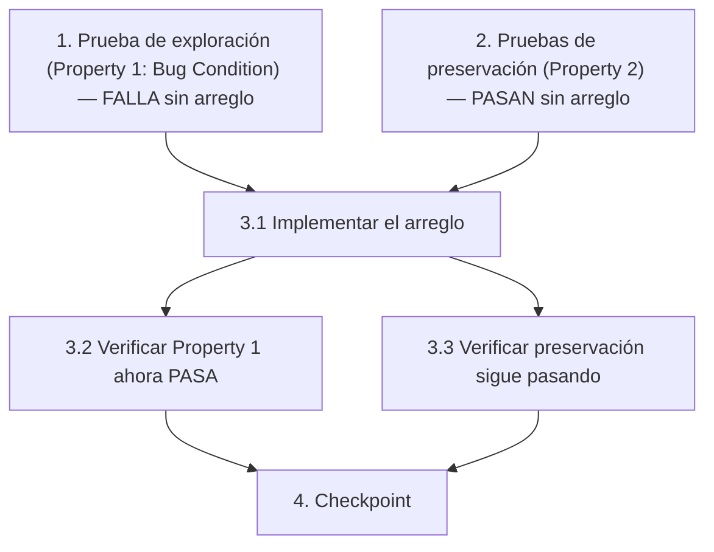

# Implementation Plan

## Overview

Plan de implementación del arreglo del sonido de ataque del guerrero al acertar una carta durante un duelo en `torre-de-las-nubes.html`. Sigue la metodología de condición del bug: primero se escribe una prueba de exploración que FALLA sobre el código sin arreglar (Property 1: Bug Condition), luego pruebas de preservación que PASAN sobre el código sin arreglar (Property 2: Preservation), después se aplica el arreglo y se verifican ambas propiedades.

## Tasks

- [x] 1. Escribir prueba de exploración de la condición del bug
  - **Property 1: Bug Condition** - El acierto reproduce el sonido de ataque del guerrero
  - **CRÍTICO**: Esta prueba DEBE FALLAR sobre el código sin arreglar — la falla confirma que el bug existe
  - **NO intentes arreglar la prueba ni el código cuando falle**
  - **NOTA**: Esta prueba codifica el comportamiento esperado — validará el arreglo cuando pase tras la implementación
  - **OBJETIVO**: Exponer contraejemplos que demuestren que el bug existe
  - **Enfoque PBT acotado**: Como el bug es determinista, acotar la propiedad a los casos concretos que fallan: acertar durante un duelo activo (`duringBossFight = true AND chosenIdx = correctIdx`) para cualquier carta/pregunta
  - Espiar/envolver `window.Audio` para detectar la instanciación de `new Audio('public/audio/guerrero/ataque/attack_sword.wav')` (detalle de la Bug Condition del diseño: `isBugCondition(input)` donde `input.duringBossFight = true AND input.chosenIdx = input.correctIdx AND NOT played("public/audio/guerrero/ataque/attack_sword.wav")`)
  - Las aserciones de la prueba deben coincidir con la Property 1 (Expected Behavior) del diseño: al acertar se reproduce `sfx.correct()` **y además** `attack_sword.wav`, incluyendo aciertos consecutivos
  - Ejecutar la prueba sobre el código SIN arreglar
  - **RESULTADO ESPERADO**: La prueba FALLA (correcto — prueba que el bug existe; nunca se instancia `new Audio('.../attack_sword.wav')` al acertar)
  - Documentar los contraejemplos encontrados para entender la causa raíz (p. ej. "al acertar durante el duelo solo se llama a `sfx.correct()`; `attack_sword.wav` nunca se reproduce")
  - Marcar la tarea como completa cuando la prueba esté escrita, ejecutada y la falla documentada
  - _Requirements: 2.1, 2.2_

- [x] 2. Escribir pruebas de preservación basadas en propiedades (ANTES de implementar el arreglo)
  - **Property 2: Preservation** - Comportamiento inalterado para entradas no-bug
  - **IMPORTANTE**: Seguir la metodología de observación primero
  - Observar el comportamiento sobre el código SIN arreglar para entradas que NO cumplen la condición del bug (`isBugCondition` retorna false):
    - Observar: al fallar (`chosenIdx !== correctIdx`) se resta un pip al jugador y suena `sfx.wrong()`, sin sonido de ataque del guerrero
    - Observar: al acertar se resta un pip al guardián, se actualizan las barras con `renderPips` y se resuelve el duelo (victoria/derrota/avance de carta) igual que antes
    - Observar: los demás eventos de sonido (`sfx.place`, `sfx.fall`, `sfx.win`, `sfx.lose`, `sfx.door`, `sfx.correct`) suenan sin cambios
    - Observar: cualquier interacción fuera de un duelo activo (`fight` inexistente o `fight.resolved`) no dispara el ataque del guerrero
  - Escribir pruebas basadas en propiedades que capturen estos patrones observados (de la sección Preservation Requirements del diseño): generar `AnswerEvent` aleatorios donde `NOT isBugCondition(X)` y verificar que `answerCard(X) = answerCard'(X)`
  - Las pruebas basadas en propiedades generan muchos casos para dar garantías más fuertes
  - Ejecutar las pruebas sobre el código SIN arreglar
  - **RESULTADO ESPERADO**: Las pruebas PASAN (confirma el comportamiento base a preservar)
  - Marcar la tarea como completa cuando las pruebas estén escritas, ejecutadas y pasando sobre el código sin arreglar
  - _Requirements: 3.1, 3.2, 3.3, 3.4_

- [x] 3. Arreglo para el sonido de ataque del guerrero al acertar durante un duelo

  - [x] 3.1 Implementar el arreglo
    - En la sección SFX de `torre-de-las-nubes.html`, añadir un helper `playSample(src, vol)` que cree una instancia `new Audio(src)`, ajuste `volume` y llame a `.play()`, envuelto en `try/catch` y con `.catch(()=>{})` sobre la promesa de `play()` (degradación elegante)
    - Registrar en el objeto `sfx` una entrada dedicada, p. ej. `guerreroAtaque: ()=>playSample('public/audio/guerrero/ataque/attack_sword.wav', 0.6)`, manteniendo el estilo de las demás entradas de `sfx`
    - En la rama de acierto de `answerCard(idx, chosenIdx)` (sección BOSS FIGHT), tras `sfx.correct();`, añadir la llamada `sfx.guerreroAtaque();`
    - Crear una nueva instancia `Audio` en cada disparo (no reutilizar una sola) para soportar aciertos consecutivos sin que un sonido en curso bloquee al siguiente
    - No modificar ninguna otra rama ni la lógica de pips/resolución del duelo
    - _Bug_Condition: isBugCondition(input) = input.duringBossFight = true AND input.chosenIdx = input.correctIdx (del diseño)_
    - _Expected_Behavior: expectedBehavior(result) — al acertar se reproduce `sfx.correct()` y además `attack_sword.wav`, con soporte de aciertos consecutivos (del diseño)_
    - _Preservation: Preservation Requirements del diseño (fallos, resolución del duelo, demás sonidos, degradación ante fallo de carga)_
    - _Requirements: 2.1, 2.2, 3.1, 3.2, 3.3, 3.4_

  - [x] 3.2 Verificar que la prueba de exploración de la condición del bug ahora pasa
    - **Property 1: Expected Behavior** - El acierto reproduce el sonido de ataque del guerrero
    - **IMPORTANTE**: Re-ejecutar la MISMA prueba de la tarea 1 — NO escribir una prueba nueva
    - La prueba de la tarea 1 codifica el comportamiento esperado; cuando pasa, confirma que el comportamiento esperado se satisface
    - Ejecutar la prueba de exploración de la condición del bug del paso 1
    - **RESULTADO ESPERADO**: La prueba PASA (confirma que el bug está arreglado — se instancia y reproduce `attack_sword.wav` en cada acierto)
    - _Requirements: 2.1, 2.2_

  - [x] 3.3 Verificar que las pruebas de preservación siguen pasando
    - **Property 2: Preservation** - Comportamiento inalterado para entradas no-bug
    - **IMPORTANTE**: Re-ejecutar las MISMAS pruebas de la tarea 2 — NO escribir pruebas nuevas
    - Ejecutar las pruebas de preservación basadas en propiedades del paso 2
    - **RESULTADO ESPERADO**: Las pruebas PASAN (confirma que no hay regresiones)
    - Confirmar que todas las pruebas siguen pasando tras el arreglo (manejo de fallos, resolución del duelo, demás sonidos e interacciones fuera del duelo inalterados)
    - _Requirements: 3.1, 3.2, 3.3, 3.4_

- [x] 4. Checkpoint - Asegurar que todas las pruebas pasan
  - Asegurar que todas las pruebas pasan; si surgen dudas, preguntar al usuario.

## Task Dependency Graph



```json
{
  "waves": [
    { "wave": 1, "tasks": ["1", "2"] },
    { "wave": 2, "tasks": ["3.1"] },
    { "wave": 3, "tasks": ["3.2", "3.3"] },
    { "wave": 4, "tasks": ["4"] }
  ]
}
```

## Notes

- El proyecto no tiene framework de pruebas ni build step (JS vanilla en un solo HTML). Las pruebas se plantean con instrumentación manual en el navegador y/o PBT sobre una extracción testeable de la lógica de decisión de sonido. Mantener la política de cero dependencias pesadas salvo aprobación explícita del usuario.
- Property 1 (Bug Condition) debe FALLAR sobre el código sin arreglar; no intentar arreglarla cuando falle — la falla confirma el bug.
- Property 2 (Preservation) debe PASAR sobre el código sin arreglar y seguir pasando tras el arreglo.
- Todo el contenido de cara al usuario permanece en español por convención del proyecto.
