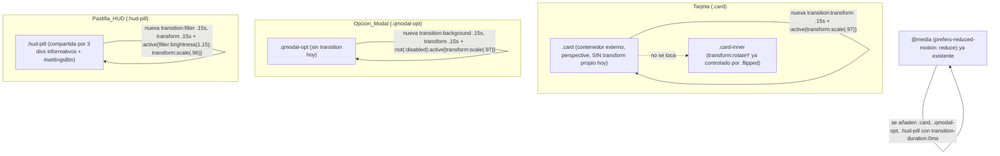

# Design Document

## Overview

Esta funcionalidad extiende el Patron_Presionado ya existente en `.btn-primary:active`/`.btn-secondary:active` (`transform:translateY(0px) scale(.98)`, junto con `transition:filter .15s, transform .15s` y `filter:brightness(...)`/`transform:translateY(-1px)` en `:hover`) a tres Elementos_Interactivos que hoy solo tienen `:hover`: la Tarjeta (`.card`), la Opcion_Modal (`.qmodal-opt`) y la Pastilla_HUD (`.hud-pill`, incluyendo `#settingsBtn`).

Es, igual que `combat-cards-mobile-layout` y `hud-responsive-layout`, una solución **puramente CSS**: se añaden reglas `:active` (y, donde no existe hoy, una `transition` nueva) a `index.html`. No se modifica ningún archivo `.js`, ningún event listener, ningún atributo `disabled`/`aria-*`, ni el DOM. No se introducen módulos, funciones ni estado nuevo en JavaScript.

El diseño trata cada uno de los 3 elementos por separado porque cada uno tiene una restricción estructural distinta que impide copiar el Patron_Presionado literalmente:

1. **`.card`**: `.card-inner` ya posee su propio `transform:rotateY(180deg)` controlado por `.card.flipped`, con su propia `transition:transform .55s`. Aplicar `transform:scale()` en `.card-inner` sobrescribiría (no combinaría) ese `rotateY`, rompiendo el flip 3D. Además, `.card.locked`/`.card.failed` (Tarjeta_No_Interactiva) deben quedar excluidas explícitamente (R1.3).
2. **`.qmodal-opt`**: no tiene ninguna `transition` propia hoy (hay que añadirla), y `.qmodal-opt:disabled` no debe recibir el patrón (R2.3); además `.correct`/`.incorrect` fijan su propio `background`, que no debe verse afectado por la regla nueva (R2.4).
3. **`.hud-pill`**: solo `#settingsBtn` es interactivo hoy, pero R3.3 exige que la regla cubra cualquier `.hud-pill` que se vuelva interactiva en el futuro, así que el selector debe apuntar a la clase compartida, no al ID.

## Architecture



No hay cambios de arquitectura de módulos, de DOM ni de JavaScript: el único artefacto modificado es la hoja de estilos embebida en `index.html`. Se reutiliza el bloque `@media (prefers-reduced-motion: reduce)` que ya existe (líneas 159-162 para `.pip`, y el bloque separado de líneas 254-256 para `.qmodal-overlay`); se añaden las nuevas declaraciones de `transition-duration:0ms` a uno de esos bloques existentes (se elige el segundo, junto a `.qmodal-overlay`, por proximidad a `.qmodal-opt`, aunque cualquiera de los dos bloques es funcionalmente equivalente ya que ambos comparten el mismo selector de media feature).

### Dónde aplicar el `transform:scale()` en cada elemento (decisión de diseño clave)

| Elemento | Selector objetivo del Patron_Presionado | Por qué |
|---|---|---|
| Tarjeta | `.card` (contenedor externo con `perspective`) | `.card` no declara ningún `transform` propio hoy. Aplicar `scale()` aquí evita cualquier colisión con el `rotateY(180deg)` que `.card-inner` aplica vía `.card.flipped .card-inner`. El `clip-path` vive en `.card-face` (heredado por `.card-front`/`.card-back`), dos niveles por debajo de `.card`, así que no se toca en absoluto (cumple R1.4 trivialmente). |
| Opcion_Modal | `.qmodal-opt` (el propio botón) | No hay conflicto de `transform` porque `.qmodal-opt` no tiene ningún `transform` existente. Se restringe la propiedad afectada a `transform` (no `background`) para no interferir con `.correct`/`.incorrect` (cumple R2.4). |
| Pastilla_HUD | `.hud-pill` (clase compartida) | Aplicar sobre la clase (no sobre `#settingsBtn`) hace que cualquier futura pill interactiva reciba el patrón automáticamente (cumple R3.3), sin duplicar la regla. |

### Por qué NO se aplica `scale()` sobre `.card-inner`

Se evaluó aplicar el Patron_Presionado directamente en `.card-inner:active` (ej. `transform:rotateY(180deg) scale(.97)` condicionalmente), pero esto exigiría escribir dos variantes del `transform` (con y sin `rotateY`) según el estado `.flipped`, duplicando lógica CSS y arriesgando que una tarjeta volteada "salte" de `rotateY(180deg)` a `rotateY(180deg) scale(.97)` con una `transition` de duración distinta a la de `.card-inner` (`.55s` vs. la nueva `.15s`), produciendo un parpadeo o interpolación visualmente inconsistente durante el flip. Aplicar el patrón en `.card` (un nivel más externo, sin `transform-style:preserve-3d` propio) evita esta complejidad por completo: el `scale()` de `.card` se combina visualmente con el `rotateY` de `.card-inner` porque son `transform` en elementos DOM distintos (padre/hijo), cada uno con su propia `transition` independiente.

## Components and Interfaces

### `index.html` — hoja de estilos embebida (único artefacto modificado)

#### 1. Tarjeta (`.card`)

```css
.card{
  width:150px; height:190px; perspective:1200px; cursor:pointer;
  transition:transform .15s;
}
.card.locked{cursor:default;}
.card.failed{cursor:default; filter:grayscale(1) brightness(.62); opacity:.55; transition:filter .3s ease, opacity .3s ease;}
.card:not(.locked):not(.failed):active{transform:scale(.97);}
```

Notas:
- Se añade `transition:transform .15s;` a la regla `.card` existente (mismo valor de duración que `.btn-primary`/`.btn-secondary`, `.15s`, para consistencia con el Patron_Presionado de referencia).
- El selector `.card:not(.locked):not(.failed):active` excluye explícitamente ambas clases de Tarjeta_No_Interactiva en una sola regla (cumple R1.3). No se usa `:active` genérico sobre `.card` para no requerir un selector `.card.locked:active{transform:none}`/`.card.failed:active{transform:none}` de anulación, que sería redundante y más frágil ante cambios de orden de reglas.
- `transform:scale(.97)` (ligeramente distinto de `.98` usado en `.btn-primary`) se justifica porque la Tarjeta es más grande (150×190px) que un botón; una reducción del 3% sigue siendo perceptible sin distorsionar visualmente proporciones más grandes. Es un valor cercano al de referencia, manteniendo el mismo lenguaje visual.
- No se toca `.card-inner`, `.card-face`, `.card-front`, `.card-back` ni su `clip-path` (cumple R1.4). El `transition:filter .3s ease, opacity .3s ease;` de `.card.failed` permanece intacto; como `.card.failed` queda excluida del nuevo `:active`, no hay interacción entre ambas transiciones.
- El nuevo `transition:transform .15s` en `.card` no afecta la `transition:transform .55s cubic-bezier(...)` de `.card-inner`: son propiedades `transition` declaradas en selectores/elementos distintos, cada una gobierna el `transform` de su propio elemento.

#### 2. Opcion_Modal (`.qmodal-opt`)

```css
.qmodal-opt{
  display:block; width:100%; text-align:left; font-family:var(--font-body);
  font-size:clamp(15px, 1.8vw, 18px); line-height:1.35; color:var(--ink-dim);
  background:rgba(255,255,255,.06); border:1px solid rgba(255,255,255,.16);
  padding:12px 14px; margin-bottom:10px; cursor:pointer;
  transition:transform .15s;
}
.qmodal-opt:hover{background:rgba(255,255,255,.12);}
.qmodal-opt.correct{background:rgba(89,194,122,.35); border-color:var(--success); color:#fff;}
.qmodal-opt.incorrect{background:rgba(226,73,58,.35); border-color:var(--danger); color:#fff;}
.qmodal-opt:disabled{cursor:default;}
.qmodal-opt:not(:disabled):active{transform:scale(.97);}
```

Notas:
- Se añade `transition:transform .15s;` a la regla `.qmodal-opt` existente. Se declara únicamente `transform` (no `background`, no `filter`) para que la regla `:active` nunca compita con `background` de `.correct`/`.incorrect` (cumple R2.4): el Patron_Presionado aquí es solo el `scale()`, sin el componente `filter:brightness(...)` que sí usan `.btn-primary`/`.hud-pill`, precisamente porque `background` ya está reservado para comunicar el resultado de la respuesta.
- **Comportamiento nativo de `:active` sobre `:disabled` (confirmación explícita para R2.3):** en todos los navegadores basados en las especificaciones CSS UI (Selectors Level 4, HTML Living Standard), un elemento `<button disabled>` no genera eventos de puntero ni activa pseudo-clases de interacción de usuario (`:hover`, `:active`, `:focus`) — el estándar excluye a los elementos deshabilitados de la "interacción de usuario" (user interaction) que dispara esas pseudo-clases. Esto ya es observable en el CSS actual: `.qmodal-opt:hover{background:...}` no se activa hoy sobre un `.qmodal-opt` con `disabled`, y el proyecto no tiene ninguna regla `:not(:disabled):hover` para prevenirlo. No obstante, el diseño usa `:not(:disabled):active` explícitamente (en vez de depender implícitamente del comportamiento nativo) por las mismas razones de claridad y robustez documentadas en el requisito R2.3: hace el contrato explícito en el código, es inmune a comportamientos no estándar de navegadores WebView/embebidos menos comunes, y es consistente con el patrón `:not(.locked):not(.failed)` ya usado para `.card`.
- El botón se crea vía `b.className = 'qmodal-opt facet-cut-sm';` en `src/ui/screens.js` (no se modifica ese archivo); el atributo `disabled` se asigna después en el mismo módulo al resolver la respuesta, fuera de alcance de este cambio CSS.

#### 3. Pastilla_HUD (`.hud-pill`)

```css
.hud-pill{
  background:linear-gradient(180deg, rgba(29,37,66,.92), rgba(20,26,48,.92));
  border:1px solid rgba(217,179,77,.45);
  padding:7px 16px; font-family:var(--font-display); font-weight:700; font-size:14px;
  letter-spacing:.03em; color:var(--gold);
  transition:filter .15s, transform .15s;
}
.hud-pill span{color:var(--ink);}
.hud-pill:active{filter:brightness(1.15); transform:scale(.96);}
```

Notas:
- Se añade `transition:filter .15s, transform .15s;` (idéntica a `.btn-primary`/`.btn-secondary`) y una regla `.hud-pill:active` que replica el Patron_Presionado completo (`filter` + `transform`), ya que `.hud-pill` no tiene una restricción de `background` como `.qmodal-opt` (ninguna Pastilla_HUD hoy usa clases de estado tipo `.correct`/`.incorrect`).
- El selector es `.hud-pill:active`, sin condicionarlo a `#settingsBtn`, para que cualquier Pastilla_HUD que en el futuro reciba un manejador de clic/puntero (los 3 `<div class="hud-pill">` informativos de mejor puntuación, piso y puerta) obtenga el mismo feedback automáticamente en el momento en que se vuelva interactiva, sin requerir una nueva regla CSS (cumple R3.3). Los `<div>` no interactivos no disparan `:active` de forma perceptible en el flujo normal (no reciben foco de puntero como objetivo de una acción del jugador porque no tienen ningún manejador ni `cursor:pointer`), por lo que no hay efecto visual indeseado hoy sobre ellos.
- `transform:scale(.96)` (más pronunciado que `.98` de los botones grandes) se justifica porque `.hud-pill` es visualmente pequeña (`padding:7px 16px`, `font-size:14px`, aún más reducida en Mobile_Breakpoint a `font-size:12px; padding:5px 8px` según `hud-responsive-layout`); una reducción algo mayor sigue siendo sutil en términos absolutos de píxeles pero permanece perceptible en una superficie pequeña.
- R3.4 (graceful degradation si el navegador no soporta `:active` o alguna propiedad del patrón) se cumple de forma nativa por el modelo de cascada de CSS: un navegador que no reconozca la pseudo-clase `:active` o las propiedades `filter`/`transform` simplemente ignora esa regla (no falla, no bloquea el parseo del resto de la hoja de estilos) y el elemento sigue siendo un `<button>` funcional cuyo `addEventListener('click', ...)` (registrado en `src/ui/screens.js`, fuera de alcance) no depende de ningún estilo computado.

#### 4. Movimiento_Reducido — extensión del bloque `@media` existente

```css
@media (prefers-reduced-motion: reduce){
  .qmodal-overlay{ transition-duration:0ms; } /* refuerzo declarativo (Movimiento_Reducido) */
  .card{ transition-duration:0ms; }
  .qmodal-opt{ transition-duration:0ms; }
  .hud-pill{ transition-duration:0ms; }
}
```

Notas:
- Se extiende el bloque `@media (prefers-reduced-motion: reduce)` ya existente (el que hoy solo contiene `.qmodal-overlay`) añadiendo una línea por cada uno de los 3 selectores que reciben una `transition` nueva en este diseño, siguiendo el mismo patrón declarativo `transition-duration:0ms;` ya usado (cumple R5.1).
- `transition-duration:0ms` anula la duración de **todas** las transiciones declaradas en el selector (tanto `transform` como, en el caso de `.hud-pill`, también `filter`), sin necesitar una propiedad por cada componente de la `transition` shorthand.
- El cambio visual de `:active` en sí (el `scale()`/`filter:brightness()` aplicado mientras el elemento está presionado) **no se elimina** bajo Movimiento_Reducido: solo se elimina la animación de interpolación entre estados. El jugador sigue viendo el Estado_Presionado aplicado instantáneamente al presionar y retirado instantáneamente al soltar (cumple R5.2), igual que ya ocurre con `.qmodal-overlay` y `.pip` bajo la misma preferencia.
- No se modifica el bloque `@media (prefers-reduced-motion: reduce)` de `.pip` (líneas 159-162): ese bloque queda intacto; se reutiliza el bloque de `.qmodal-overlay` (líneas 254-256) por proximidad temática y de ubicación en el archivo con `.qmodal-opt`.

### Confirmación: ningún archivo `.js` se modifica (R4.1)

Se realizó una búsqueda en `src/` de los selectores `.card`, `.qmodal-opt` y `.hud-pill`/`#settingsBtn`:
- `src/main.js` (línea ~164) solo lee `.card` para obtener una referencia DOM y alternar la clase `.locked` — no depende de `transform`/`filter`/`transition`.
- `src/ui/screens.js` crea `.qmodal-opt` y adjunta su `addEventListener('click', ...)` — no depende de ningún estilo computado; el atributo `disabled` se asigna por lógica de juego, no por CSS.
- El binding de `#settingsBtn` (`bindAudioSettingsHandlers`) referencia el elemento por `id`, no por clase ni por estilo.

Ningún manejador de evento existente lee `getComputedStyle`, `getBoundingClientRect` con fines de decisión de lógica, ni ninguna propiedad CSS afectada por este diseño. Por tanto, este diseño no requiere ni realiza ningún cambio en archivos `.js`, confirmando R4.1 explícitamente.

## Data Models

No se introducen ni modifican modelos de datos. No hay estado nuevo en JavaScript: el Estado_Presionado es puramente una pseudo-clase CSS (`:active`) gestionada nativamente por el navegador a partir de eventos de puntero/táctiles ya existentes, sin ningún flag, contador o propiedad de objeto que rastrear en el código de la aplicación.

## Error Handling

No se introduce lógica nueva susceptible de error (no hay parsing, I/O, ni ramas condicionales nuevas en JavaScript; este es un cambio CSS puro). Casos de robustez a considerar:

- **Navegador sin soporte de `:active`, `filter` o `transform`** (R3.4): degrada de forma nativa por la cascada CSS — la regla no reconocida se ignora, el elemento permanece funcional (ver nota de la sección de Pastilla_HUD arriba). No se requiere ningún `@supports` ni fallback en JavaScript.
- **Tarjeta que pasa a `.locked`/`.failed` mientras está siendo presionada** (por ejemplo, si el juego aplica `.locked` en el mismo instante en que el jugador tiene el dedo sobre la Tarjeta): el selector `.card:not(.locked):not(.failed):active` se reevalúa de forma continua por el motor CSS ante cualquier cambio de clase, así que si `.locked` se añade mientras `:active` sigue verdadero, la regla deja de aplicar inmediatamente y el `transform:scale(.97)` se retira sin necesidad de lógica adicional.
- **Presión cancelada** (el jugador desliza el dedo fuera del elemento antes de soltar, o el sistema operativo interrumpe el gesto táctil): `:active` es gestionado nativamente por el navegador y se retira automáticamente en estos casos (comportamiento estándar de la pseudo-clase, idéntico al ya usado por `.btn-primary:active`), sin necesidad de manejar `pointercancel`/`touchcancel` explícitamente.
- **Movimiento_Reducido combinado con transición ya existente de `.card.failed`** (`transition:filter .3s ease, opacity .3s ease;`): esa transición no se ve afectada por este diseño (no se añade `.card.failed` al bloque `@media (prefers-reduced-motion: reduce)` porque no es un requisito de este spec ni de esta transición nueva); solo se anulan las duraciones de las transiciones introducidas por este diseño (`transform` en `.card`, `.qmodal-opt`; `filter`+`transform` en `.hud-pill`).

## Testing Strategy

**Evaluación de aplicabilidad de PBT:** igual que en `combat-cards-mobile-layout` y `hud-responsive-layout`, esta funcionalidad no introduce ninguna función pura, transformación de datos, parser ni lógica de negocio en JavaScript — es un cambio exclusivamente declarativo en la hoja de estilos CSS embebida en `index.html` (nuevas reglas `:active`/`transition` sobre selectores ya existentes, más una extensión del bloque `@media (prefers-reduced-motion: reduce)`). No hay entrada/salida computable por código propio sobre la que formular una propiedad universal ("para todo X, P(X) se cumple"): el "comportamiento" a verificar es la presencia y forma de reglas CSS estáticas y la disposición visual resultante, que jsdom (el entorno de test del proyecto) no calcula (no hay motor de layout ni de pseudo-clases de interacción real; jsdom no simula `:active` a partir de eventos de puntero). Por lo tanto, **se omite la sección de Correctness Properties y no se usa property-based testing (fast-check) para esta funcionalidad**, siguiendo el mismo criterio ya aplicado en las dos specs hermanas de la Fase 4. Se usan en su lugar tests de verificación estática del CSS (mismo patrón que `hudLayout.css.test.js`/`screens.cardLayout.test.js`) más una nota de QA manual para la verificación visual/táctil real en dispositivo.

### Verificación estática de la hoja de estilos embebida (ejemplos concretos, no PBT)

Se crea un nuevo archivo `src/ui/touchFeedback.css.test.js`, siguiendo literalmente el patrón de `hudLayout.css.test.js` (lectura de `index.html` vía `readFileSync` + aserciones por expresión regular sobre el contenido de las reglas):

1. **`.card` recibe el Patron_Presionado excluyendo Tarjeta_No_Interactiva (R1.1, R1.3)**: afirmar que existe una regla `.card:not(.locked):not(.failed):active{...}` (o equivalente con los mismos dos `:not()`) cuyo cuerpo contiene `transform:scale(...)`, y que la regla `.card{...}` declara una `transition` que incluye `transform`.
2. **`.card` no recibe una regla `:active` sin exclusión (R1.3)**: afirmar que no existe una regla `.card:active{...}` genérica (sin los `:not()`) que pudiera aplicar también sobre `.locked`/`.failed`.
3. **`.card-face`/`.card-front`/`.card-back` conservan su `clip-path` sin cambios (R1.4)**: afirmar, por comparación textual exacta, que las declaraciones `clip-path` de esas tres reglas permanecen idénticas a las actuales.
4. **`.card-inner`/`.card.flipped .card-inner` sin cambios**: afirmar que la regla `.card-inner{...}` sigue conteniendo `transform-style:preserve-3d` y que no se le añadió ninguna declaración `:active`, confirmando que el Patron_Presionado no se aplicó ahí.
5. **`.qmodal-opt` recibe el patrón excluyendo `:disabled` (R2.1, R2.3)**: afirmar que existe `.qmodal-opt:not(:disabled):active{...}` con `transform:scale(...)`, y que esa regla **no** declara `background`.
6. **`.correct`/`.incorrect` de `.qmodal-opt` sin cambios (R2.4)**: afirmar, por comparación textual exacta, que `.qmodal-opt.correct{...}` y `.qmodal-opt.incorrect{...}` conservan literalmente su `background` actual.
7. **`.hud-pill` recibe el patrón sobre la clase compartida (R3.1, R3.2, R3.3)**: afirmar que existe `.hud-pill:active{...}` (no `#settingsBtn:active`) con `filter` y `transform`, y que la regla `.hud-pill{...}` declara una `transition` que incluye `filter` y `transform`.
8. **Movimiento_Reducido cubre los 3 selectores nuevos (R5.1)**: reutilizando el helper de extracción de bloques `@media` (adaptado para `prefers-reduced-motion: reduce` en vez de `max-width:520px`, análogo a `getMobileMediaBlock` de `hudLayout.css.test.js`), afirmar que dentro de ese bloque existen las reglas `.card{transition-duration:0ms;}`, `.qmodal-opt{transition-duration:0ms;}` y `.hud-pill{transition-duration:0ms;}` (o una regla combinada con selector-lista que las agrupe).
9. **`:hover` existentes intactos (R4.2)**: afirmar, por comparación textual exacta, que `.card` (no tiene `:hover` hoy, se omite), `.qmodal-opt:hover{...}`, `.hud-pill` (no tiene `:hover` propio, se omite) permanecen sin cambios; en particular confirmar que `.qmodal-opt:hover{background:rgba(255,255,255,.12);}` sigue presente literalmente.
10. **`.opt-btn` excluido (R4.4)**: afirmar que no se añadió ninguna regla `.opt-btn:active{...}` con `transform:scale`/`filter:brightness` (el bloque de código muerto permanece sin la regla `:active` de este patrón).

### Tests DOM/jsdom (patrón `screens.*.test.js`)

11. **Listeners existentes siguen invocándose tras el cambio de estilo (R4.1)**: reutilizar los tests ya existentes de clic sobre `.qmodal-opt` (`screens.modal.open.test.js`) y sobre `#settingsBtn` (`screens.audioSettings.test.js`) sin modificarlos — su paso continuo tras aplicar este diseño demuestra que ningún `addEventListener` se vio afectado por las nuevas reglas `:active`/`transition` (jsdom no aplica CSS, pero el test de integración de clic es la evidencia funcional de que el binding no cambió).

### Fuera de alcance de los tests automatizados (QA manual)

- La verificación visual/táctil real del Estado_Presionado (que el `scale()`/`filter:brightness()` se perciba correctamente al presionar con el dedo en un dispositivo táctil real, y que no queden restos visuales del patrón tras soltar) requiere un motor de renderizado e interacción táctil real que jsdom no provee. Se recomienda una verificación manual/QA en al menos un dispositivo táctil real (o emulación táctil de DevTools) para: (a) Tarjeta no bloqueada, (b) Tarjeta `.locked`/`.failed` (confirmar ausencia del efecto), (c) Opcion_Modal habilitada y deshabilitada, (d) `#settingsBtn`, y (e) confirmar con `prefers-reduced-motion: reduce` activado en el sistema que el cambio visual sigue ocurriendo sin animación perceptible, antes de cerrar la tarea de implementación.
