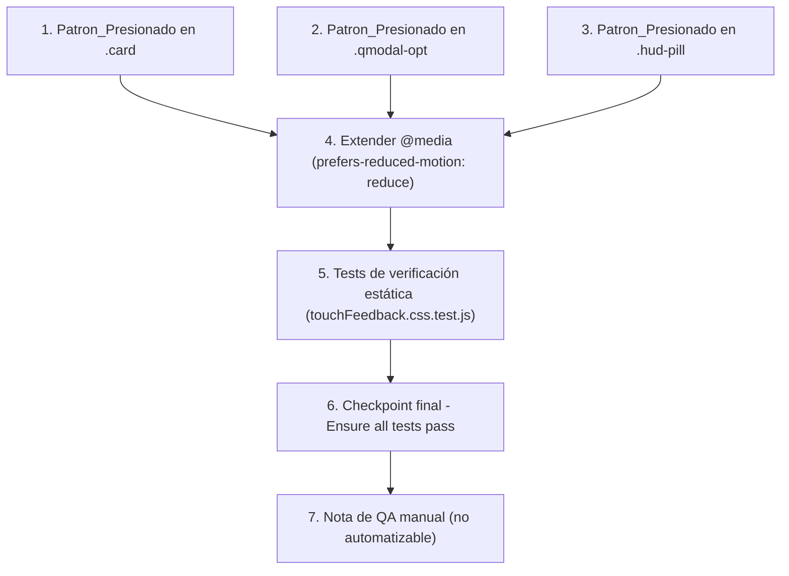

# Implementation Plan: touch-feedback-polish

## Overview

Esta funcionalidad es un cambio puramente CSS sobre la hoja de estilos embebida en `index.html`: se añade el Patron_Presionado (`transition` + regla `:active`) a `.card`, `.qmodal-opt` y `.hud-pill`, y se extiende el bloque `@media (prefers-reduced-motion: reduce)` ya existente. No se modifica ningún archivo `.js`, ningún event listener ni el DOM. Como el design.md justifica explícitamente que no aplica property-based testing (no hay funciones puras ni transformaciones de datos, solo reglas CSS estáticas), no se incluyen sub-tareas de property tests; se usan en su lugar tests de verificación estática (patrón `hudLayout.css.test.js`) y una nota de QA manual no automatizable.

Cada tarea de implementación depende de que el bloque CSS correspondiente exista literalmente como está hoy en `index.html` (verificado en el design.md); las tareas 1-4 son independientes entre sí a nivel de archivo (tocan reglas CSS distintas) pero se ejecutan secuencialmente sobre el mismo archivo. La tarea 5 (tests) depende de que las tareas 1-4 estén completas, ya que verifica el resultado final de las cuatro modificaciones CSS.

### Grafo de dependencias de tareas

Nota: T4 depende de T1/T2/T3 solo en el sentido de que las 3 reglas `.card`/`.qmodal-opt`/`.hud-pill` deben existir con su nueva `transition` antes de que la extensión del bloque `@media` tenga sentido semántico completo; en la práctica las 4 ediciones se aplican sobre el mismo archivo `index.html` y pueden implementarse en el orden 1→2→3→4 dentro de una misma tarea de edición si se prefiere, pero se listan por separado para trazabilidad granular por requisito.

## Tasks

- [x] 1. Añadir Patron_Presionado a `.card` en `index.html`
  - En la regla `.card{width:150px; height:190px; perspective:1200px; cursor:pointer;}` (sección `/* ---------- cards row ---------- */`), añadir `transition:transform .15s;` sin modificar las declaraciones existentes
  - Añadir una nueva regla `.card:not(.locked):not(.failed):active{transform:scale(.97);}` inmediatamente después de las reglas `.card.locked`/`.card.failed` existentes
  - No modificar `.card-inner`, `.card.flipped .card-inner`, `.card-face`, `.card-front`, `.card-back` ni ninguna declaración `clip-path`
  - No añadir ninguna regla `.card:active` genérica sin los dos `:not()`
  - _Requirements: 1.1, 1.2, 1.3, 1.4, 4.2, 4.3_

- [x] 2. Añadir Patron_Presionado a `.qmodal-opt` en `index.html`
  - En la regla `.qmodal-opt{...}` existente (sección de la Modal_Pregunta), añadir `transition:transform .15s;` sin modificar las declaraciones existentes (color, background, border, padding, etc.)
  - Añadir una nueva regla `.qmodal-opt:not(:disabled):active{transform:scale(.97);}` inmediatamente después de la regla `.qmodal-opt:disabled` existente
  - No añadir `filter` ni `background` a la nueva regla `:active`
  - No modificar `.qmodal-opt:hover`, `.qmodal-opt.correct`, `.qmodal-opt.incorrect` ni `.qmodal-opt:disabled`
  - _Requirements: 2.1, 2.2, 2.3, 2.4, 4.2, 4.3_

- [x] 3. Añadir Patron_Presionado a `.hud-pill` en `index.html`
  - En la regla `.hud-pill{...}` existente (sección `#hud`), añadir `transition:filter .15s, transform .15s;` sin modificar las declaraciones existentes
  - Añadir una nueva regla `.hud-pill:active{filter:brightness(1.15); transform:scale(.96);}` inmediatamente después de la regla `.hud-pill{...}` (y de `.hud-pill span{...}` si aplica)
  - Usar el selector de clase `.hud-pill:active` (no `#settingsBtn:active`) para que la regla cubra automáticamente cualquier Pastilla_HUD que se vuelva interactiva
  - No modificar `.hud-pill span`
  - _Requirements: 3.1, 3.2, 3.3, 4.2, 4.3_

- [x] 4. Extender el bloque `@media (prefers-reduced-motion: reduce)` existente en `index.html`
  - Localizar el bloque `@media (prefers-reduced-motion: reduce){ .qmodal-overlay{ transition-duration:0ms; } }` (junto a `.qmodal-opt`)
  - Añadir dentro de ese mismo bloque, sin eliminar la regla `.qmodal-overlay` existente: `.card{transition-duration:0ms;}`, `.qmodal-opt{transition-duration:0ms;}`, `.hud-pill{transition-duration:0ms;}`
  - No modificar el bloque `@media (prefers-reduced-motion: reduce)` separado que contiene `.pip`/`.pip.just-lost`
  - _Requirements: 5.1, 5.2_

- [x] 5. Escribir tests de verificación estática del CSS
  - Crear `src/ui/touchFeedback.css.test.js` siguiendo el patrón de `src/ui/hudLayout.css.test.js` (lectura de `index.html` vía `readFileSync` + aserciones por expresión regular sobre el texto de las reglas; incluir un helper de extracción de bloque `@media` análogo a `getMobileMediaBlock`, adaptado al selector `prefers-reduced-motion: reduce`)
  - [x]* 5.1 Verificar `.card:not(.locked):not(.failed):active` con `transform:scale(...)` y `transition` de `.card` incluyendo `transform`
    - _Requirements: 1.1, 1.2, 1.4_
  - [x]* 5.2 Verificar ausencia de una regla `.card:active` genérica sin los `:not()`
    - _Requirements: 1.3_
  - [x]* 5.3 Verificar que `clip-path` de `.card-face`/`.card-front`/`.card-back` permanece idéntico por comparación textual exacta
    - _Requirements: 1.4_
  - [x]* 5.4 Verificar que `.card-inner` no recibe ninguna nueva regla `:active` y conserva `transform-style:preserve-3d`
    - _Requirements: 1.4, 4.3_
  - [x]* 5.5 Verificar `.qmodal-opt:not(:disabled):active` con `transform:scale(...)` y ausencia de `background` en esa regla
    - _Requirements: 2.1, 2.2, 2.3, 2.4_
  - [x]* 5.6 Verificar que `.qmodal-opt.correct`/`.qmodal-opt.incorrect` conservan literalmente su `background` actual
    - _Requirements: 2.4_
  - [x]* 5.7 Verificar `.hud-pill:active` (y no `#settingsBtn:active`) con `filter` y `transform`, y `transition` de `.hud-pill` incluyendo `filter` y `transform`
    - _Requirements: 3.1, 3.2, 3.3_
  - [x]* 5.8 Verificar que el bloque `@media (prefers-reduced-motion: reduce)` contiene las 3 reglas nuevas (`.card`, `.qmodal-opt`, `.hud-pill` con `transition-duration:0ms;`)
    - _Requirements: 5.1_
  - [x]* 5.9 Verificar que `.qmodal-opt:hover{background:rgba(255,255,255,.12);}` permanece intacto literalmente
    - _Requirements: 4.2_
  - [x]* 5.10 Verificar que `.opt-btn` no recibe ninguna nueva regla `:active` con `transform:scale`/`filter:brightness`
    - _Requirements: 4.4_

- [x] 6. Checkpoint final - Ensure all tests pass
  - Ensure all tests pass, ask the user if questions arise.

- [x] 7. Documentar la nota de QA manual (informativa, no automatizable)
  - Añadir al final de `src/ui/touchFeedback.css.test.js` (como comentario) o en un bloque de descripción del `describe` principal, la lista de verificaciones manuales pendientes en dispositivo/emulación táctil real: (a) Tarjeta no bloqueada, (b) Tarjeta `.locked`/`.failed` (confirmar ausencia del efecto), (c) Opcion_Modal habilitada y deshabilitada, (d) `#settingsBtn`, (e) verificación con `prefers-reduced-motion: reduce` activado en el sistema
  - No crear ningún test automatizado nuevo en esta tarea; es únicamente documentación de alcance no cubierto por jsdom
  - _Requirements: 1.1, 1.3, 2.1, 2.3, 3.1, 5.2_

## Notes

- Tareas marcadas con `*` son sub-tareas de test opcionales y pueden omitirse para un MVP más rápido; sin embargo, las sub-tareas 5.1-5.10 SÍ deben implementarse como parte de esta tarea 5 según el proceso de ejecución habitual (solo se marcan `*` por convención de la plantilla, no implica omitirlas).
- No se incluye ninguna sección de Correctness Properties ni tareas de property-based testing: el design.md justifica explícitamente que esta funcionalidad (cambio CSS puro, sin funciones ni transformaciones de datos en JavaScript) no es candidata a PBT.
- Cada tarea referencia requisitos granulares (X.Y) para trazabilidad con requirements.md.
- El checkpoint de la tarea 6 asegura que las 4 modificaciones CSS y los 10 tests estáticos son consistentes antes de cerrar la nota de QA manual.
