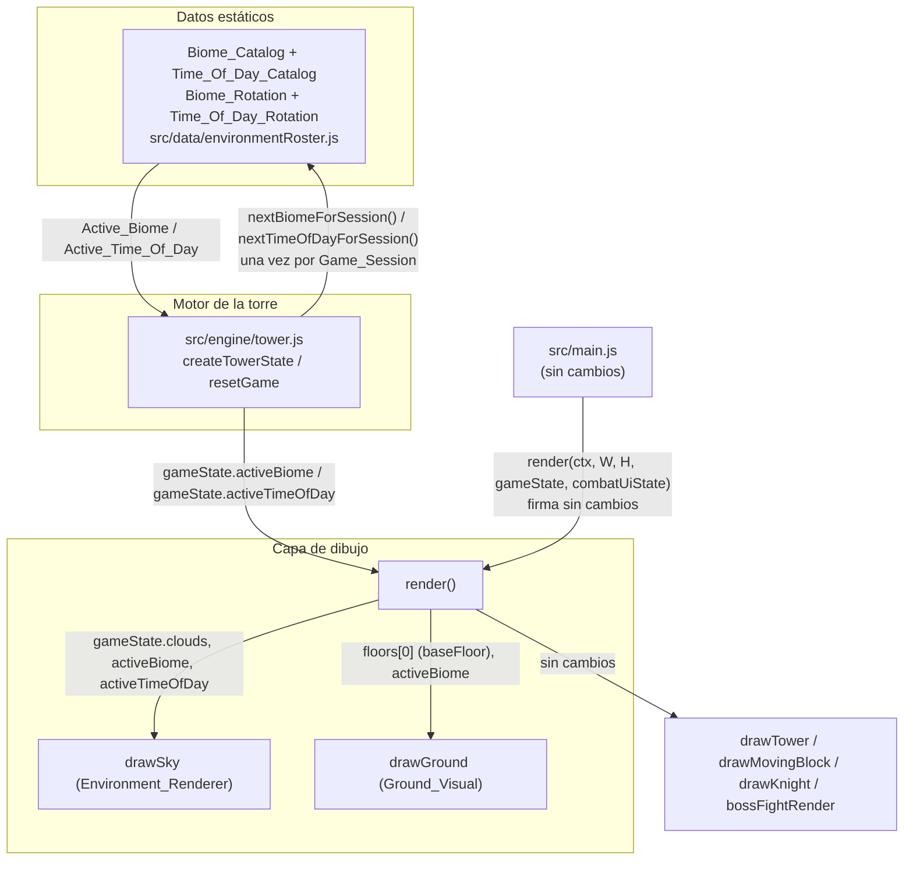
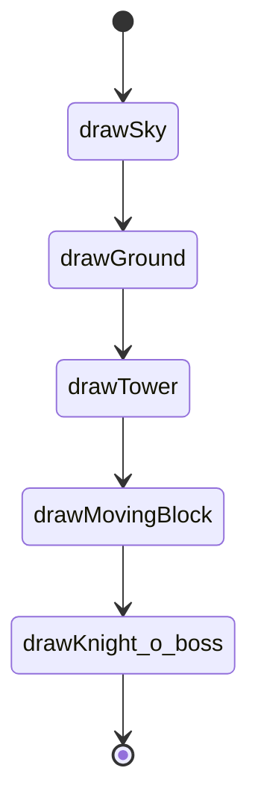

# Design Document

## Overview

Esta funcionalidad añade dos mejoras puramente visuales al mundo procedural de "Torre de las Nubes", ambas dibujadas en `src/render/draw.js`: un `Ground_Visual` (banda de suelo de pasto/tierra en la base de la torre) y un `Environment_Renderer` que sustituye el degradado de cielo fijo de noche de `drawSky` por una combinación de dos catálogos independientes — `Biome_Catalog` (5 entradas: Tundra, Sabana, Desierto, Bosque_Templado, Taiga) y `Time_Of_Day_Catalog` (4 entradas: Mañana, Día, Tarde, Noche) — seleccionados una sola vez por `Game_Session`.

El diseño se apoya en tres decisiones estructurales:

1. **Se reutiliza exactamente el patrón de rotación de `selectBoss`** (`src/data/bossRoster.js`): orden fijo para las primeras N sesiones, luego aleatorio con repetición. Se introduce un nuevo módulo, `src/data/environmentRoster.js`, que expone dos catálogos y dos pares de funciones de selección (una pura, parametrizada, para pruebas; una con estado, para uso real), siguiendo el mismo espíritu de `BOSS_ROSTER`/`selectBoss` sin añadir ninguna dependencia nueva.
2. **Los dos contadores de rotación viven exclusivamente en `src/data/environmentRoster.js`, y no en `gameState`**, porque a diferencia de `selectBoss` (que recibe `gameState.doorsPassed`, un contador que ya existía en el motor por otras razones), no hay ningún contador equivalente a "Game_Session iniciadas" en `src/engine/tower.js`. Introducir uno ahí solo para este propósito ensancharía el estado del motor con un concepto (biomas/momentos del día) que no le pertenece. En su lugar, `environmentRoster.js` posee sus dos contadores (`biomeSessionCounter`, `timeOfDaySessionCounter`) y los incrementa él mismo, exactamente una vez por invocación de sus funciones "de sesión" (`nextBiomeForSession`/`nextTimeOfDayForSession`), que `createTowerState`/`resetGame` llaman una sola vez cada una por Game_Session.
3. **`drawSky` y el nuevo `drawGround` son las únicas superficies de cambio en `draw.js`**; ningún otro dibujo (`drawTower`, `drawMovingBlock`, `drawKnight`, el combate de jefes) se modifica. `render()` solo gana una llamada nueva (`drawGround`) y dos argumentos nuevos hacia `drawSky`, preservando su firma pública `render(ctx, W, H, gameState, combatUiState)`.

`src/main.js` no requiere ningún cambio: ya llama a `engine.createTowerState`/`engine.resetGame` y a `render.render(ctx, W, H, gameState, combatUiState)` sin conocer los campos internos de `gameState`, por lo que los nuevos campos `gameState.activeBiome`/`gameState.activeTimeOfDay` fluyen de forma transparente desde el motor hasta el render.

## Architecture



### Orden de dibujo dentro de `render()`



`drawGround` se inserta entre `drawSky` y `drawTower` (Requirement 1.4): `drawTower` dibuja `floors[0]` (`baseFloor`) como su primer elemento, por lo que colocar `drawGround` inmediatamente antes garantiza que `baseFloor` quede visualmente por encima del suelo.

## Components and Interfaces

### 1. `Biome_Catalog`, `Time_Of_Day_Catalog` y sus rotaciones (`src/data/environmentRoster.js`, NUEVO)

```js
export const BIOME_CATALOG = [
  {
    id: 'tundra', displayName: 'Tundra',
    hillColor: '#7f97ad',
    groundColors: ['#eef4f7', '#b9c7cf'],   // [claro, oscuro] de la banda de suelo
    vegetationCue: 'none',                   // Requirement 2.3 / 8.1: nieve, sin vegetación
  },
  {
    id: 'sabana', displayName: 'Sabana',
    hillColor: '#9c8a4e',
    groundColors: ['#d9b968', '#a9822f'],
    vegetationCue: 'dryGrassTufts',          // Requirement 2.4 / 8.2
  },
  {
    id: 'desierto', displayName: 'Desierto',
    hillColor: '#b98a55',
    groundColors: ['#e3c48a', '#c79a54'],
    vegetationCue: 'none',                   // Requirement 2.5 / 8.3: explícitamente sin vegetación
  },
  {
    id: 'bosque_templado', displayName: 'Bosque Templado',
    hillColor: '#3f6b3f',
    groundColors: ['#5fa050', '#356b34'],
    vegetationCue: 'bushes',                 // Requirement 2.6 / 8.4
  },
  {
    id: 'taiga', displayName: 'Taiga',
    hillColor: '#2f4f4f',
    groundColors: ['#4a6b5a', '#2c4a3a'],
    vegetationCue: 'conifers',                // Requirement 2.7 / 8.5, distinto de 'bushes'
  },
];

export const TIME_OF_DAY_CATALOG = [
  {
    id: 'manana', displayName: 'Mañana',
    skyGradientStops: [[0, '#ffd9a0'], [0.5, '#ffb37a'], [1, '#8fb6d9']],
    starVisibility: false,
    cloudColor: 'rgba(255,255,255,.22)',
    sunMoonCue: { type: 'sun', color: '#fff2c2', xRatio: 0.2, yRatio: 0.18, radius: 34 },
  },
  {
    id: 'dia', displayName: 'Día',
    skyGradientStops: [[0, '#8fd0ff'], [0.6, '#bfe6ff'], [1, '#eaf6ff']],
    starVisibility: false,
    cloudColor: 'rgba(255,255,255,.35)',
    sunMoonCue: { type: 'sun', color: '#fff9e0', xRatio: 0.5, yRatio: 0.1, radius: 40 },
  },
  {
    id: 'tarde', displayName: 'Tarde',
    skyGradientStops: [[0, '#3b2d54'], [0.5, '#c1573f'], [1, '#f2a65a']],
    starVisibility: false,
    cloudColor: 'rgba(255,220,200,.18)',
    sunMoonCue: { type: 'sun', color: '#ffb066', xRatio: 0.78, yRatio: 0.22, radius: 36 },
  },
  {
    id: 'noche', displayName: 'Noche',
    skyGradientStops: [[0, '#050716'], [0.55, '#111a3d'], [1, '#2c3d6e']],
    starVisibility: true,
    cloudColor: 'rgba(200,210,235,.10)',
    sunMoonCue: { type: 'moon', color: '#eef3ff', xRatio: 0.82, yRatio: 0.15, radius: 22 },
  },
];
```

Los valores de `skyGradientStops`/`cloudColor` de `'noche'` son idénticos a los que `drawSky` usa hoy de forma fija, de modo que la primera sesión que rote a `Noche` se ve igual que el comportamiento actual (sin regresión visual para ese caso).

**Selección pura, parametrizada (mirroring `selectBoss` exactamente):**

```js
/**
 * @param {number} sessionsStarted - Game_Session ya iniciadas antes de esta selección
 *   (equivalente al `bossesResolved` de `selectBoss`, pero para bioma).
 * @returns {typeof BIOME_CATALOG[number]}
 */
export function selectBiome(sessionsStarted) {
  if (sessionsStarted < BIOME_CATALOG.length) return BIOME_CATALOG[sessionsStarted]; // Requirement 4.1
  const idx = Math.floor(Math.random() * BIOME_CATALOG.length);                       // Requirement 4.2
  return BIOME_CATALOG[idx];
}

/** @param {number} sessionsStarted @returns {typeof TIME_OF_DAY_CATALOG[number]} */
export function selectTimeOfDay(sessionsStarted) {
  if (sessionsStarted < TIME_OF_DAY_CATALOG.length) return TIME_OF_DAY_CATALOG[sessionsStarted]; // Requirement 5.1
  const idx = Math.floor(Math.random() * TIME_OF_DAY_CATALOG.length);                              // Requirement 5.2
  return TIME_OF_DAY_CATALOG[idx];
}
```

`selectBiome`/`selectTimeOfDay` son funciones **puras**: mismo `sessionsStarted`, mismo comportamiento (determinista para `sessionsStarted < length`). Esto es lo que permite probarlas de forma directa y repetible con valores concretos (`selectBiome(0)`, `selectBiome(1)`, ...), igual que se prueba `selectBoss` hoy.

**Contadores de sesión y wrappers con estado (Requirement 4.3, 4.4, 5.3, 5.4, 9.1, 9.2, 9.3):**

```js
let biomeSessionCounter = 0;        // Biome_Session_Counter — módulo, en memoria, Requirement 4.4/9.1
let timeOfDaySessionCounter = 0;    // Time_Of_Day_Session_Counter — módulo, en memoria, Requirement 5.4/9.1

/**
 * Selecciona el Active_Biome para una nueva Game_Session e incrementa el
 * Biome_Session_Counter en exactamente 1. Debe invocarse EXACTAMENTE una vez
 * por Game_Session, únicamente desde createTowerState/resetGame.
 * @returns {typeof BIOME_CATALOG[number]}
 */
export function nextBiomeForSession() {
  const entry = selectBiome(biomeSessionCounter);
  biomeSessionCounter += 1;         // Requirement 4.3
  return entry;
}

/** Análogo a nextBiomeForSession() para Time_Of_Day. Requirement 5.3. */
export function nextTimeOfDayForSession() {
  const entry = selectTimeOfDay(timeOfDaySessionCounter);
  timeOfDaySessionCounter += 1;     // Requirement 5.3
  return entry;
}
```

**Decisión: dos funciones por catálogo (`selectX` pura + `nextXForSession` con estado) en vez de una sola función con contador implícito.** Se evaluaron dos alternativas:

1. Una única función `selectBiome()` sin parámetros, que lee y muta el contador internamente en cada llamada. Esto es simple de invocar desde `tower.js`, pero hace que probar el comportamiento fijo-luego-aleatorio (Requirement 4.1/4.2) dependa de mutar el contador global del módulo entre llamadas de prueba, acoplando cada test al orden de ejecución de los demás tests del mismo archivo (un problema real con módulos ES, cuyo estado persiste entre `it()` dentro del mismo proceso de test).
2. Separar la función **pura** (`selectBiome(sessionsStarted)`, sin efectos secundarios, mirroring exacto de `selectBoss`) de la función **con estado** (`nextBiomeForSession()`, que envuelve a la pura y posee el contador). La pura se prueba con valores explícitos sin preocuparse por el estado del módulo; la función con estado solo se ejercita a través de `createTowerState`/`resetGame` (una vez por sesión) y se prueba de forma más restringida (secuencias de llamadas sucesivas, ver Property 1/2/3).

Se elige la opción 2 por ser más testeable y por reflejar más fielmente la relación real entre `selectBoss` (pura, parametrizada por `bossesResolved`) y el contador `gameState.doorsPassed` que la alimenta desde fuera: aquí el "de fuera" es el propio módulo, pero la separación de responsabilidades es la misma.

Ninguna función exportada de este módulo reinicia `biomeSessionCounter`/`timeOfDaySessionCounter` (Requirement 9.2/9.3): el único reinicio posible es la reinstanciación completa del módulo tras un recargo de página.

### 2. Integración en `src/engine/tower.js` (MODIFICADO)

`createTowerState`/`resetGame` son los dos únicos puntos donde comienza una Game_Session (ver Overview), y por tanto los únicos que invocan `nextBiomeForSession`/`nextTimeOfDayForSession`:

```js
import { nextBiomeForSession, nextTimeOfDayForSession } from '../data/environmentRoster.js';

export function createTowerState(width, height) {
  const baseFloor = { /* sin cambios */ };
  const clouds = /* sin cambios */;
  return {
    screen: 'start',
    floors: [baseFloor],
    // ... resto de campos sin cambios ...
    activeBiome: nextBiomeForSession(),           // Requirement 6.1
    activeTimeOfDay: nextTimeOfDayForSession(),    // Requirement 6.1
  };
}

export function resetGame(state, width, height) {
  const baseFloor = { /* sin cambios */ };
  state.screen = 'start';
  // ... resto de mutaciones sin cambios ...
  state.activeBiome = nextBiomeForSession();          // Requirement 6.1, 6.4
  state.activeTimeOfDay = nextTimeOfDayForSession();  // Requirement 6.1, 6.4
}
```

Ninguna otra función de `tower.js` (`update`, `dropBlock`, `applyDuelWinSpeedBoost`, `triggerFall`, `newMovingBlock`, `updateDoorCounter`) lee o escribe `activeBiome`/`activeTimeOfDay` (Requirement 6.2, 6.3): estos campos se fijan una vez al construir/reiniciar el estado y permanecen inalterados durante el resto de la Game_Session, sin importar `doorsPassed`, pisos construidos, combates resueltos o tiempo transcurrido.

### 3. `Environment_Renderer`: extensión de `drawSky` (`src/render/draw.js`, MODIFICADO)

```js
/**
 * @param {CanvasRenderingContext2D} ctx
 * @param {number} W @param {number} H
 * @param {Array} clouds
 * @param {typeof BIOME_CATALOG[number]} activeBiome
 * @param {typeof TIME_OF_DAY_CATALOG[number]} activeTimeOfDay
 */
export function drawSky(ctx, W, H, clouds, activeBiome, activeTimeOfDay) {
  const g = ctx.createLinearGradient(0, 0, 0, H);
  activeTimeOfDay.skyGradientStops.forEach(([offset, color]) => g.addColorStop(offset, color)); // Requirement 3.1/3.2/7.1
  ctx.fillStyle = g;
  ctx.fillRect(0, 0, W, H);

  // sun/moon cue (Requirement 3.4)
  drawSunMoonCue(ctx, W, H, activeTimeOfDay.sunMoonCue);

  // stars — solo si el Time_Of_Day activo las declara visibles (Requirement 3.3/3.4)
  if (activeTimeOfDay.starVisibility) {
    ctx.fillStyle = 'rgba(255,255,255,.5)';
    for (let i = 0; i < 40; i++) {
      const sx = (i * 97 + 31) % W;
      const sy = (i * 53 + 17) % (H * 0.5);
      const tw = 0.5 + 0.5 * Math.sin((performance.now() / 600) + i);
      ctx.globalAlpha = 0.25 + 0.4 * tw;
      ctx.fillRect(sx, sy, 2, 2);
    }
    ctx.globalAlpha = 1;
  }

  // clouds drift with camera slightly (parallax) — posición/movimiento sin cambios (Requirement 7.2)
  ctx.fillStyle = activeTimeOfDay.cloudColor;
  clouds.forEach(c => {
    const cx = ((c.x * W) + (performance.now() * 0.006 * c.speed)) % (W + 160) - 80;
    drawCloud(ctx, cx, c.y, c.r);
  });

  // distant hills — forma sin cambios, color del Active_Biome (Requirement 2.2-2.7, 7.1)
  ctx.fillStyle = activeBiome.hillColor;
  ctx.beginPath();
  ctx.moveTo(0, H);
  for (let x = 0; x <= W; x += 40) {
    ctx.lineTo(x, H - 70 - 18 * Math.sin(x * 0.01 + 2));
  }
  ctx.lineTo(W, H); ctx.closePath(); ctx.fill();
}

function drawSunMoonCue(ctx, W, H, cue) {
  const cx = cue.xRatio * W, cy = cue.yRatio * H;
  const grad = ctx.createRadialGradient(cx, cy, 0, cx, cy, cue.radius * 2.2);
  grad.addColorStop(0, cue.color);
  grad.addColorStop(1, 'rgba(255,255,255,0)');
  ctx.fillStyle = grad;
  ctx.beginPath(); ctx.arc(cx, cy, cue.radius * 2.2, 0, Math.PI * 2); ctx.fill();
  ctx.fillStyle = cue.color;
  ctx.beginPath(); ctx.arc(cx, cy, cue.radius * 0.55, 0, Math.PI * 2); ctx.fill();
}
```

El algoritmo/forma de dibujo (gradiente vertical de 0 a H, estrellas en la misma grilla determinística, parallax de nubes idéntico, silueta de colinas con la misma curva senoidal) **no cambia**; solo cambian los valores de color/visibilidad que antes eran constantes y ahora provienen de `activeTimeOfDay`/`activeBiome` (Requirement 7.1, 7.2, 7.4).

### 4. `Ground_Visual`: nueva función `drawGround` (`src/render/draw.js`, MODIFICADO)

```js
/**
 * Dibuja la banda de suelo (Ground_Visual) que ancla la torre al fondo,
 * desde el borde inferior de baseFloor hasta el borde inferior del canvas,
 * ocupando todo el ancho visible (Requirement 1.3).
 * @param {CanvasRenderingContext2D} ctx
 * @param {number} W @param {number} H
 * @param {number} camElev
 * @param {object} baseFloor - floors[0]
 * @param {typeof BIOME_CATALOG[number]} activeBiome
 */
export function drawGround(ctx, W, H, camElev, baseFloor, activeBiome) {
  if (!baseFloor) return;
  const groundY = elevToScreen(camElev, baseFloor.bottom, H); // borde inferior de baseFloor en pantalla
  const bandTop = Math.min(groundY, H);                        // nunca por debajo del canvas
  if (bandTop >= H) return; // fuera de vista: no hay banda que dibujar

  const g = ctx.createLinearGradient(0, bandTop, 0, H);
  g.addColorStop(0, activeBiome.groundColors[0]);
  g.addColorStop(1, activeBiome.groundColors[1]);
  ctx.fillStyle = g;
  ctx.fillRect(0, bandTop, W, H - bandTop);                     // ancho completo, sin hueco hasta H (Requirement 1.3)

  drawVegetationCues(ctx, W, bandTop, H, activeBiome.vegetationCue);
}

function drawVegetationCues(ctx, W, bandTop, H, cue) {
  if (cue === 'none') return; // Requirement 8.3 (Desierto) / 2.3 (Tundra)
  const count = Math.max(6, Math.round(W / 90));
  for (let i = 0; i < count; i++) {
    const fx = (i + 0.5) * (W / count);
    const jitter = seededRand(i * 13.7) * (H - bandTop) * 0.4;
    const fy = bandTop + jitter;
    drawVegetationCue(ctx, fx, fy, cue, i);
  }
}

function drawVegetationCue(ctx, x, y, cue, seed) {
  if (cue === 'dryGrassTufts') { /* triángulos amarillentos finos */ }
  else if (cue === 'bushes') { /* semicírculos verdes */ }
  else if (cue === 'conifers') { /* triángulos apilados verde oscuro, distintos de 'bushes' */ }
  // (implementación de bajo nivel de detalle, consistente con el low-poly de drawFacetedBlock)
}
```

`drawGround` se llama después de `drawSky` y antes de `drawTower` (Requirement 1.4), usando solo dibujo procedural — sin `Image`/`drawImage`/rutas de archivo (Requirement 1.2, 7.4, 8.6).

### 5. Integración en `render()` (`src/render/draw.js`, MODIFICADO)

```js
export function render(ctx, W, H, gameState, combatUiState) {
  drawSky(ctx, W, H, gameState.clouds, gameState.activeBiome, gameState.activeTimeOfDay); // Requirement 7.1
  drawGround(ctx, W, H, gameState.camElev, gameState.floors[0], gameState.activeBiome);     // Requirement 1.1, 1.4
  drawTower(ctx, W, H, gameState.camElev, gameState.floors);
  drawMovingBlock(ctx, W, H, gameState.camElev, gameState.screen, gameState.floors, gameState.moving, gameState.knight.animating);
  if (gameState.screen === 'build' || gameState.screen === 'falling') {
    const topFloorRef = gameState.floors[gameState.floors.length - 1];
    drawKnight(ctx, topFloorRef, gameState.knight, gameState.camElev, H);
  }
  if (gameState.screen === 'boss' && combatUiState) {
    bossFightRender.updateCombatants(gameState.lastDt || 0, combatUiState.warriorEngine, combatUiState.bossEngine);
    bossFightRender.drawBattleBackground(ctx, W, H, combatUiState.backgroundImage);
    bossFightRender.drawCombatants(ctx, W, H, combatUiState.warriorEngine, combatUiState.bossEngine);
  }
}
```

Solo se añaden la llamada a `drawGround` y dos argumentos a `drawSky`; `drawTower`, `drawMovingBlock`, `drawKnight` y el bloque de `bossFightRender` quedan exactamente como están hoy (Requirement 1.1 se cumple para las tres pantallas `'build'`/`'boss'`/`'falling'` porque `drawGround` se ejecuta incondicionalmente al inicio de `render()`, antes de la rama por pantalla).

### 6. Superficies explícitamente fuera de alcance (sin cambios)

Por Requirement 7.3 y para acotar el radio de impacto de esta feature: `src/combat/fight.js`, `src/data/bossRoster.js`, `gameState.doorsPassed`, la colocación de pisos y la física de caída de bloques (`computeOverlap`, `decidesFall`, `computeNewFloor`, `dropBlock`, `update` salvo la lectura ya existente de `camElev`), y el cálculo de puntuación no se tocan ni se leen por ninguna de las funciones nuevas de esta feature. `Biome_Rotation`/`Time_Of_Day_Rotation` son completamente independientes de `Boss_Rotation`: no comparten contador, catálogo, ni módulo.

## Data Models

```
BiomeEntry = {
  id: string,                  // 'tundra' | 'sabana' | 'desierto' | 'bosque_templado' | 'taiga'
  displayName: string,
  hillColor: string,           // color de silueta de colinas lejanas
  groundColors: [string, string], // [claro, oscuro] del degradado del Ground_Visual
  vegetationCue: 'none' | 'dryGrassTufts' | 'bushes' | 'conifers',
}

TimeOfDayEntry = {
  id: string,                  // 'manana' | 'dia' | 'tarde' | 'noche'
  displayName: string,
  skyGradientStops: Array<[number, string]>, // [offset 0-1, color] en orden ascendente de offset
  starVisibility: boolean,
  cloudColor: string,          // rgba(...) usado para el relleno de drawCloud
  sunMoonCue: { type: 'sun' | 'moon', color: string, xRatio: number, yRatio: number, radius: number },
}

GameState (extensión, src/engine/tower.js) = {
  // ...todos los campos existentes sin cambios...
  activeBiome: BiomeEntry,        // Active_Biome — fijado una vez por Game_Session
  activeTimeOfDay: TimeOfDayEntry, // Active_Time_Of_Day — fijado una vez por Game_Session
}
```

Ni `BiomeEntry` ni `TimeOfDayEntry` contienen rutas a archivos de imagen: todos sus campos son colores/números consumidos directamente por operaciones de canvas (`createLinearGradient`, `createRadialGradient`, `fillRect`, `arc`), consistente con Requirement 7.4/8.6.

## Correctness Properties

*A property is a characteristic or behavior that should hold true across all valid executions of a system-essentially, a formal statement about what the system should do. Properties serve as the bridge between human-readable specifications and machine-verifiable correctness guarantees.*

### Property 1: Rotación determinística en las primeras sesiones de cada catálogo

For any valor de `sessionsStarted` en `[0, 4]`, `selectBiome(sessionsStarted)` devuelve siempre la misma entrada de `BIOME_CATALOG` en la posición `sessionsStarted` (Tundra para 0, ..., Taiga para 4), de forma repetible entre llamadas con el mismo valor; y for any valor de `sessionsStarted` en `[0, 3]`, `selectTimeOfDay(sessionsStarted)` devuelve siempre la misma entrada de `TIME_OF_DAY_CATALOG` en esa posición (Mañana para 0, ..., Noche para 3).

**Validates: Requirements 4.1, 5.1**

### Property 2: Rotación aleatoria con repetición fuera del rango fijo

For any valor de `sessionsStarted >= 5` y cualquier número N (≥100) de llamadas sucesivas a `selectBiome(sessionsStarted)`, cada resultado pertenece siempre al conjunto de las 5 entradas de `BIOME_CATALOG` y, para N suficientemente grande, se observa al menos una repetición entre llamadas distintas; y análogamente for any valor de `sessionsStarted >= 4` y N (≥100) llamadas a `selectTimeOfDay(sessionsStarted)`, cada resultado pertenece siempre a las 4 entradas de `TIME_OF_DAY_CATALOG`, con al menos una repetición para N suficientemente grande.

**Validates: Requirements 4.2, 5.2**

### Property 3: Independencia entre Biome_Rotation y Time_Of_Day_Rotation

For any secuencia intercalada de M llamadas a `nextBiomeForSession()` y K llamadas a `nextTimeOfDayForSession()` (en cualquier orden y cualquier proporción entre M y K), la secuencia de resultados devuelta por las M llamadas a `nextBiomeForSession()` es exactamente la misma (mismo orden, mismos valores) que la que se obtendría llamando `nextBiomeForSession()` M veces de forma consecutiva sin ninguna llamada a `nextTimeOfDayForSession()` intercalada; y la afirmación simétrica se cumple para las K llamadas a `nextTimeOfDayForSession()` respecto a intercalar `nextBiomeForSession()`.

**Validates: Requirements 4.3, 4.4, 5.3, 5.4, 5.5**

### Property 4: Inmutabilidad de Active_Biome y Active_Time_Of_Day durante la sesión

For any estado de torre producido por `createTowerState`/`resetGame`, y for any secuencia de llamadas a `engine.update`, `engine.dropBlock`, `engine.applyDuelWinSpeedBoost`, `engine.triggerFall`, o `engine.newMovingBlock` sobre ese estado (con cualquier combinación válida de `dt`, `now`, `width`), los valores de `state.activeBiome` y `state.activeTimeOfDay` permanecen exactamente iguales (deep-equal, misma identidad de entrada de catálogo) antes y después de esa secuencia — solo una nueva invocación de `resetGame` puede cambiarlos.

**Validates: Requirements 6.2, 6.3**

### Property 5: El Ground_Visual siempre cubre todo el ancho hasta el borde inferior del canvas

For any `W > 0`, `H > 0`, cualquier `camElev` y cualquier `baseFloor` cuyo borde inferior en pantalla (`elevToScreen(camElev, baseFloor.bottom, H)`) sea menor que `H`, el rectángulo de relleno dibujado por `drawGround` tiene `x === 0`, `width === W`, y su borde inferior coincide exactamente con `H` (sin espacio de cielo/fondo visible entre el final de la banda y el borde inferior del canvas).

**Validates: Requirements 1.3**

### Property 6: Ausencia de carga de assets de imagen (invariante procedural)

El código fuente de `src/data/environmentRoster.js` y de las funciones `drawSky`/`drawGround`/`drawVegetationCues`/`drawSunMoonCue` en `src/render/draw.js` no contiene ninguna referencia a `new Image(`, `.src =`, `drawImage(`, `fetch(` ni a ninguna ruta de archivo de imagen (`.png`, `.jpg`, `.svg`, `.webp`); toda variación visual de Biome/Time_Of_Day se produce exclusivamente mediante `createLinearGradient`, `createRadialGradient`, `fillRect`, `beginPath`/`arc`/`fill` y aritmética sobre colores. Esta propiedad se verifica de forma estática (inspección del código fuente), no en tiempo de ejecución, porque es un invariante sobre el código, no sobre una entrada variable.

**Validates: Requirements 1.2, 7.4, 8.6**

### Property 7: El combate, la puntuación y la física de pisos no son alterados por esta feature

For any objeto `fight` producido por `startBossFight` y for any estado de torre producido por `createTowerState`/`resetGame` (con cualquier `activeBiome`/`activeTimeOfDay`), invocar cualquier combinación de `drawSky`, `drawGround`, `render` (con `ctx` mockeado) no cambia `fight.cardCount`, `fight.playerPips`, `fight.bossPips`, `fight.resolved`, `fight.cards` (deep-equal), ni `state.floors`, `state.doorsPassed`, `state.moveSpeed`, `state.knight` (deep-equal) — estos solo cambian por `answerCard`, `dropBlock`, `applyDuelWinSpeedBoost` y `triggerFall`, que esta feature no modifica.

**Validates: Requirements 7.3**

## Error Handling

- **`baseFloor` ausente o `undefined`** (por ejemplo, `gameState.floors` vacío en un estado corrupto): `drawGround` retorna de inmediato sin dibujar (no-op seguro), evitando un `TypeError` al leer `baseFloor.bottom`.
- **Borde inferior de `baseFloor` fuera de la vista (por debajo de `H`)**: `drawGround` no dibuja ningún rectángulo (`bandTop >= H`), evitando un `fillRect` con altura negativa o nula que no aportaría nada visible.
- **`activeBiome`/`activeTimeOfDay` ausentes en `gameState`** (no debería ocurrir en el flujo normal, porque `createTowerState`/`resetGame` siempre los fijan, pero se documenta como precondición): `drawSky`/`drawGround` no incluyen manejo especial para este caso porque, a diferencia de la carga de assets externos (que puede fallar por red), estos valores provienen de datos estáticos en memoria dentro del mismo proceso — un `gameState` construido por las funciones del motor siempre los tiene definidos por construcción.
- **`sessionsStarted` negativo o no entero pasado a `selectBiome`/`selectTimeOfDay`** (uso incorrecto de la API, no alcanzable desde `nextBiomeForSession`/`nextTimeOfDayForSession` porque el contador solo se incrementa en enteros no negativos desde 0): no se valida explícitamente; se documenta como precondición de las funciones puras, igual que `selectBoss` no valida `bossesResolved`.
- **`W`/`H` iguales a 0**: `drawGround`/`drawSky` no lanzan (los gradientes y `fillRect` con dimensión 0 son operaciones válidas de Canvas 2D que simplemente no dibujan nada), consistente con cómo el resto de `draw.js` ya maneja estos casos de borde.

## Testing Strategy

**Enfoque dual**: pruebas unitarias para ejemplos concretos, casos de borde y los catálogos estáticos, y pruebas basadas en propiedades para los invariantes universales de la sección de Correctness Properties, siguiendo el mismo formato que `boss-fight-sprite-animations` y otros specs del repositorio (fast-check + vitest + jsdom, ya presentes en `devDependencies`).

### Pruebas unitarias (ejemplos)

- `BIOME_CATALOG` tiene exactamente 5 entradas en el orden Tundra, Sabana, Desierto, Bosque_Templado, Taiga (Requirement 2.1), y `TIME_OF_DAY_CATALOG` tiene exactamente 4 entradas en el orden Mañana, Día, Tarde, Noche (Requirement 3.1).
- Ninguna pareja de entradas de `BIOME_CATALOG` comparte el mismo `hillColor`+`groundColors`+`vegetationCue` (Requirement 2.2), y ninguna pareja de entradas de `TIME_OF_DAY_CATALOG` comparte el mismo `skyGradientStops`+`starVisibility`+`sunMoonCue` (Requirement 3.2).
- `selectBiome(0)` .. `selectBiome(4)` devuelven respectivamente Tundra .. Taiga (Requirement 4.1, caso concreto que complementa la Property 1); `selectTimeOfDay(0)` .. `selectTimeOfDay(3)` devuelven respectivamente Mañana .. Noche (Requirement 5.1).
- La entrada `Desierto` de `BIOME_CATALOG` tiene `vegetationCue === 'none'` (Requirement 8.3); las entradas `Bosque_Templado` y `Taiga` tienen `vegetationCue` distintos entre sí (`'bushes'` vs `'conifers'`, Requirement 8.5).
- La entrada `Noche` de `TIME_OF_DAY_CATALOG` tiene `starVisibility === true`; las otras tres tienen `starVisibility === false` (Requirement 3.3, 3.4).
- `createTowerState(width, height)` devuelve un objeto con `activeBiome` igual a una entrada de `BIOME_CATALOG` y `activeTimeOfDay` igual a una entrada de `TIME_OF_DAY_CATALOG` (Requirement 6.1).
- Llamar `resetGame(state, width, height)` dos veces sucesivas sobre el mismo `state` reemplaza `state.activeBiome`/`state.activeTimeOfDay` (no necesariamente con valores distintos, pero sí re-invocando la selección) (Requirement 6.4).
- `drawSky(ctx, W, H, clouds, activeBiome, activeTimeOfDay)` y `drawGround(ctx, W, H, camElev, baseFloor, activeBiome)` no lanzan excepciones para cada una de las 5×4 combinaciones de `BIOME_CATALOG`×`TIME_OF_DAY_CATALOG`, usando un `ctx` mockeado (objeto plano con `createLinearGradient`/`createRadialGradient`/`fillRect`/`beginPath`/`arc`/`fill`/`moveTo`/`lineTo`/`closePath` como spies que no dibujan realmente).
- `render(ctx, W, H, gameState, null)` no lanza para `gameState.screen` en `'build'`, `'boss'`, `'falling'` (Requirement 1.1), usando el mismo `ctx` mockeado.

### Pruebas basadas en propiedades

Se utiliza **fast-check** con un mínimo de 100 iteraciones por prueba, corriendo con **vitest** (y **jsdom** cuando la prueba necesite `document`/DOM real, aunque la mayoría de estas propiedades no lo requieren porque operan sobre datos puros o un `ctx` mockeado). Cada test de propiedad se etiqueta:

**Feature: tower-ground-biome-background, Property N: {texto de la propiedad}**

- **Property 1** (Rotación determinística): generar `sessionsStarted` aleatorio en `[0,4]`/`[0,3]` y llamar `selectBiome`/`selectTimeOfDay` varias veces con el mismo valor; verificar igualdad de resultado en cada catálogo.
- **Property 2** (Rotación aleatoria con repetición): generar `sessionsStarted` aleatorio `>= 5`/`>= 4` (hasta un límite razonable, ej. 1000) y N llamadas (100-500) a `selectBiome`/`selectTimeOfDay`; verificar pertenencia al catálogo correspondiente y presencia de al menos una repetición.
- **Property 3** (Independencia de rotaciones): generar una secuencia aleatoria intercalada de M llamadas a `nextBiomeForSession()` y K llamadas a `nextTimeOfDayForSession()` (M, K entre 1 y 50, orden de intercalado aleatorio); comparar la subsecuencia de resultados de `nextBiomeForSession()` contra la secuencia obtenida llamándolo M veces sin intercalar (en un módulo reimportado/reiniciado para la comparación), y análogamente para `nextTimeOfDayForSession()`.
- **Property 4** (Inmutabilidad de Active_Biome/Active_Time_Of_Day): generar un estado vía `createTowerState` con `width`/`height` aleatorios, y una secuencia aleatoria de llamadas a `update`/`dropBlock`/`applyDuelWinSpeedBoost`/`triggerFall` (con `dt`/`now` aleatorios válidos); verificar deep-equal de `activeBiome`/`activeTimeOfDay` antes y después de toda la secuencia.
- **Property 5** (Cobertura del Ground_Visual): generar `W`, `H` aleatorios (>0), `camElev` aleatorio y un `baseFloor` aleatorio válido (con `bottom` tal que su posición en pantalla quede por encima de `H`); capturar los argumentos de la llamada a `fillRect` dentro de `drawGround` (con `ctx` mockeado como spy) y verificar `x === 0`, `width === W`, `y + height === H`.
- **Property 6** (Sin carga de imágenes): prueba estática, no generativa — lee el código fuente de `environmentRoster.js` y de las funciones nuevas/modificadas de `draw.js` como texto y verifica con expresiones regulares la ausencia de los patrones listados (`new Image(`, `.src =`, `drawImage(`, extensiones de imagen). Se ejecuta una sola vez (no necesita 100 iteraciones al no depender de datos generados).
- **Property 7** (No interferencia con combate/física): generar un `fight` aleatorio (vía `startBossFight` con `level` aleatorio) y un estado de torre aleatorio (vía `createTowerState`); tomar una copia profunda de ambos antes de invocar `drawSky`/`drawGround`/`render` (con `ctx` mockeado) en cualquier combinación/orden; verificar deep-equal de `fight` y de los campos de `state` listados en la Property 7 contra las copias.

Las pruebas de las Properties 1-4 no requieren ningún mock de Canvas (operan sobre datos puros de `environmentRoster.js` y sobre el estado plano de `tower.js`); las Properties 5 y 7 usan un mock ligero de `CanvasRenderingContext2D` (objeto con métodos como spies, sin canvas real ni `jsdom`), siguiendo el mismo enfoque ya usado para las Properties de dibujo en `boss-fight-sprite-animations`.
