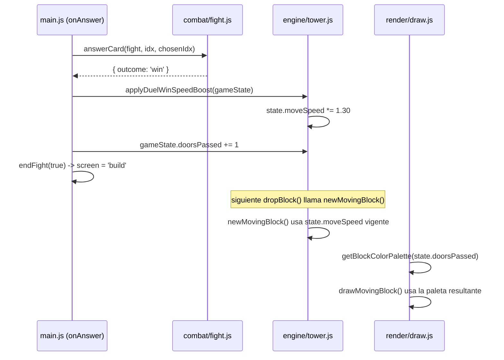

# Design Document

## Overview

Esta feature introduce tres mecanismos de progresión en "Torre de las Nubes":

1. **Plataforma Base ampliada**: `floors[0]` pasa de 210px a 630px de ancho (`BASE_WIDTH * 3`), fijado únicamente durante la Fase de Arranque (`createTowerState` / `resetGame`).
2. **Velocidad compuesta sin techo**: se sustituye el cálculo actual de `speed` (derivado de `state.floors.length`, con cap `Math.min(3.6, ...)`) por un valor de velocidad persistente en el estado (`state.moveSpeed`), que se multiplica por `1.30` cada vez que el jugador gana un Duelo (`outcome === 'win'`), sin límite superior salvo el de `float64`.
3. **Color progresivo del Bloque en Movimiento**: se introduce `Nivel_Progreso` (= `state.doorsPassed`, el número de Duelos Ganados acumulados) y una función pura `getBlockColorPalette(nivelProgreso)` en el módulo de render, que sustituye la paleta fija usada hoy por `drawMovingBlock`.

El proyecto vive simultáneamente en dos superficies de código:

- **Monolito** `torre-de-las-nubes.html` (IIFE inline, sin módulos, sin tests).
- **Módulos** `src/engine/tower.js`, `src/render/draw.js`, `src/combat/fight.js`, `src/main.js` (con tests Vitest + `fast-check` ya presentes en el repo — ver `src/data/scoreManager.test.js` y `devDependencies.fast-check` en `package.json`).

Dado que no existe un build step ni bundler que sincronice ambos, **este diseño trata al monolito como una réplica manual de la lógica modular**: cada cambio de comportamiento descrito aquí se implementa primero (y se testea) en `src/`, y luego se replica línea a línea en el `<script>` de `torre-de-las-nubes.html`, dejando comentarios que referencien el spec (`// tower-progression-scaling: ...`) para facilitar la trazabilidad entre ambas copias. Esto es consistente con `structure.md` ("Los specs se crean incrementalmente... no se reescribe el archivo del juego sin pasar primero por un spec aprobado") y con el hecho de que el monolito no tiene infraestructura de test.

## Architecture

No se introducen nuevos módulos ni dependencias. Los tres cambios se implementan como modificaciones focalizadas en los módulos existentes, extrayendo la lógica de cálculo a **funciones puras** para que sea testeable con `fast-check` (ya usado en el proyecto).

```mermaid
flowchart TD
    subgraph Engine["src/engine/tower.js"]
        A[createTowerState / resetGame] -->|BASE_WIDTH * 3| B[floors[0].width = 630]
        A --> C[state.moveSpeed = BASE_SPEED]
        D[newMovingBlock] -->|lee| C
        E[applyDuelWinSpeedBoost] -->|state.moveSpeed *= 1.30| C
    end

    subgraph Combat["src/combat/fight.js"]
        F[answerCard] -->|outcome === 'win'| E
    end

    subgraph Main["src/main.js"]
        G[onAnswer] -->|orquesta| F
        G -->|lee outcome| H[endFight]
    end

    subgraph Render["src/render/draw.js"]
        I[getBlockColorPalette nivelProgreso] --> J[drawMovingBlock]
    end

    H -->|doorsPassed++| K[state.doorsPassed]
    K -->|nivelProgreso| I
```

### Secuencia: Duelo Ganado incrementa velocidad y color



**Decisión de diseño**: la actualización de velocidad se hace explícitamente en el punto donde se conoce el `outcome` (en `main.js`, tras `combat.answerCard`), no dentro de `fight.js`. Esto mantiene `fight.js` desacoplado del engine (como ya lo está hoy: no importa `tower.js`) y concentra la mutación de `state.moveSpeed` en el módulo dueño de ese estado (`engine/tower.js`), vía una función exportada `applyDuelWinSpeedBoost(state)`.

## Components and Interfaces

### `src/engine/tower.js`

**Constantes nuevas:**
```js
export const BASE_PLATFORM_WIDTH = BASE_WIDTH * 3; // 630px, Requirement 1.1
export const SPEED_INCREMENT_FACTOR = 1.30;          // Requirement 2/3
export const BASE_SPEED = 1.6;                       // Velocidad_Base original (sin *floors.length)
```

`BASE_SPEED` reemplaza el término fijo `1.6` que hoy es el primer sumando de `1.6 + state.floors.length*0.045`. Es el valor desde el cual arranca `state.moveSpeed` en cada partida nueva.

**Funciones puras nuevas (candidatas a PBT):**

```js
// Requirement 1.1 / 1.3 / 1.4: ancho fijo de la Plataforma Base
export function computeBasePlatformWidth() {
  return BASE_PLATFORM_WIDTH; // 630, constante pura sin inputs
}

// Requirement 2.1 / 2.2 / 3.1 / 3.2 / 3.3: incremento compuesto de velocidad
export function applySpeedBoost(currentSpeed) {
  return currentSpeed * SPEED_INCREMENT_FACTOR;
}
```

`applySpeedBoost` es una función pura `number -> number`, ideal para PBT (round of composición: aplicar N veces equivale a `currentSpeed * 1.30^N`).

**Mutadores existentes modificados:**

- `createTowerState(width, height)`: el `baseFloor.width` pasa de `BASE_WIDTH` a `computeBasePlatformWidth()`. Se añade `moveSpeed: BASE_SPEED` al objeto de estado retornado.
- `resetGame(state, width, height)`: mismo cambio en `baseFloor.width`; además `state.moveSpeed = BASE_SPEED` (restaura la velocidad, Requirement 3.4), y el nuevo `state.moving` se genera con `newMovingBlock` que ya leerá `BASE_SPEED`.
- `newMovingBlock(state, afterFloor)`: se elimina `Math.min(3.6, 1.6 + state.floors.length*0.045)` y se sustituye por `speed: state.moveSpeed` (lectura directa del estado persistente, Requirement 2.4).
- **Nueva función exportada** `applyDuelWinSpeedBoost(state)`:
  ```js
  export function applyDuelWinSpeedBoost(state) {
    state.moveSpeed = applySpeedBoost(state.moveSpeed);
    return state.moveSpeed;
  }
  ```
  Solo debe invocarse cuando `outcome === 'win'` (Requirement 2.3). No toca `state.moving` (el bloque en pantalla durante el duelo no existe, ya que `screen` cambia a `'boss'` y `dropBlock` sólo actúa con `screen === 'build'`; aun así, la función no recibe ni muta ningún objeto `moving`, garantizando 2.1 por construcción).

### `src/main.js`

`onAnswer(cardIdx, chosenIdx)` es el único lugar que conoce el `outcome` devuelto por `combat.answerCard`. Se añade una llamada a `engine.applyDuelWinSpeedBoost(gameState)` en la rama `outcome === 'win'`, antes o junto a `endFight(true)`:

```js
if (result.outcome === 'win') {
  engine.applyDuelWinSpeedBoost(gameState); // Requirement 2.1, 2.2
  sfx.win();
  ui.showBanner('¡Guardián derrotado!', 'win');
  setTimeout(() => { endFight(true); }, 1300);
}
```

No se modifica la rama `'lose'` ni la ruta de caída (`onDrop` -> `fell`): `state.moveSpeed` no se toca ahí (Requirement 2.3).

### `src/render/draw.js`

**Nueva función pura exportada:**

```js
// Requirement 4.3, 4.4, 4.5: paleta determinística por Nivel_Progreso
const PROGRESS_PALETTES = [
  ['#9aa3b3', '#6b7488'], // 0 duelos: gris neutro (igual a la paleta de piso par actual)
  ['#5fb37a', '#2f8f52'], // 1 duelo: verde
  ['#4aa3ff', '#2b6fcb'], // 2 duelos: azul
  ['#f2a641', '#b9932f'], // 3 duelos: naranja/dorado
  ['#b287ff', '#7a4fd1'], // 4+ duelos: púrpura
];

export function getBlockColorPalette(nivelProgreso) {
  const safeLevel = Number.isFinite(nivelProgreso) ? Math.trunc(nivelProgreso) : 0;
  const clamped = Math.max(0, Math.min(safeLevel, PROGRESS_PALETTES.length - 1));
  return PROGRESS_PALETTES[clamped];
}
```

- Es una función pura `number -> [string, string]`: sin `Date.now()`, sin `Math.random()`, sin acceso a DOM/canvas (Requirement 4.4).
- El clamp (`Math.min(..., length - 1)`) cubre tanto valores negativos como valores arbitrariamente grandes (Requirement 4.5), sin lanzar errores.

**`drawMovingBlock` modificado:**

Firma actual:
```js
export function drawMovingBlock(ctx, W, H, camElev, screen, floors, moving, knightAnimating)
```

Nueva firma (se añade `nivelProgreso`, con valor por defecto `0` para no romper compatibilidad si algún caller no lo pasa aún):

```js
export function drawMovingBlock(ctx, W, H, camElev, screen, floors, moving, knightAnimating, nivelProgreso = 0)
```

Dentro de la función, el bloque:
```js
const nextIsDoor = floors.length % DOOR_INTERVAL === 0;
const palette = nextIsDoor ? ['#e8c96b','#b9932f'] : getBlockColorPalette(nivelProgreso);
```

reemplaza la paleta fija `['#b7c0d1','#8993a8']`. Se conserva la paleta especial dorada cuando el siguiente piso es puerta (comportamiento previo no tocado por este spec, ya que Requirement 4 solo habla del color "base" del bloque según progreso; la señal visual de puerta inminente es independiente y tiene mayor prioridad visual).

**`render(ctx, W, H, gameState)` modificado:** pasa `gameState.doorsPassed` como `nivelProgreso` a `drawMovingBlock`:
```js
drawMovingBlock(ctx, W, H, gameState.camElev, gameState.screen, gameState.floors, gameState.moving, gameState.knight.animating, gameState.doorsPassed);
```

Esto conecta `Nivel_Progreso` (Requirement 4.2, definido como `state.doorsPassed`) con el render sin que `draw.js` necesite conocer la estructura completa del `fight`/combate.

### Monolito `torre-de-las-nubes.html`

Réplica manual 1:1 de los cambios anteriores dentro de la IIFE:

- `BASE_WIDTH` se mantiene en 210 (es la constante de referencia, `Ancho_Base_Inicial`); se añade `const BASE_PLATFORM_WIDTH = BASE_WIDTH*3;` y `makeBaseFloor()` usa `BASE_PLATFORM_WIDTH` en vez de `BASE_WIDTH`.
- `state` gana `moveSpeed: 1.6` inicial; `resetGame()` lo restaura a `1.6`.
- `newMovingBlock(afterFloor)` usa `speed: state.moveSpeed` en vez de la fórmula con cap.
- `answerCard()`, en la rama `if(correct){ fight.bossPips = ...; if(fight.bossPips<=0){ ... } }`, dentro del bloque que detecta `fight.bossPips<=0` (equivalente a `outcome==='win'`), añade `state.moveSpeed *= 1.30;`.
- `drawMovingBlock()` usa una función local `getBlockColorPalette(nivelProgreso)` idéntica a la de `draw.js`, alimentada con `state.doorsPassed`.

Estos cambios no se testean automáticamente (el monolito no tiene test runner), pero deben mantenerse sincronizados con `src/` en cada PR que toque esta feature, tal como indica `tech.md`.

## Data Models

Extensión del objeto de estado (`GameState`, hoy un objeto plano sin tipo formal) usado por `engine/tower.js`:

```
GameState {
  ...campos existentes (screen, floors, moving, camElev, knight, doorsPassed, ...)
  moveSpeed: number   // NUEVO — Velocidad_Actual persistente, Requirement 2/3
}
```

- `moveSpeed` se inicializa a `BASE_SPEED` (1.6) en `createTowerState` y `resetGame`.
- `moveSpeed` solo se muta desde `applyDuelWinSpeedBoost(state)`, llamada exclusivamente cuando `outcome === 'win'`.
- `doorsPassed` (ya existente) se reutiliza como `Nivel_Progreso` sin cambios estructurales; no se añade un campo nuevo para él (Requirement 4.2 es una definición, no un dato nuevo).

`MovingBlock` no cambia de forma; solo cambia el origen del valor `speed` (antes derivado de `floors.length`, ahora leído de `state.moveSpeed`).

`Floor` (para `floors[0]`) no cambia de forma; solo cambia el valor de `width` en el momento de creación (630 en vez de 210).

No se persiste `moveSpeed` ni `doorsPassed` en `localStorage`/leaderboard — son puramente de la sesión en memoria, igual que hoy.

## Correctness Properties

*A property is a characteristic or behavior that should hold true across all valid executions of a system-essentially, a formal statement about what the system should do. Properties serve as the bridge between human-readable specifications and machine-verifiable correctness guarantees.*

Tras la reflexión de prework, se consolidan las propiedades redundantes (ej. Requirements 1.1/1.3/1.4/1.5 en una sola propiedad de invariante de ancho + reset; Requirements 2.2/2.5/3.1/3.2/3.3 en una sola propiedad de crecimiento compuesto sin techo; Requirements 4.1/4.3/4.4/4.5/4.6 en una sola propiedad de mapeo determinístico con clamp).

### Property 1: La Plataforma Base siempre mide 630px al inicializar o reiniciar, sin importar el tamaño del canvas

*For any* par de dimensiones de canvas `(width, height)` con `width > 0` y `height > 0`, y *for any* estado de juego previo arbitrario (con `floors`, `doorsPassed` y `moveSpeed` en cualquier valor válido), al invocar `createTowerState(width, height)` o `resetGame(state, width, height)`, el `floors[0].width` resultante SHALL ser exactamente `630` (`BASE_WIDTH * 3`), independientemente de `width`, `height`, y del estado previo.

**Validates: Requirements 1.1, 1.3, 1.4, 1.5**

### Property 2: El ancho de la Plataforma Base es invariante frente a la construcción de pisos posteriores y al resize

*For any* secuencia válida de bloques en movimiento apilados sobre `floors[0]` (usando `computeNewFloor`/`dropBlock` con overlaps `>= 16`), y *for any* llamada posterior a un handler de `resize` que solo recalcule `W`/`H` del canvas, el `floors[0].width` SHALL permanecer igual a `630` después de dicha secuencia.

**Validates: Requirements 1.3**

### Property 3: `applySpeedBoost` multiplica la velocidad por 1.30 de forma compuesta y sin techo

*For any* velocidad inicial positiva `v0` (`0 < v0 < 1e100`, para evitar overflow trivial de float64) y *for any* entero `N >= 1` (incluyendo `N >= 50`), aplicar `applySpeedBoost` `N` veces consecutivas sobre `v0` SHALL producir un valor igual a `v0 * Math.pow(1.30, N)` con una tolerancia máxima de `0.001` unidades de diferencia relativa/absoluta, y dicho valor SHALL ser siempre estrictamente mayor que el valor anterior a cada aplicación (monotonía creciente, sin techo salvo límites de `Number.MAX_VALUE`).

**Validates: Requirements 2.1, 2.2, 2.5, 3.1, 3.2, 3.3**

### Property 4: `newMovingBlock` siempre usa la `Velocidad_Actual` vigente del estado, de forma constante entre duelos

*For any* valor válido de `state.moveSpeed` (fijado externamente antes de la llamada) y *for any* secuencia de `N >= 1` llamadas a `newMovingBlock(state, afterFloor)` sin que ocurra ningún Duelo Ganado entre ellas, el campo `speed` de cada bloque generado SHALL ser exactamente igual a `state.moveSpeed` vigente en el momento de cada llamada (y por tanto idéntico entre sí si `state.moveSpeed` no cambió).

**Validates: Requirements 2.4**

### Property 5: `applyDuelWinSpeedBoost` solo se refleja en el estado cuando se invoca explícitamente, y no muta el bloque en movimiento existente

*For any* estado de juego con `moveSpeed` y `moving` arbitrarios, invocar `applyDuelWinSpeedBoost(state)` SHALL multiplicar `state.moveSpeed` por `1.30` y SHALL dejar el objeto `state.moving` (incluyendo su `.speed`) completamente sin modificar; y *for any* estado de juego en el que dicha función NO sea invocada (por ejemplo tras un `outcome` distinto de `'win'`), `state.moveSpeed` SHALL permanecer sin cambios.

**Validates: Requirements 2.1, 2.3**

### Property 6: `getBlockColorPalette` es una función determinística con clamp para niveles de progreso altos o inválidos

*For any* entero `nivelProgreso` (incluyendo negativos, `0`, `1`, `2`, `3`, y valores `>= 4` hasta al menos `10000`), llamar a `getBlockColorPalette(nivelProgreso)` dos veces con el mismo valor SHALL devolver un resultado estructuralmente idéntico (determinismo), y el resultado SHALL corresponder exactamente a la tabla: `0 -> gris`, `1 -> verde`, `2 -> azul`, `3 -> naranja/dorado`, cualquier valor `>= 4` (o negativo, tratado como `0`) -> el color correspondiente sin lanzar excepciones ni devolver `undefined`.

**Validates: Requirements 4.1, 4.3, 4.4, 4.5, 4.6**

## Error Handling

- **`getBlockColorPalette`**: entradas no numéricas o `NaN` (ej. `undefined`, `null`, cadenas) se normalizan a `0` mediante `Number.isFinite(nivelProgreso) ? Math.trunc(nivelProgreso) : 0`, evitando `PROGRESS_PALETTES[NaN]` (`undefined`) y por tanto evitando que `drawFacetedBlock` reciba una paleta inválida y falle al crear el `linearGradient`.
- **`applySpeedBoost` / `applyDuelWinSpeedBoost`**: no se introduce validación adicional de rango; el Requirement 3.2 explícitamente acepta los límites naturales de `IEEE 754` doble precisión (overflow a `Infinity` en partidas extremadamente largas) como comportamiento aceptable, no como error a manejar.
- **`newMovingBlock`**: si `state.moveSpeed` fuera `undefined` (estado mal inicializado, p. ej. un caller que no pasó por `createTowerState`/`resetGame`), el bloque resultante tendría `speed: undefined`, lo cual ya causaría un bug visible en `update()` (`m.x += m.dir*m.speed*(dt/16)` -> `NaN`). Esto es idéntico al riesgo que ya existe hoy con `state.floors.length` no inicializado, por lo que no se añade guardas nuevas más allá de garantizar que `createTowerState`/`resetGame` siempre inicialicen `moveSpeed`.
- **Monolito**: al no tener tests, cualquier discrepancia entre el comportamiento modular y el inline solo se detecta por revisión manual o QA exploratorio; se documenta explícitamente en la sección Architecture como riesgo aceptado.

## Testing Strategy

**Enfoque dual:**

- **Tests unitarios (Vitest)**: casos concretos y de integración entre componentes.
  - `createTowerState`/`resetGame` producen `floors[0].width === 630` y `moveSpeed === 1.6` en un caso concreto (ej. `width=800, height=600`).
  - `main.js` (o un test de integración de `combat` + `engine`): al simular un `outcome: 'win'` se llama `applyDuelWinSpeedBoost`; al simular `'lose'` no se llama.
  - `drawMovingBlock` con `nivelProgreso` no numérico (`undefined`, por defecto `0`) no lanza excepción.
  - Caso límite: `getBlockColorPalette(4)`, `getBlockColorPalette(3)`, `getBlockColorPalette(0)` devuelven exactamente los colores de la tabla (ejemplo concreto, no propiedad).

- **Tests de propiedades (`fast-check`, ya en `devDependencies`)**: implementan las 6 Correctness Properties de arriba, una por test, con mínimo 100 ejecuciones (`fc.assert(fc.property(...), { numRuns: 100 })` o superior).
  - Tag de cada test: `// Feature: tower-progression-scaling, Property N: <texto de la propiedad>`.
  - Ubicación sugerida: `src/engine/tower.test.js` (Properties 1-5) y `src/render/draw.test.js` (Property 6), siguiendo el patrón de colocar el test junto al módulo (`scoreManager.test.js` ya usa esta convención).
  - Generadores relevantes: `fc.integer({min: 1, max: 4000})` para dimensiones de canvas; `fc.double({min: 0.0001, max: 1e50, noNaN: true})` para velocidades iniciales; `fc.integer({min: 1, max: 60})` para N de duelos ganados consecutivos (cubriendo el caso `>= 50` de Requirement 3.1); `fc.integer({min: -100, max: 10000})` para `nivelProgreso`.

- **Monolito**: sin infraestructura de test; se valida por QA manual siguiendo los mismos casos concretos listados arriba (abrir el archivo, jugar varias rondas, verificar visualmente ancho de plataforma, velocidad creciente y cambio de color).
